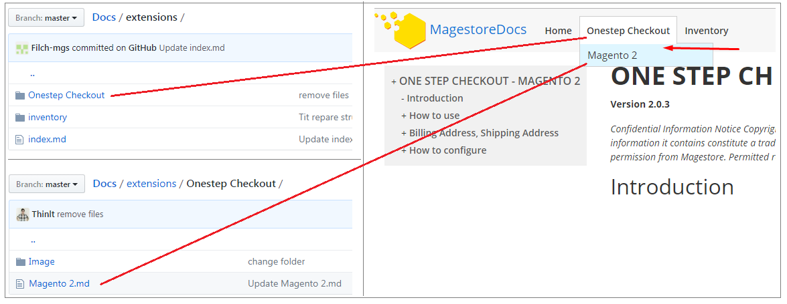
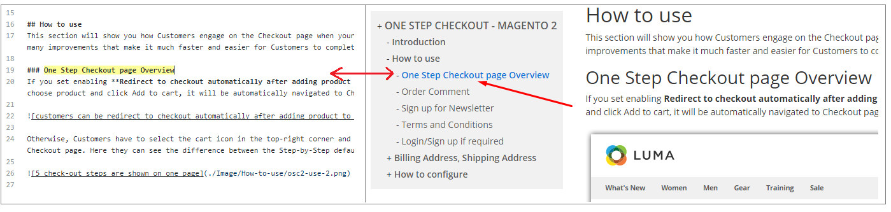

# <i class="icon-file"></i> Hướng dẫn
*magestore.github.io*


## Giới thiệu
1. **Cấu trúc thư mục trong này bao gồm**
   - **docs** (là thư mục mà docs-tool sau khi đã generate ra html - **không được ghi file vào thư mục này**) 
   - **extensions** (là thư mục doc để docs-tool sử dụng để generate ra html, bao gồm các file giới dạng md - Markdown)
      + Trong thư mục này chưa file **index.md** là file tương ứng với trang **home**
      + Để tạo menu ở header thì mỗi thư mục sẽ là một menu cha, thư mục hoặc file bên trong thư mục cha sẽ là menu con
      
      + Menu left chính là chỉ mục văn bản trong content. Ví dụ các thẻ **h1**, **h2** tương ứng là **#**, **##**
      
   - guide là thư mục chứa những file tài liệu Guide chi tiết
2. **Chỉ được phép chỉnh sửa** các tài liệu trong thư mục extension, sau khoảng thời gian 1 phút docs-tool sẽ tự động biên dịch lại và kết quả chứa trong thư mục docs. Để viết được doc theo format Markdown thì có thể dùng tool https://stackedit.io/editor.

## For editor

### How to insert image

#### 1. Upload images
1. Create images folder in github
2. Upload images

#### 2. Insert images to documents
 
 ```html
 
 ```
 
