# ECOMMERCE MANAGEMENT - USER GUIDE FOR MAGENTO 1

--------------------------

## Introduction

According to Big Commerce and Square, ecommerce is growing 23% year-over-year. Even 2 in 5 (40%) online shoppers say they couldn’t live without online shopping. However, many e-commerce businesses are struggling to capitailize on their digital sales channels. 
	
So how retailers can manage their business to maximize sales on online channels in the emerging technology world? 

Magento Ecommerce Management module including [Store Pickup](https://www.magestore.com/store-locator-pickup), and Loyalty programs is here to help you create more values for your customers and thus, will boost sales for the whole business. 

With Loyalty programs module, your business can build a strong relationship with their customers and drive more sales from returning ones as well through [Reward Points](https://www.magestore.com/reward-points), [Store Credit](https://www.magestore.com/store-credit) and [Gift Cards](https://www.magestore.com/gift-card). Besides, Store Pickup will satisfy your shoppers with the convenient option of ordering online - picking up in store.  

This guide is specially written according to business flow which happens reguarly in reality. Therefore, you can quickly understand a sales execution process  during the operation of an ecommerce business.

-----------------------------

## Validating Orders and Store Pickup Processing
###  Customer place online  orders
####   View store information

Many times customers want to visit your physical store to pick up products ordered so they can test the quality as well as save the shipping fee. Below, let us introduce you how customers exploit all the usefulness when your store is integrated with the **Store Pickup** module.

	
Store Pickup module creates a separated page to list all of your stores in the front-end. Customers can access this page by clicking on **Our Stores** on Top-Link (the top right of the page) or Footer-Link (the bottom of the page).

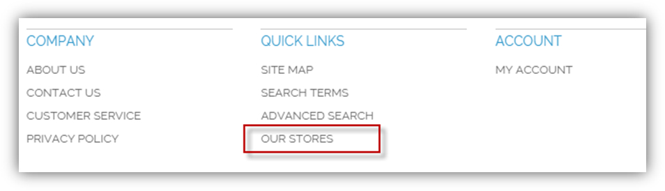

The Store Listing page includes 4 sections: **Store list, Search form, Google Map** and **Tags list**.

The list of all stores is shown on the bottom of Google Map. Customers can view store names and base images on this list. 

Click on the icon   on the bottom right corner on the G-Map to show store list or click on the   to hide store list

Store locations are displayed on Google Map. Customers can zoom in/ zoom out and choose view mode as map/ satellite as preferred. Customers can also view store address or get direction by clicking on the pin icon of any store.

Click on the icon   to search stores by location. Customers need to enter the key word and select criteria. Results that are matched are shown on G-Map. 

Click on the icon   to search stores by radius. After customers enter the location then choose radius, related results are shown on G-Map.

Besides, customers can also filter by tags. Customers just have to click on tags they want to search. Then, list of stores which admin add these tags to will be shown.

When customers click on a store on the map, they can instantly view the store location along with its name, address, phone number and store manager’s email address. Customers can also get direction on this box. 

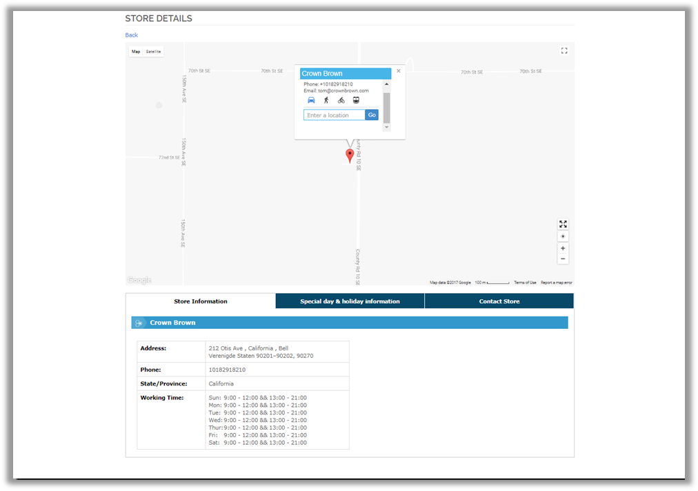

For more details of a store, customers can click on its **View more info** link to be navigated to the detailed page as above. 

As you can see, this page shows all details that customers want to know about a store before arriving, such as location, contact info, working time, description and store images. 

They can also view list of special days & holidays in **Special day** & **Holiday information** tab.

Conveniently, they can email store manager by filling in the contact form then clicking on **Submit**.

####  Use Store Pickup at Checkout	

The main function of Store Pickup module is allowing customers to select a preferred store at checkout to arrive and pick up their ordered products. This section will show you how the module works for customers. 

##### Choose shipping method: Delivery in store

In the **Shipping method** tab at checkout, customers can select **Store Pickup** as their shipping option. Then customers can select a store from the dropdown list as below. 

Or customers can select on Google map as bellow:

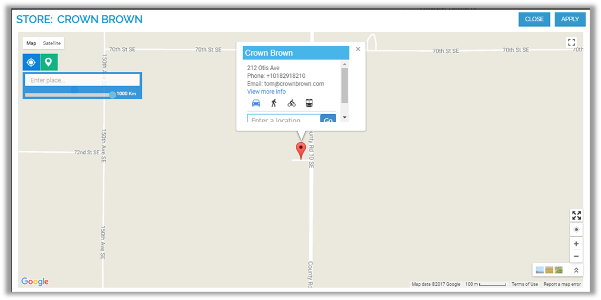

##### Choose time delivery 

After selecting a store, customers need to choose a specific shipping date and time for arrival, and then check out as usual by clicking on the **Continue** button. 

##### Choose payment method

In the **Payment Information** tab, applicable payment methods for **In-store Pickup** are shown as your configuration.
##### Place Order

Before placing order, customers can also review the store address, shipping date and time along with other order information, and then customers can click on **Place Order** button to complete.

####  View Orders

To view their orders with store pickup information, customers can go to **My Account** on Top-Link > **My Orders** tab > **View Order**.

### Order Fulfill Staff validate orders

####  Check orders in store

#### Process Shipment for customers

**Path: Sales > Orders** 
##### Create shipment

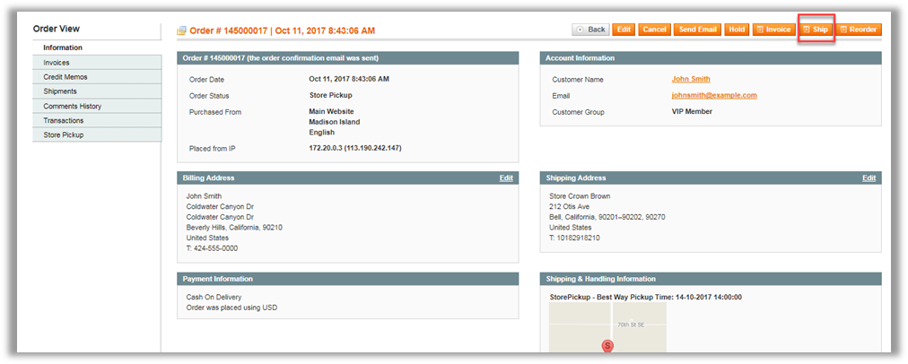

1.	In the **Information** tab, click on **Ship** 

The **New Shipment** page like the image above will open and include a customer’s information such as sales info, account, address, payment and shipping method. 

2.	Click on **Submit Shipment** button to complete.

When a new shipment is created, you will see the notification:   **The shipment has been created**

##### Print  Packing Slips

**Path: Sales > Orders** 

After a new shipment has been created, if you want to print packing slips:

1.	In the **Order** page, click on **Shipments** to open a shipment tab.

The **Shipment page** of a particular order will open as above. 

2.	Click on **Print** button to print out your packing slip. 

#####  Send confirm email to customers

**Path: Sales > Orders** 

Continually, to send confirm email to customers: 

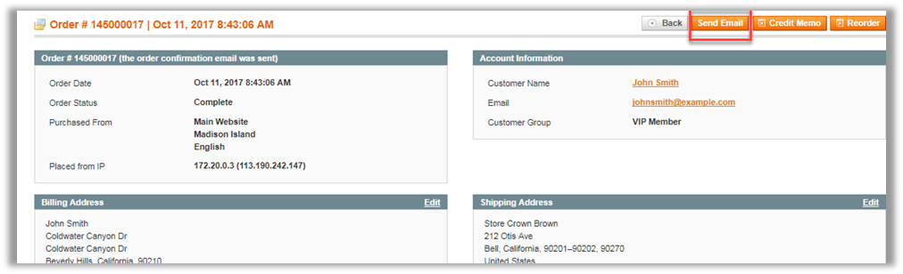

1.	In the **Information** tab, click on **Send Email**.

Then a popup will appear to make sure that you want to send confirm email to customers. 

2.	Click on **OK** to complete.

After that, you will see the notification as above.
####  Request Transfer Stock from other warehouses

**Path: Inventory Management > Transfer Stock > Request Stock**.

If the store where customers choose to pick up their orders doesn’t have enough stock to provide, it ‘s time  to request stock from other warehouses, firstly go to **Inventory Management > Transfer Stock > Request Stock**.

In the **Add a New Request Stock** tab, let’s fill in the **Transfer Code**, choose **Source Warehouse** and **Destination Warehouse**.  Besides, you can fill in the **Reason** box for resquesting stock. 

Then, to prepare product list, click on the **Prepare Product List** button as the image above. 

To add new list of products:

1.	Click on the product needed 

2.	Choose the quantity to transfer

3.	Click on  **Start to Request**

A new Stock Request  is ready to deliver and receive

####  Receice Transfer Stock 

**Path: Inventory Management > Transfer Stock > Request Stock**

After the staff of the requested warehouse confirmed transferring their stocks and these stocks are ready to import into your store, it’s time to receive them. 

To receive stock from other warehouses, in the **Receiving History** tab of the created request:

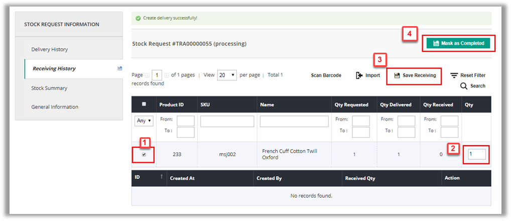

1.	Click on the request created for receiving

2.	Write the quantity received in **Receiving History**

3.	Click on **Save Receiving**

4.	Click on Mark as Completed to end the process. 

### Store Staff delivers orders

####  Find pickup-in-store-orders

**Path: Inventory Management > Warehouse**.

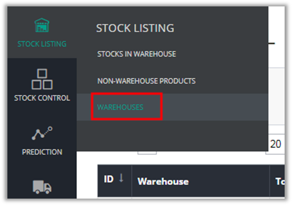

In the **Manage Warehouses** page, tick to the warehouse of store in which your customer want to pick up his/her order.

Then click **View** to see the order in the chosen warehouse.  

**View Warehouse** page will open and in the **Orders** section, you can find the order of customer picking up in your store. **Apply Filters** to find that order easily by following steps in the image above.

####  Print invoice

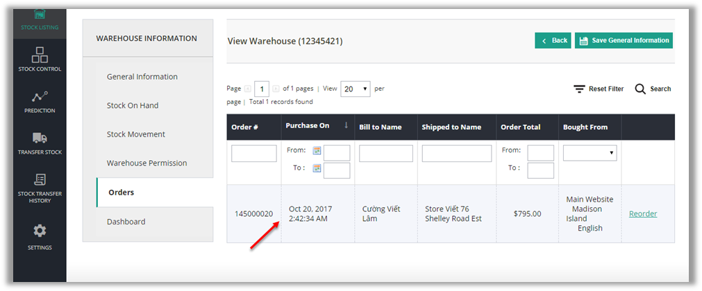

In the **View Warehouse** page - section **Orders**, click on a row of the customer’s pickup-in-store order to see his or her detailed information.	

An Order page will display and allow you to create new invoice for the customer. 

Click on **Invoice** to create a new invoice for customers.

A **New Invoice** page will appear with all information of the customer ‘ s order. 

Click on **Submit Invoice** button. Then a new invoice has been created. 

To print it, click on **Print** button. 

---------------------------------
## Running Loyalty Program

### Reward points

####  How to configure  reward points

##### Settings

**General Configuration Tab**

1.	Choose **Yes** to enable Reward Points Extension on the Module

2.	Enter the **Point Label**. If you leave it empty, the default label “Point” will be used.
For example, if you enter “P” on this field, then instead of showing “1 Point”, it will show “1 P”.  
3.	Enter the **Point label (plural)**. (similar as step 2)

4.	**Choose File** to upload Reward Point Image. Notice that: the recommended sixe is 18x18px. If you leave it blank, the image on template will be used instead.

5.	Choose **Yes** if you want to use Reward Policy page

6.	Choose **Yes** to show Reward Welcome Page

**Earning Points Configuration Tab**

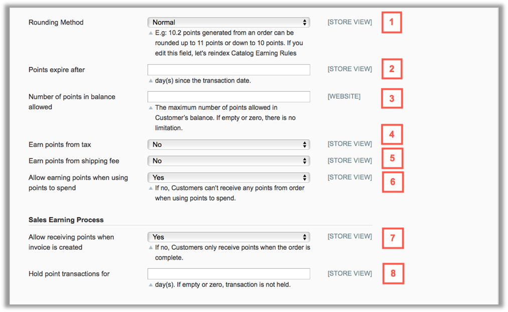

1.	You have three options about Rounding Method:

✓ Normal:  for example, 10.2 points generated from an order can be rounded to 10, and 10.8 points generated from an order can be rounded to 11.

✓ Up: for example, 10.2 points generated from an order can be rounded up to 11

✓ Down: for example, 10.2 points generated from an order can be rounded down to 10

If you finish editing the field, remember to reindex **Catalog Earning Rules**, as below:

2.	Enter the **expiration date** of the Points

3.	Enter the **maximum number** of points allowed in Customer’s balance. If you leave it blank, there will be no limitation. 

4.	Choose **Yes** to allow customers to earn point from tax

5.	Choose **Yes** to allow customers to earn point from using your shipping service

6.	Choose **Yes** to allow customers to earn point after spending points.

**Spending Points Configuration Tab**

1.	Enter the **minimum number of points** in Customer’s Balance is permitted to redeem. If you leave it blank, there will be no limitation

2.	Enter the **maximum number of points** that customers can redeem in an order. If you leave it blank, there will be no limitation

3.	Choose **Yes** if you allow customers to spend maximum points at checkout by default

4.	Choose **Yes** to allow using points for **Shipping Fee**

**Display Configuration Tab**

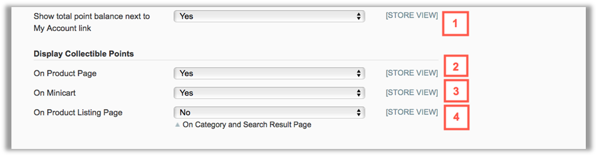

1.	Choose **Yes** to show total point balance next to My Account link

2.	Choose **Yes** to display collectible Points on **Product Page**

3.	Choose **Yes** to display collectible points on **Mini cart**

4.	Choose **Yes** to display collectible points on **Product listing page**

**Email Configuration Tab**

1.	Choose **Yes** to enable notification email

2.	Choose the **name of the Sender** who can send email about Balance Updates and Expiration Notifications to customers:

✓ General Contact

✓ Sale Representative

✓ Customer Support

✓ Customer Email 1

✓ Customer Email 2

3.	Choose **Email Template** sent to customer before a transaction expires 

4.	Enter **number of days** before a transaction empires so that your customer can receive a Reminder Email before the expiration date. 

**Loyalty Level Configuration Tab**

1.	Choose **Yes** to enable Loyalty Level Plugin

2.	Choose **Yes** to send email before level expires

**Rules Plugin Configuration Tab**

1.	Choose **Yes** to enable Rules plugin

2.	Choose **Yes** to show Earning Rule on Shopping Cart Page

##### Manage Earning Rate and Rule 

###### Manage Earning rate

**Path:  Backend > Reward Points > Earning > Earning Rates**

Then the **Earning Rates** page will be shown, allowing you to do many tasks:

•	**Add a new rate**

In order to add a new earning rate, you can click on the **Add Rate** button and then fill out all the required data below: 

1.	**Amount of money spent**: Enter a specific amount of money

2.	**Earning point(s)**: Enter the number of points that you want customers to earn when they place orders. It is compatible with the above money spent.

3.	**Status**: Select Active to enable the earning rate in fronend

4.	**Websites**: Select the website where customers can earn points

5.	**Customer groups**: Select the customer groups which are allowed to earn points

6.	**Priority**:  This field allows you to set up the priority level for every earning rule. If there are many rules, then the one with the highest priority will be applied first. In case there are two rates with the same priority, the rate created sooner will be applied.

After you finish filling out all the required data, remember to click on the **Save** or **Save and Continue Edit** button to save your work. If you click on the **Save** button, you’ll be navigated to the **Earning rates** page and your rate will be shown as below:

•	**Edit/ Delete an existing rate**

In case you want to edit a rate, please click on the **Edit** link in the **Action** column.

Then you will be redirected to the **Edit Earning Rate** page:

After editing the rate as you want, remember to click on the **Save** or the S**ave and Continue Edit** button to save your work.

To delete a rate, you can go to the **Edit Rate** page and then click on the **Delete** button on top of the page.

###### Manage Catalog Earning Rules

**Path:  Backend > Reward Points > Earning > Catalog Earning Rules**

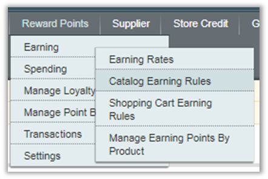

Or you can follow the path **Earning > Catalog Earning Rules** as below:  

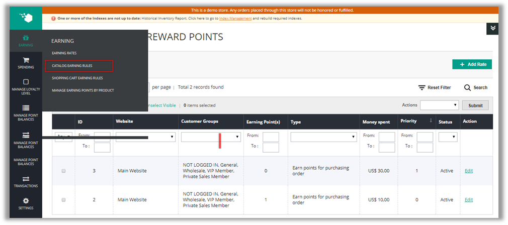

Then you can see the **Catalog Earning Rule Manager** page as below:

•	**Add a new rule**:

In order to add a new catalog rule, click on the **Add Rule** button and fill out all the required data.

**General Information tab**:

You should pay attention to these following fields:

1.	**Rule Name**: Set name for a rule

2.	**Description**: Describe the rule

3.	**Status**: Select **Active** or **Inactive** to allow the rule works or not.

4.	**Websites**: Select the website you want to apply the rule.

5.	**Customer Group**: Select types of customers you want to apply the rule. 

 6,7. **Validate from** and **Validate to**: These fields are used to configure the effective time of the rule.
 
 8.**Priority**: This field allows you to set up the priority level for every catalog rule. If there are many rules, then the one with the highest priority will be applied first.

**Conditions tab**: 

This tab allows you to configure the products to which the rule is applicable. For example, if you want to apply this rule for **Dress and Shirts**, you can configure the condition as in the image above.

If you leave this tab blank, the rule will be applied for all products.

**Actions tab**:

In this tab, you can configure the number of points that Customers will receive according to the rule and how to exchange points when they purchase products. There are three options for you to choose: 

**Option 1: Give Fixed X points to Customers**:

 Customers will receive a fixed number of points for whatever products they buy. 

For example, if you want to give Customers 5 points for purchasing products, then:

1.	Choose **Action**: Give X points to Customer 

2.	Fill in field **Points** (X): eg: 5

3.	Select  **Yes** for the field **Stop Further Rules Processing** to stop applying  all other Shopping Cart Earning rules or **No** to apply the rule with the highest priority level.

➪ If Customers purchase a product of $500.00 or $800.00, they will earn 5 points.

**Option 2: Give X points for every Y amount of Price**: 

The more expensive the products Customers buy, the more points they can receive. 

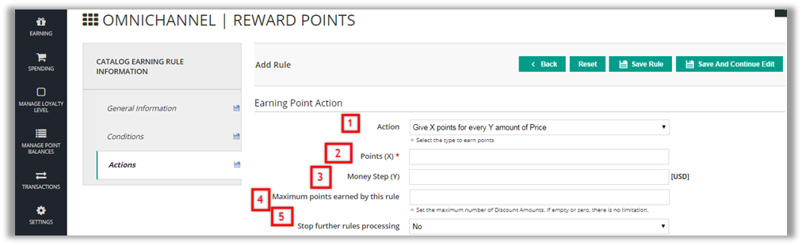

For example, if you want to give Customers 5 points for every $200.00 of price they spend and limit the number of points that can be earned to 15, then:

1.	Choose **Action**: Give X points for every Y amount of price 

2.	Fill in field **Points** (X): eg: 5 

4.	Fill in field **Money Step** (Y): eg: 200 

3.	Fill in field **Max points earned by this rule**: eg: 15 

4.	Select  **Yes** for the field **Stop Further Rules Processing** to stop applying  all other Shopping Cart Earning rules or **No** to apply the rule with the highest priority level.

➪  If Customers purchase a product of $800.00, they will earn 15 points.

**Option 3: Give X points for every Y amount of Profit**

 The more profits get from selling products that Customers buy, the more points they can receive.

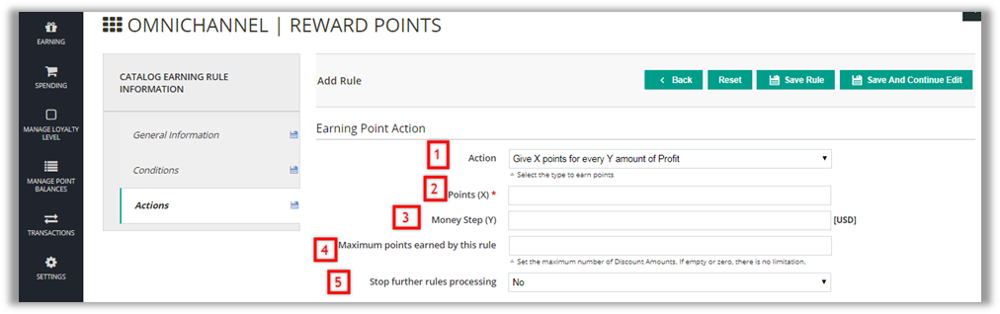

For example, if you want to give Customers 5 points for every $200.00 of profit they make and limit the number of points that can be earned to 15, then:

1.	Choose **Action**: Give X points for every Y amount of Profit 

2.	Fill in field **Points** (X): eg:5 

3.	Fill in field **Money Step** (Y): eg: 200 

4.	Fill in field **Max points earned by this rule**: eg: 15

5.	Select  **Yes** for the field **Stop Further Rules Processing** to stop applying  all other Shopping Cart Earning rules or **No** to apply the rule with the highest priority level.
.
➪  If Customers purchase a product which contributes $800.00 in profit, they will earn 15 points.

After you finish configuring, remember to click on the **Save Rule** or **Save and Continue Edit** button to save your work. If you click on the **Save Rule** button, you will be navigated to the **Catalog Earning Rule Manager** page and the rule will be shown in the catalog rule list as below:

•	**Edit/ Delete an existing rule**

In case you want to edit any catalog rule, please click on the **Edit** link in the **Action** column. Then you will be redirected to the **Edit Rule** page.

After editing the rule as you want, remember to click on the **Save Rule** or **Save and Continue Edit** button to save your work.

To delete a catalog rule, you can go to the **Edit Rule** page and click on the **Delete** button on the top of the page. 

###### Manage Shopping Cart Earning Rules

**Path:  Backend > Reward Points > Earning > Shopping Cart Earning Rules**

Or follow as below: 

•	**Add a new rule**

In order to add a new **Shopping Cart** rule, you can click on the **Add rule** button and fill out all the required data.

**General Information tab**

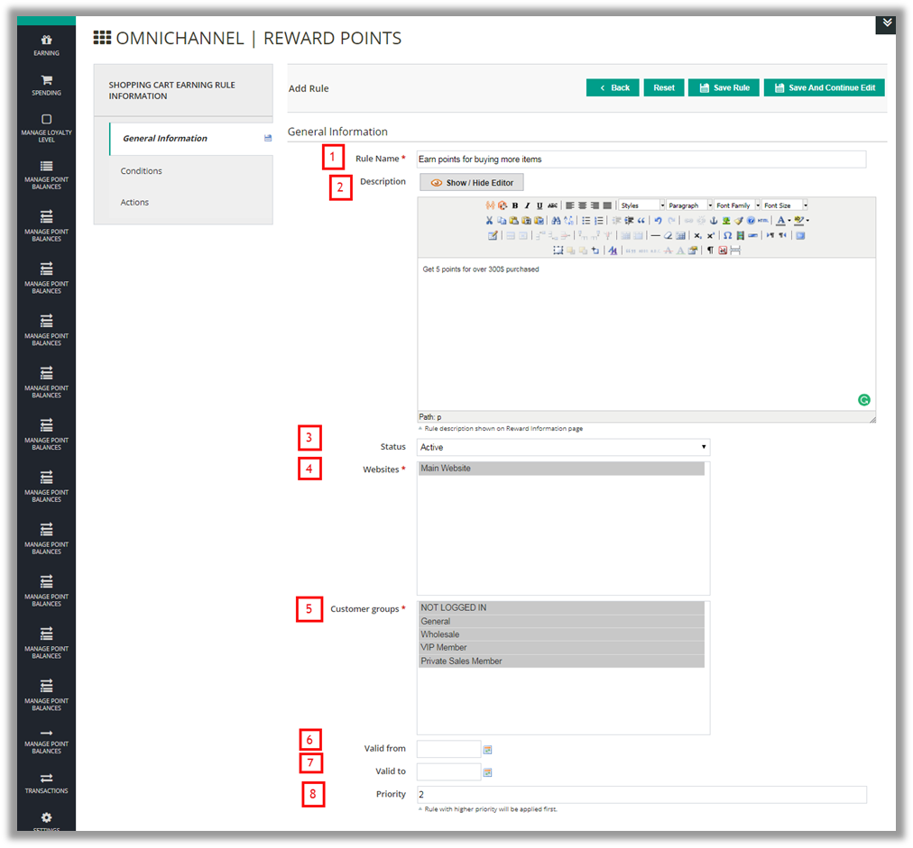

You should pay attention to these following fields:

1.	**Rule Name** : Set rule name, which will be shown on the **My Reward** page on fronend. 

2.	**Description**: Describe the rule

3.	**Status**: Select **Active** or **Inactive** to allow the rule works or not.

4.	**Websites**: Select the website you want to apply the rule.

5.	**Customer Group**: Select types of customers you want to apply the rule. 

6,7. **Validate from** and **Validate to**: These fields are used to configure the effective time of the rule.

8. **Priority**: This field allows you to set up the priority level for every catalog rule. If there are many rules, then the one with the highest priority will be applied first

**Conditions tab**:

This tab allows you to configure the condition of shopping carts to which the rule is applicable. 

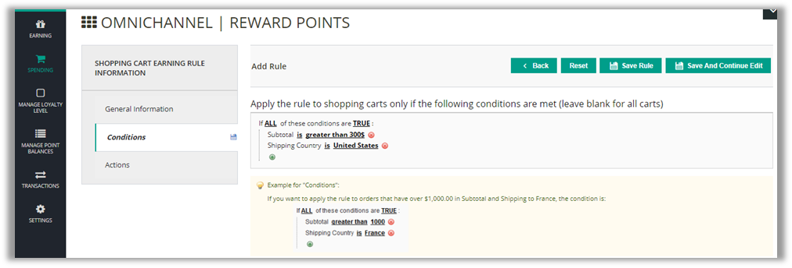

For example, if you want to apply this rule only for carts which have **Subtotals** greater than $300, you can configure the condition as in the image above:

If you leave this tab blank, the rule will be applied for all shopping carts.

**Actions tab**

In the **Action** tab, you can configure the number of points that Customers will receive when the rule is applied.

There are three options of actions for you to choose:

**Option 1: Give fixed X points to Customers**:

 Customers will receive a fixed number of X points for whatever order they place.

For example, if you want to give Customers 5 points for purchasing, then:
1.	Choose **Action**: Give fixed X points to Customers 

2.	Fill in field **Points** (X): 5 

3.	Select  **Yes** for the field **Stop Further Rules Processing** to stop applying all other Shopping Cart Earning rules or **No** to apply the rule with the highest priority level.

4.	Choose the conditions of card items to apply the rule 

➪  If Customers place an order of $100 or $1000, they will earn 5 points.

**Option 2: Give X points for every Y money spent**: 

The higher the order values that Customers place, the more points they can receive.

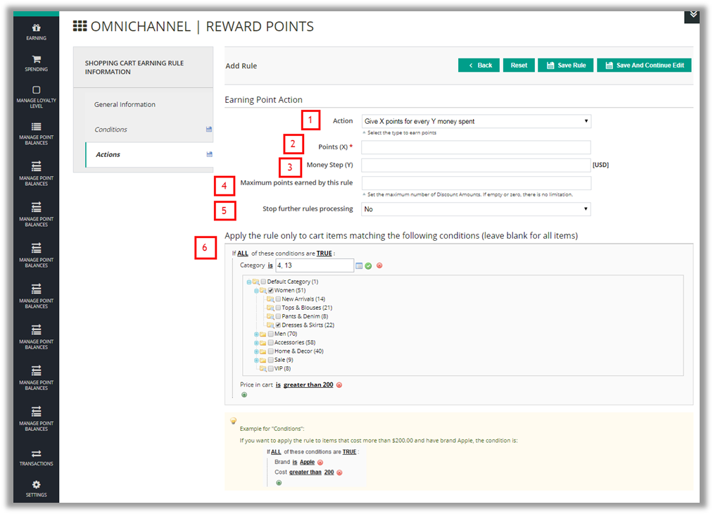

For example, if you want to give Customers 5 points for every $200.00 spent and limit the number of points that can be earned to 15, then:

1.	Choose **Action**: Give X points for every Y amount spent 

2.	Fill in field **Points** (X): 5 

3.	Fill in field **Money Step** (Y): 200 

4.	Fill in field **Max points earned by this rule**: 15 

5.	Select  **Yes** for the field **Stop Further Rules Processing** to stop applying all other Shopping Cart Earning rules orNo to apply the rule with the highest priority level.

6.	Choose the conditions of card items to apply the rule 

➪ If Customers purchase an order of $800.00, they will earn 15 points.

**Option 3: Give X points for every Y quantity**:

 The more products Customers buy from your store, the more points they can receive. 

For example, if you want to give Customers 5 points for every 10 items they order and limit the number of points that can be earned to 15, then:

1.	Choose **Action**: Give X points for every Y qty purchased 

2.	Fill in field **Points** (X): eg.  5 

3.	Fill in field **Quantity** (Y): eg.  10 

4.	Fill in field **Max points earned by this rule**:  eg. 15 

5.	Select  **Yes** for the field **Stop Further Rules Processing** to stop applying all other Shopping Cart Earning rules or **No** to apply the rule with the highest priority level. 

6.	Choose the conditions of card items to apply the rule 

➪ If Customers purchase an order of 40 items, they will earn 15 points.

After you finish configuring, remember to click on the **Save Rule** or **Save and Continue Edit** button to save your work. If you click on the **Save Rule** button, you will be navigated to the **Shopping Cart Earning Rule Manager** page and the rule will be shown in the catalog rule list as below:

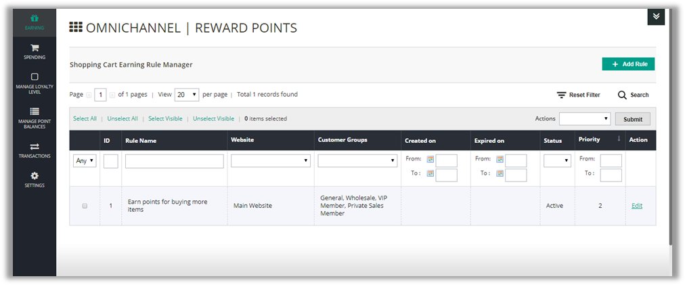

•	**Edit/ Delete an existing rule**

In case you want to edit any shopping cart rule, please click on the **Edit** link in the **Action** column. Then you will be redirected to the **Edit Rule** page.

After editing the rule as you want, remember to click on the **Save Rule** or **Save and Continue Edit** button to save your work.

To delete a catalog rule, you can go to the **Edit Rule** page and click on the **Delete** button on the top of the page. 

######  Manage Earning points by product

**Path:  Backend > Reward Points > Earning > Manage earning points by product**:

Or follow the path **Earning > Manage earning points by product**:

Then you will be redirected to the **Manage Earning Points By Product** page:

On this page, you can change the number of earning points for each product by 2 ways:

✓ Tick the product, choose **Change Point** in dropdown menu of **Action** box. Then, fill in the number of points you want to set.

✓ Double click on **Earning Points** column of the product you want to edit. Insert the number of points as you prefer, then click on **Ok**

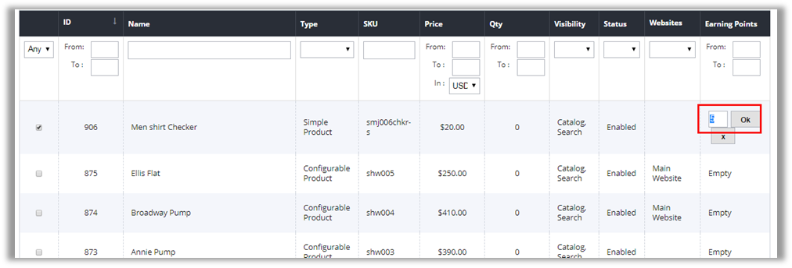

Please note that Earning Points for products takes priority over catalog rules, and shopping cart rules may still apply.

##### Mange Speanding Rate and Rule
###### Manage Spending Rate

**Path: Backend > Reward Points > Spending > Spending rates**

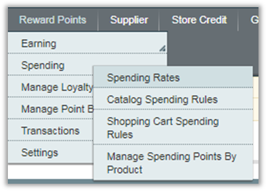

Or follow the path below: 

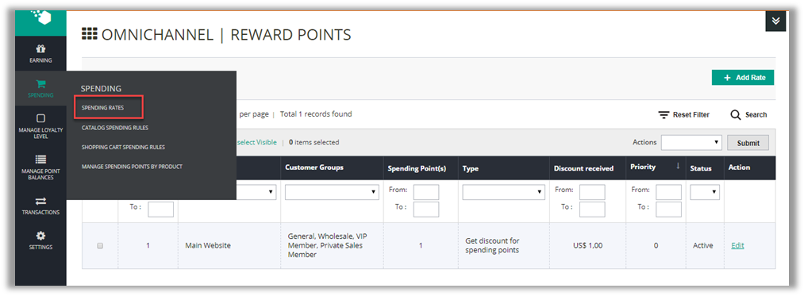

Then the **Spending Rates** page will be shown, allowing you to do many tasks:

•	**Add a new rate**

In order to add a new spending rate, you can click on the **Add Rate** button and then fill out all the required.

1.	**Spending Points**: Enter a specific number of spending points

2.	**Discount received**: Enter the amount of money which will be discounted,  compatible with the above spending points.

3.	**Status**: Select **Active** or **Inactive** to allow the rule works or not.

4.	**Limit Spending points based on fixed amount** or **a percentage amount** of Total Order Value or none of which are applied. 

5.	**Websites**: Select the website you want to apply the rule.

6.	**Customer Group**: Select types of customers you want to apply the rule. 

7.	**Priority**: This field allows you to set up the priority level for every catalog rule. If there are many rules, then the one with the highest priority will be applied first.

After you finish filling out all the required information, remember to click on the **Save** or the **Save and Continue Edit** button to save your work. If you click on the Save button, you’ll be navigated to the **Spending Rates** manager page and your rate will be shown as below:

•	**Edit/ Delete an existing rate**

In case you want to edit a rate, please click on **Edit** link in the **Action** column.

Then you will be redirected to the **Edit Spending Rate** page:

After finish editing, remember to click on the **Save** or the **Save and Continue Edit** button to save your work.

To delete a rate, you can go to the **Edit Rate** page and then click on the **Delete** button on top of that page.

######  Manage Catalog Spending rules

**Path: Backend > Reward Points > Spending > Catalog Spending Rules**

Or follow the path: 

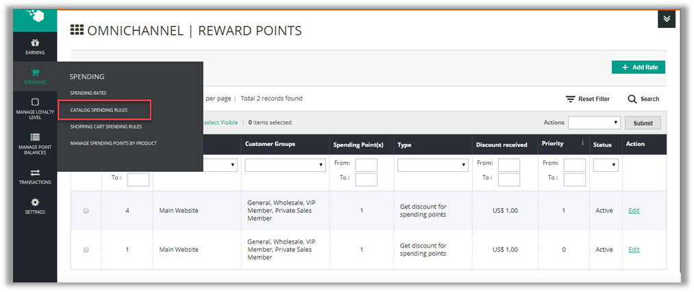

Then you will be redirected to the **Catalog Spending Rule** Manager page.

•	**Add a new Rule**:

First you should click on the Add Rule button. And then you should configure information in 3 tabs:

**General Information Tab**:

You should pay attention to these following fields:

1.	**Rule Name**: Set name for a rule

2.	**Description**: Describe the rule

3.	**Status**: Select **Active** or **Inactive** to allow the rule works or not.

4.	**Websites**: Select the website you want to apply the rule.

5.	**Customer Group**: Select types of customers you want to apply the rule. 

6,7. **Validate from** and **Validate to**: These fields are used to configure the effective time of the rule.

8. **Priority**: This field allows you to set up the priority level for every catalog rule. If there are many rules, then the one with the highest priority will be applied first

**Conditions tab**:

This tab allows you to configure the conditions of products to which the rule is applicable.

For example, you want to apply this rule only for Category  named Tops & Blousers; you can configure the condition as in the below:

1.	Select the conditions you want to apply category spending  rules. . If you do not set up this field, the rule will be applied for all categories

2.	Choose one of the two options to configure how Customers can spend points: **Discount for every X points** or **Spend X points for every Y amount of Price**

**Option 1: Discount for every X points**:

For example, if you want to configure that Customers need to spend at least 5 points on products:

✓ Choose **Action**: Discount for every X points 

✓ Fill in field **Points** (X): 5 

➪  With every 5 points customers spent, they can receive a corresponding discount. For example, 5 points can be spent to get $1, 10 points can get $2 and so on.

**Option 2: Spend X points for every Y amount of Price**: 

For example, if you want to configure that Customers need to spend 5 points on every $200.00 of product price and limit the required number of points to 15, then:

✓ Choose **Action**: Spend X Points for every Y amount of price

✓ Fill in field **Points** (X): 5 

✓ Fill in field **Money Step** (Y): 200 

✓ Fill in field **Max points required to spend**: 15 

➪ If the price of the product is $800.00, Customers can use 15 or 30 or 45 points for 1 or 2 or 3 times of discount to buy it.

**Actions tab**:

In the **Action** tab, you can configure how prices of products are discounted after Customers use points:

There are four discount types:
✓ By Fixed Amount

✓ To Fixed Amount

✓ By Percentage of the original price

✓ To Percentage of the original price

Let’s take an example, to give a discount of $10 or to $10 for every X points and apply the discount 5 times maximum per product, you can configure as below:
✓ Choose **Discount Type**: By a fixed amount or To a fixed amount 

✓ Fill in field **Discount Amount**: 10 

✓ Fill in field **Uses Allowed Per Product**: 5

➪ With the discount By a fixed amount of $10.00 and Uses Allowed Per Product equal to 5, a $200.00 product will have its price down to $90.00 for the first time of spending points, to$180.00 for the second time and so on until reaching $150.00 for the last time (5th time).

After being saved, the rule which has just been created will be shown as below:

•	Edit/ Delete an existing rule

In case you want to edit any catalog spending rule, please click on the **Edit** link in the **Action** column. Then you will be redirected to the **Edit Rule** page.

After editing the rule as you want, remember to click on the **Save Rule** or **Save and Continue Edit** button to save your work.

To delete a catalog rule, you can go to the **Edit Rule** page and click on the **Delete** button on the top of the page. 

###### Manage Shopping Cart Spending Rules

**Path:  Backend > Reward Points > Spending > Shopping Cart Spending Rules**

Or follow the path below: 

Then you will be redirected to the **Shopping Cart Spending Rule** Manager page.

•	**Add a new Rule:**

First you should click on the **Add Rule** button. And then you should configure information in 3 tabs:

**General Information Tab**:

Fill in all the required information as above: **Money spent for order, Earning Points, Status, Websites, Vailidity Time, Customer groups, Priority**.

**Conditions tab**:

This tab allows you to configure the conditions of shopping carts to which the rule is applicable.

For example, you want to apply this rule only for shopping carts of subtotals equal to or greater than $200, you can configure the condition as in the image below:

1.	Select the shopping cart you want to apply the rule. If you do not set up this field, the rule will be applied for all carts.

2.	Configure how Customers can spend points in the **Action** field

Notice that in this field, there are two options for you to choose

**Option 1: Give discount for fixed X points**: 

Customer can ONLY spend X points on whatever order they place.

For example, If you want to allow Customers to spend 5 points only on a shopping cart to get the discount, then you can configure as below:

✓ Choose **Action**: Give discount for fixed X points 

✓ Fill in field **Points** (X): 5

➪ If Customers place an order of $500.00 or $800.00, they can spend only 5 points in both cases.

**Option 2: Give discount for every X points**:
 Customers can receive discounts proportionally to the number of points they spent.

If you want to give discount for every 5 points Customers spend on the order and limit the number of points that can be used to 15, then:

✓ Choose **Action**: Give discount for every X points 

✓ Fill in field **Points** (X): 5 

✓ Fill in field  **Max points spent by this rule**: 15 

➪ With every 5 points customers spent, they can receive a corresponding discount. For example, 5 points can be spent to get $1, 10 points can get $2.00 and so on. But they cannot use more than 15 points as that is the max points that can be spent by this rule.

**Actions tab**:

In the **Action** tab, you can configure how prices of products are discounted after Customers use points: 

1.	Select a condition you want to apply. 

There are two discount types:
✓  Fixed amount discount for whole cart

✓  Percentage amount discount for whole cart

2.	Enter the discount amount you want to give customers when they spend points to place orders. 

3.	Select  **Yes** for the field **Stop Further Rules Processing** to stop applying  all other Shopping Cart Spending  rules or **No** to apply the rule with the highest priority level.

4.	Choose a specific condition ( such as Category, product…) to apply the rule you have just set. 

Let’s take an example, if you want to give a discount of $10 or 10% for X points (configured in the Conditions tab), then you can configure as below:

✓ Choose **Action**: Fixed discount amount for the whole cart or Percent discount amount for the whole cart 

✓ Fill in field **Discount Amount**: 10 

➪ An order of $200.00 can be discounted to $190.00 with action Fixed discount amount for the whole cart or to $180.00 with action Percent discount amount for the whole cart. 

Besides, you can configure the condition of products on shopping cart to apply the rule.

After being saved, the rule which has just been created will be shown as below:

•	**Edit/ Delete an existing rule**

In case you want to edit any shopping cart spending rule, please click on the **Edit** link in the **Action** column. Then you will be redirected to the **Edit Rule** page.

After editing the rule as you want, remember to click on the **Save Rule** or **Save and Continue Edit** button to save your work.

To delete a shopping cart rule, you can go to the **Edit Rule** page and click on the **Delete** button on the top of the page. 

###### Manage Spending Points By Product

**Path:  Backend > Reward Points > Spending > Manage spending points by product**:

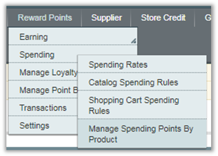

Or follow the path: 

Then you will be redirected to the **Manage Spending Points By Product** page:

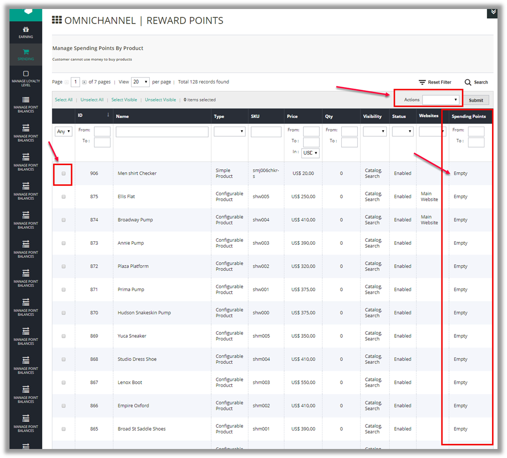

On this page, you can change the number of spending points to purchase each product by 2 ways:

✓ Tick the product, choose **Change Point** in dropdown menu of **Action** box. Then, fill in the number of points you want to set.

✓ Double click on **Spending Points** column of the product you want to edit. Insert the number of points as you want, then click on **Ok**.

You can also set products to buy with points by going to **Catalog > Manage Products**. On the Product Manager page, click on your wanted product. Here, in **General** tab, you will find the field to fill in the number of points that can be used to purchase it. 

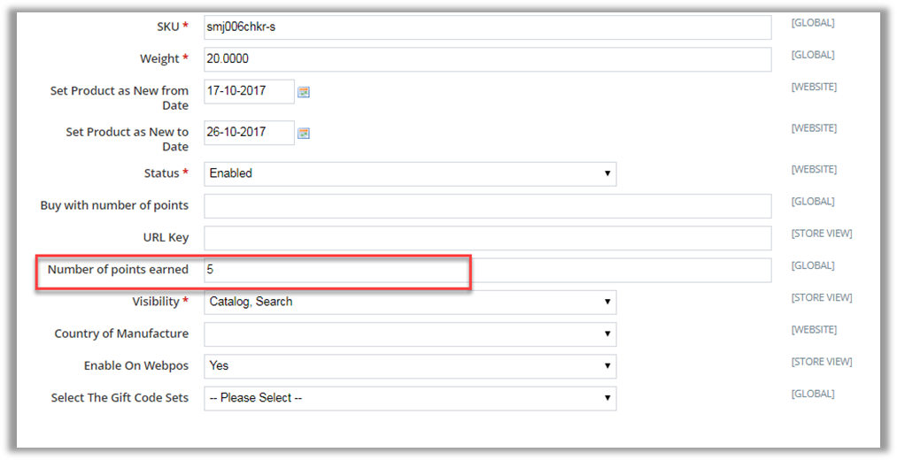

##### Manage transaction 

**Path:  Backend > Reward Points > Transactions**

Then all the transactions related to reward points will be shown as below:

On this **Transaction Manager** page, you can view a list of all point transactions together with many general information including **Customer, Transaction Type, Points Used**, etc.

Moreover, you can filter and search for the information you want as well as export this table to CSV/XML/Excel files.

You can **Complete, Cancel** or make transactions expire by choosing the status in the **Action** dropdown list and checking checkboxes of those transactions you like before clicking on the **Submit** button.

To view details of each transaction, you can click on the corresponding row: 

To add a new transaction, you can click on the **Add Transaction** button, fill out all the required data and then click on the **Save Transaction** button.

##### Mange point balances of customers

**Path: Reward Points > Manage Point Balances**

Then, the Reward Point Balance Manager page will be shown. Here you can see the information of customers and their current point balance. To view in details, click on **View** link in **Action** column. 

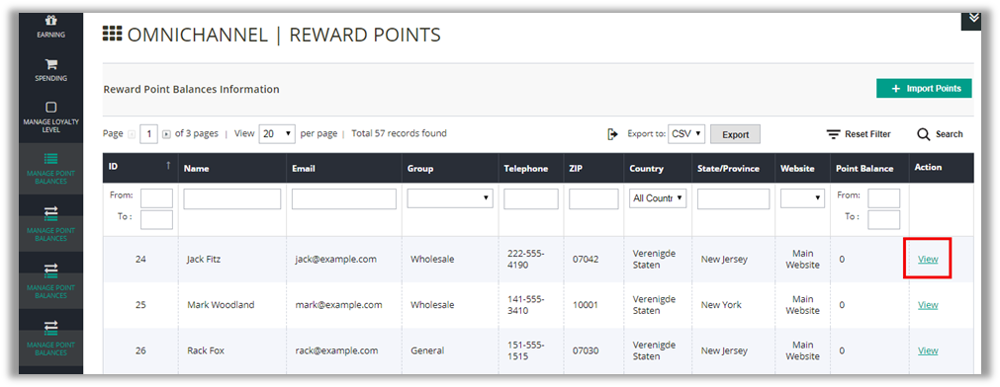

Moreover, you can also import/export customers’ points to your system via csv files. 

Another way to manage point balances is to go to **Customers > Manage Customers**

On the **Customer Manager** page, you can choose the Customer you want to change balance by clicking on the **Edit** link in the **Action** column.

After clicking on the **Reward Points** tab, all of that Customer’s information will appear as below:

**Reward Points Information**: In this session, you can change the Customer’s balance by filling an integer in the **Change Balance** field. For example, if you enter 5, then 5 points will be added to that customer’s balance and vice versa, -5 means that Customer’s balance will be deducted 5 points.

Also, you can configure other information like **Update Points Subscription** or **Expire Transaction Subscription**

**Transaction history**: This part lists all of that Customer’s transactions:

##### Change point balance 

There are two ways to change point balances of customers.

✓ You can change point balances for each customer by entering the **Change Balance** in the **Reward Point** session of **Customer information** page. After you save, the **Available Points Balance** will be updated. 

✓ Another way is that you can change point for many customers at the same time by importing points from csv file. Go to **Reward Points > Manage Point Balances**. On this page, the list of customers will be shown with Point Balance column. 

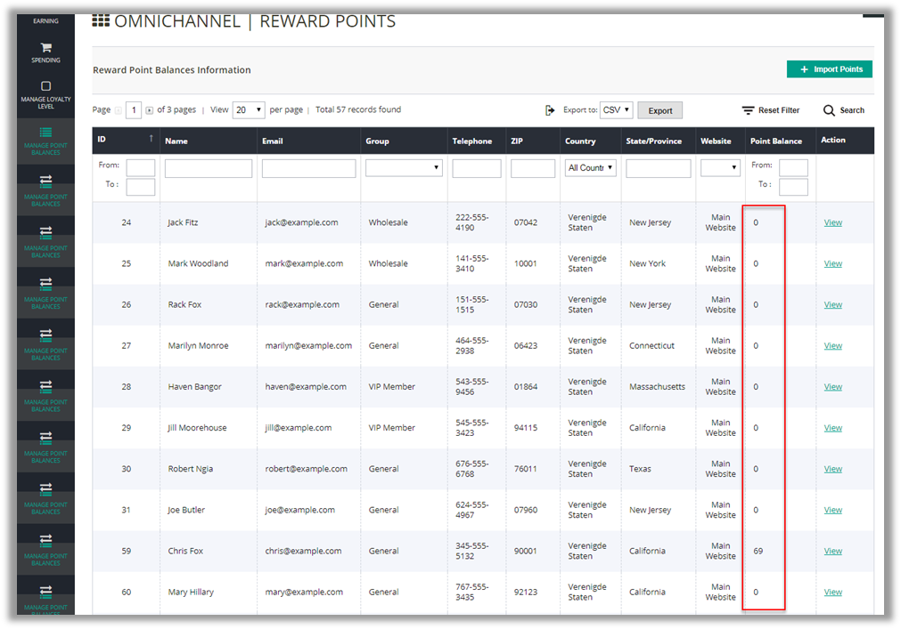

Next step, you need to click on **Import Points** button, the Import Points page will be shown so that you can import file from your computer. Please download the sample file, edit customers’ information then import it. After being imported successfully, the Point Balance of customers will be updated.

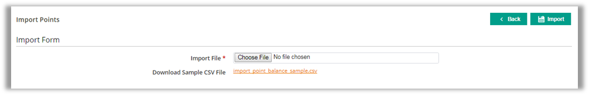

Besides, you can also export csv file from the list of customers in **Reward Point Balances Information** page. You can also use this file to import again. 

##### Use points when creating orders

**Path:  Sales > Orders**

Then the System will display all Customers’ orders. 
To create orders:
First, please click on the **Create New Order** button to see the Order form.
After selecting a Customer, a store and adding Products, you will see the **Use Customer Reward Points** box in which you can set up the number of points the Customer will spend for his order.

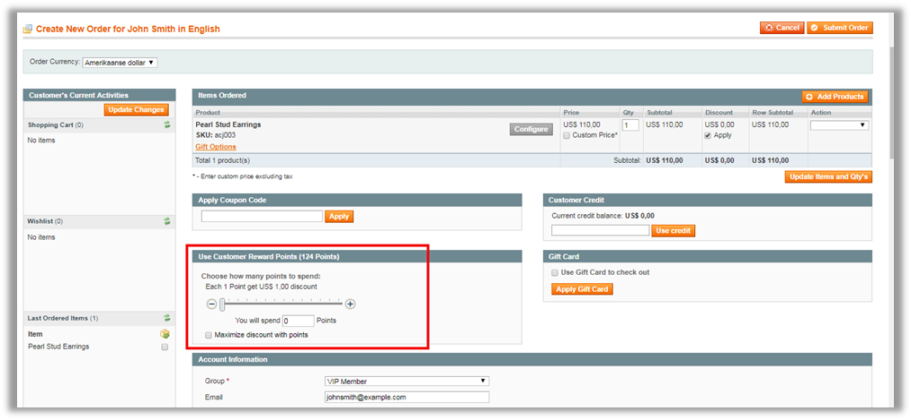

The **Order Totals** box will also display the number of points that Customer will spend:

After filling out all the required fields, please click on the **Submit Order** button to finish creating the new order. Then the **Order totals** box shows the total spent point.

##### Refund orders into points balance

When Customers refund orders, you can decide how many points to refund them as well as how many points to get back from them. By default, the System will set those values as the number of points that Customer spent and the number of points that Customer earned respectively.
First, please choose the order your Customer wants to refund by clicking on the **View** link in the **Action** column. Then the order will appear as below:

Now, please click on the **Credit Memo** link to process the order refund. In the **Refund Total** box, you can choose to refund a number of points you like among those that the Customer spent and get back a number of points among those that he earned.

After that, please click on the **Refund Offline** button to finish your refunding.

##### Manage Loyalty Level

**Path:  Backend > Reward Points > Manage Loyalty Level**

Then you will be naviagted to the **Loyalty Level Manager** page as the image below: 

In this page, you can add new cutomer group by clicking on **Add New Customer Group** button. 
Then, the Loyalty Level Information wiill be displayed and you can create a new level in 3 tabs: 

**General Information Tab**: 

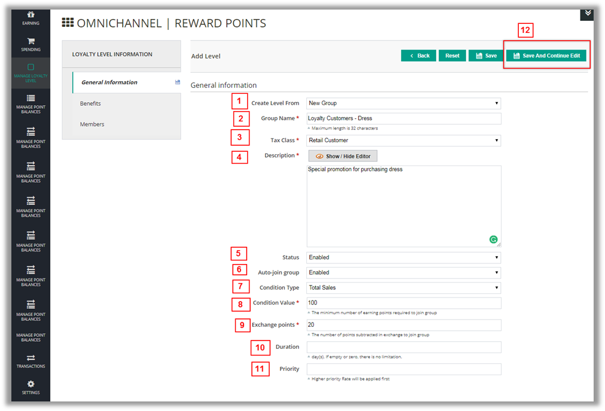

1.	**Create Level From**: Choose group that you want to create leve from: New Group or / Existed Group

2.	**Group Name**: Enter Name for the new group

3.	**Tax Class**: Select which type of customer you want to have in the group: **Retail Customer, Wholesale Customer, General, Members Only, Private Sales, Not Logged-in**

4.	**Description**: Describe the new customer group

5.	**Status**: Select **Enabled** or **Disabled** to display the status of the new group

6.	**Auto-join group**: To allow auto-join group, select Enabled

7.	**Condition Type**Select Total Sales to apply the condition of joining group according to total sales. 

8.	Select Accumulated to apply condition type according to the accumulated value of transactions. 

9.	**Condition Value**: Enter the minimum number of earning points required to join group. 

10.	**Exchange points**:  Enter the number of points substracted in exchange to join group

11.	**Duration**: Enter the number of days you want to apply the level 

12.	**Priority**: This field allows you to set up the priority level for every catalog rule. If there are many rules, then the one with the highest priority will be applied first.

13.	Click on **Save and Continue Edit** before you configure other conditions for the new level.

**Benefits Tab**: 

In the Benefits tab, you can configure Earning, Spending Rule and Promotion policy for the new loyalty level:

Click on **Add earning rule, Add new spending rule** or **Add new promotion rule** button to create new rule appplied for the New Customer Group you have created. 

When you click on the icon (+), you will be navigated to other pages to configure  Earning, Speding and Promotion Rule. 

For example, when clicking on the icon (+) next to Earning Rate, a Earning Rate Information page will open and you can continue configuring  in several fields as same as the section **Manage Earning Rate- Add Earning Rate**. 

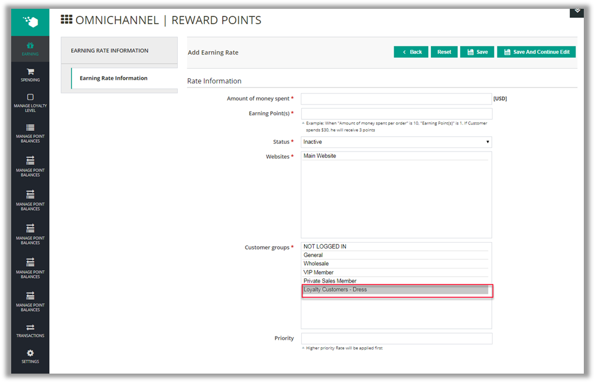

####   How customers join reward points programs
##### How customers earn points

###### Earn points based on earning rate

When placing an order, Customers can earn points based on the rate set by admin.

The system make sure that Customers are well aware of your reward point policy by showing messages on many pages. For example, on **Product Detail** pages, there will be a notification for Customers that says You could receive some Points for purchasing this product.

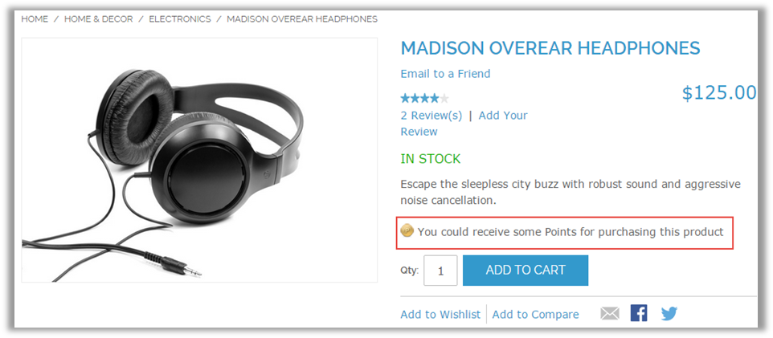

Also, after clicking on the **Add to Cart** button, on **Mini Cart**, Customers will see another notification **Check out now to earn points**.

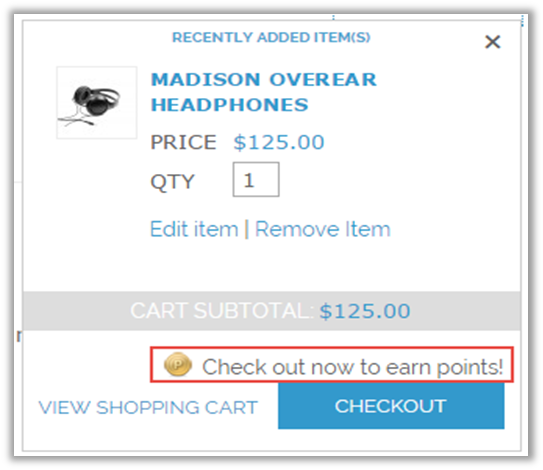

If Customers have not logged in yet, a notification message **Login and checkout to earn points** will be shown on mini cart:

On **Checkout** page, Customers can see exactly the number of points they earned from buying that product in the **Grand Total** box:

If Customers have not logged in yet, a notification message **Login and checkout to earn points** will be shown on **Grand Total** box of checkout page:

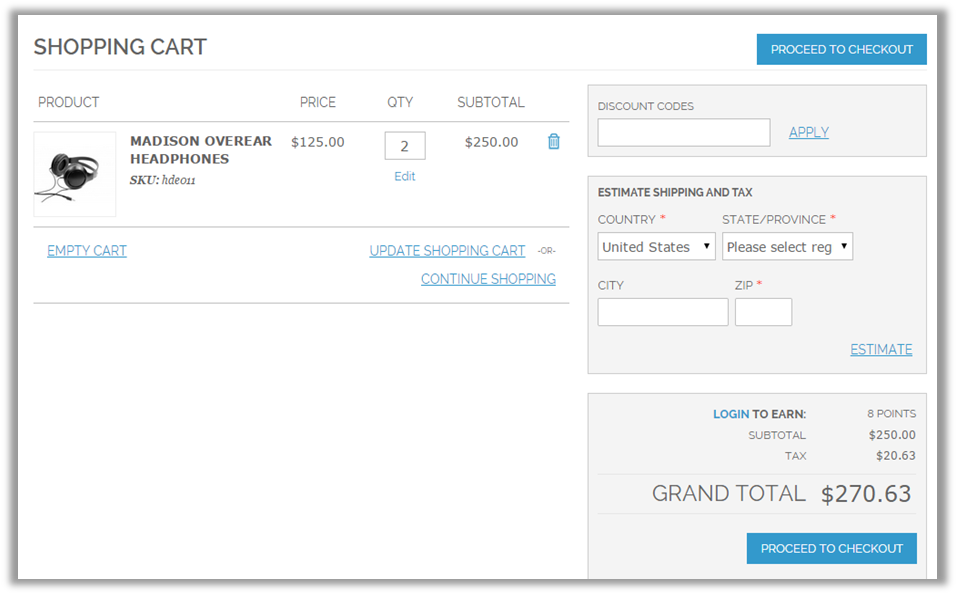

After placing an order successfully, Customers can check their point balance right next to the **My Account** top link or can go directly to that link: 

######  Earn points based on Catalog Earning Rule & Shopping Cart Earning Rule

When placing an order, Customers can earn points depending on the rule set by Admins. 

•	**Earning points based on Catalog Earning Rule**

Catalog Earning Rule enables your Customers to earn points based on specific products. That means you can give your Customers chances of earning more points from some items than from others. This point information will be shown on the **Product Listing** and **Product Detail** pages:

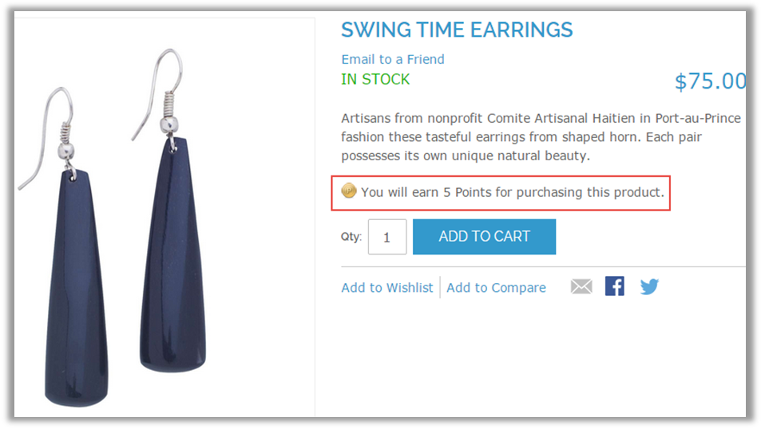

After adding products to the shopping cart, Customers can also see the point amount they will receive as below:

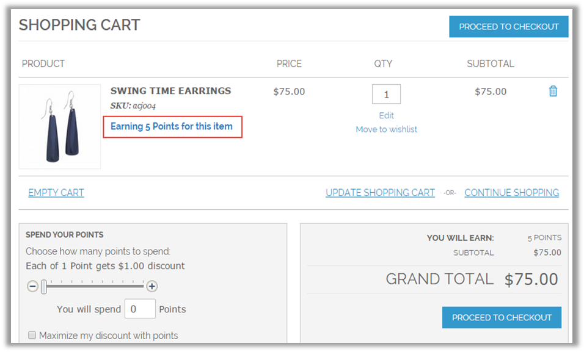

•	**Earning points based on Shopping Cart Rule**

Shopping Cart Earning Rule enables your Customers to earn points based on specific values of orders. That will help you to organize programs such as Earn 20 points for orders equal to or higher than $500. If Customers’ shopping carts meet the condition of the shopping cart rule that you set up on backend, the System will show the points they will earn. After Customers add products to the shopping cart, they can see the point amount as below:

##### How cutomers spend points

######  Spend points based on speading rate

On **Shopping Cart** and **Checkout** pages, Customers can move the slide forwards or backwards to select the number of points they would like to spend. They can also just click on the **Minus** or **Plus** icons. Besides, they can enter this number in the empty box or tick the checkbox **Maximize my discount with points** to spend the maximum number of points. 

On the **Checkout** page, System shows a similar form for Customers to edit the number of points they want to spend for their orders:

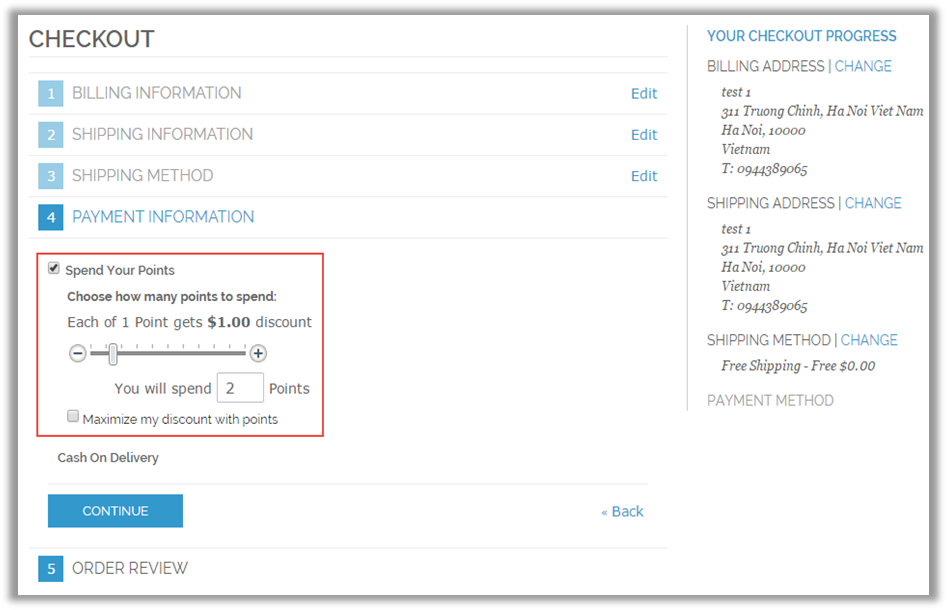

######  Spend points based on Catalog Spending Rule and Shopping Cart Spending rules

On **Product Detail, Shopping Cart** and **Checkout** pages, there are many ways for Customers to choose the number of point they want to spend. They can move along a slider or click on the **Minimize** or **Maximize** buttons to increase/decrease the point amount to spend. Besides, they can enter this number in the box or tick to choose to use the maximum number of points. 

•	**Spending points based on Catalog Spending Rule**

Similar to the **Catalog Earning Rule**, you can set up for products to have different types of using points. The **Catalog Spending** rule information will be shown on **Product Detail** pages and **Checkout** pages after products are added to cart.

When Customers go to a **Product Detail** page, they can see a drop-down list box which contains all the **Catalog Spending** rule options of your site. 

After Customers select an option, the System will show the new price (the discount price) as well as the corresponding spent points. Customers then just need to choose a point amount to spend.

	
In case Customers do not have enough points to spend, System will show a message as below: 

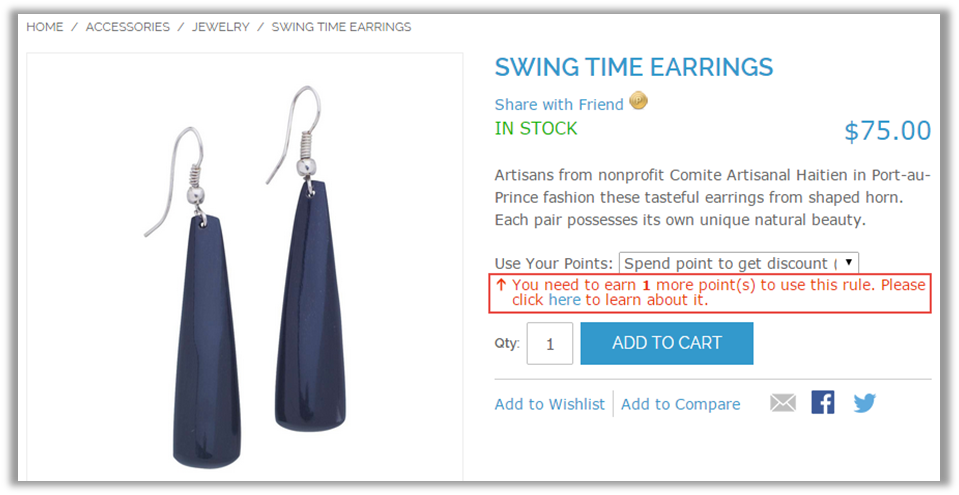

After Customers finish placing orders, the total price of their orders will be discounted by the number of used points:

•	**Spending points based on Shopping Cart Rule**

When Customers add product(s) to cart, there will be a **Spend your points** box on the **Shopping Cart** page. In this box, Customers can select the rule they want to apply for point spending in the drop-down list box. After Customers select the number of points to be spent, the **Grand Total** will be updated automatically: 

•	

In case Customers do not have enough points to apply any rule, the System shows a notification as below:

•	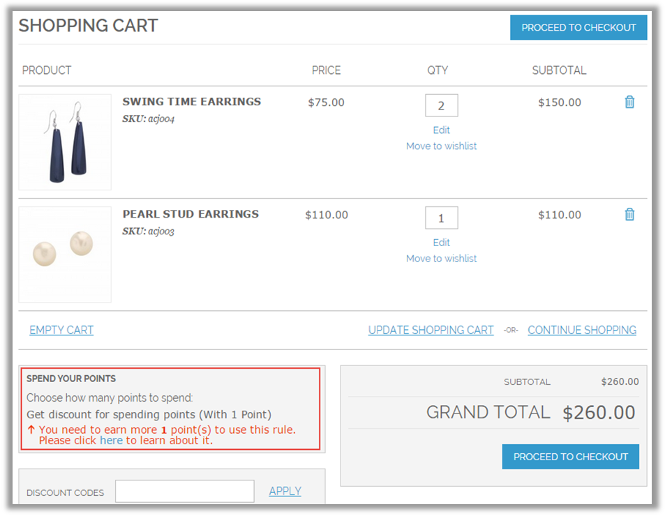

On the **Checkout** page, our system shows a similar form for Customers to edit their spent points for orders:

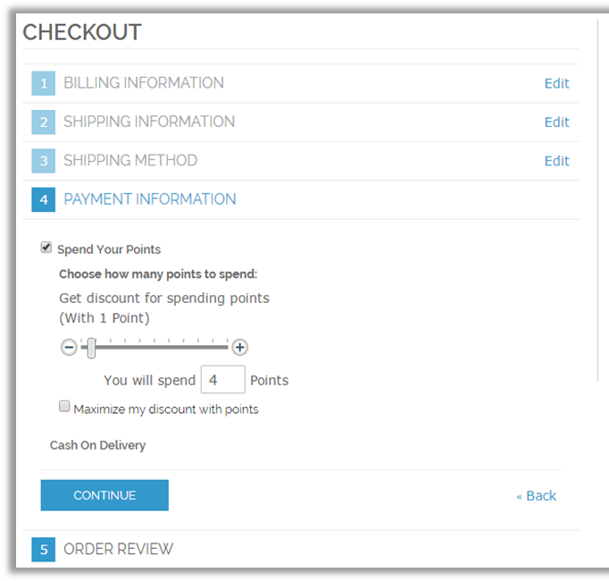

##### How customers manage reward points

Customers can follow and manage their current points in 2 places.

Firstly, they can view their current points in the header as below:

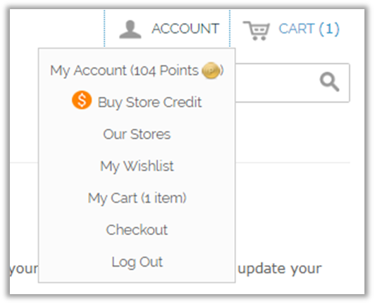

Secondly, they can go to **My Account > My rewards** to view more information:

This page has 2 parts including **Reward Information** and **Recent transactions**

**Reward Information**: This part shows Customers their current balances as well as description about the application rules on your site.

**Recent transactions**: This part provides Customers with a lot of information on their reward point transactions such as **ID, points, action, date and status**. 
### Store Credit
####   How to configure Store Credit
#####  Settings

**Path:  Store Credit > Settings**

**General Configuration Tab**:

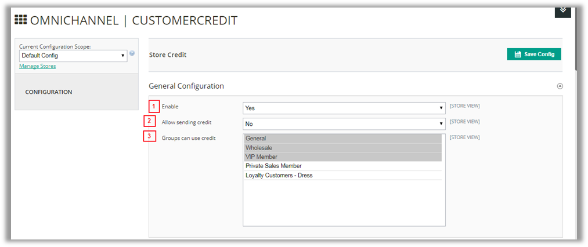

1.	**Enable Store Credit**: to activate Store Credit on your site

2.	**Allow sending Credit**: allow customers to send credit to their friends

3.	**Groups can use edit**: allow only **General/Wholesaler/Retailer** or all customers able to use credits

**Spend Credit On Tab**

1.	**Apply Customer Credit**: If you choose **After tax**, it means the Customer Credit Discount will be applied to order value including tax

2.	**Shipping fee**: If you choose **No**, credit balance cannot be used to pay for Shipping Fee

**Email Configuration Tab**:

1.	**Email template with credit code sent to recipients**: default

2.	**Email template with verification code sent to credit sender**: default

3.	**Email template notifying customers**: default

4.	**Send-to-customer email template when recipient receives credit**: default

**Adjust time for Customers credit reports on total used and total received credit Tab**:

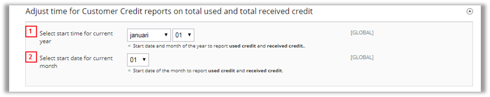

1.	**Select start time for current year**: choose Month, then Date

2.	**Select date for current month**: choose Date

**Style Configuration tab**: on this tab, you will be able to change background and color of Title

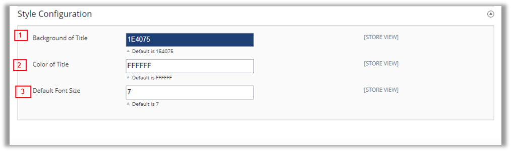

1.	**Background of Title**: enter Hexadecimal code

2.	**Color of Title**: enter Hexadecimal code or choose a color as above.

3.	**Default Font Size**: enter a font size

##### Manage Customers Using Credit

**Path:  Store Credit > Manage Customers Using Credit**

Then the **Customers Using Credit Manager** page will be displayed as below:
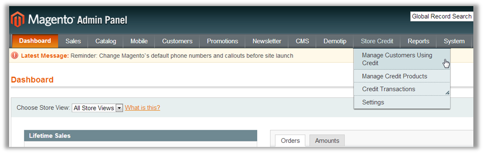

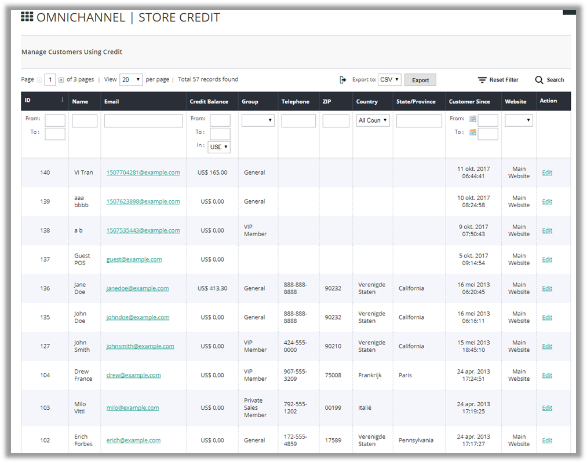

This page shows a list of all Customers using credit and their information such as name, email, credit balance, telephone, etc.

In order to view more details about a Customer, you can click on the **Edit** link in the **Action** column.

Then you will be navigated to the **Store Credit** tab on the **Customer Manage** page that shows you all of that Customer’s transaction history and credit balance:

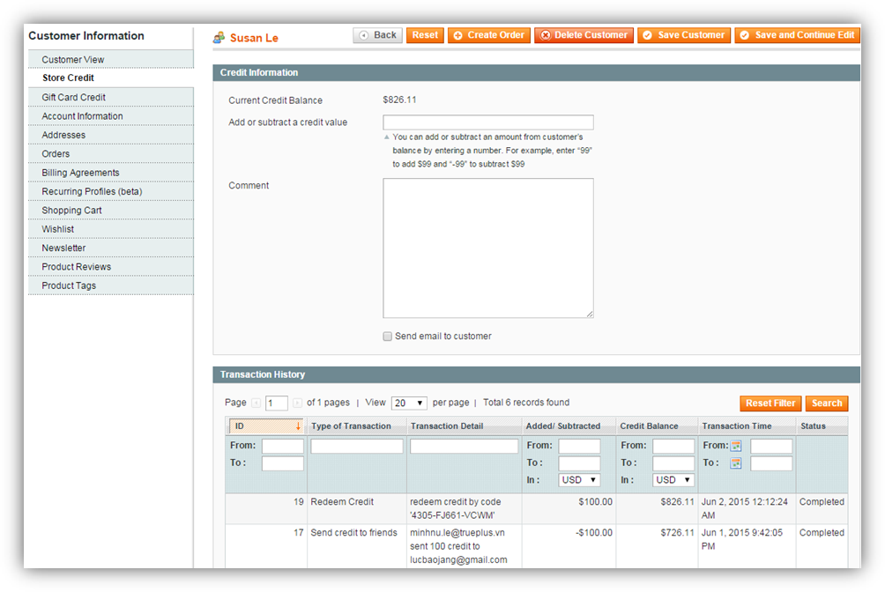

Besides, you can change the Customer’s credit balance by entering an integer (a positive or negative number) and a comment in text fields as below:

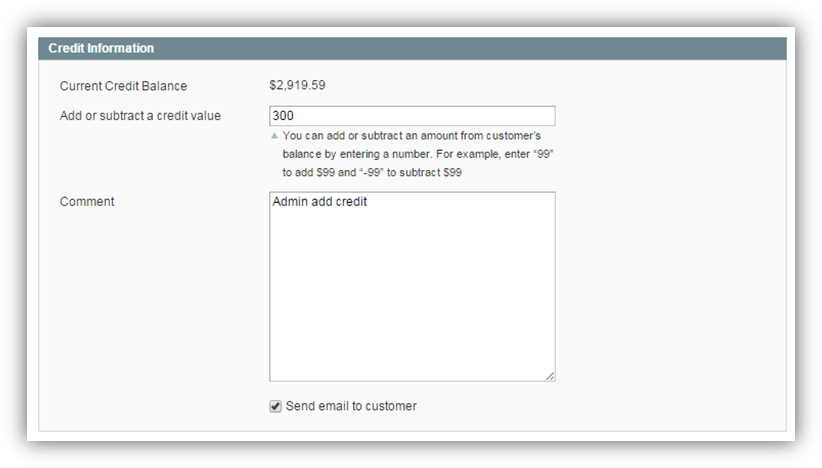

Our module will auto send email to Customer to announce about this transaction if you tick on **Send email to customer** checkbox. The email will be sent to the customer as bellow: 

After you save, our module will auto update the Customer’s credit balance, send an email to that Customer and create a transaction as follows:

##### Manage Credit Products

**Path:  Store Credit > Manage Credit Products**

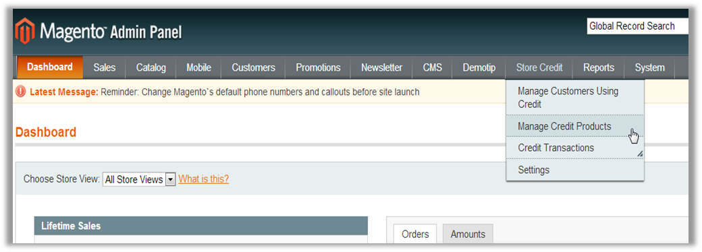

Then the **Credit Product Manager** page will be shown:

This page shows you all credit products with a lot of information such as **product ID, name, SKU, quantity, status**, etc. 

In order to add a new credit product, you can click on theAdd Credit Product** button on the right top of the page.

You can add a credit product just in a similar way to adding a normal product. You should pay attention to these following tabs: 

**General Tab:**

Fill in all required information such as **Product Name, Description, SKU, Status, Visibility**, … the same as creating new normal product. 

**Prices Tab**:

In this tab, you can configure the price of the credit product. 

There are three kinds of credit products you can use including **fixed price, option price** and **range price**.

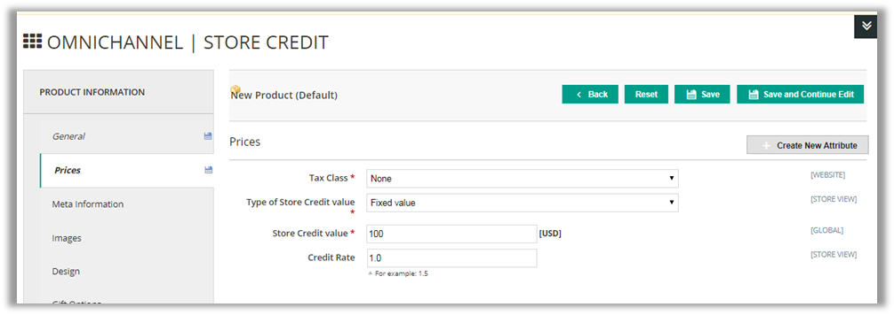

If you select **Fixed value**, enter the only value you want to apply for the credit product. 

If you select **Range of value**, you need to enter the maximum and minimum store credit value as the image above. 

If you select **Dropdown value**, you need to enter which credit values you want to display and they should be seperated by a comma (for example: 10, 30, 50, 60)

Inventory Tab:

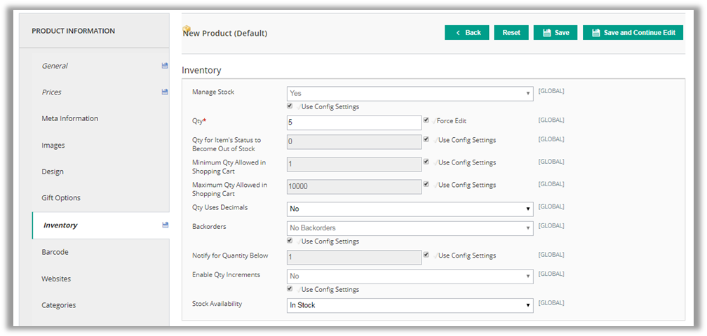

In this tab, by default, our module sets up the field **Manage Stock** as **No**. It means that you do not need to manage the quantity of credit products.

If you choose **Yes** in **Manage Stock** box , you need to enter all the information related to the quantity of store credit you want to have in your stock. 

Besides the **Credit Product Manager** page, you can also create a new credit product by clicking on the **Add Product** button on the **Manage Product** page:

Then you will be navigated to the **New Product** page. In the **Settings** tab, you need to select **Customer Credit** for the **Product Type** field before going on to configure the product as above.

##### Manage Credit Transactions and Report Charts

###### Credit Transactions

**Path: Store Credit > Credit Transactions > Credit Transactions**

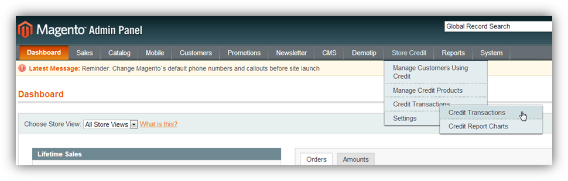

Then the **Credit Transactions** page will be shown: 

This page shows all credit-related transactions with a lot of information such as **type, detail, customer name/email, added/deducted credit, credit balance** after transaction and **transaction time**.

You can search any transaction by using filter boxes in each column.

If you click on a Customer’s email, you will be navigated to the Customer Manager page.

######  Credit Report Charts

**Path:  Store Credit > Credit Transactions > Credit Report Charts**

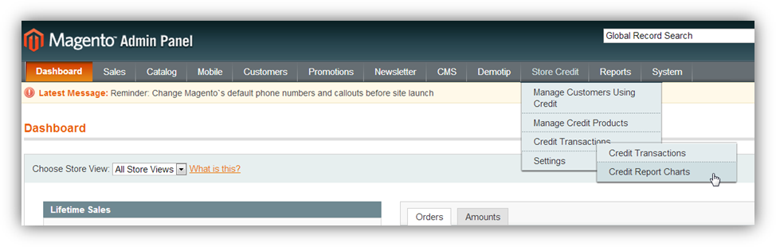

or follow the path below: 

Then the **Report Charts** page will be shown as follows:

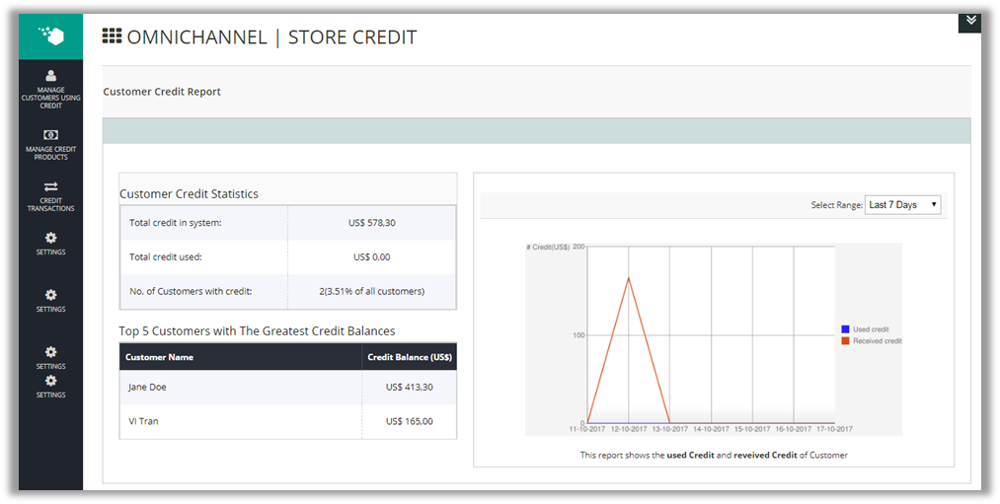

This page can be divided into two main sections including **Life-time Reports** and **Period-of-time Report Charts**.

**Life-time Reports**: There are 2 types of reports

✓ **Customer Credit Statistics** with the total credit, the total spent credit and the number of Customers with credit in your system.

✓ **Top 5 Customers with The Greatest Credit Balances** with their names and current balances in your system.

**Period-of-time Report Charts**: This chart shows you the total spent credit and received credit of all Customers per day in your chosen time range such as **last 24 hours, last 7 days, current month**, etc.

##### Using Credit to checkout in backend:

On the **Create Order** page on backend, our module allows you to use credit when creating orders for Customers.

Firstly,  enter a credit amount and then click on the **Use Credit** button. Our module will auto-update and calculate the grand total of the order.

After submitting the order, the Customer’s credit balance will be also auto updated and you can check the transaction on the **Credit Transaction** page.

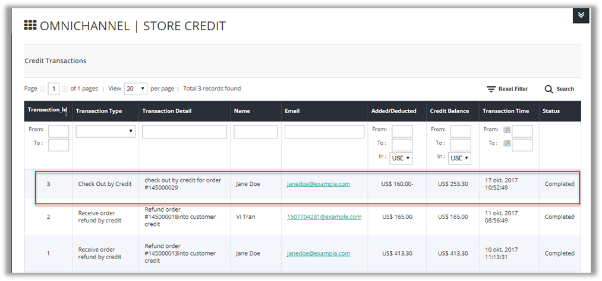

#####  Refund Orders into Credit Balance

When Customers want to refund an order, our module allows you to transfer the order value to his credit balance. In that way, Customers can use the credit for future purchases and you do not have to lose money for the refund at the same time.

After clicking on the **Credit Memo** button, our module shows a text field for you to enter the amount you want to refund into credit:

After that, when you click on the **Refund Offline** button, the amount you entered as well as the credit that the Customer used for paying for the order will be refunded to his current credit balance. 

Once the refund is finished, you can check the transaction on the **Manage Transaction** page:

####   How customers mange store credit 
##### How customers buy credit products

After Customers login to your website, they can access the **Store Credit** page in two ways.

Firstly, clicking on the **My Account** link, they can choose **Buy Store Credit** in the dropdown list. 

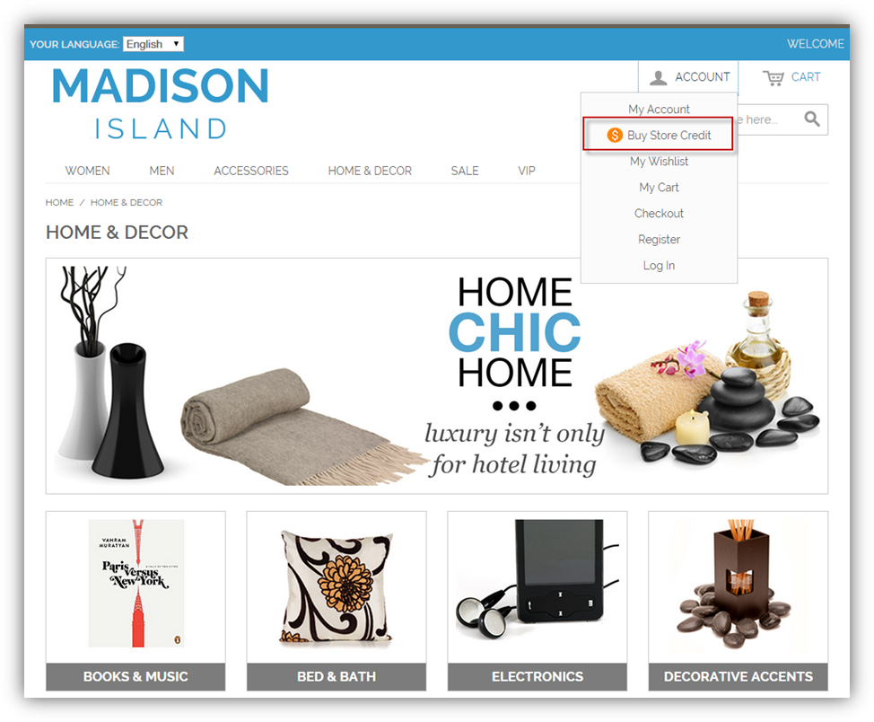

Secondly, they can click on the **My Credit** tab on the left navigation on the **My Account** page.
In this second way, they will be navigated to the **My Credit** page on which they just need to click on the **Buy store credit** button:

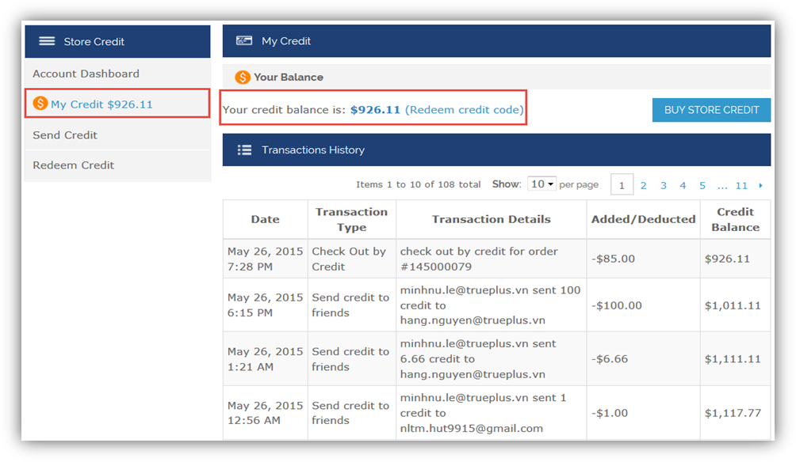

After that, the **Store Credit** page will be shown as follows:

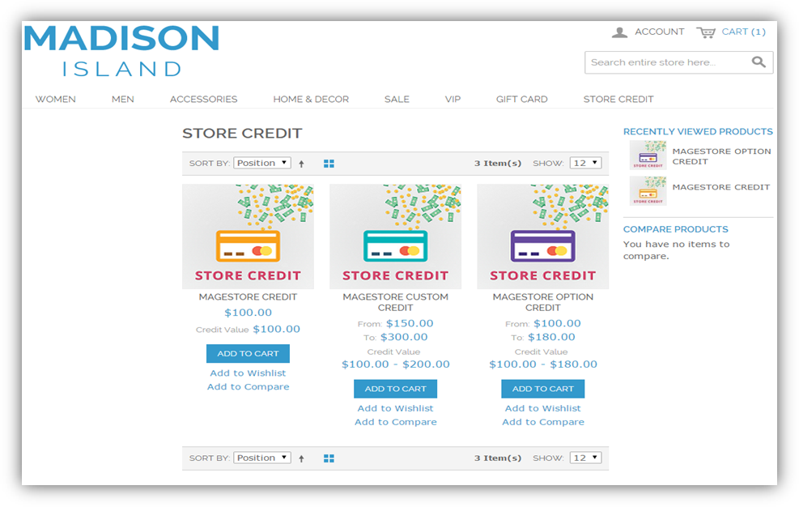

As you can see, this page lists all credit products of your website. There are three types of credit products for Customers to choose:

•	**Fixed Value**: These credit products have fixed value. 

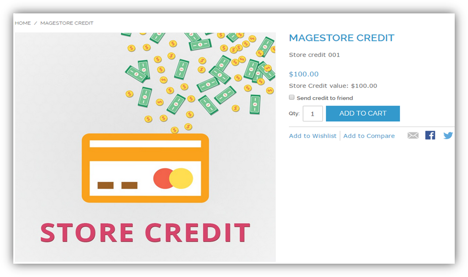

•	**Option Value**: With this type, Customers can select a value option in the drop-down list box.

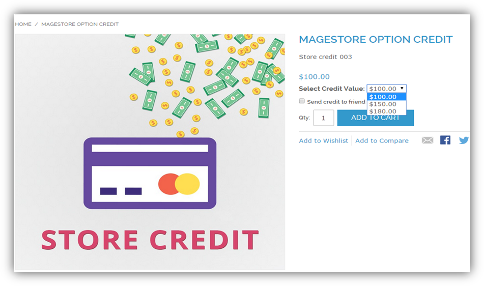

•	**Range Value**: With this type, Customers can choose a desired credit amount within the range configured by admin in backend. 

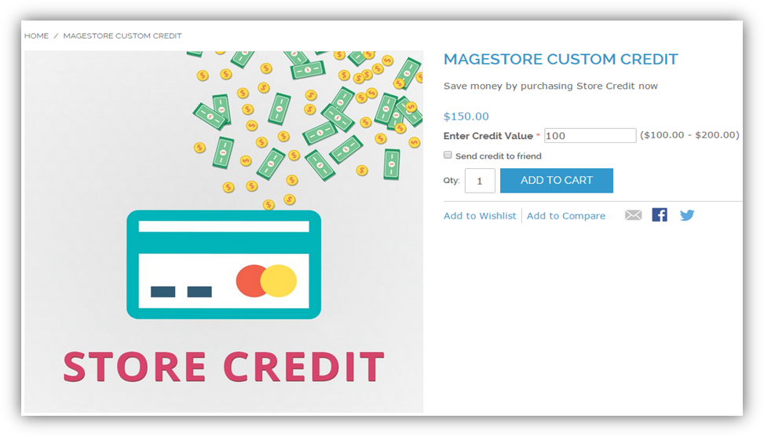

After selecting credit products they like, Customers can add them to cart and checkout normally.

When the order is complete, our module will auto-add that credit amount to the Customer’s credit balance.

Customers can also send Credits to their friends by ticking **Send credit to friend** checkbox and enter all the required fields:

1.	Enter **Sender’s name** (optional)

2.	**Recipient name**: the name of the recipient 

3.	**Recipient email address**: the email address of the recipient. The system will send an email to this address.

4.	**Custom message**: the message that recipient will receive

When the order is complete, if the recipient do not have an account in the system will receive an email as below:

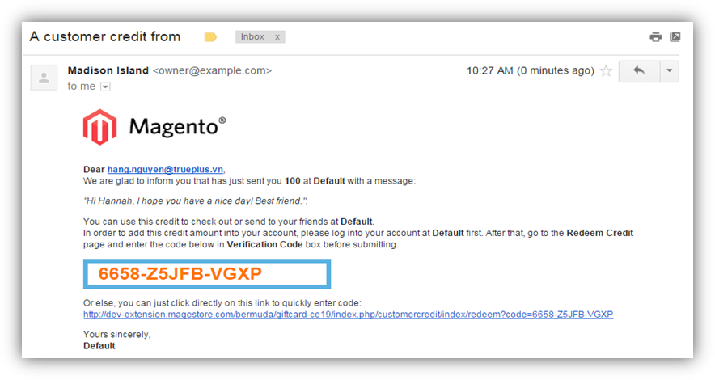

If the recipient has an account in the system, our module will auto-add that credit amount to the Recipient’s credit balance.

The sender always gets email notifications as below:

#####  How customers manage Credit on My Credit page

In order to access the **My Credit** page, Customers can click on the **My Credit** tab on the left navigation.

######   Manage Credit Balance

On the **My Credit** page, Customers can view information about their current credit balances and transaction history.

In the section **Transaction History**, our module shows Customers all of their credit transactions with a lot of information including **date, type, details, added/deducted value in transaction** and **credit balance**.

######  Send Credit to Friends

First, Customers should click on the **Send Credit** tab on the left navigation to go to the **Send Credit to Friends** page.

This page has 2 parts including **Send Credit To Friends** and **Credit Code List**.

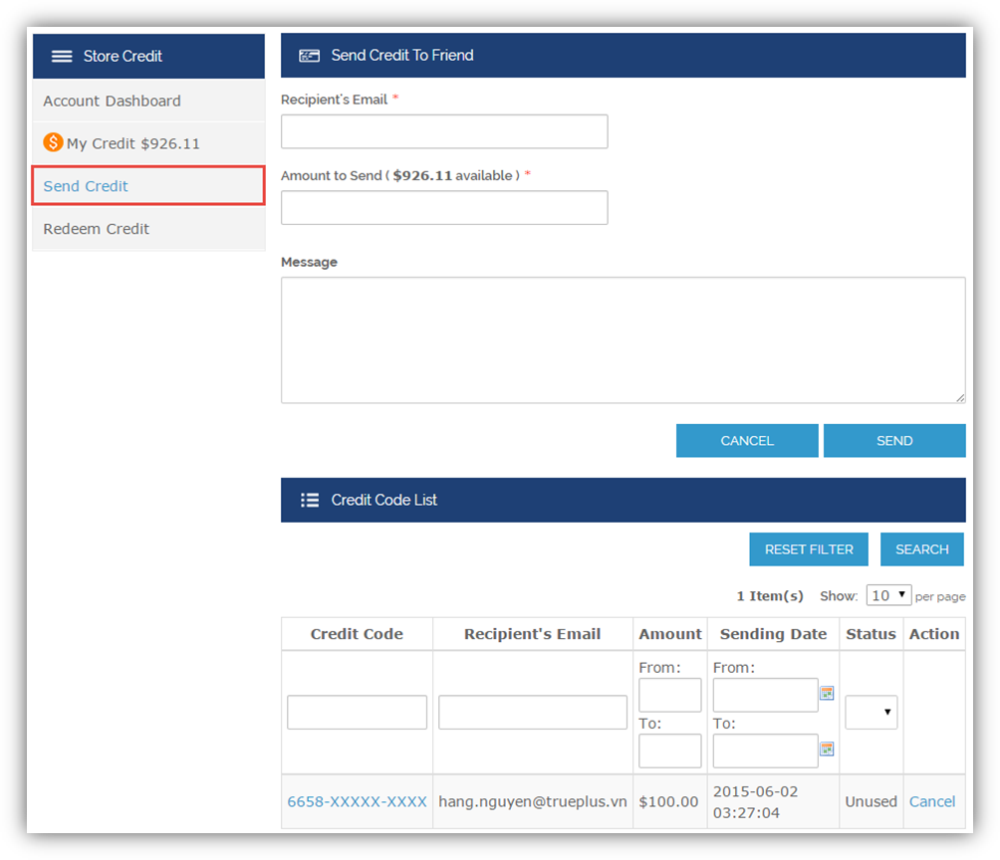

✓ **Send Credit to Friends**: In this section, Customers can send credit to their friends.

✓ **Credit Code List**: This section shows all information about the credit codes that Customers sent to their friends including **code, recipient email, amount, sent date** and **status of code**. Credit codes are not displayed in full for security purpose. When Customers click on, they will be shown clearly.

Please note that our module allows you to configure whether to require your Customers to verify their credit sharing or not. We will consider the two cases separately.

**Case 1: Customers are not required to verify their credit sharing**.

In order to send credit to friends, Customers should enter the recipient’s email and credit amount in the text fields. Our module will check that email address and show notification to Customers.

•	**If the recipient’s email has not been registered on the website**: 

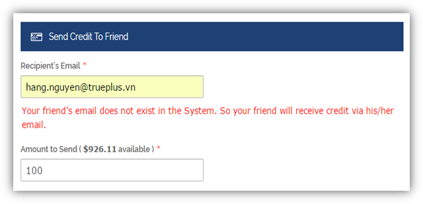

In this case, our module will show a notification for the Customer that his friend will receive the credit code via that email. The Customer can enter a message and click on the **Send** button. After that, his credit balance will be deducted immediately and an email will be auto-sent to the recipient’s email address:

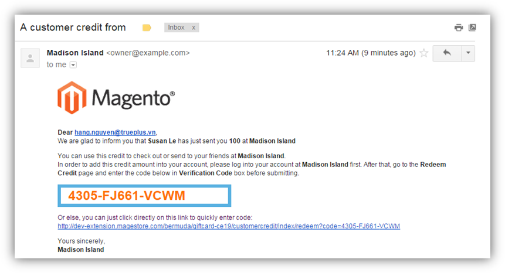

As you can see, this email informs the recipient about the credit amount, message and a credit code which can be used to redeem credit to his balance.
At the same time, the sender can also see the sent credit code in the **Credit Code List** section as below:

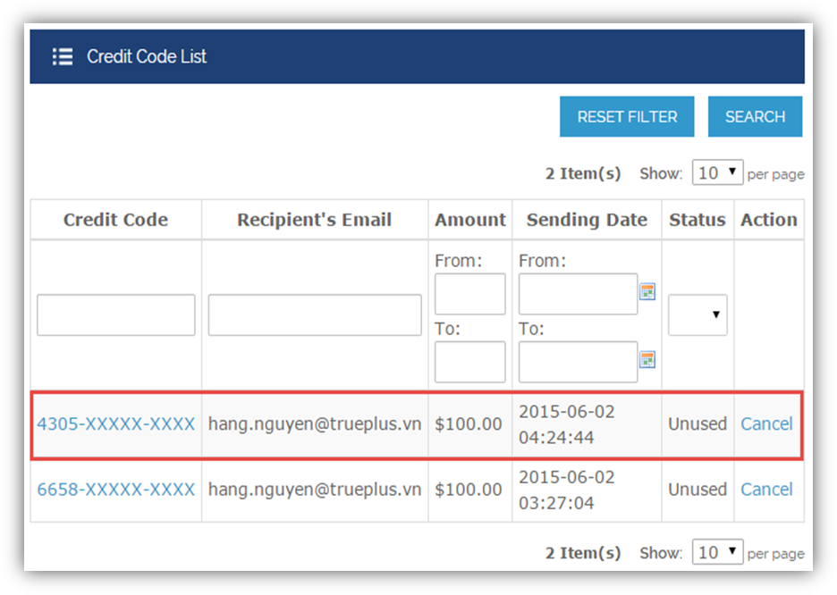

In this section, Customers can follow the status of the credit codes they sent. When a recipient has not redeemed a credit code, Customers are allowed to cancel it by clicking on the **Cancel** link in the **Action** column. After the cancellation, the recipient cannot redeem that credit code any more.

Otherwise, once the credit code has been redeemed, the status will be updated and the **Cancel** link will be disabled. Please refer to the section **Redeem Credit below** for more information.

Customers can check their current balances and transactions of sharing credit in the **Transaction History** section.

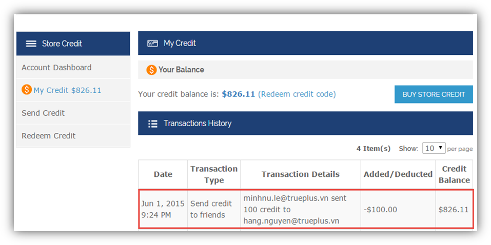

•	**If the recipient’s email has been registered on the website**: 

If the recipient’s email address has been registered on your website, our module will send credit directly to his credit balance instead of sending credit code to his email.

Customers can check their current balances and transactions in the **Transaction History** section.

At the same time, recipients can get information about this transaction:

**Case 2: Customers are required to verify their credit sharing**.

If you configure that Customers have to verify before sharing credit, after clicking on the **Send** button, they will receive an email as below:

At the same time, they will be navigated to the Verify page:

On this page, our module shows them a notification about the verification requirement. In the **Credit Code List**, that code is put under the **Awaiting verification** status with a **Verify** link. 

To verify, Customers just enter the verification code they received in their emails and then click on the **Submit Code** button.

After Customers finish verifying, our module will send credit to the recipient.

######  Redeem Credit

In order to go to the **Redeem Credit** page, Customers can click on the **Redeem Credit** tab on the left navigation.

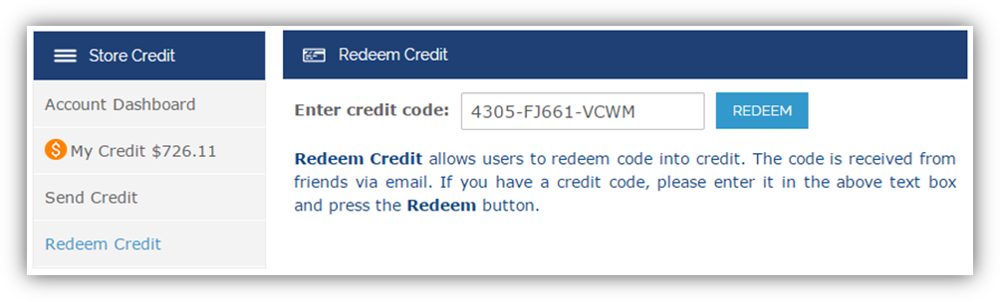

On this page, Customers can redeem the credit code they received to their credit balance by entering the code in the text field before clicking on the **Redeem** button. Another way is just to click on the link in the email.
After redeeming code, Customers can check their current balance and transaction in the **Transaction History** section.

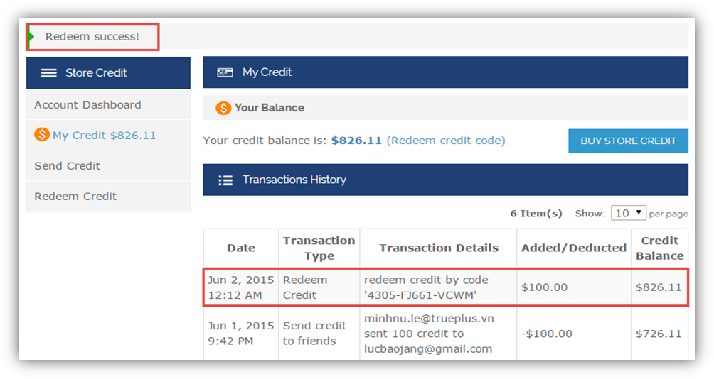

#####  How customers checkout by Credit

Customers can use credit to checkout on both **Shopping Cart** and **Checkout** page.

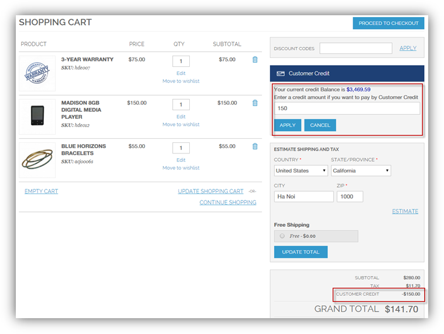

On the **Shopping Cart** page, our module will add a **Customer Credit** block for Customers to use their credit balances to checkout.

To use a credit amount, Customers can first enter that number in the field and then click on the **Apply** button. Our module will auto-update and calculate the grand total of order.

Please note that Customers cannot use credit to buy credit products. If their carts have one or more credit products, our module will show a notification in the **Customer Credit** block as below:

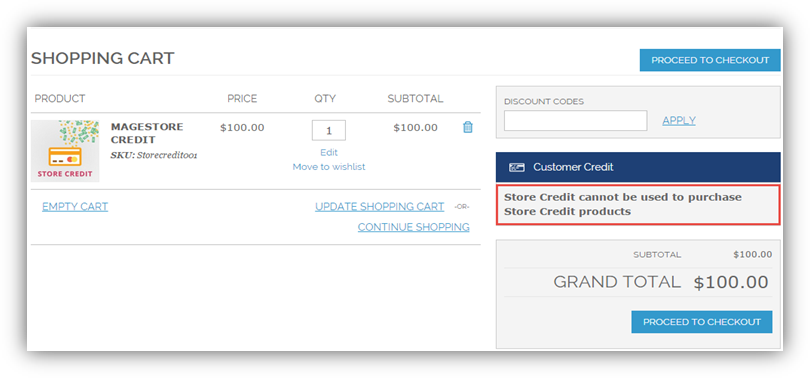

On the **Checkout** page, in the **Payment Information** tab, Customers can also use credit to check out by ticking on the checkbox and then enter a credit amount they want.

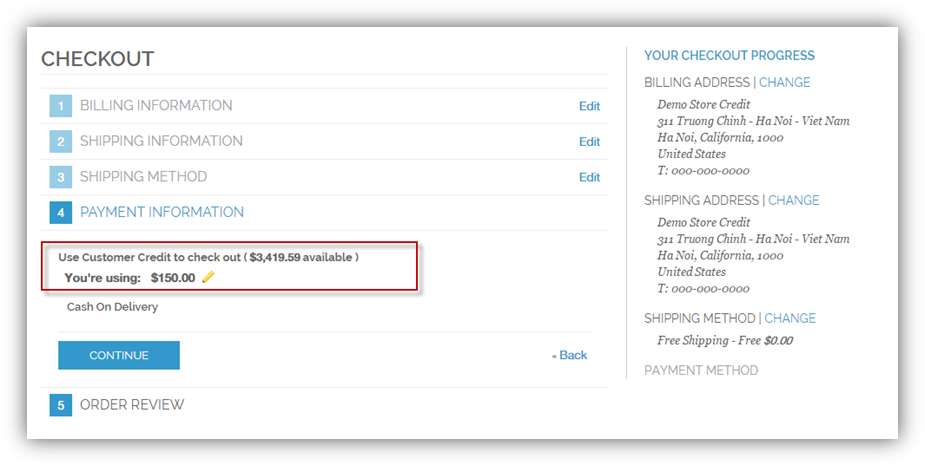

When Customers click on the **Continue** button, our module will auto-update the Grand Total of the order.
After order has been placed, Customers’ credit balances will be updated immediately. They can check the current balances and transactions in the **Transaction History** section.

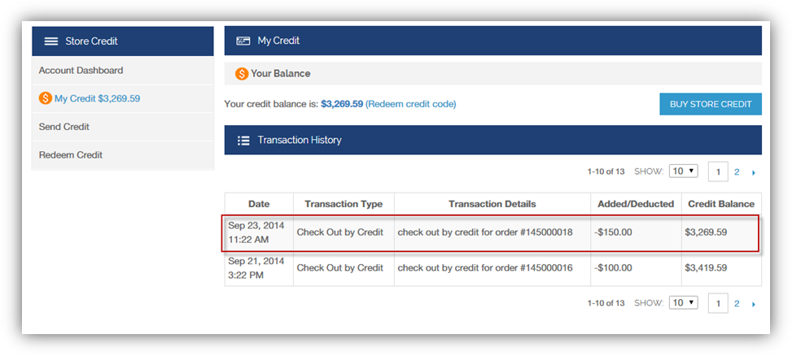

### Gift Cards

####   How to configure Gift Card

##### Settings

**Path:  Gift Card → Settings**. 

Administrators can change parameters as follows:

**General tab** :

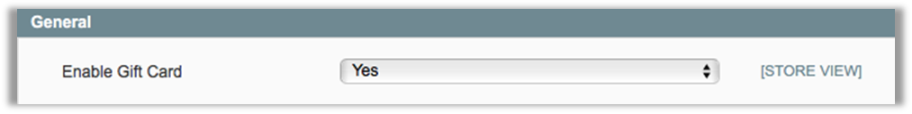

Choose **Yes** if you want to enable Gift Card. Otherwise, choose No.

•	**Gift Code**

1.	Configure the **pattern** to auto-generate gift codes for Gift Card products when customers purchase in frontend

2.	Enter the number of **prefix characters** which are shown in a voucher code

3.	Enter one letter to **replace hidden characters**

•	**Gift Card Usage**

1.	Enter the term of validity that Gift Cards can be used after being activated.

2.	Enter the **maximum time(s) ** that allows users to enter gift code incorrectly.

3.	Enter the **maximum number of users per gift code**.

4.	Choose **Yes** to enable customer’s Gift Card Credit Balance. Then, customers can redeem their gift code for credit balance

5.	Select **Yes** to allow customers to redeem Gift Cards with usage conditions 

6.	Choose **Yes** to allow customer to apply gift card for shipping fee

7.	Select **Yes** to allow customers to use both Gift Card codes and Coupon codes at once. 

8.	Choose **Yes** to allow customers to check status of Gift Cards after entering Gift Codes, and vice versa.

9.	Select **Yes** to show the expiration date of Gift Cards on website, and vice versa.

•	**Tax Configuration**

Here, you have two options to apply Gift Card Discount:

✓ After Tax: to allow applying Gift Card after the tax is applied

✓ Before Tax: to allow applying Gift Card before the tax is applied

**Gift Card Product page tab**:

•	**Gift Card Value**

1.	Enter the default gift card value 

2.	Enter the description of gift card value 

•	**Gift Card Template**

1.	Select **Yes** to allow customers to change the image inserted in the template

2.	Limit the maximum size of images uploaded by customers to 500KB

•	**Gift Card Shipping Information**

1.	Select **Yes**: Gift card can be sent through the post office

2.	Choose **the number of days** that after Customers order Gift Cards for friends and choose Send through post office option, Gift Cards will be sent to recipients within that number of days

3.	Limit the maximum length of a custom message on Gift Card. 

4.	Select **Yes** to enable scheduling Gift Card Delivery. It helps customer flexibly choose their preferred date to send the Gift Card to others 

**Shopping Cart Page tab**:

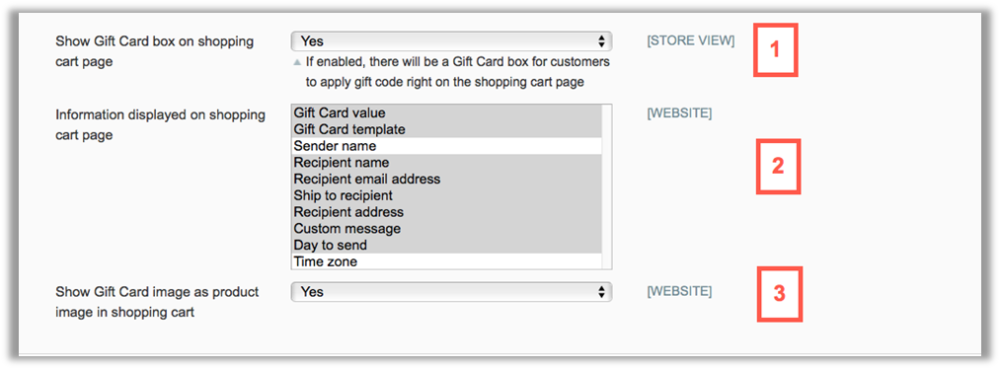

1.	Select **Yes** to Enable a Gift Card box for customers to apply gift codes right on the shopping cart page.

2.	Select the data to display on shopping cart page

3.	Select **Yes** to allow showing Gift Card printout preview as product image on shopping cart page

**Checkout Page tab**

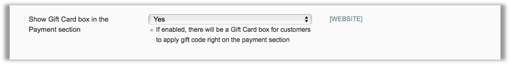

Select **Yes** to show Gift Card box on the checkout page
 
**Email Notification tab**:

•	**General**

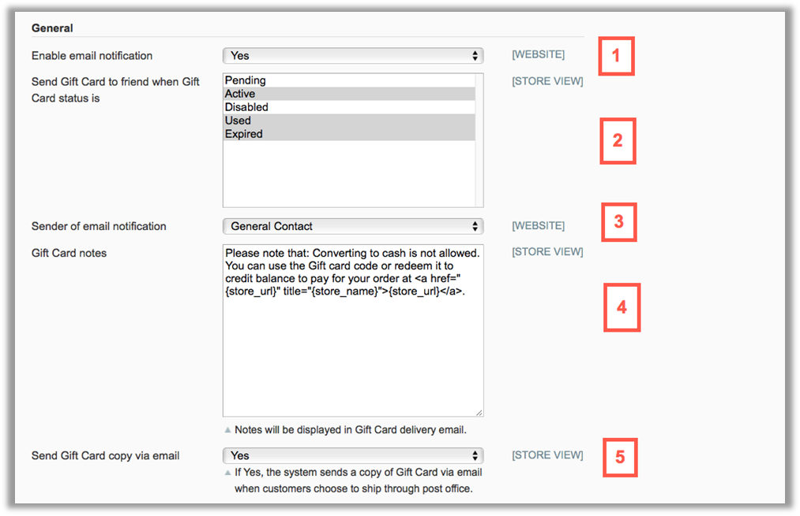

1.	Select **Yes** to allow sending notification emails to customers and recipients

2.	Select **Active**, only a gift card which is activated can be sent to a friend

3.	Set the default **sender of notification emails** as **General Contact** or **Sales Representatives, Customer Support, Custom Email 1, Custom Email 2**

4.	Enter the notes displayed in Gift Card Delivery Email 

5.	Select **Yes** to allow sending a copy of gift card via email if customers choose to ship through post office.
•	**Notification Email send to Purchaser**

1.	Select the email template **sent to purchasers after buying Gift Card** successfully. 

2.	Select the email template **sent to purchasers when recipients receive Gift Cards**.

•	**Notification Email send to Recipient**

1.	Select the email template **sent to the gift card’s recipient**.

2.	Select **Yes** to allow sending email notification to recipient when sender refunds Gift Card.

3.	Choose the email template **sent to recipient when gift card is refunded**.

4.	Select Yes to enable auto reminder email sent to Customers before Gift card expires

5.	Enter the number of days to send notification to customers before the expiration date of a Gift card.
 
**Gift Card Printout tab**:

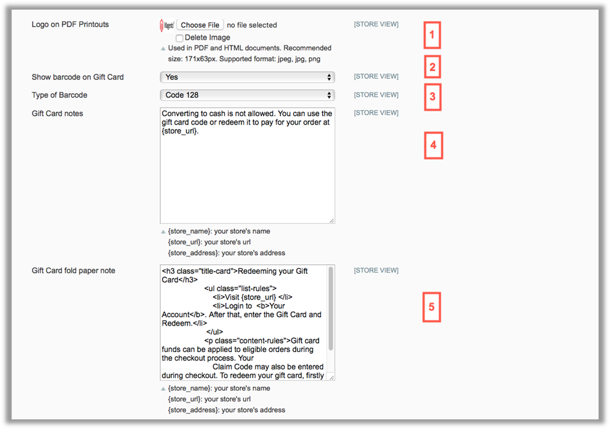

1.	Click on **Choose File** to upload your Logo image. **Notice that**: this image is used in PDF and HTML, recommended sixe is 17x63 px ndn the supported format is jpeg, jpg and png

2.	Choose **Yes** to show barcode on Gift Card

3.	Select **type of barcode** shown on Gift Card (if you choose Yes on step 2)

4.	Enter **Gift Card Notes** 

5.	Enter **Gift Card fold paper note** (recommed to use HTML)

#####  Manage Gift Card Templates

After installing the module, you can start with Gift Card templates. This function helps you create unlimited templates for Gift Card with different titles, designs, images and notes. You can flexibly customize Gift Cards for different purposes, such as X-mas Gift Card or Birth Day Gift Card, offering Customers a wide range of choices.

**Path: Gift Card > Manage Gift Card Template** 

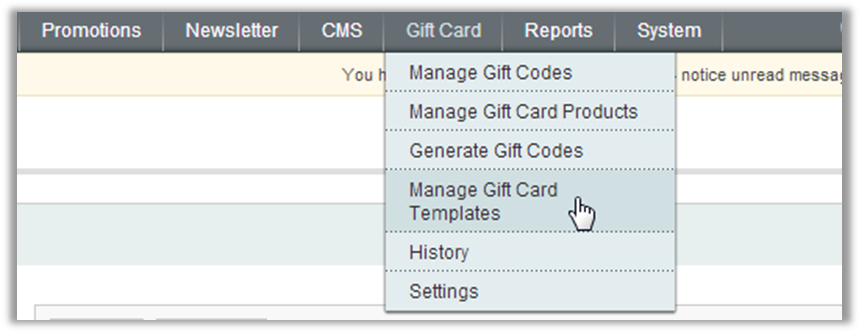

The **Gift Card Template Manager** page will be displayed as below:

As you can see, this page lists all available templates in the system. You can add/edit/delete a template and export the list of templates to .CSV/.XML files. If you want to change status /delete templates in mass, simply select multiple rows, apply an action then click on **Submit** button.

In **Template Design** column, there are 5 default Gift Card templates with 4 different design styles for you to select:

✓  **Left template**: picture aligns with the **left** of Gift Card

✓ **Top template**: picture aligns with the **top** of Gift Card

✓ **Center template**: picture aligns with the **center of Gift Card

✓ **Simple**: a template for any stores with simple & clean design

✓ **Amazon gift card style**: a template which is similar to Amazon gift card

**Left template** 

**Top template** 

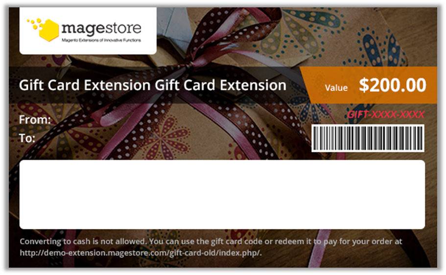

**Center template** 

! manage gift card templates 

**Simple template**

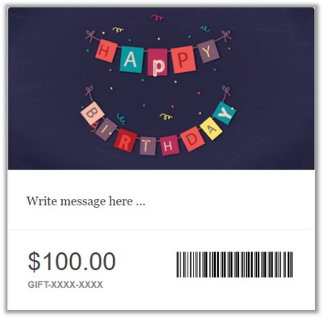

**Amazon Gift Card template**

If you want to create new Gift Card templates, select **Add Gift Card Template** button and finish the form as below:

**General Information tab**:

1.	**Template name**:  Enter  a name of the Gift Card template 

2.	**Status**: Select  **Active** to enable this template to be chosen when creating Gift Card product

3.	**Template design** : Choose  **Left /Right/Top/Simple/Amazon-gift–card**  to align the  image with the design of  left/right/top/simple/Amazon style as you can see right behind the fields.

4.	**Title**:  Set the title of Gift Cards using this template instead of the default title Gift Card.

5.	**Style color**: Choose color of texts in Gift Card title, Value and Gift Cide fields. 

6.	**Text color**: Choose color of other texts (fields’ name, message, notes, etc.).

7.	**Background image**: Upload an image to use as a background of Gift Card. 

Notice that customers will not be able to change the background image. 

8.	**Notes**:  Converting to cash is not allowed. You can use the Gift card code or redeem it to credit balance to pay for your order, Add notes, such as usage conditions, for Gift Card.

You can click on **Preview** button at the top right corner to see how Gift Cards using this template will look like. All changes in title, template design, style color and text color will be shown in a popup. If you want to view the background image applied on a Gift Card, click **Save and Continue Edit** button and then preview as above.

**Images tab**:

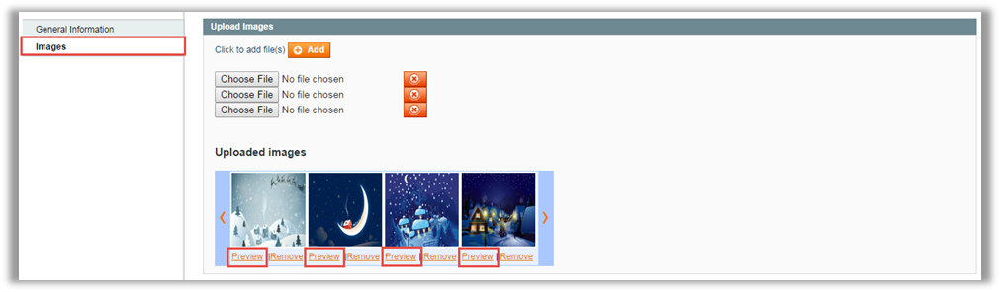

In this tab, you can create a list of images for Customers to select when buying Gift Card in frontend. Just click on **Add** button and choose image files to upload. 

***Note**: 

You should use images with the following recommended sizes for better display:

✓ Template style is Top: 600x190px.

✓ Template style is Left: 250x365px.

✓ Template style is Center: 600x365px.

✓ Template style is Simple or Amazon gift card

Click **Preview** under each image to see how Gift Card will look like. When you finish, remember to click on **Save** or **Save and Continue Edit** to save your work. 

##### Create/Edit a Gift Card Products

There are two ways to create a Gift Card product: on **Manage Gift Card Products** page and on **Manage Products** page.

-	Create Gift Card on **Manage Gift Card Products** page:

**Path: Gift Card > Manage Gift Card Products**

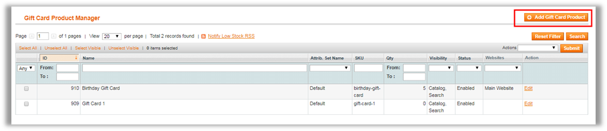

Click on **Add Gift Card Product** button

Click on **Continue** button then enter information as a normal product. You should pay attention to the following tabs:

**General tab:**

Different from normal products, there is another required field, **Select Gift Card template**, allowing you to choose templates for Gift Card product. You can add more templates to this field in **Manage Gift Card Templates**.

Fill in the required fields

1.	Enter a **Name of Gift Card**

2.	Describe about the New Gift Card

3.	Short description

4.	Enter SKU

5.	Enter a Weight

6,7. Set a period of time when a Gift Card is new

9.	Select **Active** to enable the New Gift Card. 

10.	Enter an **URL Key**

11.	Select **Catalog** or **Search** or both to display Gift Card when customers search

12.	Select **Yes** to enable the Gift Card on Web POS

13.	Select a **Gift Code Set** ( to set gift code, you can refer to Manage Gift Code Set to know more)

14.	Select **Gift Card templates** that are available for the Gift Card products. A Gift Card product can include many templates. 

**Prices tab**:

In **Prices** tab, Admin can configure prices and values of a Gift Card Product. 

1.	Select a type of tax class to apply for the new Gift card product 

2.	Select **a type of Gift Card value**. 

The system  provides 3 types of Gift Card value, including **fixed value, range of values** and **dropdown values**. You can base on the type chosen to set Gift Card value(s) accordingly such as 50-100 (USD) for the **range of value**s type.

3.	Enter **Credit Value** if it is allowed 

4.	Enter the **Gift Card Value**

5.	Selecting the **type of Gift Card price**, which could be 1 in 2 following options: 

✓ **Same as Gift Card value**: Gift Card price is similar to Gift Card value

✓ **Percent of Gift Card value**: Gift Card price is a percentage of Gift Card value as you configure in the next field.

Notice that when you choose **Range of values or Dropdown values** in the Type of Gift Card Value you need to fill in several fields: 

For example: 

If you choose **Range of values**, you need tofill in all the required information below:  

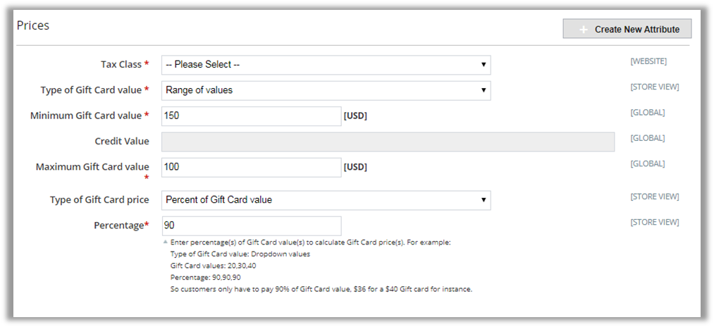

✓ **Type of Gift Card value**: Range values

✓ **Minimum Gift Card value**: 150

✓ **Maximum Gift Card value**: 100

✓ **Type of Gift Card price**: Percent of Gift Card value

✓ **Percentage**: 90

If you choose **Drop down values**, you need to enter the following fields: 

✓ **Type of Gift Card value**: Dropdown values

✓ **Gift Card values**: 30,50,70

✓ **Type of Gift Card price**: Percent of Gift Card value

✓ **Percentage**: 90,90,90

So Customers only have to pay 90% of Gift Card value, which means $45 for a $50 Gift Card for instance.

**Shopping Cart Conditions** tab:

This tab enables you to set up the conditions applied to shopping cart when Customers use Gift Card, for example: Customers can only use their Gift Card for orders which have Subtotal is greater than $200.

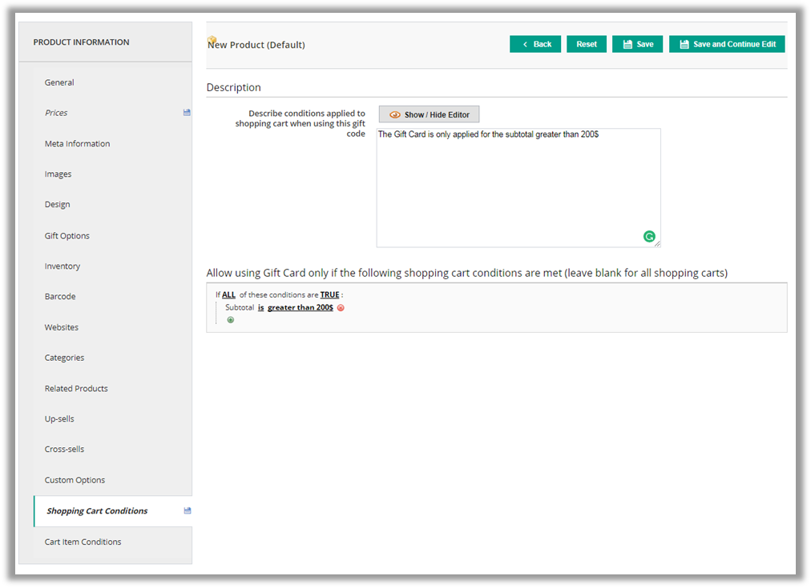

**Cart Item Conditions** tab:

It  allows you to set up Gift Card usage conditions applied to each item in Customers’ shopping cart. For example, Customers can use their Gift Cards to pay for orders only if the Category  is Women - Top, and Blousers.

***Note:** Normally some common product attributes are enabled to use with promotion rules by default. If you don’t see the attribute you want when setting **Gift Card’s Conditions**, such as SKU, you can go to **Catalog→ Attributes→ Manage Attributes**. Search and choose Attribute Code, such as SKU. Then change **Use for Promo Rule Conditions** to **Yes**.

Remember to click on **Save** or **Save and Continue Edit** button to save your work. After saving, the Gift Card product which you have just created will be shown on **Gift Card Product Manager** page as below:

-	Create Gift Card on **Manage Products** page:

✓ Go to **Catalog → Manage Products**

✓ Click on **Add Product** button

✓ Select **Product Type: Gift Card**

✓ Click on **Continue** button and enter information as in **Manage Gift Card Product** page. 

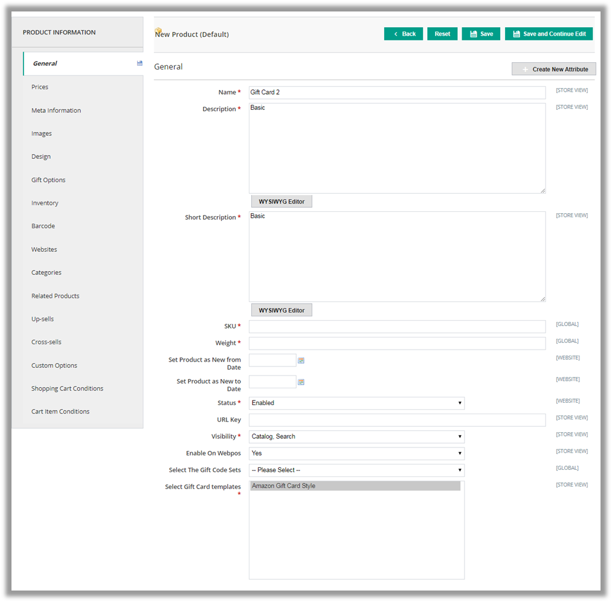

After saving, Gift Card product which you have just created is shown on both **Manage Products** page and  **Gift Card Product Manager** page as below:

In order to edit any Gift product, you need to click on corresponding row or link **Edit**. Remember to click on **Save** or **Save and Continue Edit** button after editing to save your work.

#####  Generate Gift Codes

This function helps you to generate a wide range of synchronous Gift Card codes, then you can print and give them to your Customers.

**Path: Gift Card → Generate Gift Codes**

 You will be navigated to **Gift Code Pattern Manager** page. 

To add a new template to generate gift codes, click on **Add Gift Code Pattern** button and configure information as below: 

**General Information tab**:

1.	Pattern name: Enter a name of the template to generate gift codes 

2.	Gift code pattern:  Configure the pattern to generate gift codes in mass including the following code: 

[A.8] : 8 alpha characters

[N.4] : 4 numeric characters

[AN.6] : 6 alphanumeric characters

If you enter GIFT-[A.4]-[AN.6] as the sample, the system will auto-create a bunch of gift codes matching this pattern, GIFT-ADFA-12NF0O for example.

3.	Gift code value:  Enter a value for gift codes. 
	
4.	Currency: Choose a currency unit for gift code value 5.

5.	Expired on: Set the expiration date for gift codes 

6.	Template image: Select template image for gift code

7.	Gift code Qty: Enter the number of gift codes generated based on the pattern above. 

8.	 Store View: Set places where customers can use the gift code 

**Conditions tab**: 

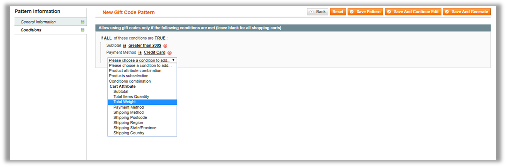

In this tab, you can set special conditions applied to shopping carts when Customers use gift codes generated to check out.

After setting up, click on Save Pattern, Save and Continue Edit or Save And Generate button, the template created will be shown in the Gift Code Pattern Manager grid as below:

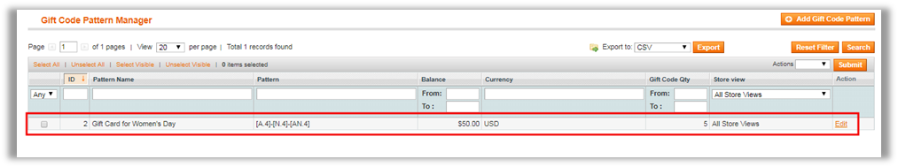

When you click on Save And Generate button, gift codes will be auto-generated. After that, Gift Codes Information page will show a new tab as below:

Gift Codes Information tab: 

Besides viewing details and status of gift codes generated, you can export the list of Gift Card codes to .CSV or .XML file by clicking on the drop-down list Export to, choose one of the options provided and then click on Export button.

#####  Manage Gift Codes	

**Path:  Gift Card → Manage Gift Codes**

You will be navigated to **Gift Code Manager** page.

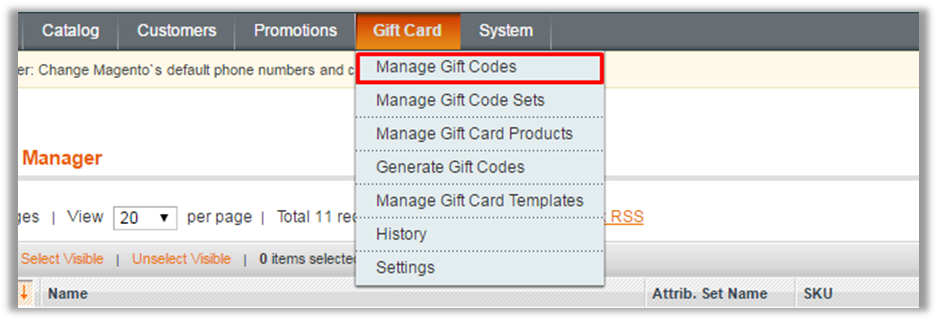

This page gives you a detailed list of all gift codes in your system, including gift codes created from Gift Card orders in front-end and gift codes created/ generated in back-end. Each gift code is provided with essential information, such as the Initial Value, the Current Balance and gift code’s status, etc. To help save much time in managing, our module allows you to select multiple gift codes and apply the following action(s) in mass.

✓ Export the list of gift codes to CSV/XML files

✓ Change status/send email/delete/print gift codes. Please note that gift codes without recipient email address cannot be sent.

Besides, you can add new gift codes manually, import gift codes in bulk from CSV files and edit each gift code by clicking on **Edit**  link at the end of each corresponding row.

If you want to create a new gift code manually, select **Add Gift Code** and finish the form as below:

**General Information tab**:

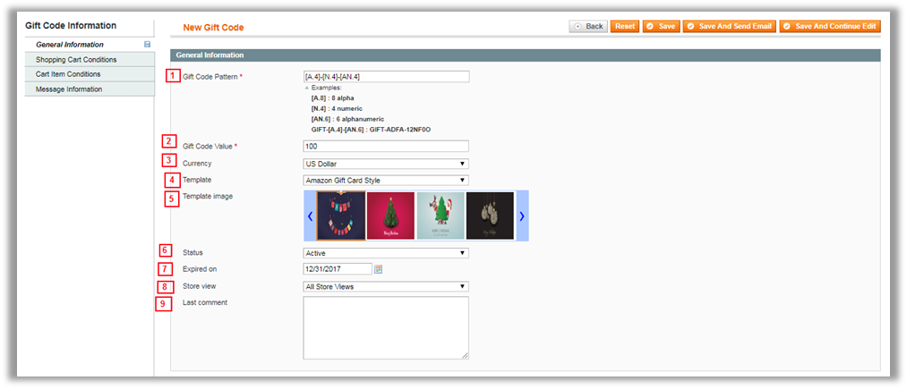

1.	**Gift Code Pattern**: Configure the pattern to generate a gift code as the following example: 

[A.8] : 8 alpha characters

[N.4] : 4 numeric characters

[AN.6] : 6 alphanumeric characters

If you enter GIFT-[A.4]-[AN.6] as the sample, the system will auto-create a gift code matching this pattern, GIFT-ADFA-12NF0O for example.

2.	**Gift Code Value**: enter  a fixed value for the gift code 

3.	**Currency**.: Select the currency unit for gift code value 

4.	**Template**: Chose a Gift Card Template which is used for the gift code generated, in case it is sent to Customers by email or post office.

For adding or editting more templates, you can refer to the **Manage Gift Card Template** section above. 

5.	**Template image**: Select the image used with the Gift Card template chosen above. You can also edit this image on **Gift Card Template Manager** page (please refer to **Manage Gift Card Template** section for more details).

6.	**Status**: Choose Active for the gift code, and then Customers can use it in frontend.

7.	**Expired on**: Select the expiration date for the gift code.

8.	**Store View**: Choose  places where customers can use the gift codes. 

9.	Last Comments: Add Admin’s notes if needed

**Conditions tabs:**

Similar to**Shopping Cart Conditions** tab and **Cart Item Conditions** tab when creating new Gift Cards, these two tabs on **New Gift Code** page allow you to set conditions applied to shopping carts and items in cart when Customers use this gift code to check out.

**Message Information tab**:

If you intend to send the gift code to a specific person, a Customer for example, this tab allows you to add information about the Customer, the recipient and a custom message.

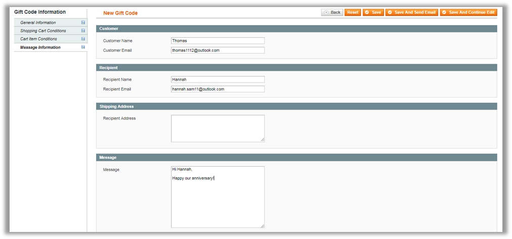

After entering all data, remember to click on **Save, Save And Send Email** or **Save and Continue Edit** to save your work.

Moreover, you can add new gift codes by importing voucher codes from a CSV file. You need to click on **Import Gift Code** button on the top right corner of the **Gift Code Manager** page.

The **Import Gift Code** page will be shown as below for you to browse a CSV file. And then, click on **Import** or **Import and Print** button.

##### Manage Gift Code Sets

Gift code set is a list of code that store owners import into the system to sell. When you create gift card product, you can choose gift code set for that gift card product: 

**Path: Gift Card -> Manage Gift Code Sets**. 

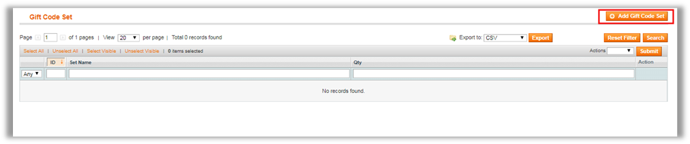

To create gift code sets: You choose **Add Gift Code Set**.

1.	Enter a name for a new Gift Code set 

2.	Upload file Gift Code sets

3.	Download Sample CSV/File

To edit gift code set: Click on the Gift Code Set you would like to edit. You can upload a new CSV file of gift code or edit each gift code’s information in the set.

##### Manage Gift Card Credit Balance

**Path: Customers → Customers Manager.**

✓ Click on any row of customer

✓ Choose **Gift Card Credit** tab 

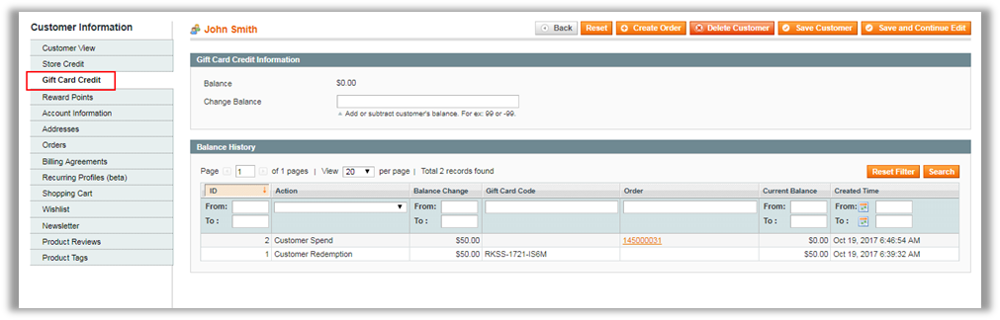

On this page, you can view current Gift Card credit balance and Balance History of a Customer.

To change Customers’ Gift Card balance
1.	Enter the amount of money into **Change Balance** text field 

2.	Click on **Save Customer** or **Save and Continue Edit** button.

 The balance will be updated and the change will be added to **Balance History** grid as above.

##### Use Gift Card/Code when creating orders

**Path: Sales > Orders> Create New Order**

On **Create New Order** page, after selecting a Customer and adding a product to an order, the system will show the Gift Card box, which allowing you to use Gift Card credit balance or Gift Card code(s) of the Customer to pay for this order. 

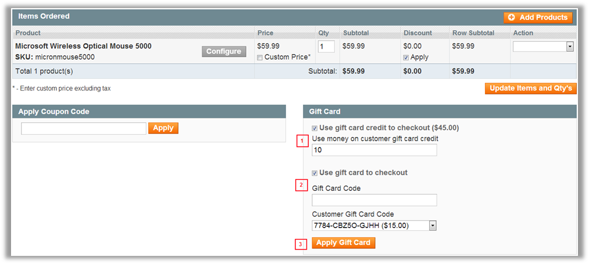

1.	Select **Use gift card to checkout** and enter the amount of money in the box: it means that customers will spend their gift credit balance to place order. 

2.	Select **Use gift card to checkout** and enter a Gift Card code: it means that customers will use the Gift Card code they have received to place order. 

3.	Click on **Apply Gift Card** button.

After applying, the discount from Credit Balance/Gift Card Code will be subtracted from the Subtotal as below:

#####  Refund Orders into Gift Card Credit Balance

When Customers request to refund their Product orders which Gift Card credit/ gift code was used as a payment method, the system will show a box to enter the amount of money which will be refunded into Customers’ credit balance or Gift Card code. 

If Customers have their own account on your site, this amount will be refunded into their Gift Card credit balance by default even if they use either their credit balance or Gift Card code to check out.

If Customers don’t have accounts on your site, this amount will be refunded into their Gift Card codes.

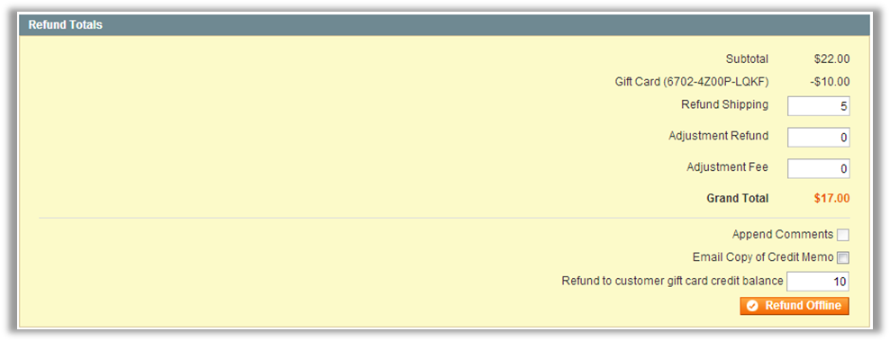

***Note**: Once Gift Card is used (redeemed or used to buy other products), it cannot be refunded to cash.

##### History

**Path:  Gift Card → History** 

All actions related to Gift Card such as: **Create, Update, Mass Update, Spend on order, Refund** and **Redeem** are recorded on **Gift Card History** page. 

On Gift Card History page, you will know when Gift Cards were created/ updated/ redeemed/ spent/ refunded and by whom as well as their values and status.

You can filter data with the above criteria to get more accurate reports. Information can be exported to .CSV or .XML files for your convenience.

####  How customers manage Gift Card
##### How customers order a Gift Card Product

✓  Gift Card can be ordered as a normal product. Customers can enter or choose the value and quantity of Gift Card they want to order, then click on **Add to Cart** button.

✓ The price of Gift Card product may differ from Gift Card value. It depends on Admin’s configuration in backend, which could be a fixed value or a percentage of Gift Card value. If the price type is percentage, Customers will see the corresponding Gift Card prices when they choose different Gift Card values.

✓  For better Gift Card appearance, after choosing a preferred template, Customers can select between 1 of provided images. It is possible for Customers to personalize their Gift Card by uploading their own image as well. The recommended size for image to upload is 250x365px. 3 file types are supported including .GIF, .JPG and .PNG.

If Customers upload an image with an unsupported file type or the image is larger than the maximum file size configured by Admin, the system will auto-show an alert message to notify Customers.

Customers can also see the expiration date of the Gift Card on Gift Card image.

✓ For Gift Card products that have usage conditions, the conditions will be displayed in a tooltip form when hovering over the hyperlink text as shown below:

✓  Customers can also send Gift Cards to their friends by ticking **Send Gift Card to friend** checkbox and enter all the required fields:

1.	**Sender name**: Enter the name of the sender if necessary

2.	**Recipient name**: Enter the name of the recipient 

3.	**Recipient email address**: Enter the email address of the recipient. The system will send an email which contains a Gift Card code to this address.

4.	**Custom message**: Fill in the message which is delivered along with the Gift Card code.

5.	**Day to send**: Customers can set up the date and time zone that a Gift Card will be sent.

If Customers want to get the notification email when their friend receives Gift Card, they need to tick the **Get notification email when your friend receives Gift Card** checkbox.

6.	Select a time zone 

7.	Click on **Preview Gift Card** button or the Gift Card thumbnail image to see how the Gift Card actually looks like. 

 A popup of Gift Card interface will be shown as below:

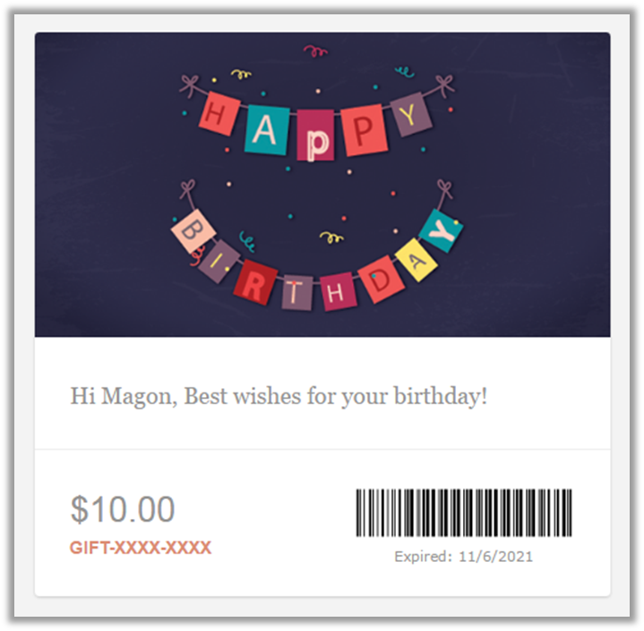

✓  After Customers add a Gift Card to cart and click on **Proceed to Checkout**, they will be directed to the following page:

**_When Customers send the Gift Card to their friend_**

**_When Customers buy Gift Card for themselves_**

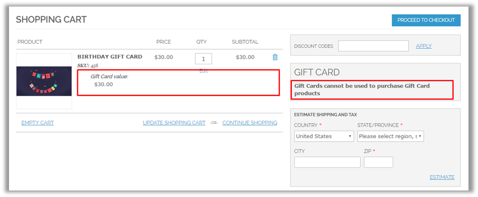

✓ Then Gift Cards products can be checked out as normal products. Customers will receive a Gift Card code if they buy for themselves. In case Customers purchase the Gift Card to send to their friends, the code will be delivered to their friends’ email with the following form:

If the Sender has ticked the checkbox **Get notification email when your friend receives Gift Card**, a notification will be sent to his email address immediately after the Gift Card is delivered to the friend’s email as below:

If Customers purchase Gift Card for themselves, the notification email that they receive is as below:

##### How customers manage Gift Card/Credit

**Path: My Account>  Gift Card tab** 
	
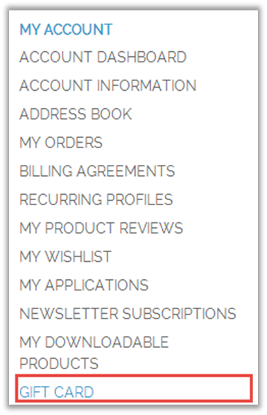

**Gift Card** page will be shown as below; the gift code which Customers received will be automatically added to the list.

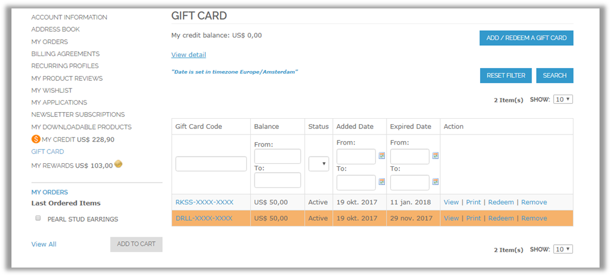

Gift Card list shows some information of Gift Cards such as: **code, balance, status, added date and action**. Customers can view, print, redeem and remove their Gift Cards.

Gift code is mostly hidden to ensure the security for Customers. They can view a full gift code by clicking on each one. Clicking on **View** link on **Action** column, Customers can view Gift Card detailed information.

Another way to view the details of Gift Card Credit balance , customers can click  on **View detail**  link. **Credit Detail** page is shown as below:

This page shows their current balance and their **Balance history** (Action, Balance Change, Gift Card code, Order, Balance, and Date).

-	**Add a Gift Card**: 

1.	Enter the Gift Card Code

2.	Click on **Add To Your List** button

Then the Gift Card Code will be added to the list and displayed as below:

-	**Redeem a Gift Card**:

1.	Enter Gift Card code

2.	Click on **Redeem Gift Card** button. 

Then, the value of the Gift Card will be redeemed to their Gift Card credit balance.

Customers can also redeem their Gift Card to the credit balance or remove it from a list by clicking on the corresponding link in **Action** column.
	

##### How customers use Gift Card/Credit to Place an Order

When Customers have Gift Card codes or Gift Card credit balances, they can use them to get discount when ordering a product. There are two ways to use Gift Card code/credit balance:

On **Shopping Cart** page:

Customers can choose to use credit or Gift Card by ticking either **Use Gift Card credit to checkout** or **Use Gift Card to checkout** checkbox or both. 

✓ **Use Gift Card credit to checkout:** Customers need to enter an amount of money they want to use. After applying, this amount will be deducted from their Gift Car credit balance immediately.

✓ **Use Gift Card to checkout**: The system shows a box where Customers can enter gift codes. Besides, they can use gift codes they added to the list on **Gift Card/Credit Management** page.

After Customers click on **Apply Gift Card** button, the Grand Total will be updated as below:

On **Checkout** page:

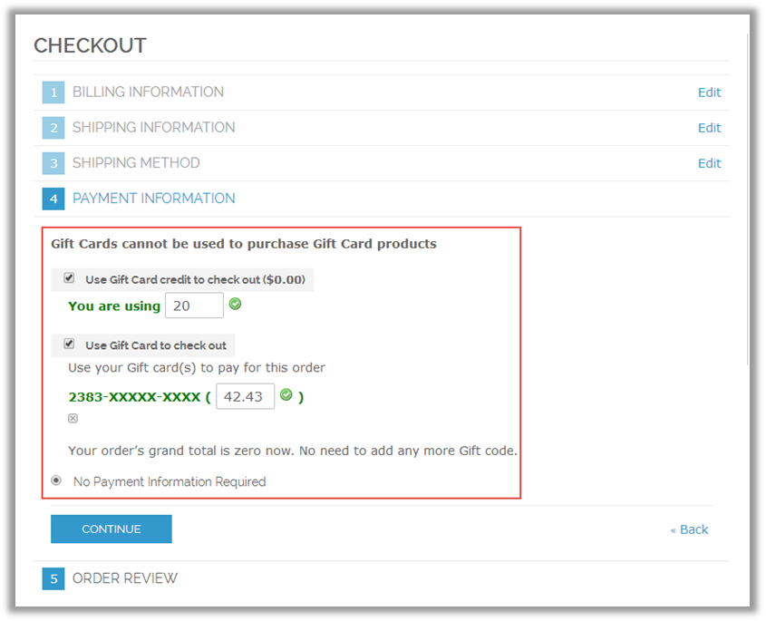

Customers can choose to use Gift Card or Gift Card credit and enter the amount of money as on **Shopping Cart** page. Then click on **Add Gift Card** button to apply.

***Note**: Gift Card codes or Credit Card credit balances cannot be used to purchase Gift Card products but they can be spent on shipping fee, depending on Admin’s settings.

----------------------------------

**_Confidential Information Notice_** 

Copyright 2017. All Rights Reserved. Any unauthorized reproduction of this document is prohibited. 

This document and the information it contains constitute a trade secret of Magestore and may not be reproduced or disclosed to non-authorized users without the prior written permission from Magestore. Permitted reproductions, in whole or in part, shall bear this notice.
