# ECOMMERCE MANAGEMENT - USER GUIDE FOR MAGENTO 2
--------------------------

## Introduction

According to Big Commerce and Square, ecommerce is growing 23% year-over-year. Even 2 in 5 (40%)online shoppers say they couldn’t live without online shopping. However, many e-commerce businesses are struggling to capitailize on their digital sales channels. 

So how retailers can manage their business to maximize sales on online channels in the emerging technology world? 

Magento 2 Ecommerce Management module including Store Pickup, and Loyalty programs is here to help you create more values for your customers and thus, will boost sales for the whole business. 

With Loyalty programs, a module in our [Omnichannel solution](https://www.magestore.com/omnichannel-retail) for Magento retailers, your business can build a strong relationship with their customers and drive more sales from returning ones as well through Reward Points, Store Credit and Gift Cards. Besides, Store Pickup will satisfy your shoppers with the convenient option of ordering online - picking up in store.  
This guide is specially written according to business flow which happens reguarly in reality. Therefore, you can quickly understand a sales execution process  during the operation of an ecommerce business.  

-----------------------------------
 
## Validating Order and Store Pickup Processing

### Customers place online orders

#### View Store Information

Store Pickup module creates a separated page to list all of your stores in the front-end. 

1.	Click on **arrow button** on Top-Link (the top right of the page)

The Store Listing page includes 4 sections: Store list, Search form, **Google Map** and **Tags list**.

* The list of all stores is shown on the bottom of Google Map. Customers can view store names and base images on this list. 

* Store locations are displayed on Google Map. Customers can zoom in/ zoom out and choose view mode as map/ satellite as preferred. Customers can also view store address or get direction by clicking on the pin icon of any store.

* Switch the tab to search stores by distance or area.

* Besides, customers can also filter by tags. Customers just have to click on tags they want to search. Then, list of stores which admin add these tags to will be shown.

2. Click on a store on the map to view the store location along with its name, address, phone number and store manager’s email address. Customers can also get direction on this box.

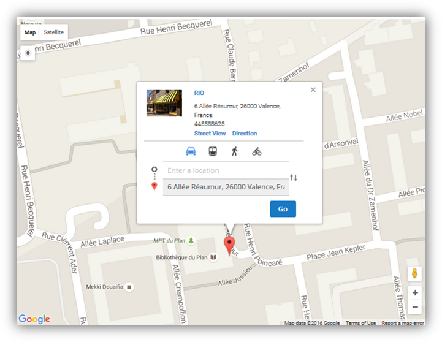

3. To view more details of a store, click on its name link to be navigated to the detailed page.

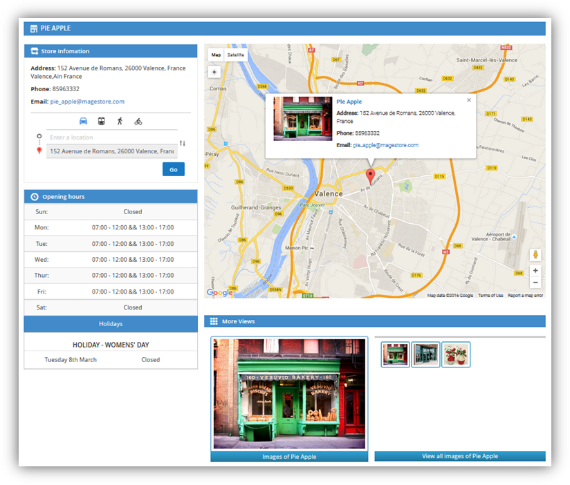

As you can see, this page shows all details that customers want to know about a store before arriving, such as location, contact info, working time, description and store images.

They can also view list of special days & holidays in **Special day & Holiday information** tab. They can conveniently give comment to stores by filling in the Facebook comment box.

#### Use Store Pickup at Checkout

The main function of Store Pickup module is allowing customers to select a preferred store at checkout to arrive and pick up their ordered products. This section will show you how the module works for customers.

##### Choose shipping method: Delivery in Store

1.	In the **Shipping method** tab at checkout, select **Store Pickup** as shipping option. 

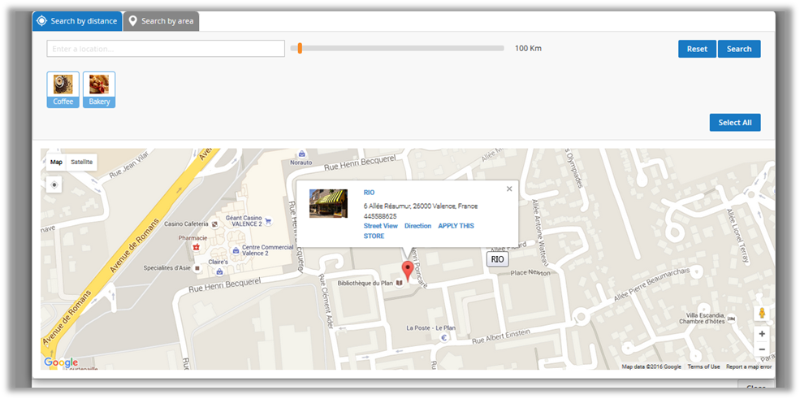

2.	Select a store from the dropdown list or select by Google map.

On the G-Map popup, select a store on store list or search store 

3. Click on the  **Apply** button to apply or click on Close button to cancel.

##### Choose time Delivery

•	After selecting a store, customers need to choose a specific shipping date and time for arrival, and then check out as usual.

 

To do that, select the pickup date and time in **Pickup Date** and **Pickup Time** box. 

If the shipping date is one of store’s holidays, customers won’t be able to choose that on the calendar. Thus, they can avoid arriving on the store’s days off. You can refer to **User Guide for IT Administration – How to Configure Store Pickup - section Manage Holidays** to know how to set up these holidays.

##### Choose payment method

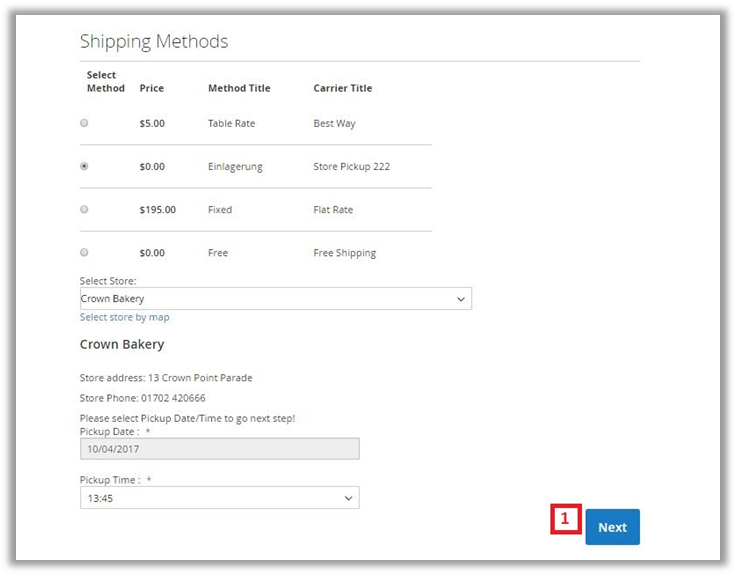

1) After choosing shipment method, click **Next** to continue choosing payment method. 

In the **Payment Information** tab, applicable payment methods for In-store Pickup are shown as your configuration.

2) Select a payment method 

#####  Place Order

To place the order , customers will click on the **Place Order** button.

#### View Orders

To view their orders with store pickup information, customers can go to **My Account** on Top-Link > **My Orders** tab > **View Order**

To print orders, click on **Print Order** on the top right. 

-----------------------------------

###  Order Fulfill Staff validates orders
#### Check orders in store

✓ **Path:  Inventory Management -> Warehouses.**

The **Manage Warehouses** page will display a list of warehouses and you need to find the warehouse that customers place their pickup-in-store order and click on View to view the chosen warehouse. 

1)	In the **View Warehouses** page - section **Orders** , find the order that customer want to pick up in store. 

2)	Click on **View** to see the detail of the order. 

The order page will opene and you can see all the information of the order as above.

#### Process Shipment for customers
##### Create shipment

✓ **Path: Sales > Orders**

1)	In the **Information** tab, click on **Ship** 

The **New Shipment** page will open and include a customer’s information such as sales info, account, address, payment and shipping method. 

2)	Click on **Submit Shipment** button to complete.

When a new shipment is created, you will see the notification: **“ The shipment has been created”**

##### Print Packing Slips

✓ **Path: Sales > Orders**

After a new shipment has been created, if you want to print packing slips:

1.	In the **Order** page, click on **Shipments** to open a shipment tab.

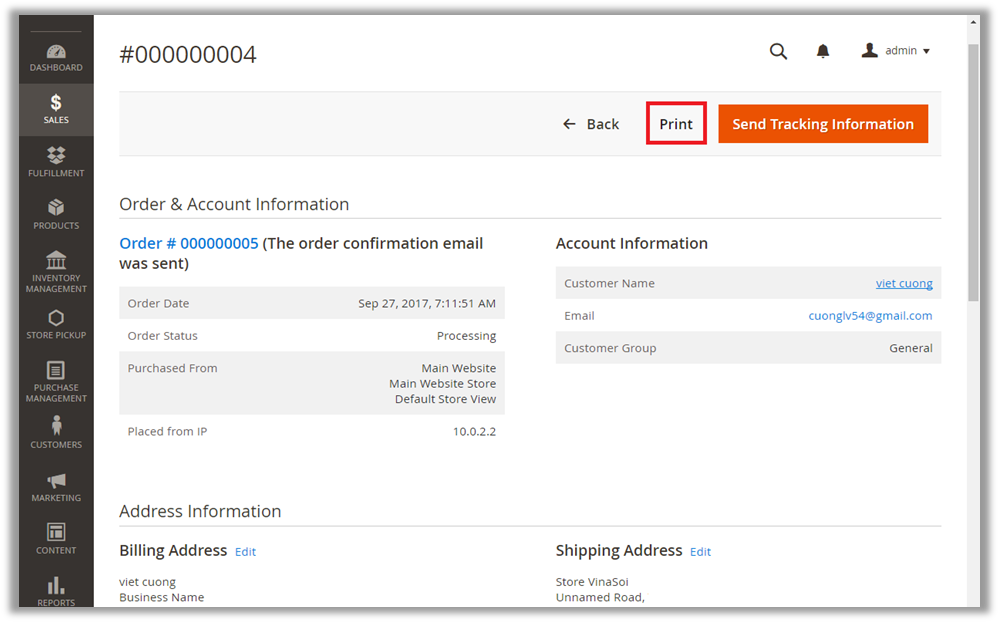

The **Shipment page** of a particular order will open as above. 

2) Click on **Print** button to print out packing slips. 

##### Send confirm email to customers

✓	**Path: Sales > Orders***

Continually, to send confirm email to customers: 

In the **Information** tab, click on **Send Email.**	

* Then a pop up will appear to make sure that you want to send the confirm email to customers. Click on **OK** to complete.

* After that, you will see the notification as above.

#### Request Transfer Stock from other warehouses

✓ ** Path: Inventory Management > Transfer Stock > Request Stock.**

If the store where customers choose to pick up their orders doesn’t have enough stock to provide, it ‘s time  to request stock from other warehouses, firstly go to ** Inventory Management > Transfer Stock > Request Stock.**

In the **Add a New Request Stock** tab, let’s fill the **Transfer Code** choose **Source Warehouse** and **Destination Warehouse**.  Besides, you can fill in the **Reason** box for resquesting stock. 

Then, to prepare product list, click on the **Prepare Product List** button as the image above. 

To add new list of products:

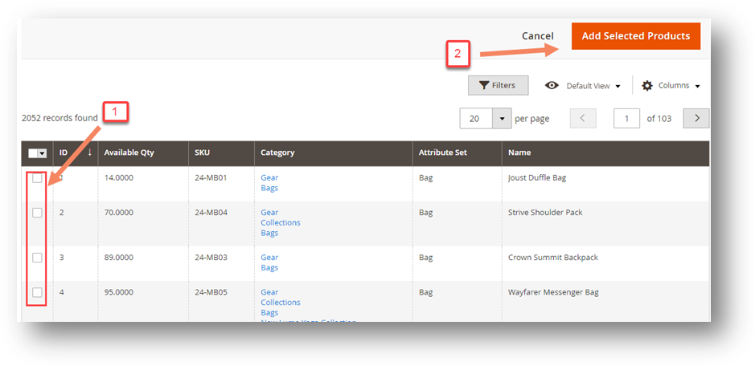

1)	Click on the product needed 

2)	Click on **Add Selected Products**

3)	Choose the quantity to transfer
 4)  Click on **Start Request Stock**

If you want to delete ta product you just added, click on **Remove** to delete product line.

The **request transfer** is completed.
	
#### Receive Transfer stock 

After the staff of the requested warehouse confirmed transferring their stocks and these stocks are ready to import into your store, it’s time to receive them. 
To receive stock from other warehouses, click on **Select Products in Receiving history section:

1.	Click on the request created for receiving

2.	Click on **Add Selected Products**

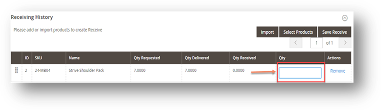

3.	Enter the quantity received in receiving history

4.	Click on **Save Receive**
	

-------------------

### Store Staff delivers orders 

#### Find pickup-in-store orders

✓ **Path: Inventory Management > Warehouse.**
	
In the **Manage Warehouses** page, tick to the warehouse of store in which your customer want to pick up his/her order.

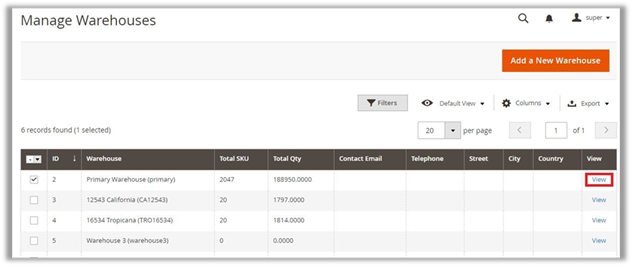

Then click **View** to see the order in the chosen warehouse.  

**View Warehouse** page will open and in the **Orders** section, you can find the order of customer picking up in your store. **Apply Filters** to find that order easily by following steps in the image above.

#### Print invoice 

1)	In the **View Warehouse** page - section **Orders** , click **View**  to see the detailed information of the customer’s order.	

2)	Click on **Invoice** to create a new invoice for customer.

A **New Invoice** page will appear with all information of the customer ‘ s order. 
	

3)	Click on **Submit Invoice** button. Then a new invoice has been created. 

4)	To print it, click on **Print** button. 

-------------------------------------------------------

##  Running Loyalty Program

### 	Reward Points

#### How to configure reward points

#####  Add new rate

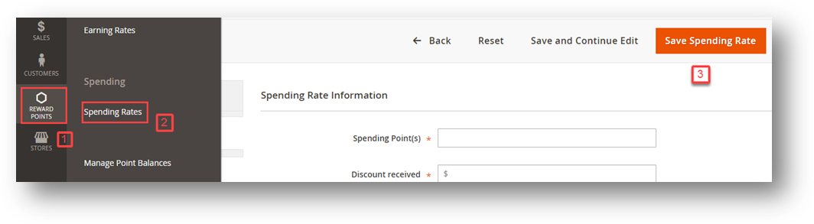

1)	Click on **Reward Points**

2)	Click on **Spending rates**

3)	Click on  **Add New Spending Rate**

Fill all the data needed in the boxes

Click on **Save spending rate** after finishing filling in all the boxes

The new spending  rate will be shown as the above image.
If you want to edit a new earning rate, do the same as above but notice the difference between earning rate (the number of points customers will earn when spending an amount of money) and spending rate (the number of points customer will spend when purchasing an order)

##### Edit existing rate 

✓	**Path: Reward Point > Spending Rates**

Click on **Edit** on action column of the rate needed to be edited

Edit the rate, then click **Save Spending Rate**, or **Delete** it.

If you want to edit a new earning rate, do the same as above but notice the difference between earning rate (the number of points customers will earn when spending an amount of money) and spending rate (the number of points customer will spend when purchasing an order)
##### Manage transaction

✓ **Path: Reward points > Transactions**

Click on **Add New Transaction** to add new transaction

Fill in the required information and click on **Save**.

##### Manage point balances of customers

✓	**Path: Customers > All customers**

Click on **Edit** of the customer needed to be managed.

Click on **Reward Points** to manage the customer’s balance by filling in  the **change balance, change title, time when points expire** in box.

Also, update points subscription and expire transaction subscription can be configured in reward points.

Click on **Save Customer** to save the changes

All transactions of a customer are also listed in **Reward Points** session –s ection **Transaction History**

##### Change point balance

✓	**Path: Reward Points > Manage Points Balances**

There are two ways to change the point balance of a customer. 
	
The first way is to enter the **Change Balance** in the **Reward Points** session as mentioned above.

The second way to change points, which can be done to many customers at the same time, is illustrated below:

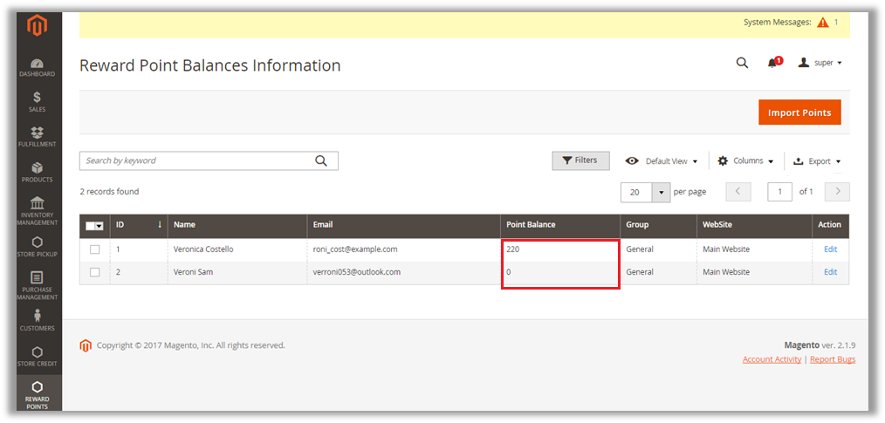

A list of customers will be shown with point balance column.

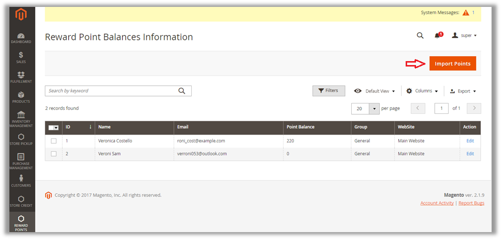

Click on **Import** to import from computer

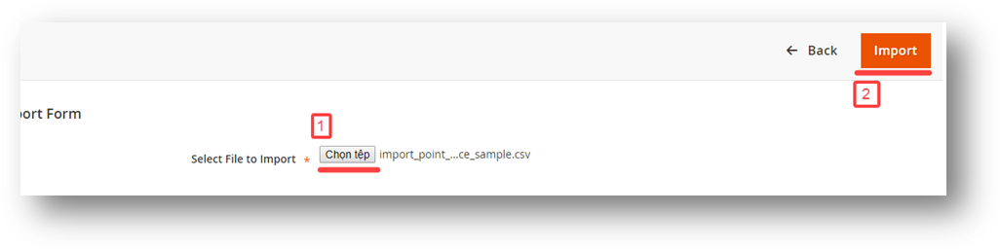

1)	Click on **“Choose File”** to upload file

2)	Click on **Import** to import it

The list of customers in **Reward Point Balances** Information page can also be exported by clicking on **Export**

##### Use points when creating orders 

✓	**Path: Sales > Orders**

1)	Click on **Sales**

2)	Click on **Orders**

3)	Click on **Create New Order**

Select customer from the list

Click on **Add products** to add products to the order

Click on the product and enter the quantity, then click on **Add Selected Product(s) to Order**

Set the number of point customer will be used in the order in the use customer reward points

Fill in the required fields, click on submit order to finish creating new orders.

##### Refund Orders into points balance

**Note:** Customers is allowed to refund an order into their points balance when they have used points to buy the products in this order. 

✓	**Path: Sales > Orders**

1)	Click on **View** to see the details of an order 

2) On the top bar, click on **Credit Memo** label to create a refund order 

On the pop-up screen named , scroll down, then:

3)   Enter the earned points that will be refunded to customer’s balance

2)	Click on  to finish.

After the credit memo has been created.

3)	Click on **Credit Memo** tab on the left hand-side to view credit memos data.

#### How customers join reward points programs

##### How customers earn points

When placing an order, customers can earn points based on the rate set by admin.

Customers are well aware of your reward point policy thanks to messages on many pages. For example, on **Product Detail** pages, there will be a notification for customers that says “You could receive some Points for purchasing this product”.

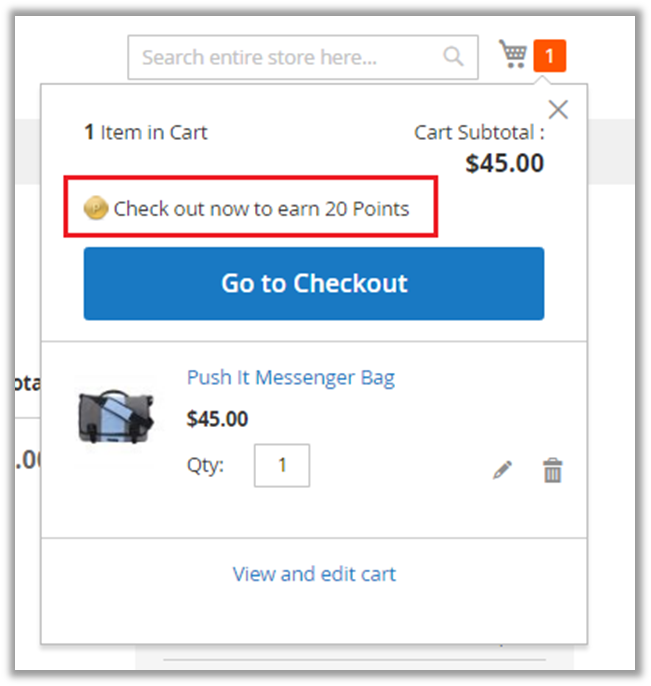

Also, after clicking on the **Add to Cart** button, on **Mini Cart**, customers will see another notification **“Check out now to earn points”**.

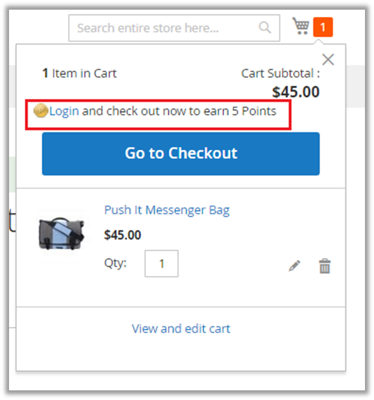

If customers have not logged in yet, a notification message **“Login and checkout to earn points”** will be shown on mini cart:

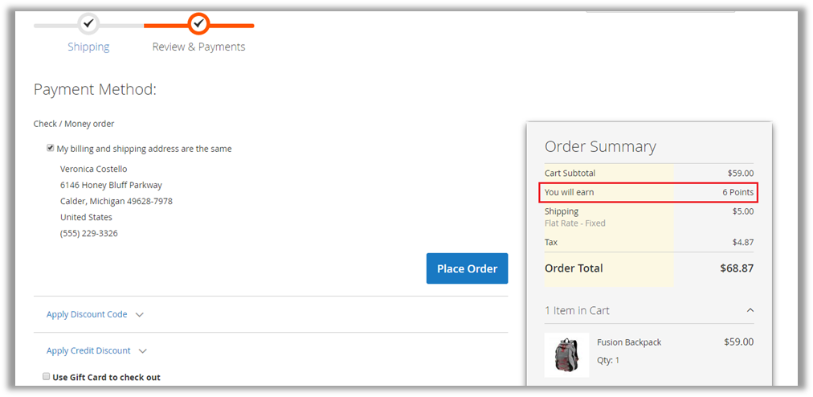

On **Checkout** page, customers can see exactly the number of points they earned from buying that product in the **Grand Total** box

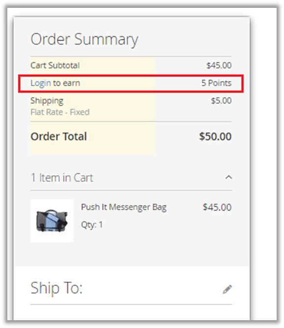

If Customers have not logged in yet, a notification message **”Login and checkout to earn points”** will be shown on **Grand Total** box of checkout page as above.

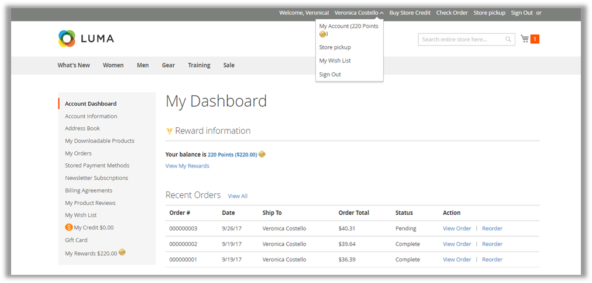

After placing an order successfully, Customers can check their point balance right next to the **My Account** top link or can go directly to that link.

##### How customers spend points

On **Shopping Cart** and **Checkout** pages, to spend points, there are 3 ways for customers to modify points they want to spend:

1)	Move the slide forwards or backwards to select the number of points they would like to spend.

2)	Enter this number in the empty box 

3)	Tick the checkbox **“Maximize my discount with points”** to spend the maximum number of points.

On the Checkout page, System shows a similar form for Customers to edit the number of points they want to spend for their orders.

##### How customers manage reward points 

Customers can follow and manage their current points in 2 places:

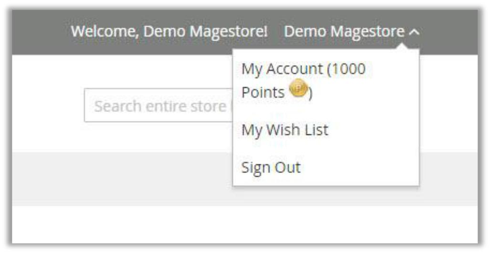

i.	View their current points on the top link as above.

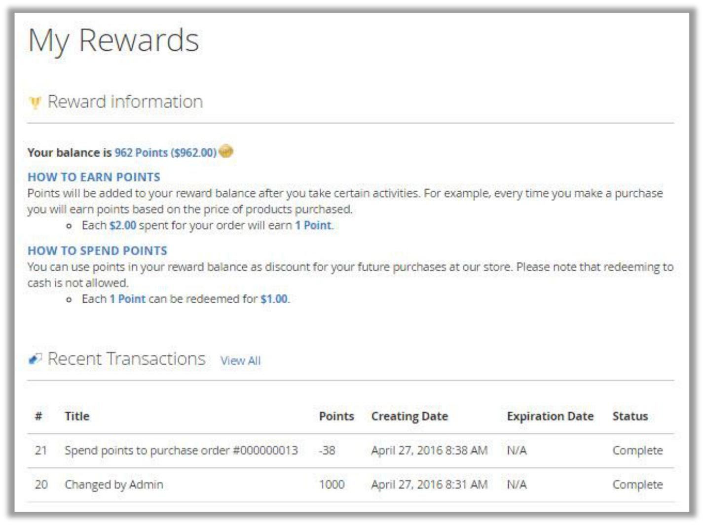

ii. Go to **My Account > My Rewards** to view more information.

As you can see, this page can be divided into two parts: **Reward Information** and **Recent Transactions**

•	**Reward Information**: In this part, Customers can view their current balances as well as description about earning/ spending point rates on your site.

•	**Recent Transactions**: This part provides Customers with information on their transactions of reward points including ID, points, action, date and status.
If Customers want to see all transactions, they can click on the **View all** links or the **Point Transactions** tab.

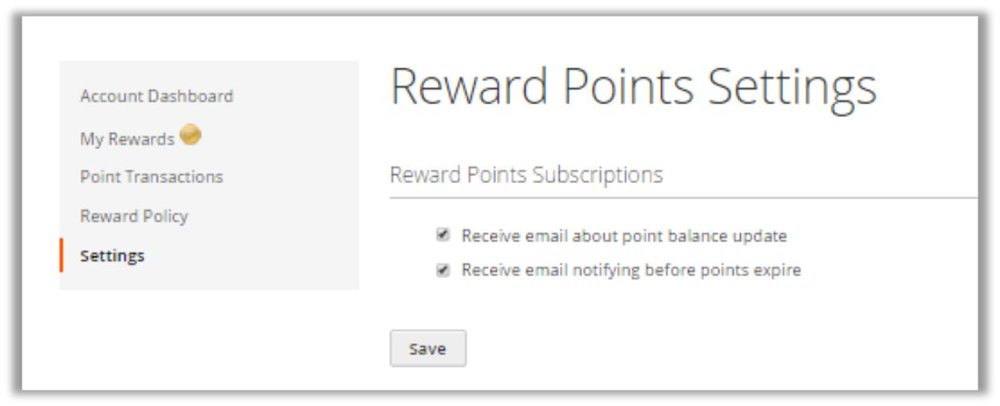

Besides, in the **Settings** tab of the **Reward Points** navigation, Customers can set up their **Reward Points Subscriptions**

---------------------

### 	Store Credit

#### How to configure Store credit

#####  Manage Customers Using Credit.

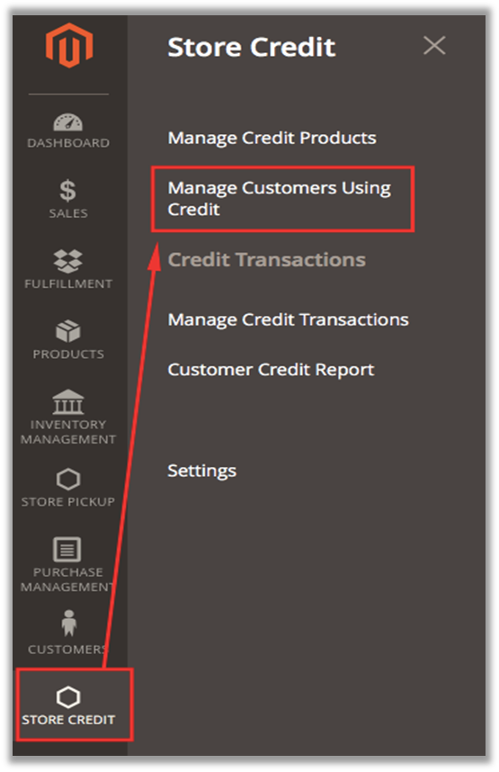

✓	**Path Store Credit > Manage Customers Using Credit**

Then the **Customers Using Credit Manager** page will be displayed as above.

This page shows a list of all customers using credit and their information such as name, email, credit balance, telephone, etc.

To view more details about a customer, click on the **Edit** link in the **Action** column. 

Then, you will be navigated to the **Customer Information** page. By selecting **Store Credit** tab, you can view all of that customer’s transaction history and credit balance.

1)	Entering an integer (a positive or negative number) 

2)	Add an comment such as why you add credit for customers. 

Our module will auto send email to customer to announce about this transaction if you tick on **Send email to customer** checkbox. The email will be sent to the customer as above.

After you save, our module will auto update the customer’s credit balance, send an email to that customer and create a transaction as above.

##### Manage Credit Products

✓	**Path:  Store Credit > Manage Credit Products**

Then the **Credit Product Manager** page will be shown.

This page shows you all credit products with a lot of information such as **product ID, name, SKU, quantity, status,** etc.

To add a new credit product, click on the **Add Credit Product** button on the right top of the page.

You can add a credit product just in a similar way to adding a normal product.

- **Prices Tab:**

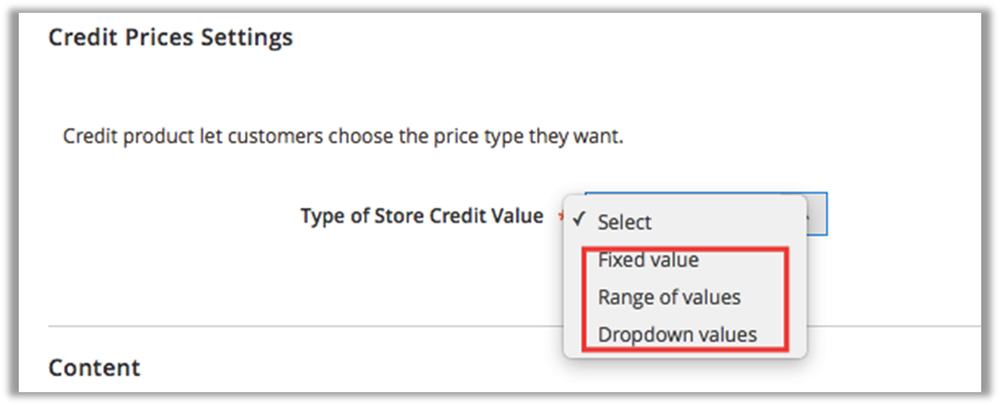

In this tab, you can configure the value of the credit product. There are three types of credit products including **fixed value, range of values and drop-down value.**

-	**Setting**  Section

In this tab, by default, our module sets up the field **Manage Stock** as **Yes**. It means that you need to manage the quantity of credit products.

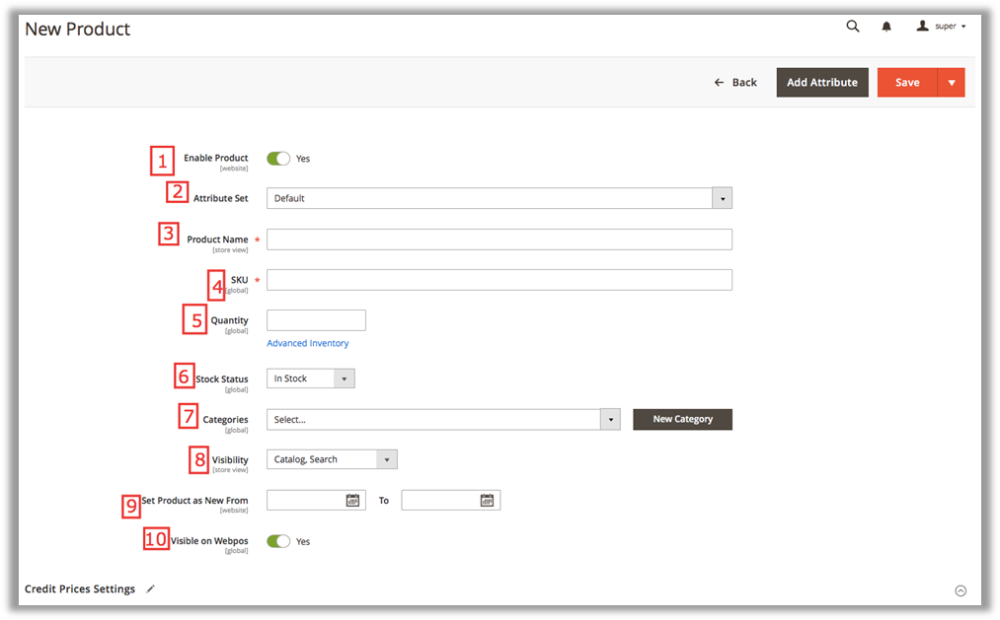

1)	**Enable Product**: activate the Store Credit

2)	**Attribute Set**: select default or any attributes available to purchase by Store Credit

3)	**Product name**: enter the name 

4)	**SKU**: enter the SKU of your store credit

5)	**Quantity**: enter the number of store credit cards you can give (optional)

6)	**Stock Status**: select the current availability of the Store Credit

7)	**Categories**: select the categories that you sell this Store Credit. In case, you do not have fitted category. Click on “**New Category**”

8)	**Visibility**: choose where it will be visible to customers

9)	**Set product as new from**: choose active date of the Store Credit

10)	**Visible on Web POS**: activate the Store Credit on the Web POS

•	**Advanced Inventory**
	
✓ **Path: New Product > Quantity > Advanced Inventory**

1)	**Manage Stock**: our module sets up the field as **Yes**. It means that you need to manage the Qty.. of Credit Products. You can edit it by uncheck box **Use Config Settings**.

2)	**Qty.**: it is synchronized with the **Qty**. on **New Product** Section

3)	**Out-of-stock Threshold**: our module sets up the field as **0**. It means the product will be notified “Out-of-stock” when the number of items is 0. You can edit it by uncheck box **Use Config Settings**

4)	**Minimum Qty. Allowed in Shopping Cart**: our modules set up the field as **1**. It means a customer must have at least 1 product in a single order to purchase Store Credit Product. You can edit it by non- checking box **Use Config Settings**.

5)	**Maximum Qty. Allowed in Shopping Cart**: as mentioned in No.4

6)	**Qty. Uses Decimals**: select **No** if the Qty. is not a decimal value

7)	**Allow Multiple Boxes for Shipping**: select **NO** if the Qty. purchased CAN NOT be shipping in separate boxed

8)	**Backorders: Backorder** means funds are still authorized or captured immediately when the order is placed, regardless of whether the product is in stock. Product will be shipped as they become available

•	**No backorders**: Do not accept backorders when product is out stock

•	**Allow Qty. below 0**: Accept backorders when the Qty. falls below zero

•	**Allow Qty. below 0 and notify customer**: accept backorders when the Qty. falls below zero, but notifies customers that orders can still be placed

9)	**Use Deferred Stock Updated**

10)	**Notify for Qty. below**: determine the stock level at which the system will notify the inventory is below the threshold

11)	**Enable Qty. Increments**: select if the product can be sold in quantity increments (**Qty. increments** –the number of products that must be purchased at the same time)

12)	**Stock Status**: it is synchronized with the **Qty.** on **New Product** Section

##### Manage Credit Transactions and Report Charts
###### Credit Transactions

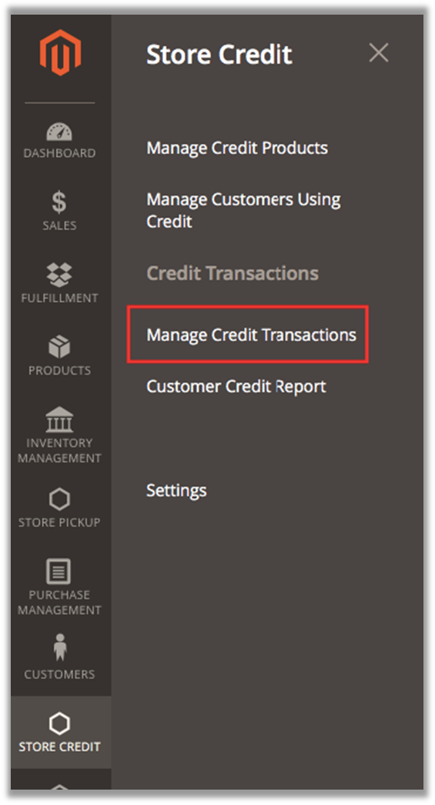

✓	**Path: Store Credit > Credit Transactions Section > Manage Credit Transactions**

Then the **Credit Transactions** page will be shown as below

.
✓**Path: Store Credit > Manage Credit Transactions**

This page shows all credit-related transactions with a lot of information such as **type, detail, customer name/email, added/deducted credit, credit balance** after transaction.

You can search any transaction by using filter boxes in each column.

If you click on a customer’s email, you will be navigated to the **Customer Information** page.

###### Credit Report Charts

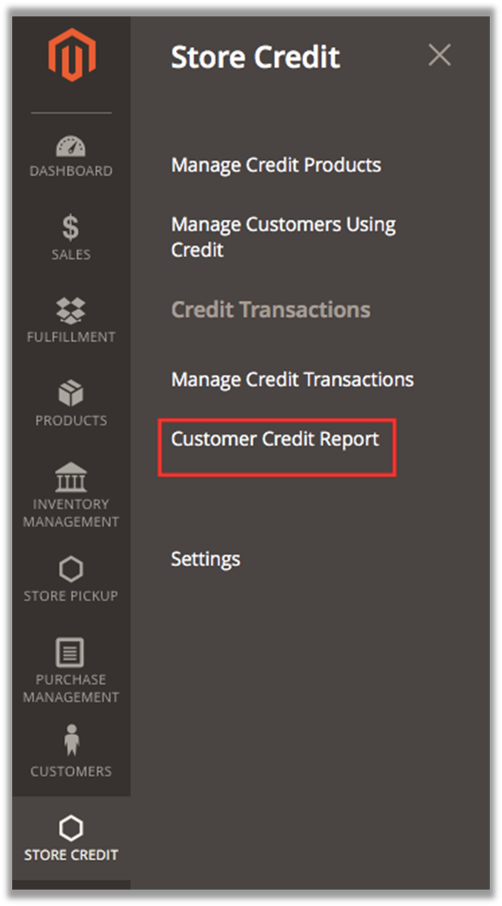

✓ **Path: Store Credit > Credit Transactions Section > Customer Credit Report**

Then the **Report Charts** page will be shown as above.

This page can be divided into two main sections including **Life-time Reports** and **Period-of-time Report Charts**.

•	**Life-time Reports**: There are 2 types of reports.
     -	**Customer Credit Statistics** with the total credit, the total spent credit and the number of Customers with credit in your system.
     -	**Top 5 Customers with The Greatest Credit Balances** with their names and current balances in your system.

•	**Period-of-time Report Charts**: This chart shows you the total spent credit and received credit of all Customers per day in your chosen time range such as **last 24 hours, last 7 days, current month**, etc.

##### Use Credit when creating orders in backend

✓ **Path: Sales > Operations Section > Orders**

On the **Create Order** page on backend, our module allows you to use credit when creating orders for customers.

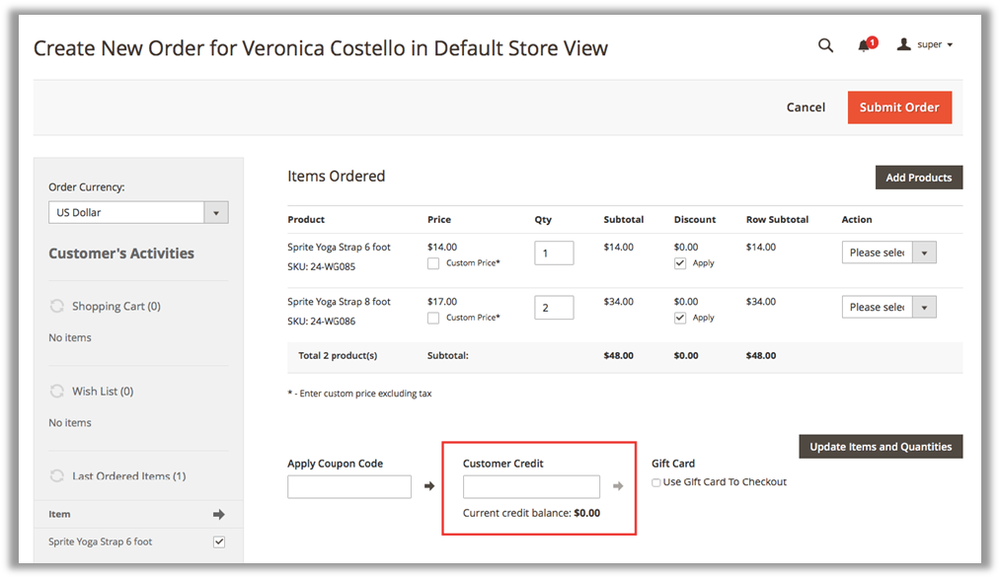

Enter a credit amount in **Customer Credit** box  and click on the **Gray Arrow** button.

Our module will auto-update and calculate the grand total of the order.

After submitting the order, the customer’s credit balance will also auto updated and you can check the transaction on the **Credit Transaction** page.

#####  Refund Orders into Credit Balance

When customers want to refund an order, our module allows you to transfer the order value to his credit balance. In that way, customers can use the credit for future purchases and you do not have to lose money for the refund at the same time. 

After clicking on the **Credit Memo** button, 

1)	Enter the amount you want to refund into credit as above

2)	Click on the **Refund Offline** button

The amount you entered as well as the credit that the customer used for paying for the order will be refunded to his current credit balance. 

For any order that includes only Credit Product, the option **Refund Order to Credit**t is not available. 

Once the refund is finished, you can check the transaction on the **Manage Transaction** page.

##### Settings

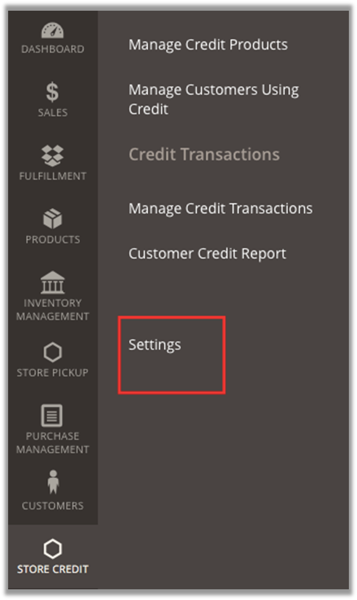

✓	**Path: Store Credit > Settings > Magestore Extension tab > Store Credit**

•	**General Configuration** Tab:

✓ **Path: Magento Extension > Store Credit**

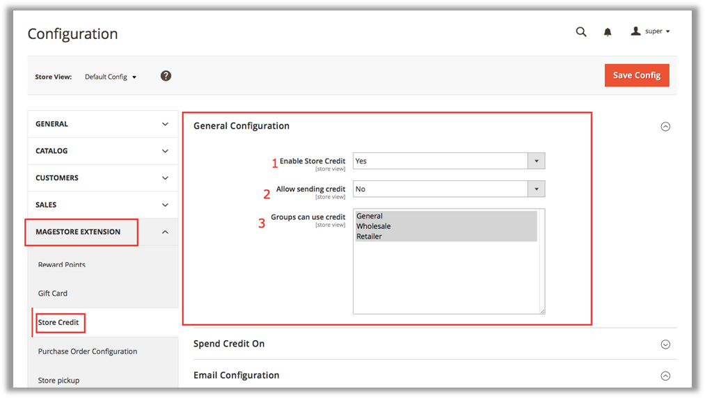

1)	**Enable Store Credit**: to activate Store Credit on your site

2)	**Allow sending Credit**: allow customers to send credit to their friends

3)	**Groups can use edit**: allow only general/wholesaler/retailer or all customers able to use credits

•	**Spend Credit On** Tab

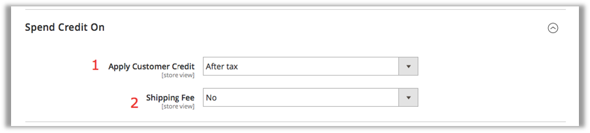

1)	**Apply Customer Credit**: If you choose **After tax**, it means the Customer Credit Discount will be applied to order value including tax

2)	**Shipping fee**: If you choose **No**, credit balance cannot be used to pay for Shipping Fee

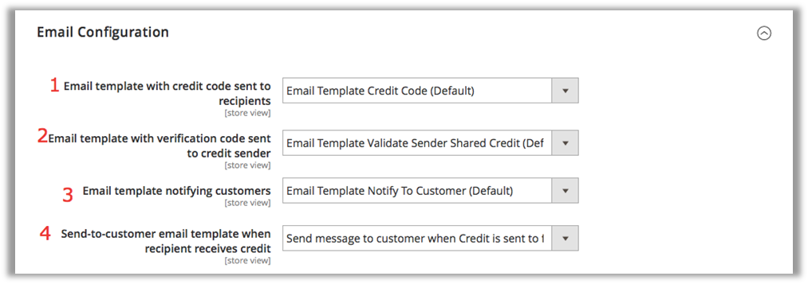

•	**Email Configuration** Tab

1)	**Email template with credit code sent to recipients**: default

2)	**Email template with verification code sent to credit sender**: default

3)	**Email template notifying customers**: default

4)	**Send-to-customer email template when recipient receives credit**: default

•	**Adjust time for Customer credit reports on total used and total received credit** Tab.

1)	**Select start time for current year**: choose Month, then Date

2)	**Select date for current month**: choose Date

•	**Style Configuration** tab:

1)	**Background of Title**: enter Hexadecimal code

2)	**Color of Title**: enter Hexadecimal code or choose a color as above.

#### How customers manage their store credit

##### How customers buy Credit Product 

After customers login to your website, they can access the **Store Credit Products** page in two ways:

•	**Option 1**: on the top navigation bar, click to **Buy Store Credit** 

•	**Option 2**: click on the **Store Credit** on the left navigation of the **Account Dashboard** page

**Option 1:**

After that, the **Store Credit** page will be shown as above.

As you can see, this page lists all **Credit Products** of your website. There are three types of credit products for customers to choose: fixed values, range of values and drop-down values. 

•	**Fixed Value**: These credit products have fixed value. 

•	**Drop-down Values**: With this type, customers can select a specific value in the drop-down list.

•	**Range of Values**: With this type, customers can choose a desired credit amount within the range configured by admin in backend. 

After selecting credit products they like, customers can add them to cart and checkout normally.

When the order is complete, our module will auto-add that credit amount to the customer’s credit balance.

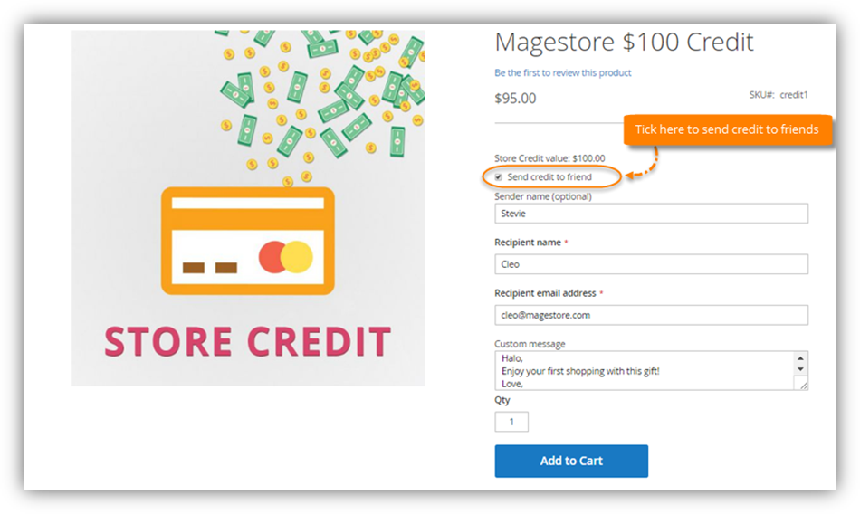

Customers can also send Credits to their friends

1)	Tick **Send credit to friend** checkbox 

2)	Enter the name of the recipient 

3)	Enter the email address of the recipient. The system will send an email to this address

4)	Enter the message that recipient will receive.

**Option 2:**

In this second way, they will be navigated to the **My Credit** page on which they just need to click on the **Buy store credit** button. See section **Send Credit to Friends** to see how it works for customers. 

When the order is completed, there will be two cases happening based on signup status of the recipient email address. 

•	**Case 1**: if the recipient do not have an account in the system, an email as above will be sent.

•	**Case 2**: if the recipient has already had an account in the system, the system will automatically add that credit amount to the Recipient’s credit balance.

In both cases, the sender always gets email notifications as above.

##### How customers manage Credit on My Credit page

In order to access the **My Credit** page, customers can click on the **Store Credit** tab on the left navigation.

######	Manage Credit Balance

On the **My Credit** page, customers can view information about their current credit balances and transaction history.

In the section **Transaction History**, our module shows customers all of their credit transactions with a lot of information including **date, type, details, added/deducted value in transaction** and **credit balance**.

######	Send Credit to Friends

First, customers should click on the Send Credit tab on the left navigation to go to the **Send Credit to Friends** page as above. 

This page has 2 parts including **Send Credit to Friends** and **Credit Code List.**

•	**Send Credit to Friends**: allows customers to send credit to their friends by filling in all required information

•	**Credit Code List**: shows all information about the credit codes that customers sent to their friends including **code, recipient’s email, amount, sent date and status of code.** Credit codes are not displayed fully for security purpose. When customers click on, they will be shown clearly.

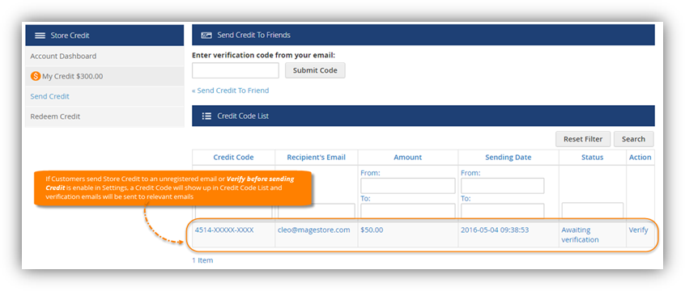

Please note that our module allows you to configure whether to require your customers to verify their credit sharing or not. We will consider the two cases separately.

**i.**	**Case 1: Customers are not required to verify their credit sharing**.

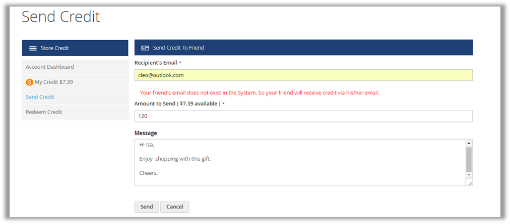

1)	Enter recipient’s email

2) Add an amount customers want to send to their friend.

3) Write a message to the recipient. 

4) Click on **Send** button
Notice that after entering recipient’s email,  our module will check that email address and show notification to customers.

•	**If the recipient’s email has not been registered on the website**: 

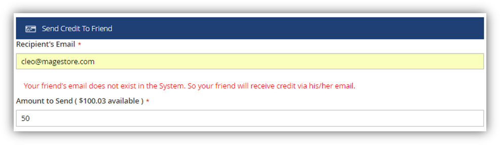

In this case, our module will show a notification for the customer that his friend will receive the credit code via that email. After that, the sender’s credit balance will be deducted immediately and an email will be auto-sent to the recipient’s email address.

As you can see, this email informs the recipient about the credit amount, message and a credit code which can be used to redeem credit to his balance.

At the same time, the sender can also see the sent credit code in the **Credit Code List** section as above.

In this section, customers can follow the status of the credit codes they sent. While the recipient has not redeemed a credit code, customers are allowed to cancel it by clicking on the **Cancel** link in the **Action** column. After the cancellation, the recipient cannot redeem that credit code any more.

Otherwise, once the credit code has been redeemed, the status will be updated and the **Cancel** link will be disabled. Please refer to the section   **Redeem Credit** for more information. 

Customers can check their current balances and transactions of sharing credit in the **Transaction History** section.

•	**If the recipient’s email has been registered on the website**

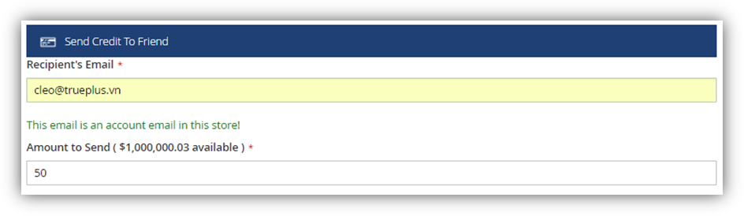

If the recipient’s email address has been registered on your website, our module will send credit directly to his credit balance instead of sending credit code to his email. 

Customers can check their current balances and transactions in the **Transaction History** section.

At the same time, recipients can get information about this transaction.

**ii.	Case 2: Customers are required to verify their credit sharing.**

If you configure that customers have to verify before sharing credit, after clicking on the **Send** button, they will receive an email as above.

At the same time, they will be navigated to the **Verify** page as follows. 

On this page, our module shows them a notification about the verification requirement. In the **Credit Code List**, that code is put under the **“Awaiting verification”** status with a **Verify** link. 

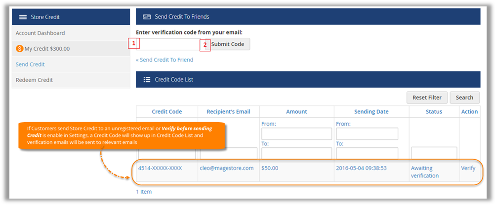

To verify, customers can:

1)	 Enter the verification code they received in their emails 

2)	Click on the **Submit Code** button.

After customers finish verifying, our module will send credit to the recipient.

######	Redeem Credit

To go to the **Redeem Credit** page, customers can click on the **Redeem Credit** tab on the left navigation.

On this page, customers can redeem the credit code they received to their credit balance as following steps:

1)	Enter the code in the text field 

2)	Clicking on the **Redeem** button.

 Another way is just to click on the link in the email. 
 

After redeeming code, customers can check their current balance and transaction in the **Transaction History** section.

##### How customers check out by Credit 

Customers can use credit to checkout on both **Shopping Cart and Checkout** page.

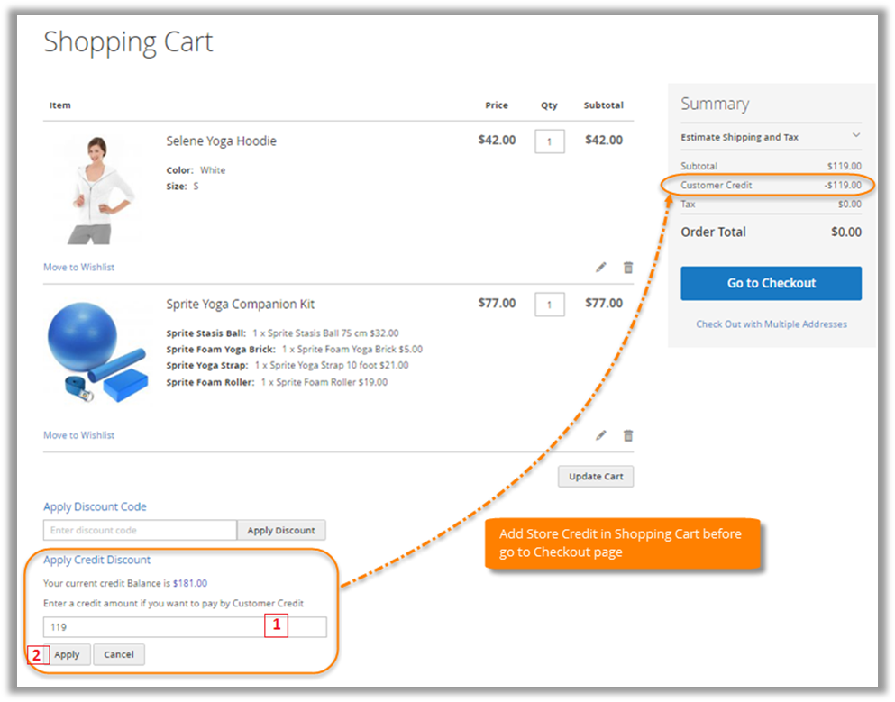

On the **Shopping Cart** page, our module will add **Apply Credit Discount** block for customers to use their credit balances to checkout.

To use a credit amount, customers can:

1)	Enter that number in the field 

2)	Click on the **Apply** button. 

Our module will auto-update and calculate the grand total of order.

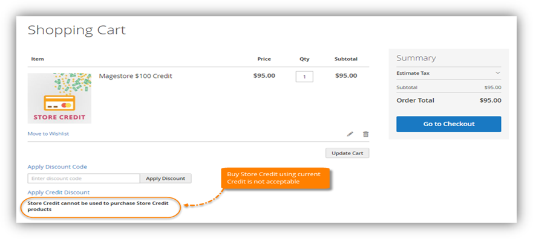

Please note that customers cannot use credit to buy credit products. If their carts have one or more credit products, our module will show a notification in the **Customer Credit** block as above.

On the **Checkout** page, in the **Payment Information** tab, apply credit discount the same as in the **Shopping Cart** page. 

When customers click on the **Continue** button, our module will auto-update the order’s Grand Total.

After order has been placed, customers’ credit balances will be updated immediately. They can check the current balances and transactions in the **Transaction History** section.

----------------------

###	Gift Cards

#### How to configure Gift Card

##### Setting

✓ **Path: Marketing > Gift Card > Settings**
	
To configure default configurations and settings of the module, please log in to backend screen, and then do the following stages as below.

**GENERAL**

**Gift code**

1)	Select **“YES”** in the dropdown list to enable Gift Card

2)	Configure the pattern to auto-generate gift codes for Gift Card products when customers purchase in WebPOS frontend

3)	Enter the number of prefix characters which are shown in a voucher code

4)	Enter one letter to replace hidden characters

**Gift Card Usage**

1)	Enter the term of validity that Gift Cards can be used after being activated.

2)	Enter the maximum time(s) that allows users to enter gift code incorrectly.

3)	Enter the maximum number of users per gift code.

4)	Select **“YES”** to allow customer to apply gift card for shipping fee

5)	Select **“YES”** to allow customers to use both Gift Card codes and Coupon codes at once. 

6)	Select **“YES”** to allow customers to check status of Gift Cards after entering Gift Codes, and vice versa.

7)	Select **“YES”**  to show the expiration date of Gift Cards on website, and vice versa.

**Tax Configuration**

Select:

1)	**After Tax**: to allow applying Gift Card after the tax is applied

2)	**Before Tax**:  to allow applying Gift Card before  tax

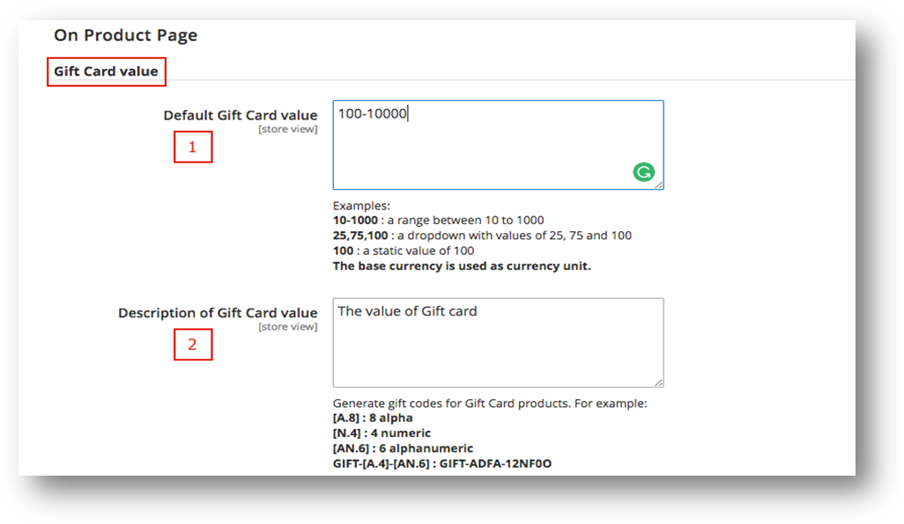

**ON PRODUCT PAGE**

**Gift Card Value**

1)	Enter the default gift card value (follow the below instruction)

2)	Enter the description of gift card value (follow the below instruction)

**Gift Card Template**

-	Select **“YES”** to allow customers to change the image inserted in the template

-	Limit the maximum size of images uploaded by customers to 500KB
Gift Card Shipping Information

-	Select **“YES”**: Gift card can be sent through the post office

-	After Customers order Gift Cards for friends and choose **Send through post office** option, Gift Cards will be sent to recipients within 5 days

-	Limit the maximum length of a custom message on Gift Card. Select **“YES”**  to allow users to schedule gift card delivery date.

**ON SHOPPING CART PAGE**

1)	Select **“YES”**  to Enable a Gift Card box for customers to apply gift codes right on the shopping cart page.

2)	Select the data to display on shopping cart page

3)	Select **“YES”**  to allow showing Gift Card printout preview as product image on shopping cart page

**ON CHECKOUT PAGE**

Select **“YES”** to show Gift Card box on the checkout pagE

**EMAIL NOTIFICATION** 

**General**

1)	Select **“YES** to allow sending notification emails to customers and recipients

2)	Select **“Active”**, only a gift card which is activated can be sent to a friend

3)	Set the default sender of notification emails as General Contact 

4)	Select **“YES”** to allow sending a copy of gift card via email if customers choose to ship through post office.

**Notification email sent to purchasers**

1)	Select the email template sent to purchasers after buying Gift Card successfully. 

2)	Select the email template sent to purchasers when recipients receive Gift Cards. 

**Notification email sent to recipient**

3)	Select “YES” to allow email notification being sent to recipient when sender refunds Gift Card.

4)	Select the email template sent to the gift card’s recipient. 

5)	Choose the email template sent to recipient when gift card is refunded.

6)	Enable auto reminder email sent to Customers before Gift card expires 

7)	Enter the number of days to send notification to customers before the expiration date of a Gift card. 

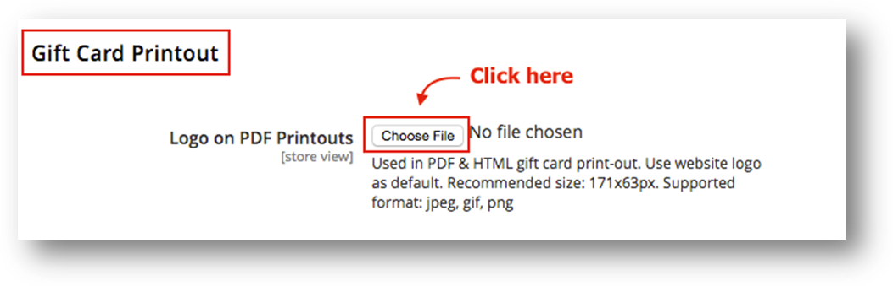

**GIFT CARD PRINTOUT**

Click **Choose File** to upload an image used as a logo when Gift Cards are printed or sent via email. 

##### Manage Gift Card Templates

######	Add new template

✓ **Path: Marketing > Gift Card > Manage Gift Card Templates**

1)	Click **Add New Template**

On the popup screen

1)	Enter the template’s name

2)	Choose a design pattern in dropdown list (optional)

3)	Enter notes or description about the gift card template (if any)

4)	Choose text color

5)	Choose link/ special text color

6)	Upload a background image. 

7)	Click “Save and Continue” or “Save”

###### Preview Existing Template

✓ **Path: Marketing > Gift Card > Manage Gift Card Templates**

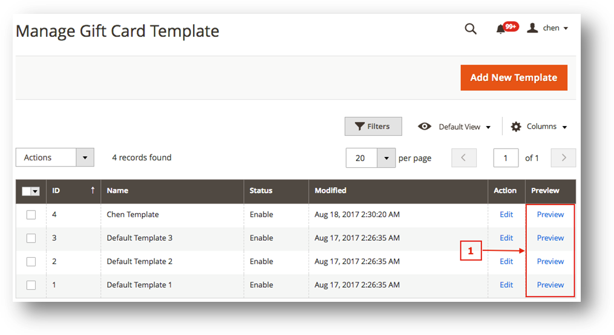

1)	Click **Preview**  to see the gift card template

######	Edit and Delete Existing Template

✓ **Path: Marketing > Gift Card > Manage Gift Card Templates**

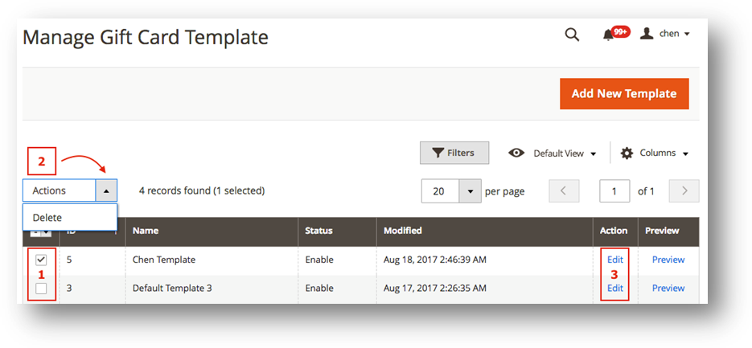

1)	Mark the template checkbox

2)	Tab the action label, select “**Delete**” to remove templates.
 
3)	Click “**Edit**” to update templates data

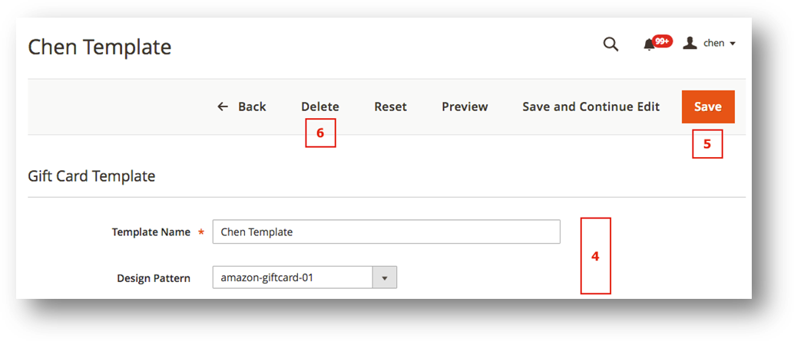

On the popup screen

4)	Edit templates data

5)	Click “**Save**” to finish

6)	Additional guidance: Click “**Delete**” to remove template

##### Generate Gift Code

✓ **Path: Marketing > Gift Card > Generate Gift Code**

1)	Click on “**Add Gift Code Pattern**” to create new pattern code

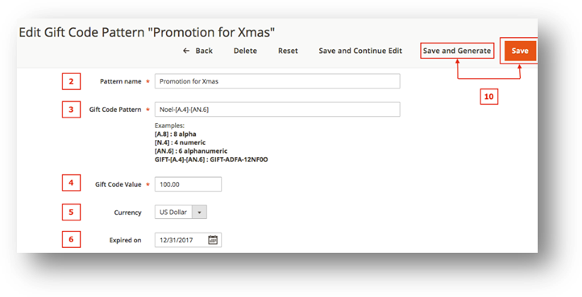

On the popup screen above, you can: 

2)	Enter the pattern name

3)	Follow the example mentioned below and set a format for the gift code 

4)	Enter the Gift code value

5)	Select a currency

6)	Select an expiration date

7)	Select a gift card template

8)	Enter the quantity of gift code issued

9)	Select store views

10)	Click on: 

-	“**Save and Generate**” to save and generate the gift code at the same time

-	“**Save**” to finish

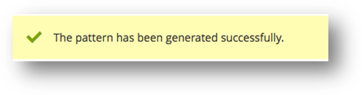

A status “**the pattern has been generated successfully** “ would be shown on the pop-up screen.

11)	A list a generated Gift Codes would be shown at the botton of the pop-up screen 

#####  Manage Gift Codes

######	Create a new Gift Code
	
✓ **Path: Marketing > Gift Card > Manage Gift Code**

1)	Click on “**Add Gift Code**” to create a new gift code

Moreover, click on “**Import Gift Codes**” to import data from your device to the system.

On the popup screen:

2)	Follow the example mentioned below to set a format for the gift code

3)	Enter the Gift code value

4)	Select a currency

5)	Select a gift code template

6)	Select “**Active**” to enable/ activate the gift code

7)	Select an expiration date

8)	Select store views

9)	Write a comment (optional)

Scroll down, on the **Message Information** tab, click  to expand.

1)	Enter the sender name and email

2)	Enter the recipient name and email

3)	Enter the recipient Address

4)	Enter the message to the recipient

Finally, scroll up, tab the arrow on the right hand-side of “**Save**” button: 

1)	Select “**Save & Send Email**” to save and send Gift Codes via emails to both sender and recipient

2)	Select “**Save & Continue Edit**” to finish.

 ######  Manage Gift Card History per customer
 
✓	**Path: Customers > All Customers**

1)	Click “**Edit**” to view an existing customer’s detailed information 

On the popup screen:

2)	Click on “**Gift Card History**” tab to view all transactions in which gift cards were applied

##### Apply Gift code when creating orders

✓	****Path: Customers > All Customers****

On **Create New Order**  page, after selecting a customer and adding a product to an order, the system will show the Gift Card box, which allowing you to use Gift Card credit balance or Gift Card code(s) of the Customer to pay for this order. Select the method(s) as you want and then remember to click on Apply Gift Card button. 

1)	Mark the check box to use gift card to checkout

2)	Enter the Gift card code

3)	Click on the arrow to apply the gift code

Scroll down to view “Order Totals” label, then click on (4) “**Submit Order**” to finish.

##### Refund Orders into Gift Card Credit Balance

✓ **Path: Sales > Orders**

1)	On the dashboard screen of admin, click **“Sales” > “Orders”**

2)	Click “**View”**

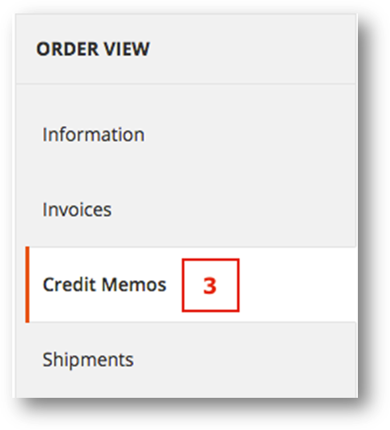

3)	On the “Order View” tab, click on **“Credit Memos”** to refund

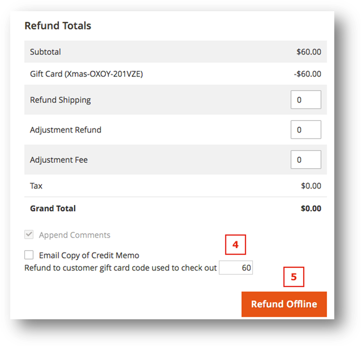

4)	Enter the number of money to refund to gift credit 

5)	Click on “**Refund Offline**” to finish.

##### History

✓ **Path: Marketing > Gift Card > Gift Code History**

On **Gift Card History** page, you will know when Gift Cards were created/ updated/ redeemed/ spent/ refunded and by whom as well as their values and status. 

You can filter data with the above criteria to get more accurate reports. Information can be exported to .CSV or .XML files for your convenience.
 
#### How customers manage Gift Card 

#####  How customers purchase a Gift Card Product.

Gift Card can be ordered as a normal product. Customers can enter or choose the value and quantity of Gift Card they want to order, then click on **Add to Cart** button.

The price of Gift Card product may differ from Gift Card value. It depends on Admin’s configuration in backend, which could be a fixed value or a percentage of Gift Card value. If the price type is “percentage”, Customers will see the corresponding Gift Card prices when they choose different Gift Card values

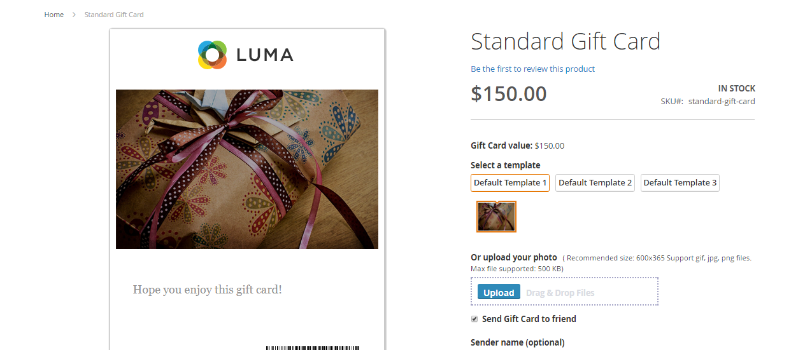

1)	Select a template

After choosing a preferred template, Customers can select between 1 of provided images. It is possible for Customers to personalize their Gift Card by uploading their own image as well. The recommended size for image to upload is 600x365px for the Top layout or 744x455px for the Amazon layout. 3 file types are supported including .GIF, .JPG and .PNG.

2)	Or upload the photo customers want to send as Gift Card. 

If Customers upload an image with an unsupported file type or the image is larger than the maximum file size configured by Admin, the system will auto-show an alert message to notify Customers.

Customers can also see the expiration date of the Gift Card on Gift Card image

- For Gift Card products that have usage conditions, the conditions will NOT be displayed below the product name as in Magento 1 version. However, the admin can write the conditions in the description if it is necessary for customersto see. If anyone want to redeem the gift cards (enter the gift code to purchase one or many products) but does not meet  the condition(s), then the system will show an “Invalid” notice

- 	Customers can also send Gift Cards to their friends by ticking Send Gift Card to friend checkbox and enter all the required fields:

1)	Enter the name of the sender 

2)	Enter the name of the recipient 

3)	Enter the email address of the recipient. The system will send an email which contains a Gift Card code to this address

4)	Fill in the message is delivered along with the Gift Card code
Tick the **Get notification email when your friend receives Gift Card** checkbox to get the notification email when customers’ friend receives Gift Card.

5)	Set up the date that a Gift Card will be sent.

6)	Set up the time zone that a Gift Card will be sent.

7)	Click on the Gift Card thumbnail image or the Preview Gift Card button to preview how the Gift Card actually looks like when recipients receive, Customers can. 

A popup of Gift Card interface will be shown as below:

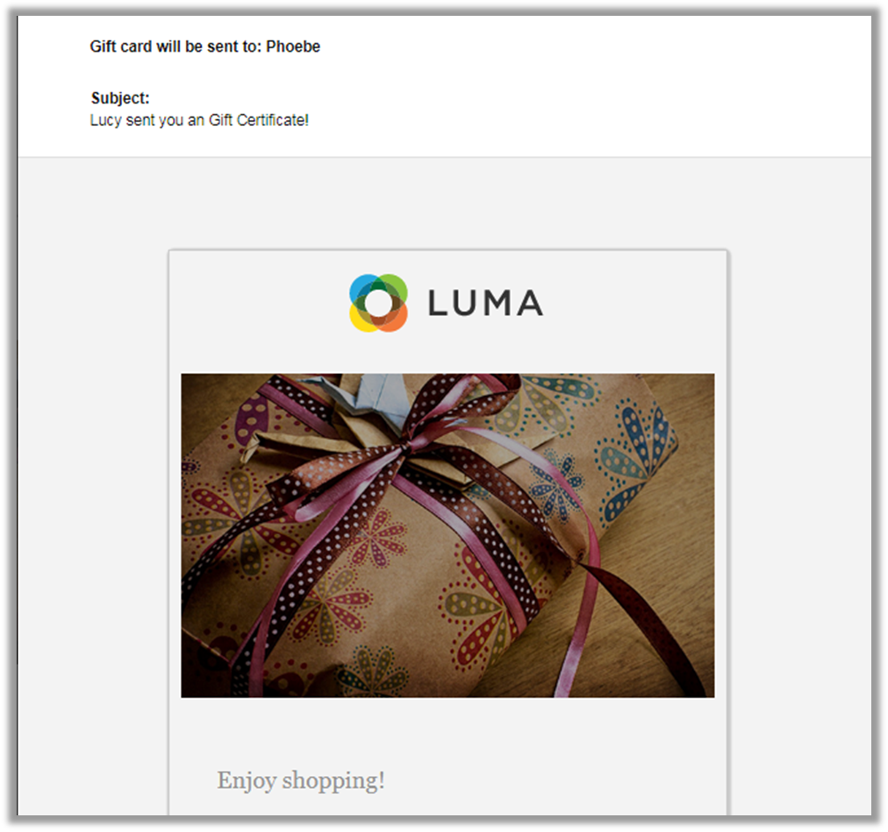

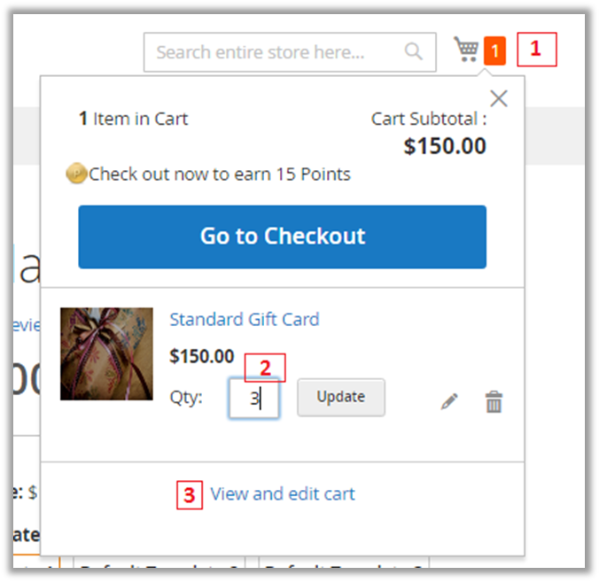

After Customers add a Gift Card to cart, they can go to shopping cart page to review the cart by following steps: 

1)	Click on the cart icon on top right corner

2)	Edit and update quantity of the Gift card if customers want. Click Update to complete the edit. 

3)	Choose **View and edit cart**. 

The details of Gift Card when Customers send the Gift Card to their friend as above. 

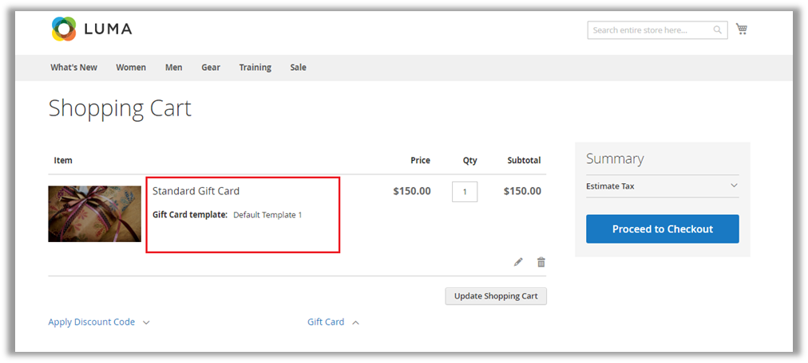

The details of Gift Card when Customers buy the Gift Card for themselves:

-	Then Gift Cards products can be checked out as normal products. Customers will receive a Gift Card code if they buy for themselves. In case Customers purchase the Gift Card to send to their friends, the code will be delivered to their friends’ email with the above form.

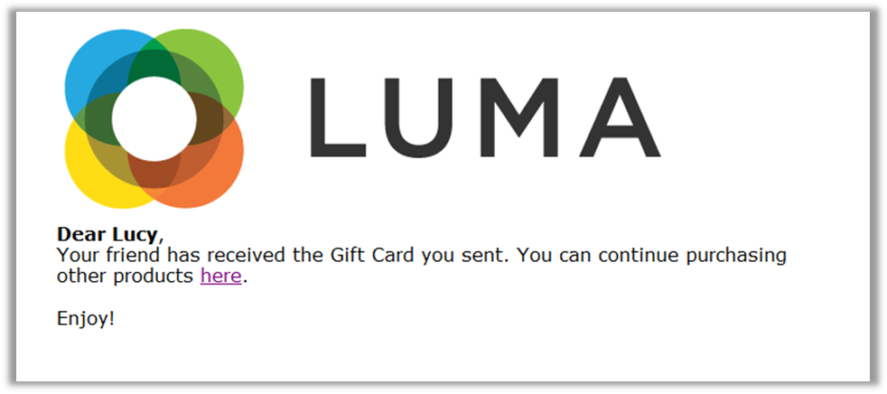

If the Sender has ticked the checkbox Get notification email when your friend receives Gift Card, a notification will be sent to his email address immediately after the Gift Card is delivered to the friend’s email as above.

If Customers purchase Gift Card for themselves, the notification email that they receive is as above. 

#####  How customers use Gift Card as discount method

When Customers have Gift Card codes, they can use them as a discount coupon when ordering a product at the Checkout page:

1)	Tick Use Gift Card to check out

2)	Enter the gift code. 

3)	Click on **Add Gift Card** button to apply.

**Note**: Gift Card codes cannot be used to purchase Gift Card products but they can be spent on shipping fee, depending on Admin‟s settings.
--------------------
**_Confidential Information Notice_** 

Copyright 2017. All Rights Reserved. Any unauthorized reproduction of this document is prohibited. 

This document and the information it contains constitute a trade secret of Magestore and may not be reproduced or disclosed to non-authorized users without the prior written permission from Magestore. Permitted reproductions, in whole or in part, shall bear this notice.
