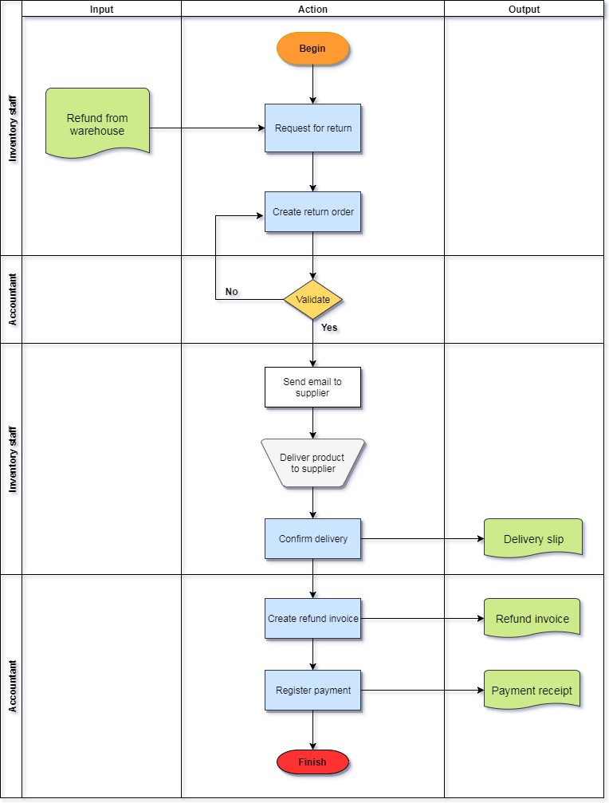
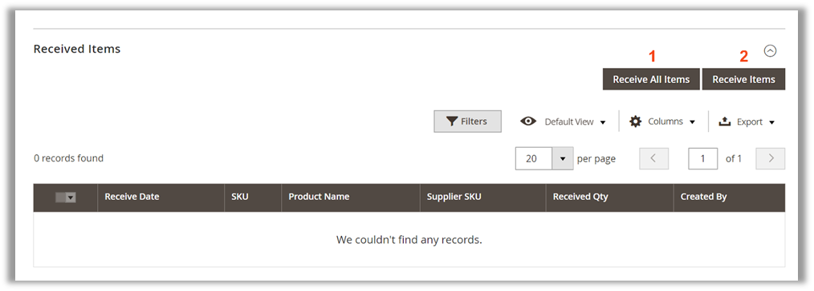
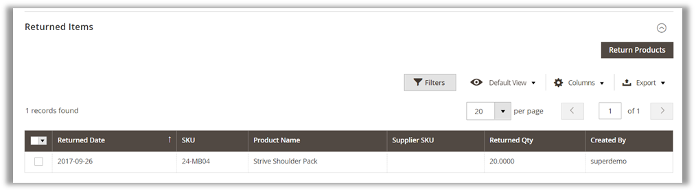
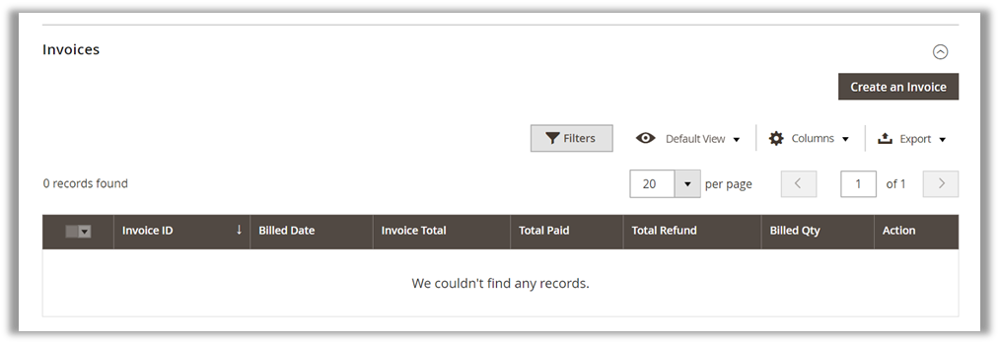
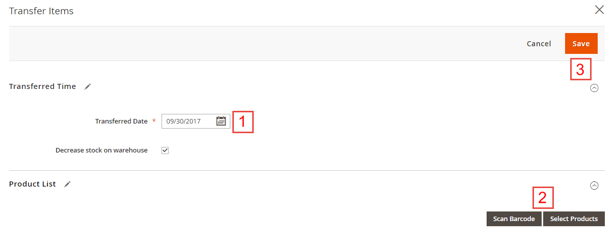
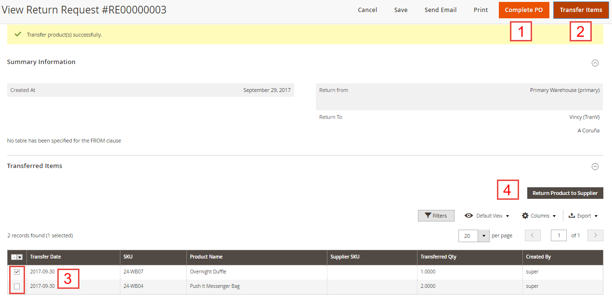

# Purchase Management - Magento 2

Confidential Information Notice.

Copyright 2017. All Rights Reserved. Any unauthorized reproduction of this document is prohibited. This document and the information it contains constitute a trade secret of Magestore and may not be reproduced or disclosed to non-authorized users without the prior written permission from Magestore. Permitted reproductions, in whole or in part, shall bear this notice.

-------------

## INTRODUCTION
Purchase management is always a headache to retailers. As the businesses grow up and upscale, they have to manage purchase orders among various suppliers and warehouses. On the other hand, without a well-organized process, so many staff involved in the purchase management will easily end up troublesome. 
	With our Purchase management module, you’ll no longer worry about how to management PO the most efficiently. Here we provide you a step-by-step workflow to manage purchasing. You are guided through how to create quotation, how to create a purchase order and how to receive or return items to finish purchase order. Especially, a detailed permission matrix will be available to show you all the possible user roles in each step of the process, which helps run a smooth internal operation. 

## WORKFLOW

### Purchase Order Process

### POS - Return Order Process

## PERMISSION MATRIX
Here are the full feature-list for all roles in the package:

# Purchase Management Processing
## Purchase Order
###  Purchase Staff Create Request for Quotation

*"**A quotation** (or **a request for quotation**) is the proposal of price and quantity of goods that store owners send to suppliers. The quotation will become purchase order when a seller sends confirmation of price and availability of products stated in the quotation.”*

To create a new request for quotation, purchase staff can follow this path: **Purchase Management** > **Quotation Management** > **Create Quotation**

Then the page will be shown as below:

1) Choose **Created Time**
2) Choose **Supplier** to ask for quotation. 
3&4) Choose Currency & Currency Exchange Rate
5) Adding comments is optional.
6) Click on **Prepare Product List** for the next step. You will be navigated to  this view:

In this step, there are 5 ways for you to prepare product list:
* Import products via a CSV file
* Prepare product list based on supply need forecast
* Prepare back sales products (Back sales products are ordered by customers but not available in stock now)
* Prepare low stock products
* Prepare product list manually with **All Supplier Products** button
Apart from importing products via a CSV file, you need to enter Purchase Cost, Tax, Discount and Qty Ordering for each product. Editing in line is allowed here. After entering all required fields, click **Save** button and Order Totals is automatically calculated.

Then, scroll down to set up **Shipping and Payment**

1) Enter the address you want the stock to be shipped to
2) Select a shipping method for the quotation
3) Estimate and enter the shipping cost
4) Set start shipping date
5) Set expected delivery date
6) Select the payment term
7) Choose the way to place order: N/A, Email, Phone, Fax, supplier website
After filling all the information, click **Save** to save all changes. You can still update products information by editing in a specific product line.  Then, choose **Confirm Quotation** to create a request for quotation.

### Purchase Manager Validates Request for Quotation

To validate a request for Quotation, purchase manager goes to **Purchase Management > Quotation Management**, choose **Quotation** to see quotation list. At the list of quotation, click on **View** at the quotation has status as **“confirmed”**. 

Then, the view will be shown as below:

In this page, you are able to edit in **Shipping and Payment** tab only. 
1) Click **Save** to save your work. 
2) To do more update about products information, click on **Revert Quotation** and you will be brought back to the previous step and enable to update products information. Later on, you will receive quotations from suppliers and compare their RFQ.

### Purchase Staff Send Request for Quotation to Supplier

To send Request for Quotation to supplier, purchase staff go to **Purchase Management > Quotation Management**, choose **Quotation** to see quotation list. At the list of quotation, click on **View** at the quotation marked as **“confirmed”**.

On this page, click on **Send Email**. The request for Quotation will be sent to supplier via the email in supplier information.

### Purchase Manager Approves Purchase Order

To approve Purchase order, purchase manager convert request for quotation to purchase order. In the Quotation view, click on **Convert Quotation to PO**.

As the quotation is converted to purchase order, you will be navigated to Purchase Order view

As can be seen, the purchase order is marked as **“pending”**. In this page, you are still able to update the product information as editing is allowed to be done directly in line. After finishing all editing, click on **Save** to save all changes.

### Purchase Manager Confirms Purchase Order

To confirm purchase order, purchase manager clicks on **Confirm Purchase Order** and the page will be shown as below:

After being confirmed, the purchase order will be marked as “processing” and supplier will deliver products to store.

### Purchase Staff Complete Purchase Order

To complete Purchase Order, purchase staff have to finish these tabs as shown in the list here:

#### **Received Items** tab

There are two ways to receive items: 
1) **Receive All Items**: All products will be noted as received. Each product goes with detailed information including Received Date, SKU, Product Name, Received Qty and Created By.
2) **Receive Items**: By clicking on this button, you are able to choose a part of the purchase order. This method is most suitable when you use partial shipment. After selecting products, you need to enter the received date, select received products and fill Received Qty for each product.

#### **Returned Items** tab

**Returned Items** are records of items & Qty. returned against a purchase order. Click on **Return Products** to create a return.

1) You need to enter the returned date, 
2) Select returned products by choosing **Scan Barcode** or **Select Products**, and fill Returned Qty for each product. 
3) After that, you click on the Save button to save your work. The system will automatically subtract the returned Qty. that you entered from the corresponding warehouse’s inventory. Now, you can see the records of all returned items shown in the Return Items tab. 

#### **Invoice** tab

Multiple invoices can be created by products for one purchase order. When you click on **Create an Invoice** button, the **Create an Invoice** page will be shown like below:

1) You need to enter the billed date, 
2) Select products and fill billed Qty, unit price, tax and discount for each product you want to create an invoice for. 
3) After that, you click on the **Save** button to save your work. Now, you can see the records of all invoices shown in the **Invoices** tab.

#### **Transferred Items** tab:
After receiving products, you can transfer them to warehouses. Here is what we got in **Transferred Items** tab:

**NOTE:** after transferring products to warehouse, you will not be able to return them to vendor.
After clicking on **Transfer Product to Warehouse** button, you need to enter the transferred date, warehouse, select products and fill transferred Qty for each product you want to transfer. After that, you click on the **Save** button to save your work. Now, you can see the records of all transferred products in the **Transferred Items** tab.

#### Shipping and Payment and General Information tabs

After finishing the first 4 tabs, checking information in the 2 last tabs before completing the Purchase Order by clicking on **Complete PO**:
1) **Shipping and Payment**
2) **General Information**

As can be seen, the PO is marked as “completed” and no more changes can be done except for transferring items. Choose **Transfer Items** to transfer the remained items in the PO to any warehouses. 

## RETURN ORDER

### Inventory Staff Create Return Order

In order to request a product return, inventory staff can follow the path **Purchase Management >  Return Request Management > Return Requests**

You will be led to the **Create Return Request** page

1) Return progress is controlled in 4 steps:
	* New: input general information of the return process,
	* Pending: create the list of products to return to supplier,
	* Processing: the product list has been submitted to the supplier. Products, once delivered, are waiting to be validated and transferred to warehouse.
	* Completed
2) Input the date that you create the return request
3) Choose the warehouse to take products out for return
4) Choose supplier to return products to
5) Input return reason (optional)
6) Click **Prepare Product List** to move to the next step

On **Pending** step:
1) View general information of the return request that you have input in the previous step.
2) There are 2 ways of preparing product list to return:
	* Choose to either Import Products list via csv file (template provided)
	* Or view and choose among all products of that supplier by clicking on All Supplier Products button.
3) Cancel the return request
4) Send an email to supplier to inform of the return
5) Print the list of returned items
6) Save your current process while stay on the page
7) Confirm 

After adding products, you can edit product quantity to return:

1) Select products to edit
2) Input product quantity to return
3) Click **Save** to save your current process and stay on page; or **Confirm Order** to continue.

### Inventory Staff Confirm Delivery

After validating the products, inventory staff can process with the product receipt:

1) Click **Complete PO** to finish the Return request.
2) Click **Transfer Items** to transfer the received products to the warehouse that you have appointed before.

In **Transfer items** page: 
1) Input the date of transfer
2) Choose either to select products by scanning barcode; or select products from a list with 2 steps as below

After selecting products or scanning barcode, you will be sent back to the **Transfer Items** page:

1) Input the product quantity to transfer (you can transfer partially in multiple times)
2) Click **Save** to continue

1) Click **Complete PO** to finish the return request
2) Click **Transfer Items** to continue transferring the rest of received products.
3&4) Select products and click button to **Return to Supplier**.

