# GIFT CARD - USER GUIDE FOR MAGENTO 1

**Version 4.7**

(Magento [Gift Card](https://www.magestore.com/gift-card) is one module in our [Omnichannel solution](https://www.magestore.com/omnichannel-retail) for Magento retailers.)

-----------------------
## INTRODUCTION

More and more Customers go online to find gifts for their friends and families, instead of wandering from shop to shop to buy the best gift. Why not join this trend by creating Gift Card/ Gift Voucher as a 1-size- fits-all gift? With this module, Customers can purchase Gift Cards to present others and then recipients can use them to buy products at your store. It’s a great idea for helping you increase customer satisfaction.

-------------
## Table of terminologies

**No.**|**Terms**|**Explanation**
--- | --- | ---
1| Gift Code | Gift codes are not only generated from Gift Card products but can also be added by Admin:   - Gift codes of Gift Card products are generated in **Settings**  - You can import/add gift codes in **Manage Gift Codes**, or auto generate random gift codes in **Generate Gift codes**
2| Gift code pattern | Template to auto-generate random gift codes
3| Gift Card product | Gift Card can be created as a product in your store.Like other products, it will have details like: Product page, Price, Weight…
4| Gift Card value | The value of Gift Card that can be used to purchase products at your store. For example: Customer may buy a Gift Card whose value is $100 at just $90. His friend later can buy a product of $100 in your store.
5| Gift Card order, Product order | Gift Card order is the order purchasing Gift Card at your store.   Product order is the order using gift codes to purchase products at your store.
6| Gift Card Product page | The detailed page of a Gift Card where Customers can choose options like: sending Gift Card to friend, filling recipient’s information, sending Gift Card via emails/PO, adding message, scheduling day to send…
7| Credit Balance | When **Gift Card Credit Balance** function is enabled, Customers may redeem their gift codes to a credit balance and use the balance to pay for orders at your store.
8| Gift Code Set | A list of gift code that users will import to their web store to sell.

-------------

##  HOW TO USE

This section demonstrates how Customers can use Gift Cards in frontend

### Order a Gift Card Product 

- Gift Card can be ordered as a normal product. Customers can enter or choose the value and quantity of Gift Card they want to order, then click on **Add to Cart** button.

- The price of Gift Card product may differ from Gift Card value. It depends on Admin’s configuration in backend, which could be a fixed value or a percentage of Gift Card value. If the price type is “percentage”, Customers will see the corresponding Gift Card prices when they choose different Gift Card values.

  
- For better Gift Card appearance, after choosing a preferred template, Customers can select between 1 of provided images. It is possible for Customers to personalize their Gift Card by uploading their own image as well. The recommended size for image to upload is 250x365px. 3 file types are supported including .GIF, .JPG and .PNG.

  If Customers upload an image with an unsupported file type or the image is larger than the maximum file size configured by Admin, the system will auto-show an alert message to notify Customers. 
  

  
Customers can also see the expiration date of the Gift Card on Gift Card image.
  
- For Gift Card products that have usage conditions, the conditions will be displayed in a tooltip form when hovering over the hyperlink text as shown below:

Customers can also send Gift Cards to their friends by ticking **Send Gift Card to friend** checkbox and enter all the required fields:

- **Recipient name**: the name of the recipient
- **Recipient email address**: the email address of the recipient. The system will send an email which contains a Gift Card code to this address.
- **Custom message**: the message is delivered along with the Gift Card code.
- **Day to send**: Customers can set up the date and time zone that a Gift Card will besent.
- If Customers want a Gift Card to be sent through a post office, they need to tick **Send through post office** checkbox. Gift Card product will be shipped as normal products.
- If Customers want to get the notification email when their friend receives Gift Card,they need to tick the **Get notification email when your friend receives Gift Card**
checkbox.
- To preview how the Gift Card actually looks like when recipients receive, Customers can click on the Gift Card thumbnail image or the **Preview Gift Card** button. A popup of Gift Card interface will be shown as below:

- After Customers add a Gift Card to cart and click on **Proceed to Checkout**, they will be directed to the following page:

    - *When Customers send the Gift Card to their friend*
 
 
    - *When Customers buy the Gift Card for themselves:*
 

- Then Gift Cards products can be checked out as normal products. Customers will receive a Gift Card code if they buy for themselves. In case Customers purchase the Gift Card to send to their friends, the code will be delivered to their friends’ email with the following form:

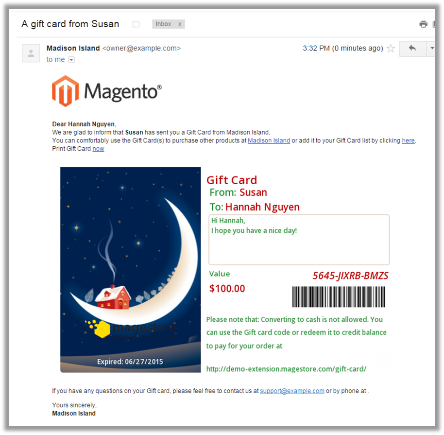

If the Sender has ticked the checkbox **Get notification email when your friend receives Gift Card**, a notification will be sent to his email address immediately after the Gift Card is delivered to the friend’s email as below:

If Customers purchase Gift Card for themselves, the notification email that they receive is as below:

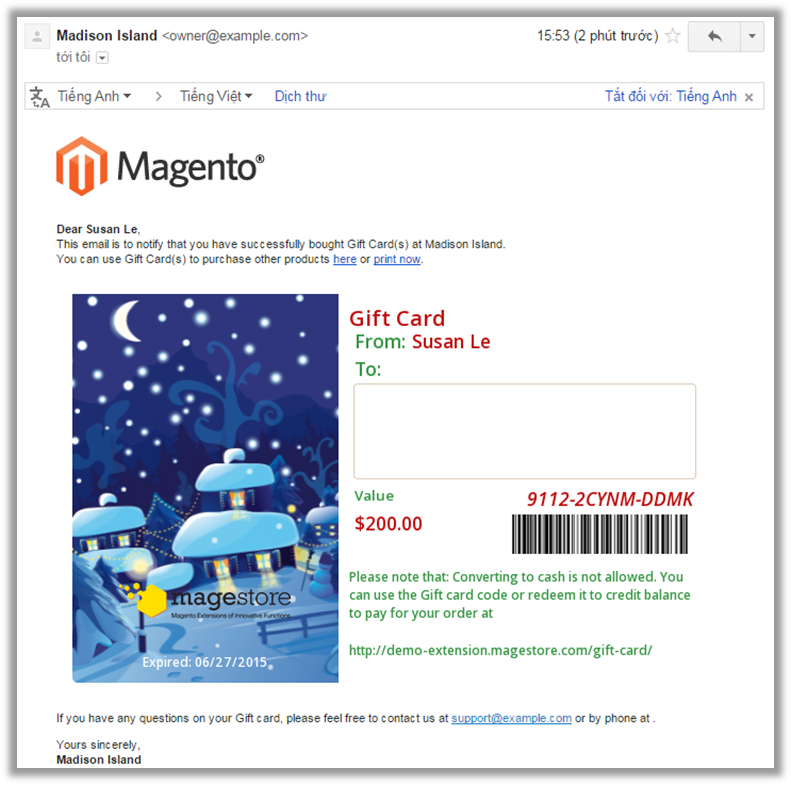

###  Manage Gift Card/Credit 

 

After receiving a voucher code, Customers can check their voucher balance and credit by clicking on **Gift Card** tab on the navigator bar in “My account” section:

- **Gift Card/Credit Management** page will be shown as below; the gift code which Customers received will be automatically added to the list.

- On this page, Customers can add a gift code which they received to the list or redeem it to their Gift Card credit balance. Next time when they order a product,they can use their credit balance without having to enter the gift code.

- Customers need to click on **Add/Redeem a Gift Card** button and enter the Gift Card code into the text field.

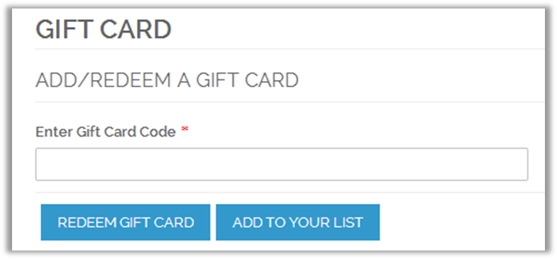

- **Add a Gift Card:**

Customers need to click on Add To Your List button, this Gift Card will be added to the list and displayed as below:

  - Gift Card list shows some information of Gift Cards such as: **code, balance, status,added date and action**. Customers can view, print, redeem and remove their Gift Cards.
  - Gift code is mostly hidden to ensure the security for Customers. They can view a full gift code by clicking on each one.
  - Clicking on **View** link on **Action** column, Customers can view Gift Card detailed information.

  - They can also redeem their Gift Card to the credit balance or remove it from a list by clicking on the corresponding link in Action column.
  
  - If Customers add the code which is sent to their friends, it will be highlighted as below:

- **Redeem a Gift Card:**

After entering the code, Customers need to click on &quot;Redeem Gift Card&quot; button. The value of the Gift Card will be redeemed to their Gift Card credit balance.

  - Customers are able to view the detailed information of their credit balance by clicking on **View detail** link. **Credit Detail** page is shown as below:
 
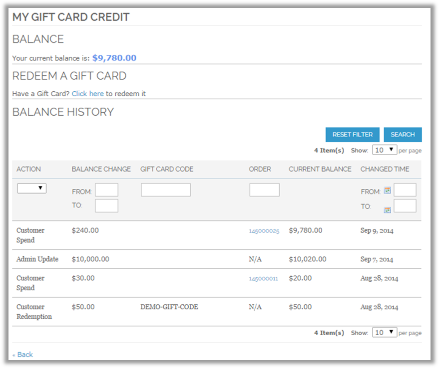

  - This page shows their current balance and their **Balance history** (Action, Balance Change, Gift Card code, Order, Balance, and Date).
  

  
###  Use Gift Card/Credit to Place an Order

When Customers have Gift Card codes or Gift Card credit balances, they can use them to get discount when ordering a product. There are two ways to use Gift Card code/credit balance:

- On **Shopping Cart** page:

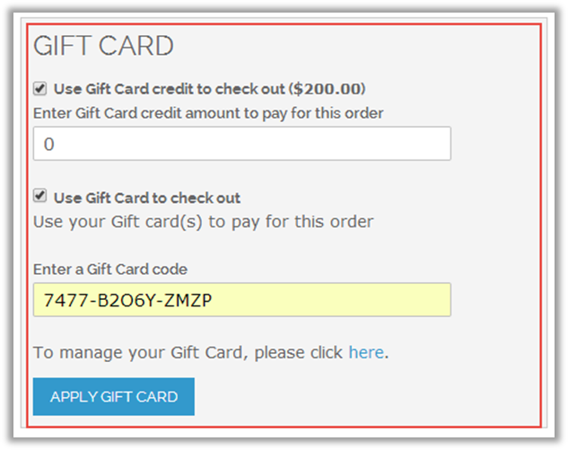

Customers can choose to use credit or Gift Card by ticking either **Use Gift Card credit to checkout** or **Use Gift Card to checkout** checkbox or both.

  - **Use Gift Card credit to checkout**: Customers need to enter an amount of money they want to use. After applying, this amount will be deducted from their Gift Car credit balance immediately.
  
  - **Use Gift Card to checkout**: The system shows a box where Customers can enter gift codes. Besides, they can use gift codes they added to the list on **Gift Card/Credit Management** page.
  
After Customers click on **Apply Gift Card** button, the Grand Total will be updated as below:

- On **Checkout** page:

Customers can choose to use Gift Card or Gift Card credit and enter the amount of money as on **Shopping Cart** page. Then click on **Add Gift Card** button to apply.

**Note**: Gift Card codes or Credit Card credit balances cannot be used to purchase Gift Card products but they can be spent on shipping fee, depending on Admin’s settings.

## HOW TO CONFIGURE

**_Important Note_**: If you use a different theme from the default theme of Magento, you need to move template, skin and layout files into your theme folder:

- app/design/frontend/base/default/.... 
- skin/frontend/base/default/css/magestore/...

### Settings

To configure default configurations and settings of the module, please log in to **backend**, and then choose **Gift Card** tab under **Settings** menu. Administrators can change parameters as follows:

 - **General** tab :
 

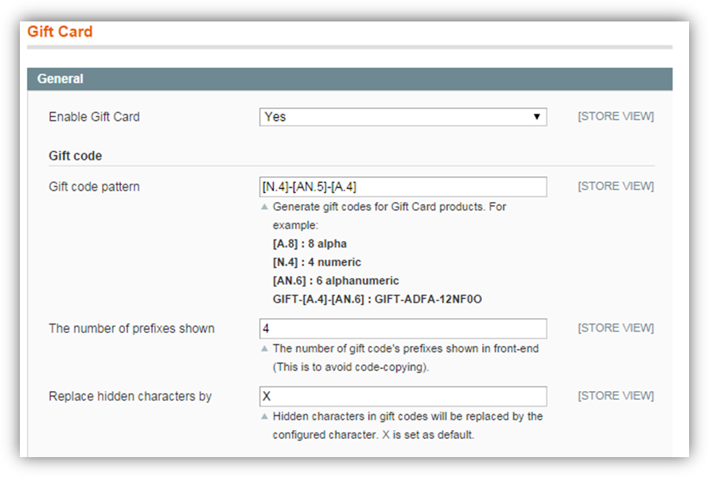

**No.** | **Field** | **Sample** | **Description**
--- | --- | --- | ---
| | Enable Gift Card | Yes | Enable Gift Card module on your site
| **Gift code** |
1 | Gift code pattern | GIFT-[A.4]-[AN.6] | Configure the pattern to auto-generate gift codes for Gift Card products when Customers purchase in frontend.   [A.8] : 8 alpha characters   [N.4] : 4 numeric characters   [AN.6] : 6 alphanumeric characters   If you enter GIFT-[A.4]- [AN.6] as the sample, the system will auto-create a bunch of gift codes matching this pattern, GIFT-ADFA- 12NF0O for example.
2 | The number of prefixes shown | 4 | The number of prefix characters which are shown in a voucher code is 4, for example: 1234-XXXX.
3 | Replace hidden character by | X| All hidden characters in a voucher code are replaced by "X", for example: 1234-XXXX.
**Gift Card usage**|
4 | Gift Cards codes expire after | 365 | Gift Card can be used within 365 days after being activated.
5 | Maximum time(s) allow to enter gift code incorrectly | 5 | Customers can just enter a code incorrectly for 5 times.
6 | Maximum number of users per one gift code | 1 | You can limit that just 1 user can use a gift code.
7 | Enable customer’s Gift Card credit balance | Yes| Allow Customers to redeem/ use Gift Card credit balance.|
8 | Allow customers to redeem Gift Cards with usage conditions | Yes | Allow customers to redeem Gift Cards with usage conditions
9 | Use Gift Card for shipping fee | Yes | Gift code or Gift Card credit can be spent for shipping fee, even when ordering Gift Card product.
10 | Use Gift Cards with coupon codes | Yes | Customers can use Gift Cards codes and credit balance with system coupon codes to get discount.
11 | Show link to check Gift Card on website | Yes | Enable Customer to check status of Gift Cards after entering gift codes.
12 | Show Gift Card expiry date on website | Yes | Allow showing the expiration date of the Gift Card on frontend
**Tax Configuration**|
13 | Apply Gift Card discount | Before Tax | Apply Gift Card discount to Customers’ order value (tax excluded).

  - **Gift Card Product page tab:**
  
 

  
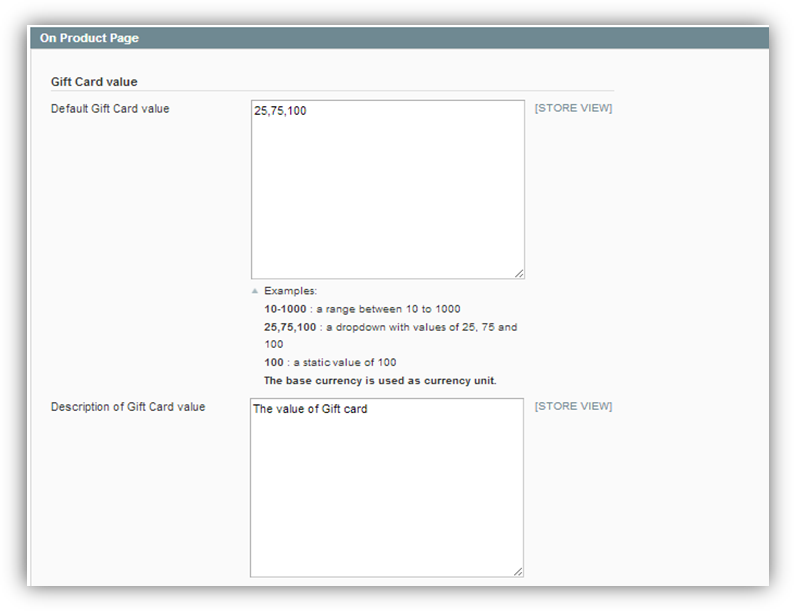

**No.** | **Field** | **Sample** | **Description**
--- | --- | --- | ---
**Gift Card value**|
1 | Default Gift Card value | 25,75,100 | Set default Gift Card dropdown values. Each Gift Card product must have its own value(s) when being created.
2 | Description of Gift Card value | The value of Gift Card | Description of Gift Card value shown on **Gift product details** page to explain for Customers (only applied to Gift Cards in versions below 4.0).
**Gift card template**|
3 | Allow customers to change the image inserted into template | Yes | Enable customers to change the image inserted into Gift Card template by uploading their preferred picture.
4 | Maximum size of images uploaded by customers | Yes | Limit the maximum size of images uploaded by customers to 400KB
**Gift Card shipping information**|
5 | Allow shipping Gift Card | Yes | Gift Cards can be sent through post office.
6 | Minimum days for store owner to send Gift Card through post office | Yes | After Customers order Gift Cards for friends and choose **Send through post office** option, Gift Cards will be sent to recipients within 5 days.
7 | Message max length | 240 | Customers can write a custom message within 240 letters
8 | Enable scheduling Gift card delivery | Yes | Allow Customers to set dates to send Gift Cards

 - **Shopping Cart Page &amp; Checkout page tabs:**
 

**No.** | **Field** | **Sample** | **Description**
--- | --- | --- | ---
1 | Show Gift Card box on shopping cart page | Yes | Enable a Gift Card box for customers to apply gift codes right on the shopping cart page.
2 | Information displayed on shopping cart page | Gift Card value Gift Card template Recipient name | Show selected information of Gift Card on shopping cart page
3 | Show Gift Card image as product image in shopping cart | Yes | Allow showing Gift Card printout preview as product image on shopping cart page
4 |Show Gift Card box in the Payment section | Yes | Show Gift Card box for customers to apply gift codes right on the Payment Method section at checkout

 - **Email Notification** tab: 
 

 
 **No.** | **Field** | **Sample** | **Description**
--- | --- | --- | ---
**General**|
1 | Enable email notification | Yes | Allow sending notification emails to Customers and recipients.
2 | Send Gift Card to friends when Gift Card status is | Active | Gift Card will be sent to friends via email when its status is **Active**
3 | Sender of email notification| General Contact | Set the default sender of notification emails as General Contact
4 |Gift Card notes | &lt;p&gt;{conditions}&lt;/p&gt;. | Notes displayed in Gift Card delivery email.
5 | Send Gift Card copy via email | Yes | Allow sending a copy of Gift Card via email if Customers choose to ship through post office
**Notification email sent to purchaser**|
7 | Send-to- Purchaser email template |  | Choose the email template sent to purchasers after buying Gift Card successfully.
8 |Send-to- purchaser email template when recipient receives Gift Card | | Choose the email template sent to purchasers when recipients receive Gift Cards.
**Notification email sent to recipient**|
9 |Send-to- recipient email template |  | Choose the email template sent to Gift Card’s recipient.
10 |Send notification email to recipient when purchaser refunds Gift Card | Yes | Enable email notification sent to recipient when sender refunds Gift Card.
11 | Send-to- recipient email template when Gift Card is refunded |  | Choose the email template sent to recipient when Gift Card is refunded.
12 |Auto-send reminder email before Gift Card expires | Yes | Enable auto reminder email sent to Customers before Gift card expires
13 | Send-to- recipient email template when Gift Card is refunded | 5 | The number of days to send notification toCustomers before the expiration date of a Gift card

 - **Gift Card Printout** tab:
 

 

**No.** | **Field** | **Sample** | **Description**
--- | --- | --- | ---
1 | Logo for PDF Printouts | Default/logo_print.png | Store’s logo used when Gift Cards are printed or sent via email.
2 |Show barcode on Gift Card | Yes | Show barcode on Gift Cards when they are printed or sent via email.
3| Type of Barcode | QR Code | Show QR code on Gift Cards when they are printed or sent via email.
4 | Gift Card notes | Converting to cash is not allowed. | The notes shown on Gift Cards when theyare printed or sent via email.

  
## Manage Gift Card Templates (Updated)

After installing the module, you can start with Gift Card templates. This function helps you create unlimited templates for Gift Card with different titles, designs, images and notes. You can flexibly customize Gift Cards for different purposes, such as X-mas Gift Card or Birth Day Gift Card, offering Customers a wide range of choices.

To access **Gift Card Template Manager** page, go to Gift Card menu → **Manage Gift Card Templates.**

The **Gift Card Template Manager** page will be displayed as below:

As you can see, this page lists all available templates in the system. You can add/edit/delete a template and export the list of templates to .CSV/.XML files. If you want to change status /delete templates in mass, simply select multiple rows, apply an action then click on Submitbutton.

There are 5 default Gift Card templates with 4 different design styles for you to select:

  - **Left template**: picture aligns with the left of Gift Card
  - **Top template**:picture aligns with the top of Gift Card
  - **Center template**:picture aligns with the center of Gift Card
  - **Simple**: a template for any stores with simple &amp; clean design
  - **Amazon gift card style**: a template which is similar to Amazon gift card
 
 
 
**_Left template_**

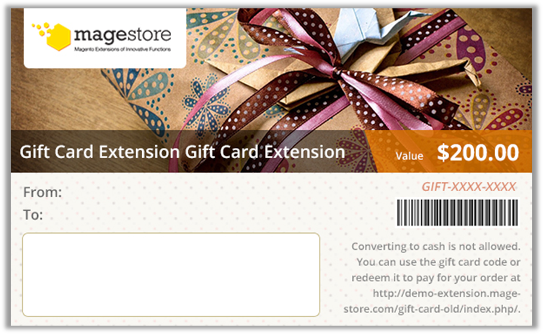

**_Top template_**

**_Center template_**

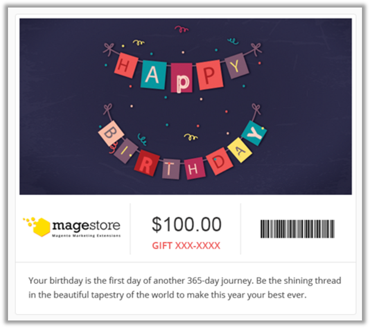

**_Simple template_**

  

**_Amazon Gift Card template_**

  
If you want to create new Gift Card templates, select **Add Gift Card Template** button and finish the form as below:

- **General Information** tab:
    - For Top, Left or Right template:
    

**No.** | **Field** | **Sample** | **Description**
--- | --- | --- | ---
1 | Template name | Gift Card for Xmas | Name of the Gift Card template
2 | Status | Active | Enable this template to be chosen when creating Gift Card product
3| Template design | Left | The image will be aligned with the left of Gift Card.
4 | Title | Xmas Gift Voucher | Set the title of Gift Cards using this template as “Xmas Gift Voucher’ instead of the default title “Gift Card”.
5 | Style color | #FFFFFF | Choose color of texts in fields including title (“Xmas Gift Voucher”), Value and Card number.
6 | Text color | #A9A7A7 | Choose color of other texts (fields’ name, message, notes, etc.).
7| Background image |  | Upload an image to use as a backgroundof Gift Card. Please follow the recommended size for the  best result:   -“Top” Template: 600x175 px  - “Left” Template: 350x365 px  - “Center” Template: not available   **_Note_**: Customers will not be able to change the background image.
8 | Notes | Converting to cash is not allowed. You can use the Gift card code or redeem it to credit balance to pay for your order | Add notes, such as usage conditions, for Gift Card.

 
 

  
- For Simple and Amazon gift card template: It’s easier to create new Gift Card template with simple or Amazon style design
 

**No.** | **Field** | **Sample** | **Description**
--- | --- | --- | ---
1 | Template name | Simple | Name of the Gift Card template
2 | Status | Active | Enable this template to be chosen when creating Gift Card product
3| Template design | Simple (NEW) | The image will be aligned with the left of Gift Card.
4 | Style color | Xmas Gift Voucher | Set the title of Gift Cards using this template as “Xmas Gift Voucher’ instead of the default title “Gift Card”.
5 | Style color | #FFFFFF | Choose color of texts gift code field.
6 | Text color | #A9A7A7 | Choose color of texts in Gift Card message and value.

You can click on **Preview** button at the top right corner to see how Gift Cards using this template will look like. All changes in title, template design, style color and text color will be shown in a popup. If you want to view the background image applied on a Gift Card, click **Save and Continue Edit** button and then preview as above.

- **Images** tab:

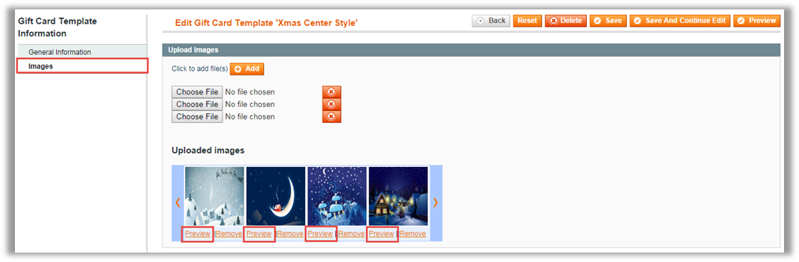

In this tab, you can create a list of images for Customers to select when buying Gift Card in frontend. Just click on **Add** button and choose image files to upload.

**_Note_**:
1. You should use images with the following recommended sizes for better display:
 - Template style is “Top”: 600x190px. 
 - Template style is “Left”: 250x365px. 
 - Template style is “Center”: 600x365px. 
 - Template style is “Simple” or “Amazon gift card” 
 
Click **Preview** under each image to see how Gift Card will look like. When you finish, remember to click on **Save** or **Save and Continue Edit** to save your work.

2. After installing Magestore Gift Card successfully, you will find Amazon Gift Card template in Magento backend. To use other templates including Top, Left, Right and Simple template, you need to configure a little bit.

  
In Settings, you choose No in field “Show only Amazon style template” then you will have all 5 templates displayed in backend.

### Create/Edit a Gift Card Products

There are two ways to create a Gift Card product: on **Manage Gift Card Products** page and on **Manage Products** page.

- Create Gift Card on **Manage Gift Card Products** page:

Go to Gift Card menu→ **Manage Gift Card Products**

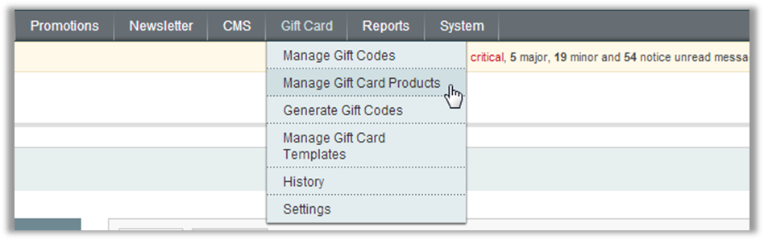

Click on **Add Gift Card Product** button

Click on Continue button then enter information as a normal product. You should pay attention to the following tabs:

- **General** tab:

Different from normal products, there is another required field, **Select Gift Card template**, allowing you to choose templates for Gift Card product. You can add more templates to this field in **Manage Gift Card Templates** (please refer to section 3.1 for more details).

- **Prices** tab:

  
In **Prices** tab, Admin can configure prices and values of a Gift Card Product.
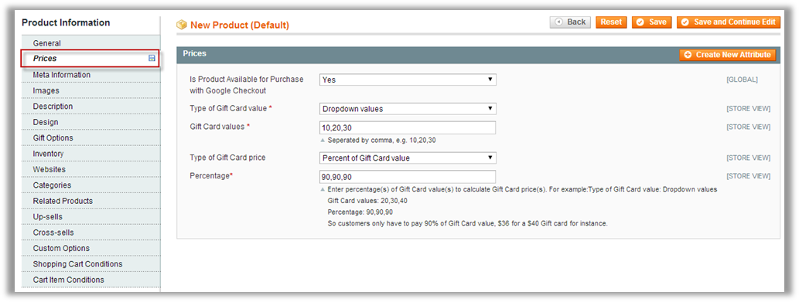

The module provides 3 **types of Gift Card value**, including **fixed value, range of values and dropdown values**. You can base on the type chosen to set Gift Card value(s) accordingly such as 50-100 (USD) for the **range of values** type.

The next step you need to do is selecting the type of Gift Card price, which could be 1 in 3 following options:

   - **Default**: Gift Card price is the same as Gift Card value by default.
   - **Fixed number**: Gift Card price is a fixed number as you configure in the next field.
   - **Percent of Gift Card value**: Gift Card price is a percentage of Gift Card value as you configure in the next field.
     
If you choose the type of Gift Card price as **Fixed number** or **Percent of Gift Card value**, remember to fill in the next field **Price/ Percentage** to set the price for your Gift Card product.

The following example will help you have better understanding about these configurations.

   - **Type of Gift Card value**: Dropdown values
    - **Gift Card values**: 20,30,40
    - **Type of Gift Card price**: Percent of Gift Card value
    - **Percentage**: 90,90,90
     
So Customers only have to pay 90% of Gift Card value, which means $36 for a $40 Gift Card for instance.

- **Conditions** tabs:

The difference between a Gift Card product and a normal product is that a Gift Card product contains 2 more condition tabs, which are **Shopping Cart Conditions** and **Cart Item Conditions**.

  - The **Shopping Cart Conditions** tab enables you to set up the conditions applied to shopping cart when Customers use Gift Card, for example: Customers can only use their Gift Card for orders which have Subtotal equals or is greater than $200.
 

  - The **Cart Item Conditions** tab allows you to set up Gift Card usage conditions applied to each item in Customers’ shopping cart. For example, Customers can use their Gift Cards to pay for orders only if the Qty. in cart is equal or greater than 2.
  

**_Note_**: Normally some common product attributes are enabled to use with promotion rules by default. If you don’t see the attribute you want when setting **Gift Card’s Conditions**, such as SKU, you can go to Catalog→ Attributes→ Manage Attributes. Search and choose Attribute Code, such as &quot;SKU&quot;. Then change &quot;Use for Promo Rule Conditions&quot; to &quot;Yes&quot;

Remember to click on **Save** or **Save and Continue Edit** button to save your work. After saving, the Gift Card product which you have just created will be shown on **Manage Gift Products** page as below:

- Create Gift Card on **Manage Products** page:
  - Go to Catalog menu → **Manage Products**   
  - Click on **Add Product** button
  - Select **Product Type: Gift Card**
  

  - Click on **Continue** button and enter information as in **Manage Gift Card Product** page.

  - After saving, Gift Card product which you have just created is shown on both **Manage Products** page and **Manage Gift Products** page as below:

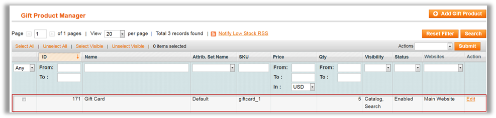

In order to edit any Gift product, you need to click on corresponding row or link **Edit**. Remember to click on **Save** or **Save and Continue Edit** button after editing to save your work.

### Generate Gift Codes

This function helps you to generate a wide range of synchronous Gift Card codes, then you can print and give them to your Customers.
Go to **Gift Card** menu→ **Generate Gift Codes,** you will be navigated to **Gift Code Pattern Manager** page.

To add a new template to generate gift codes, click on **Add Gift Code Pattern** button and configure information as below:

 - **General Information** tab:
 

**No.** | **Field** | **Sample** | **Description**
--- | --- | --- | ---
1 | Template name | SiGift Card for Woman’s Day | Name of the template to generate gift codes
2 | Gift code pattern | Woman-[A.4]- [AN.6] | Configure the pattern to generate gift codes in mass as the following example:  [A.8] : 8 alpha characters  [N.4] : 4 numeric characters  [AN.6] : 6 alphanumeric characters  If you enter GIFT-[A.4]- [AN.6] as the sample, the system will auto-create a bunch of gift codes matching this pattern, GIFT-ADFA- 12NF0O for example.
3| Gift code value | 50 | The fixed value for each gift code generated is $10.
4 | Currency | US Dollar | The currency unit for gift code value is US Dollar.
5 | Expired on | 03/10/15 | The expiration date for gift codes is March 10 th, 2015.
6 | Template image |  | Select template image for gift code
7 | Gift code Qty. | 10 | The number of gift codes generated based on the pattern above is 10.
8 | Store View | All Store Views | Customers can use the gift code in all store views.

 - **Conditions** tab:

In this tab, you can set special conditions applied to shopping carts when Customers use gift codes generated to check out.

After setting up, click on **Save Pattern, Save and Continue Edit** or **Save And Generate** button, the template created will be shown in the **Gift Code Pattern Manager** grid as below:

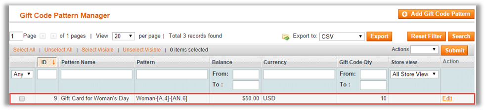

When you click on **Save And Generate** button, gift codes will be auto-generated. After that, Gift Codes Information page will show a new tab as below:

 - **Gift Codes Information** tab:
  

Besides viewing details and status of gift codes generated, you can export the list of Gift Card codes to .CSV or .XML file by clicking on the drop-down list **Export to**, choose one of the options provided and then click on **Export** button.

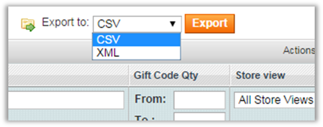

### Manage Gift Codes

Our module enables you to manage gift codes with ease. Go to **Gift Card** menu → **Manage Gift Codes,** you will be navigated to **Gift Code Manager** page.

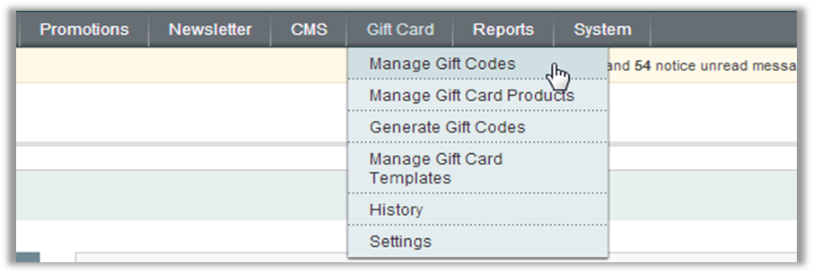

This page gives you a detailed list of all gift codes in your system, including gift codes created from Gift Card orders in front-end and gift codes created/ generated in back-end. Each gift code is provided with essential information, such as the Initial Value, the Current Balance and gift code’s status, etc. To help save much time in managing, our module allows you to select multiple gift codes and apply the following action(s) in mass.

  - Export the list of gift codes to CSV/XML files 
  - Change status/send email/delete/print gift codes. Please note that gift codes without recipient email address cannot be sent.

Besides, you can add new gift codes manually, import gift codes in bulk from CSV files and edit each gift code by clicking on Edit link at the end of each corresponding row.

- If you want to create a new gift code manually, select Add Gift Code and finish the form as below:

  
  - **General Information** tab:

**No.** | **Field** | **Sample** | **Description**
--- | --- | --- | ---
1 | Gift Code Pattern | GIFT-[A.4]- [AN.6] | Configure the pattern to generate a gift code as the following example:  [A.8] : 8 alpha characters  [N.4] : 4 numeric characters  [AN.6] : 6 alphanumeric characters  If you enter GIFT-[A.4]- [AN.6] as the sample, the system will auto-create a gift code matching this pattern, GIFT-ADFA- 12NF0O for example.
2 | Gift Code Value | 10 | The fixed value for the gift code is $10.
3| Currency | US Dollar | The currency unit for gift code value is US Dollar
4 | Template | Default Template 1 | Gift Card’s default template 1 is used for the gift code generated, in case it is sent to Customers by email or post office.  You can add/ edit templates on **Gift Card Template Manager** page (please refer to section **3.1.** for more details).
5 | Template image | | Show the image used with the Gift Card template chosen above. You can edit this image on **Gift Card Template Manager** page (please refer to section **3.1.** for more details).
6 | Status | Active | When the gift code’s status is ‘active’, Customers can use it in frontend.
7 | Expired on | 03/8/16 | The expiration date for the gift code is March 8 th, 2016.
8 | Store View | All Store Views | Customers can use the gift code in all store views.
9 | | Add Admin’s notes if needed

  - **Conditions** tabs:
  
Similar to **Shopping Cart Conditions** tab and **Cart Item Condition**s tab when creating new Gift Cards, these two tabs on New Gift Code page allow you to set conditions applied to shopping carts and items in cart when Customers use this gift code to check out.
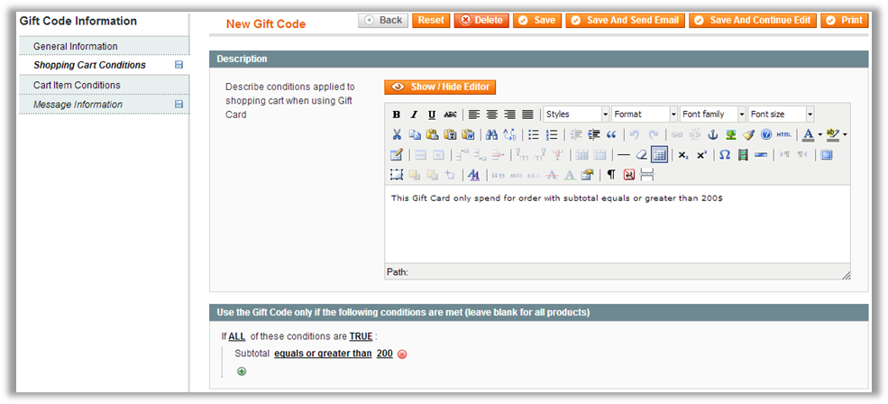

  - **Message Information** tab:
  
If you intend to send the gift code to a specific person, a Customer for example, this tab allows you to add information about the Customer, the recipient and a custom message.

After entering all data, remember to click on **Save, Save And Send Email** or **Save and Continue Edit** to save your work.

- Moreover, you can add new gift codes by importing voucher codes from a CSV file. You need to click on **Import Gift Code** button on the top right corner of the **Gift Code Manager** page.

The Import Gift Code page will be shown as below for you to browse a CSV file. And then, click on **Import** or **Import and Print** button.

### Manage Gift Code Sets

  
Gift code set is the new feature of Magestore Gift Card version 4.6.0. Gift code set is a list of code that store owners import into the system to sell. When you create gift card product, you can choose gift code set for that gift card product:

To create and manage gift code sets, you go to **Gift Card** -&gt; **Manage Gift Code Sets**.

- To create gift code sets: You choose Add Gift Code Set then enter gift code set name. You need to upload all gift codes in the set as a CSV file. You can download the sample CSV file right in the dashboard.

- To edit gift code set: Click on the Gift Code Set you would like to edit. You can upload a new CSV file of gift code or edit each gift code’s information in the set.

 

### Manage Gift Card Credit Balance

  
To manage gift card credit balance, please follow the steps below:

- Go to **Customers** menu → **Customers Manager.**
- Click on any row
- Choose **Gift Card Credit** tab

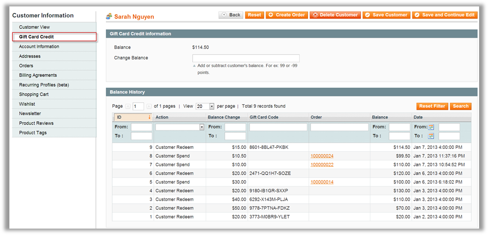

On this page, you can view current Gift Card credit balance and Balance History of a Customer.

In order to change Customers’ Gift Card balance, you need to enter the amount of money into **&quot;Change Balance&quot**; text field and click on **Save Customer** or **Save and Continue Edit** button.

The balance will be updated and the change will be added to **Balance History** grid as below:

### Create New Order

On **Create New Order** page, after selecting a Customer and adding a product to an order, the system will show the Gift Card box, which allowing you to use Gift Card credit balance or Gift Card code(s) of the Customer to pay for this order. Select the method(s) as you want and then remember to click on **Apply Gift Card** button.

After applying, the discount from Credit Balance/Gift Card Code will be subtracted from the Subtotal as below:

### Refund Orders

When Customers request for refunding their Product orders which Gift Card credit/ gift code was used as a payment method, the system will show a box to enter the amount of money which will be refunded into Customers’ credit balance or Gift Card code.

If Customers have their own account on your site, this amount will be refunded into their Gift Card credit balance by default even if they use either their credit balance or Gift Card code to check out.

If Customers don’t have accounts on your site, this amount will be refunded into their Gift Card codes.

**_Note_**: Once Gift Card is used (redeemed or used to buy other products), it cannot be refunded to cash.

### History

  
All actions related to Gift Card such as: **Create, Update, Mass Update, Spend on order, Refund** and **Redeem** are recorded on **Gift Card History** page. Go to **Gift Card** menu → **History** to access this page.

On Gift Card History page, you will know when Gift Cards were created/ updated/ redeemed/ spent/ refunded and by whom as well as their values and status.

You can filter data with the above criteria to get more accurate reports. Information can be exported to .CSV or .XML files for your convenience.

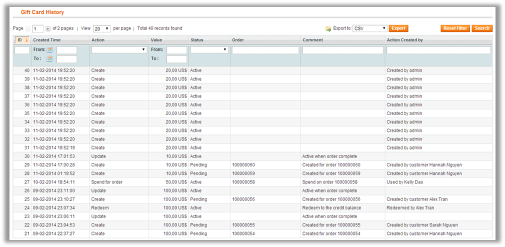

--------------
## Release Notes

### Version 4.7 (Released on Apr 16, 2017)
### Version 4.6 (Released on Nov 2, 2016)
<a href="#codeset">Allow importing gift code set </a>

<a href="#Amz">A new gift card template (similar to Amazon Gift Card)</a>

A new type of print: Fold Paper 

Remove attached PDF 

<a href="#new">Update new free templates</a>
### Version 4.5 (Released on Jan 18, 2016)
### Version 4.4 (Released on Oct 26, 2015)
Perfectly compatible with latest security patch SUPEE-6788 

<a href="#Amz">A brand-new template is added with clean design (looks like Amazon Gift Card)</a>

Allow admin to set permission for Gift Card tab management in backend
### Version 4.3 (Released on Mar 10, 2015)
<a href="#dedate">Show expiration date on Gift Cards</a>

<a href="#his">Allow admin to check whether Gift Cards are sent or not in back-end</a>

<a href="#p6">Allow customers to send Gift Cards to themselves via post office</a>

<a href="#p6">Allow customers to choose time zone to send Gift Cards via email</a>

<a href="#p11">Enable customers to drag & drop to upload images used for Gift Cards</a>

<a href="#only">Hide template selector from customers if there is only 1 option available</a>

<a href="#dedate">Allow customers to use gift codes, Gift Card credit with coupon codes or not</a>

Be compatible with other One Step Checkout modules 

Remove HTML and JS tags in input boxes
### Version 4.2 EE (Released on Oct 28, 2014)
Support Magento Enterprise v1.9 - 1.14
### Version 4.2 CE (Released on Sep 26, 2014)
Optimize design of Gift Card templates 

Support Magento Community v1.4 - 1.9
### Version 4.1 (Released on Aug 25, 2014)
Responsive and Compatible with Magento Community 1.9 

Compatible with Magestore One Step Checkout 3.2 

<a href="#p1">Admin can enable/disable Gift Card on Checkout page</a>
### Version 4.0 (updated on Feb 18th, 2014)
<a href="#p10">Separate Gift Card price and Gift Card value, allowing Admin to configure prices of Gift Card products based on their actual value</a>

<a href="#p11">Add Gift Card Template function: Admin can add and manage templates and images of Gift Card products. Customers can upload their own image in frontend</a>

<a href="#p6">Allow Customers to preview Gift Card created before adding to cart</a>

<a href="#p2">Allow setting shopping cart conditions and cart item conditions when using Gift Cards</a>

<a href="#p12">Add notification emails when sending Gift Card to friends</a>

<a href="#p13">pAllow managing Gift Card transaction history</a>

<a href="#codeset">pAllow generating Gift Card increment codes</a> 

Allow adding Gift Card product with recipient information when creating order in backend

<a href="#dedate">Allow using Gift Card discount after or before tax</a> 

Be compatible with Reward Points and Web POS extensions.
### Version 3.3 (updated on Sep 20th, 2013)
Support Soap API version 2
### Version 3.2 (updated on June 27th 2013)
<a href="#p7">Auto-add gift card to customer list when using gift card at checkout</a>

Allow recipients to add gift card to their list by clicking on the link in the email 

<a href="#dedate">Allow customers to check gift card information without logging in to the website</a>
### Version 3.1 (updated on June 19th 2013)
Support Magento Enterprise Edition
### Version 3.0 (updated on Jan 17th 2013)
<a href="#dedate">Allow Customers to schedule Gift card Delivery date</a>

<a href="#creba">Enable Customers to have Gift card credit balance</a>

<a href="#p1">Add Gift card box in shopping cart page</a>

<a href="#p8">Modify payment form when checkout using Gift code</a>

<a href="#p9">Able to generate a list of Gift codes in admin</a>

<a href="#p3">Able to use Gift code to create order in admin</a> 

Add API's functions for Gift card
### Version 2.3 (updated on Sept 20rd 2012)
### Version 2.2 (updated on Jul 3rd 2012)
Allow automatically generating invoice after placed order by using gift card code.
### Version 2.1 (updated on Dec 25th 2011)
<a href="#p5">Compatible with OnestepCheckout extension</a>
### Version 2.0 (updated on Dec 8th 2011)
<a href="#p2">Add Weight attribute to Gift Cart product</a>

<a href="#p3">Add Importing feature: Admin can import gift card codes from a CSV file</a>

<a href="#p4">Add Printing feature: Admin can print the gift card codes, then send them to customers</a>
### Version 1.2 (updated on Nov 9th 2011)
### Version 1.1 (updated on Sep 21th 2011)
<a href="#p1">Add more configuration fields to change position of Gift Card Box on the checkout page</a>
### Version 1.0 (released on Aug 30th 2011)
Release extension.

-------------
**_Confidential Information Notice _**

Copyright 2017. 

All Rights Reserved.Any unauthorized reproduction of this document is prohibited.

This document and the information it contains constitute a trade secret of Magestore and may not be reproduced or disclosed to non-authorized users without the prior written permission from Magestore. Permitted reproductions, in whole or in part, shall bear this notice.
