# INVENTORY MANAGEMENT - MAGENTO 1

**Version 2.1.1**

Confidential Information Notice. Copyright 2017. All Rights Reserved. Any unauthorized reproduction of this document is prohibited. This document and the information it contains constitute a trade secret of Magestore and may not be reproduced or disclosed to non-authorized users without the prior written permission from Magestore. Permitted reproductions, in whole or in part, shall bear this notice.

-------------

## Introduction

Having trouble with managing hundreds of items that you sold every minute, from day to day? And how to keep track of each item's quantity change? Magestore's Instock Management module is here to help. With this inventory management module, you are able to:

* Save time in stock control by in-line mass adjustment;
* Reduce cost by low stock notifications and supply need forecast in time;
* Avoid stock loss with convenient 5-step stock taking process.

-----------

## Terminologies and principles

|Terminology| Description| 
|-----------|-------------|
|Quantity in warehouse(s)| The real quantity of a product in the physical warehouse. It equals the sum of Available Qty and Qty to Ship|
|Available Quantity|The quantity of each product which shows up in Virtual Catalog (front store). It’s also the quantity remaining that are available to be sold| 
|Quantity to ship| The number of items has been ordered but not been shipped yet. This number will be returned to Avail Qty & Qty in Warehouse(s) if the shipment is cancelled| 
|Shelf Location| Insert the detailed area in the shelf where the product is located. This is how you can support your staff in finding the product efficiently in the physical warehouse|
|Warehouse| A “warehouse” in Inventory Management represents for a physical place where you keep your stock. Stocks can be moved between warehouses, purchased for a Warehouse and shipped from a Warehouse. Employees (with different admin accounts) can be restricted to handling only warehouse(s) with which they work| 
|Primary Warehouse| Primary Warehouse is automatically created after the module is installed which contains all products in your catalog. This warehouse cannot be deleted to make sure that there is always at least one warehouse consisting of your inventory|
|Warehouse Pemission| Assign and manage a staff account permission level in controlling a specific warehouse. Base on Roles Assigned, an user who has full authorities will have permission to create new role & set up new user with specific permissions|
|Stock Adjustment| Adjust Stock action is used to correct/ update inventory levels of your products and records them in Stock Adjustment History. This will change the product's Qty. in the Stock in Warehouse grid. After that, the system will update Available Qty. accordingly (or the quantity in default Catalog Products) after subtracting Qty allocated in sales orders from the new Qty in Warehouse
|Stock Adjustment History | Stock Adjustment History records all inventory corrections/ updates when there are some differences between stock levels of physical and virtual warehouses|
|Stocktaking| Stocktaking is performed to double-check and prevent any mismatch between the recorded product quantities and the actual inventory in your physical warehouses. The process includes 5 stages containing stock counting and admin’s approval before actually updating the Qty in the system| 
|Stocktaking History| Stocktaking History records all stocktaking acts and their process status|
|Stock Movement History|Stock Movements are records of inward &outward stock transfers of your primary warehouse| 
|Supply Needs|Supply Need is the system’s prediction about how many inventory items you need for each product within a future period. The system will calculate this number based on your sales history in the corresponding period in the past|
|Available Date| Based on the sales history in the chosen sales period, the system will estimate the day which a product is sold out and need to be restocked| 
|Low-stock Threshold Type|To get notification about the out-of-stock product, you will have to define how the system process. There are 2 methods: by Available Days or by Available Quantity| 
|Threshold (days)| If you insert 3 in this field, the low stock notification will appear 3 days before the product is out of stock. The  sold out day is estimated based on sales history of the chosen sales period|
|Sales Period (days)|If you insert 30 in this field, the threshold days will be estimated based on sales history in 30 days up to now|
|Threshold (quantity)|If you insert 5 in this field, the low stock notification will appear when there are only 5 items of the product in stock|
|Low Stock Notifications| Low Stock Notification shows all notifications following Low Stock Rules set up in the system. You can track the detail of a notification such as Warning Message, Low Stock Threshold Type, Notification Recipients here|

----------
## How To Configure 

Go to **Settings** and you are able to configure the Instock Management module as below:

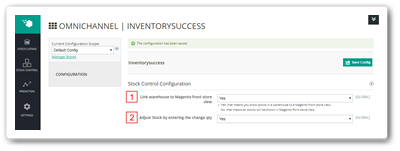

1. **Link stocks in Warehouse to Front Store View**: The Instock Management module allows synchronization between the warehouse and its Magento front store. This means when you edit information or product quantity of a warehouse, this information will automatically be updated in that warehouse’s front store and visible to customers.
After enabling this setting, you can link the warehouse to one or multiple store view in **Warehouses > General Information > Magento Store View**

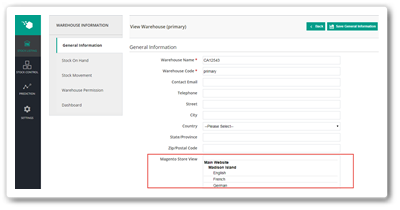

2. **Adjust Stock by entering the change qty**: 
- If this feature is enabled, when adjusting stock, you can enter the difference quantity and the system will calculate the final balance in warehouse.
- If this feature is disabled, you need to enter the exact quantity of stock in warehouse and the system will recognize this figure as the latest available quantity of product. 

----------
## How To Use

### Stock Listing

After installation, the system will automatically provide a Primary Warehouse. This Primary Warehouse cannot be deleted but can only be edited. All the existing products will be automatically synced from your website to this warehouse. 

This function consists of 3 tabs to help you manage your inventory successfully:

 - **Stock in Warehouse**: provides an overview of stocks in your primary warehouse
 - **Non-warehouse Products**: lists out a newly-created product which has not been assigned to the primary warehouse
 - **Warehouses**: allows you to view and edit details of your warehouses
 
 #### Stock in Warehouse

This tab provides an overview of stocks in all warehouses. Here you can view stock SKU, Name, Price, Qty in Warehouse(s), Qty to Ship, Available Qty, Products in Warehouse(s), Stock Movement and Product Status. 

The module provides an in-depth control over your **composite products** (configurable, bundle and grouped products).  You can see 3 quantity types of each variation or component of the composite product in the warehouse. 

For example, if you have a configurable product whose root SKU is Pwt007, you can see the quantities of each available size. If you sell products which often have different sizes and colors like clothing, this is an efficient way to control your inventory. 

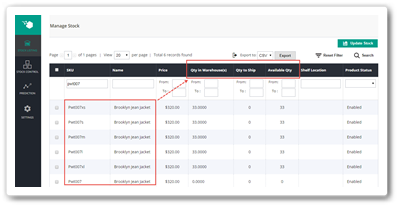

Note that there are 3 types of quantity shown:

 - **Qty in Warehouse(s)**: total amount of products in physical warehouses;
 - **Qty to ship**: the number of products which has been ordered and is ready to be shipped;
 - **Available Qty**: the amount of products left in the virtual catalog which is available to sell.
 
Note that **Qty in Warehouse(s) = Qty to Ship + Available Qty**

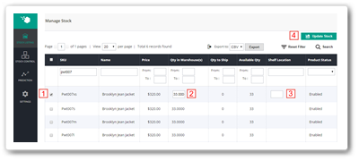

Update the total quantity and Shelf Location easily on the Inventory grid in only 3 steps:

1. Select the product(s);
2. Input the new Qty in Warehouse;
3. Input location of the shelf on which the product is placed (optional);
4. Click **Update Stock**.

**Shelf Allocation** is a useful information to find the product in the physical stock quickly, especially in fulfilling customer’s order.

#### Non-warehouse Products

When a product is newly-created and has not been assigned to warehouse yet, it will automatically be allocated in this Non-warehouse list. From here, you can select a product and add it into your warehouse. This prevents you from accidentally including disqualified products into your warehouse and wasting time searching for it later.

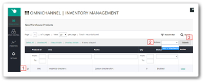

1. Select the product(s);
2. In **Actions** menu, choose "Add to Warehouse" from the drop-down list;
3. Click **Submit**

#### Warehouses

The **Warehouses** menu allows you to control your warehouse with 5 tabs:

- **General Information**: records basic details of the warehouse such as Name, Code, Contact Email, Address, etc. If you enable the **Link warehouse to Magento front store view** setting above, this is where you can select the warehouse’s linked front store.
 
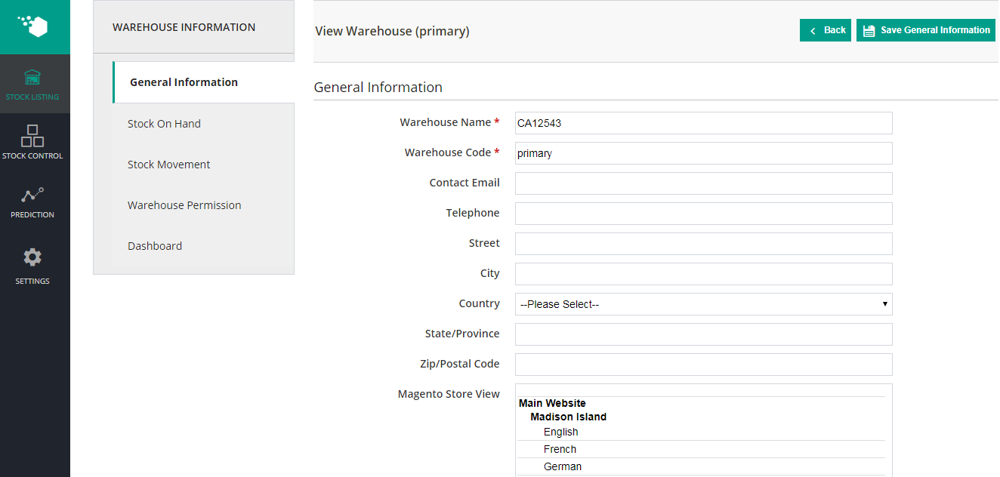

 - **Stock On Hand**: lists out all existing products in the warehouse. Selecting product(s) will let you promptly revise its total Qty in the specific Warehouse and its Shelf Location. 

On this section, if you click on any warehouses, there will have **Export** button along with CSV/Excel XML file.

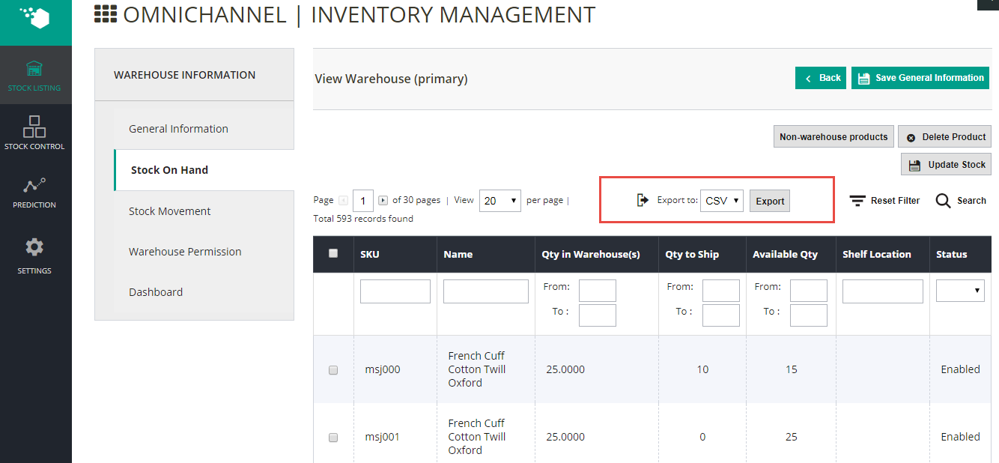

 - **Stock Movement**: provides stock changing record of the warehouse. Information includes added/ subtracted quantity, product SKU, movement type, movement date and reference number to access further details by a click.
 
 - **Warehouse Permission**: lets you assign and manage staff account permission. Here you can set staff permission by clicking at the **Assign Staffs** button at the right of the page. 
 
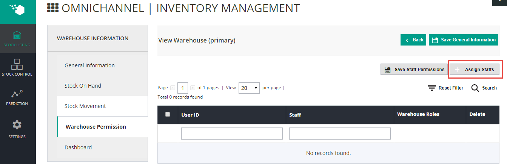

An **Assign Staff** window will appear as in the screenshot below. All you need to do is:
1. Select staff 
2. Choose his/her role from the drop-down list (you can create more roles in Magento core backend). You can assign role to multiple staff at once.
3. Click **Add Selected Staff** button and you are done!

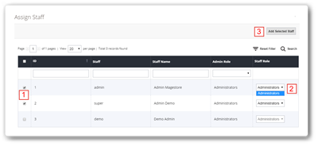

You can also select to edit/delete staff permission directly on the **Warehouse Permission** menu.
Finally, do not forget to save your recent changes.

**ADDITIONAL GUIDE**: Manage User/ Staff Roles and Permissions
If you want to create and/or edit user roles and permissions in different sections in the Instock Management module, go to Magento core backend, **System > Permission**

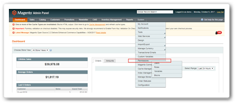

The **User** tab lists out all users with details like ID, Username, First name, Last name, Email and Status of the account. Create a new user by clicking a button at the top right of the page.

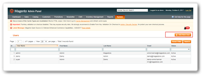

Admin can view, edit and remove staff permission by clicking on each user. Admin can also assign a warehouse to a user here.

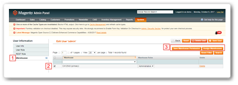

Also in Magento core backend, in **System > Permission > Roles**, View a  list  of  role  and  create  a  new  role  for  users. 

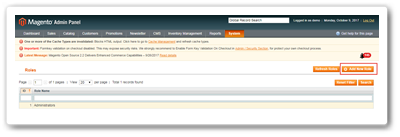

In **Role Info** tab, you need to input the role name, verify the admin’s password. Then in **Roles Resources* tab, select the checkbox of the role’s permissions in the drop-down list, or select **All** in the **Resource Access** option to grant full permission to the role. When done, hit **Save Role** to finish.

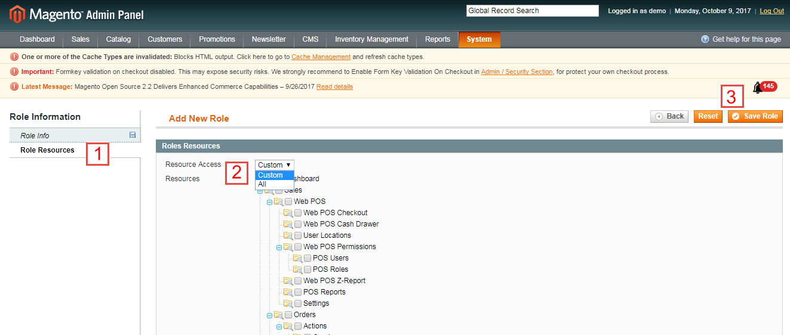

 - **Dashboard**: demonstrates summarized **sales data** of the warehouse in the last 30 days. You can view data of the warehouse’s sales, best sellers and stock on hand. 

Manage sales status at a glance with visual charts. You can also print these charts or download with 4 different options of either PNG, JPEG, PDF or SVG vector by opening a menu next to each chart.

---------------

### Stock Control

This module is a powerful assistance to help you keep track of any changes in the existing stock. It combines 5 functions in 1:

1. **New Stock Adjustment**: manually adjusts stock quantity;
2. **New Stocktaking**: assists in a complete stocktaking process;
3. **Stock Adjustment History**: records details of all stock adjustments;
4. **Stocktaking History**: records details of all stocktaking;
5. **Stock Movement History**: records all movements of stock in the warehouses

####  New Stock Adjustment and Stock Adjustment History

##### New Stock Adjustment

Sometimes your recorded product quantity does not match the actual physical number. Then, this function is exactly what you need to make changes quickly. 

To make a new stock adjustment, you need to:
1. Follow path: **Stock Control > New Stock Adjustment**
2. Fill in the reason for the adjustment 
3. Click **Start to Adjust** at the top right of the page.

The next window allows you to select whatever product you want to adjust its quantity and type in the new figure. Alternatively, you can import product quantities via a CSV file with a provided sample. This means you can adjust quantities of several products at once.

1. You can import product quantities via a CSV file with a provided sample. 
2. Alternatively, you can select products and input the quantity in line. Note: as mentioned in *How to Configure* section above, if you enable **Adjust Stock by entering the change qty** setting, you can enter the difference quantity and the system will calculate the final balance in warehouse. Otherwise, you need to enter the exact quantity of stock in warehouse and the system will recognize this figure as the latest available quantity of product.
3. Then you have 3 options to enable your changes:
 - **Save**: temporarily save the adjustment in Pending status. You will automatically transferred to the Stock Adjustment History page. 
 - **Save and continue to edit**: temporarily save the adjustment in Pending status. You continue to stay on a page with your products to continue any further edits. 
 - **Adjust**: immediately activate the quantity changes. Once you hit this button, there is no way to undo it unless you carry out another stock adjustment. The adjustment is marked Completed on the History page.
 
##### Stock Adjustment History 

The **Stock Adjustment History** page shows details of each adjustment including date of the adjustment, staff who made the adjustment, warehouse name and status (whether Pending or Completed).

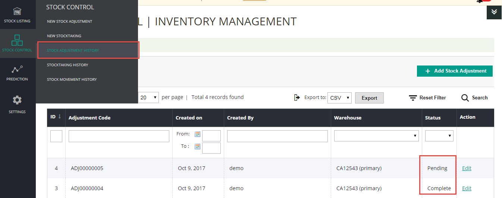

Clicking on each adjustment will transfer you to a page where you can see more information of an adjustment including adjusted product ID, Name, SKU, old Qty and Adjusted Qty. For an adjustment with Pending status, this is the page where you have left the unfinished adjustment. Complete it by clicking **Adjust** at the top right of the page. 

#### New Stocktaking and Stocktaking History

##### New Stocktaking

This Instock Management module will help you carry out a stocktaking successfully to prevent any mismatch between the recorded product quantities and the actual inventory in your physical warehouses. 

This process consists of 5 easy-to-follow stages:

 - Stage 1: **General Information**

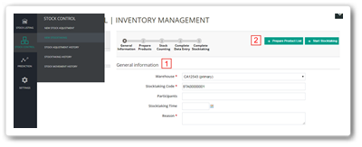

1. Select the warehouse, the reason for stocktaking. You can also fill in the participants and the time of the action but it is optional.
2. Choose the products to be stock taken by clicking the **Prepare Product List** button (Stage 2) at the top right of the page. Alternatively, you can skip it to go straight to Stage 3 by clicking the **Start Stocktaking** button.

 - Stage 2: **Prepare Products**

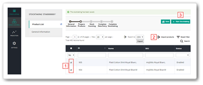

1. You can select the products you want to stock take from the product grid;
2. Alternatively, you can import products using a CSV file (template provided);
3. Click **Save** to stay with your selected products for further edits, or click “**Start Stocktaking**” to proceed Stage 3.

- Stage 3: **Stock Counting**

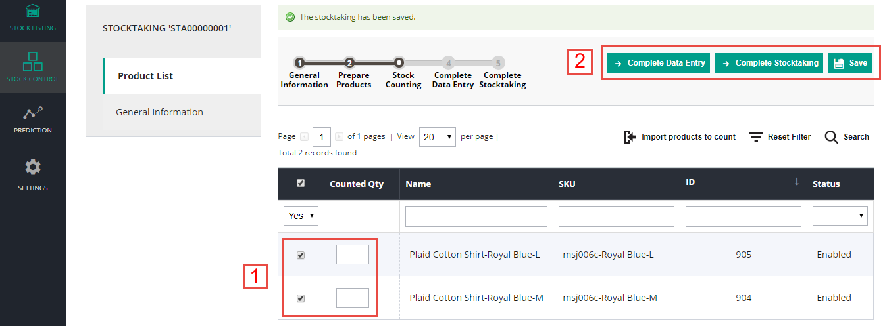

1. Select and type in the product quantity that you have recently counted.

2. Either click **Complete Data Entry** to proceed to Stage 4 and have a review of the changes; click **Complete Stocktaking** to finish the process; or **Save** to continue editing.

- Stage 4: **Complete Data Entry**

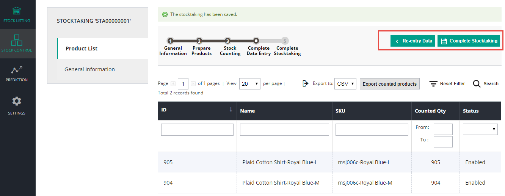

This Stage allows you to have a final review of your recent quantity counts. Click either “**Re-entry Data**” or “**Complete Stocktaking**” to move to Stage 5. If you are not an admin, your counting results will be submitted to the admin/ manager for approval before the new quantity is officially updated and the process is marked Completed.

- Stage 5: **Complete Stocktaking**

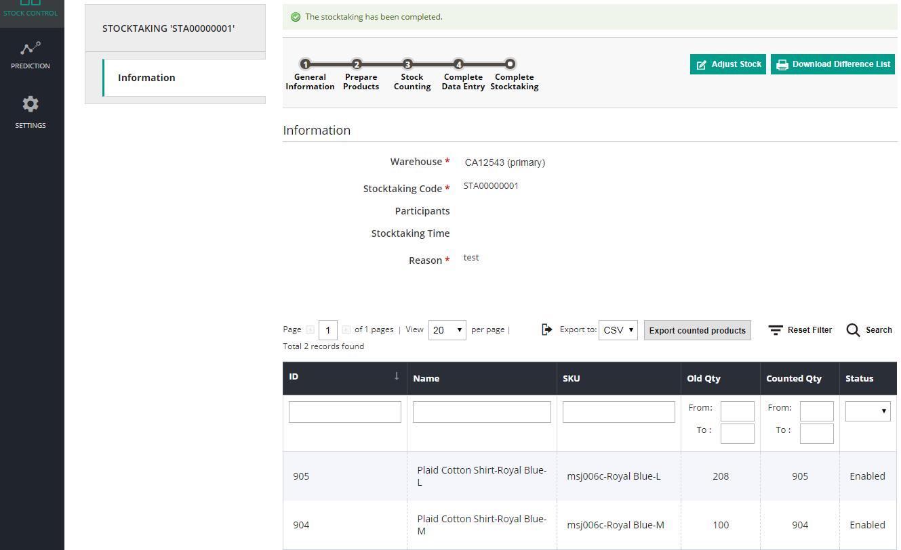

This page shows you all details of the stocktaking process including the product quantity before and after the stocktaking process. Make a **New Stock Adjustment** by hitting the **Adjust Stock** button or download a CSV copy of the grid using the **Download Difference List**.

##### Stocktaking History
All Stocktaking details are listed here. Different status shows to which stage the stocktaking process is done:

- Status **Pending** means Stage 1: **General Information** is done
- Status **Processing** means Stage 2: **Prepare Products** is done
- Status **Verified** means Stage 3: **Stock Counting** is done
- Status **Completed** means the whole stocktaking process is done

Click on each stocktaking record to view all details of the process.

#### Stock Movement History

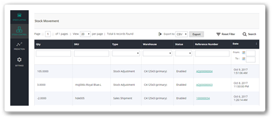

This menu records all changes of stock quantity in warehouse. The table shows the number of products added/subtracted from the warehouse, product SKU, product movement type, warehouse name, reference number, movement date. Filtering a SKU will help you track the product’s movements and changed quantity in each warehouse in no time.

### Prediction
#### Supply Needs 

There’s no need an assistant to analyze and show you whether you should order additional items for a specific product in the next Order Purchasing or not. Our inventory management module allows you to get the prediction of supply needs until the certain time stamp.

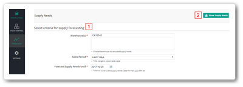

1. To process a prediction, select the time range to collect sales data and then pick the date that you want to see forecast results. 
2. Click to **Show Supply Needs** button to finally view the prediction.

The forecast data will be shown in the table as below:

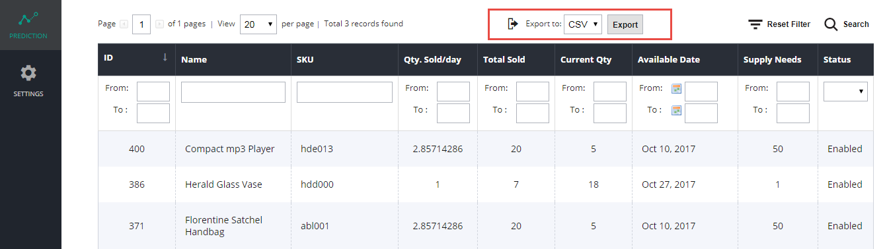

- Here, you can view the average quantity sold per day of the product during the chosen sales period. The prediction will show you **Available Date** which performs the forecast day of product’s running out of stock. The **Supply Needs** column demonstrates the quantity of product that expected to be sold until the time stamp you set. 

- For instance, the product msj000 has been sold 6 items in total during the last 30 days. It is estimated that the remaining quantity will be enough to be sold until 9/7/2017. It also suggests you to add further 11 items if you want to meet the customers’ demand until 31/8/2017.

- To export the supply needs file, you can choose to export into CSV or XML file and click to Export. To start another prediction, you may edit criteria for supply forecasting and hit Show Supply Needs again to refresh the prediction result.

#### Low Stock Rules & Low Stock Notification

**Low Stock Notifications** are as its name, system emails or notifications to inform admin, warehouse managers when some products are going to be out of stock. 
To have Low Stock Notification, you need to set up rules in the **Prediction > Low Stock Rules** section.

##### Low Stock Rules

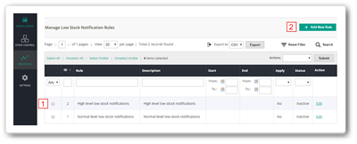

Select an existing rule to edit or click **Add New Rule** button at top right of the page. Admin can create unlimited rules to notify low stock status. One rule contains: Rule Information, Conditions & Action. There is no limitation in the quantity of rules set. 

- **Rule Information**: includes general data such as Rule Name, Status, and Update Time. You can set up the period of time in which the Low Stock Notification is activated.

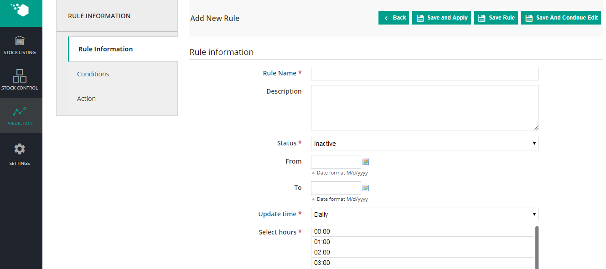

- **Condition**: allows you to set up Product Conditions & Low Stock Condition. 

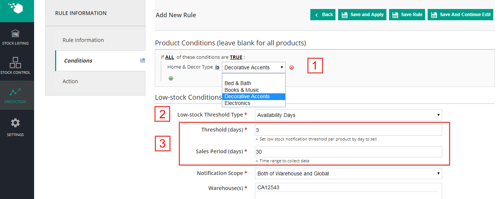

1. In the Product Conditions section, you can set the limitation for applying rules. For example, the Low Stock Rule is applied for category Decorative Accents or a specific product.
2. As for Low Stock Condition, there are 2 rule types for you to select: Available Days and Available Quantity. With **Available Days** option, the system will estimate how many days the product is available for purchasing based on its sales history.
3. For instant, if you set sales period equals to 30 and the threshold day is 3, the notification will appear 3 days before the product is out of stock which are predicted following the sales history in 30 days up to now.

1. With **Available Quantity** option, it only request for threshold quantity that you would like to receive low stock notification. 
2. If you set the threshold is 5, the system will notify you when the quantity of product(s) reach that number.

- **Action**: confirms who will receive the low stock notification by:

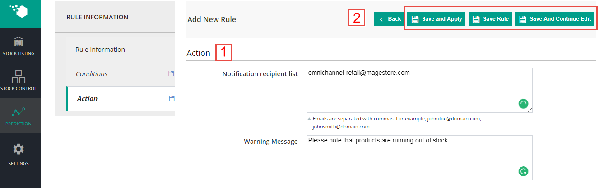

1. Entering email address in Notification recipient list and the message to be sent.

2. Selecting **Save and Apply** to start running the Low Stock Rule; **Save Rule** to save your work and come back to **Low Stock Rules** page; and click **Save and Continue Edit* to save while continue staying on page for further edits.

##### Low Stock Notifications

The list displays all notifications following the low stock rules. 

Notifications are noted with Created Date, Warning Message, Notification recipients. Click to **Action > View** to accessthe detail.

Each notification allows you to track the low stock products’ information such as SKU, Name, and Current Qty.

The Low Stock Notification will be sent to recipients’ email as well as be displayed on the Instock Management panel.

