# PURCHASE MANAGEMENT - USER GUIDE FOR MAGENTO 1

**Version 1.1.0**

----------

## INTRODUCTION

Purchase Management is a Magento 1 module, which helps you manage purchasing and receiving stock from suppliers. All information about Purchase Order and Quotation are kept track and automatically updated in the system.

----------

## HOW TO MANAGE SUPPLIER AND PRICE LIST 

### Manage Supplier

To manage information about your suppliers, please go to Suppliers menu. Then you will navigate to Manage Supplier section shown as follows:

#### Supplier List

This is a page where you can view all your suppliers list with a lot of information including **Supplier name, Supplier code, Contact email, Status**. Besides, you can edit, change status or delete suppliers one by one or in bulk. In this page, you also can export the supplier list to CSV/XML files by clicking on the Export button shown as the below image:

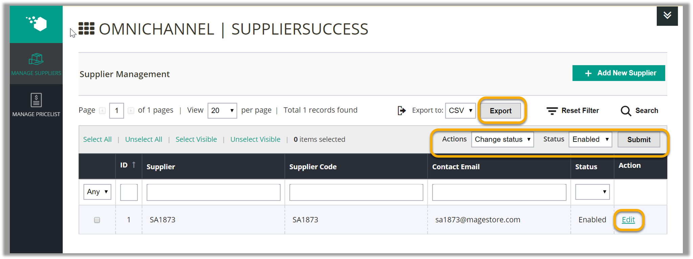

#### Add a Supplier

To add a new supplier, click to the **Add Supplie**r button on the top-right corner of the **Manage Suppliers** page. Then you need to fill in information in these following tabs:

- **Supplier Information**: In this tab, you need to fill in all required field including supplier name, supplier code, contact person, email. You should add description for each supplier to differentiate between this supplier and the rest. Do not forget to enable the supplier.

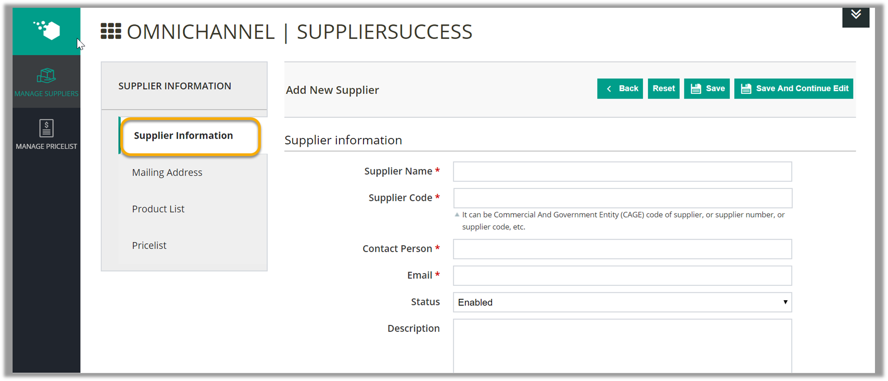

- **Mailing Address**: All information in this tab are optional for your supplier, so you don’t need to fill all of them.

- **Product List**: This tab allows you to add and manage products of the supplier you are creating. You can assign products to your supplier by importing a CSV file. 
   - Please click on the **Import products >>> Choose File button**, select a CSV file, then click on the Import button. 
    - If you are not clear about the format of the CSV file, you can download our sample file. After products imported, the list of products will be updated with ID, Name, SKU, Supplier product SKU, Cost, Tax from the CSV file.

- **Pricelist**: This is a page where view all pricelist of the supplier. In this page, you also can export the pricelist to CSV/XML files by clicking on the Export button

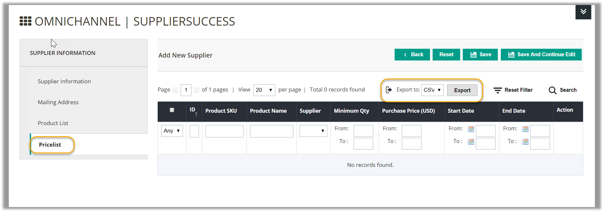

Remember to click on the **Save** or **Save and Continue Edit** button to save your work

### Manage Pricelist

“Pricelist is a list of prices for the goods offered by a supplier. It usually consists of Minimal Qty and Cost”

 - Please go to **Supplier >>> Manage Pricelist** to view the pricelist with information such as **Product SKU, Product name, Supplier, Minimal Qty, Purchase Price, Start date, End date**

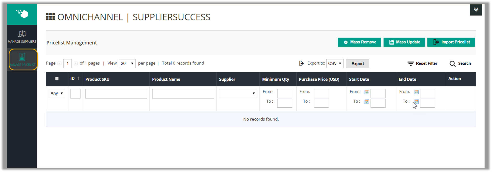

 - In order to **add pricelist** into the system, you click to **Import Pricelist** button, choose a CSV file from your computer, then click to **Import** button. If you are not clear about the format of the CSV file, you can download our sample file.
 - Right to the page, you can remove the pricelist one by one or mass remove
 - In order to **update the pricelis**t, you select the pricelist you want to update, change information of the pricelist, then click to **Mass Update** button.
 - You also can **export the pricelist** to CSV/XML files by clicking on the Export button.
 
----------

## HOW TO CREATE AND MANAGE QUOTATION

### Create a New Quotation

“A **quotation** (or a request for quotation) is the proposal of price and quantity of goods that store owners send to suppliers. The quotation will become purchase order when a seller sends confirmation of price and availability of products stated in the quotation.”

To create a new quotation, please go to the **Quotation** menu and choose **Create Quotation**.

#### Input General Information

Fill in all required information including Created Time, Supplier, Currency, Currency Exchange Rate and Commen#t (optional); then click **Prepare Product List** to go to the next step.

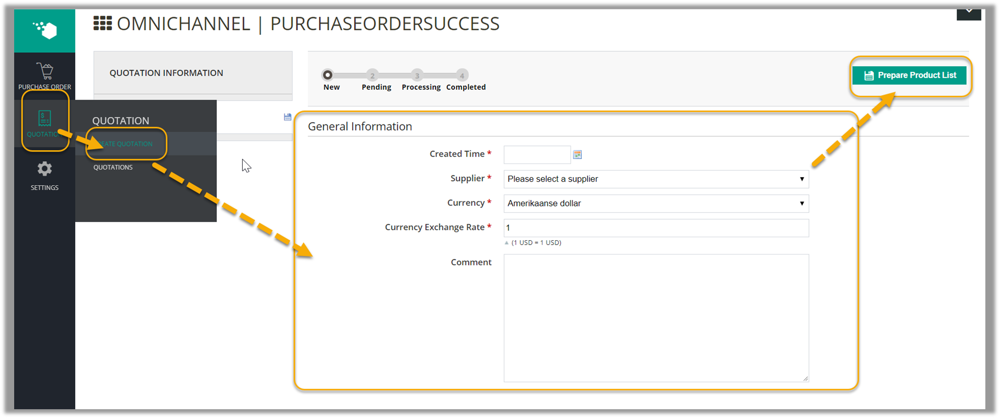

#### Prepare Product List

In this step, there are 6 ways for you to prepare product list as shown below:

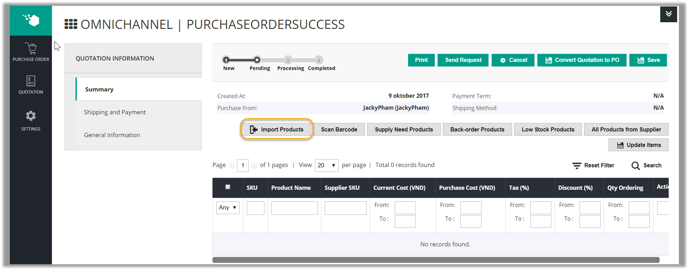

- **Import Products** via a CSV file (a sample file is provided)

- **Scan Barcode** to prepare product (if Barcode Management module is also installed);

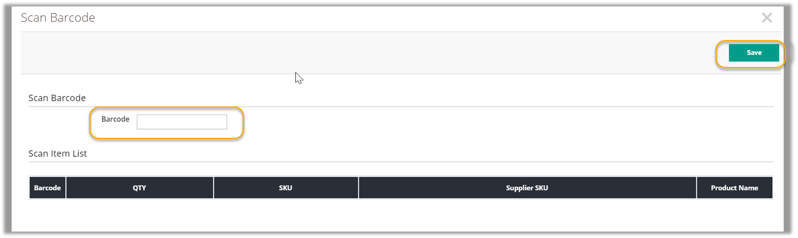

- Prepare product list based on **Supply Need Products** forecast. The system will calculate the number of stock that may be in need in an upcoming period based on its sales. There are 4 steps you need to follow:

 - Step 1: Select the criteria for the system to forecast Supply Need Products:

  o Warehouse: choose the warehouse containing the stock to be forecasted;

  o Sales Period: the system will examine the stock’s sales statistics in this period to make forecast. Options in the drop-down list include last 7 days, last 30 days, last 3 months and custom range (if you want another specific period);
  o Forecast Supply Need To: the system will predict if the stock on hand is enough for sales until this date.

- Step 2: Click Show Supply Needs and the Supply Need results will appear in the table. The table shows the current quantity in stock, its sales quantity per day, date when your stock on hand is still enough for sales and the supply need quantity.

- Step 3: Select the products in the table that you want to add to the Quotation.

- Step 4: Click **Add Selected Products** and the products will be added to the Quotation.

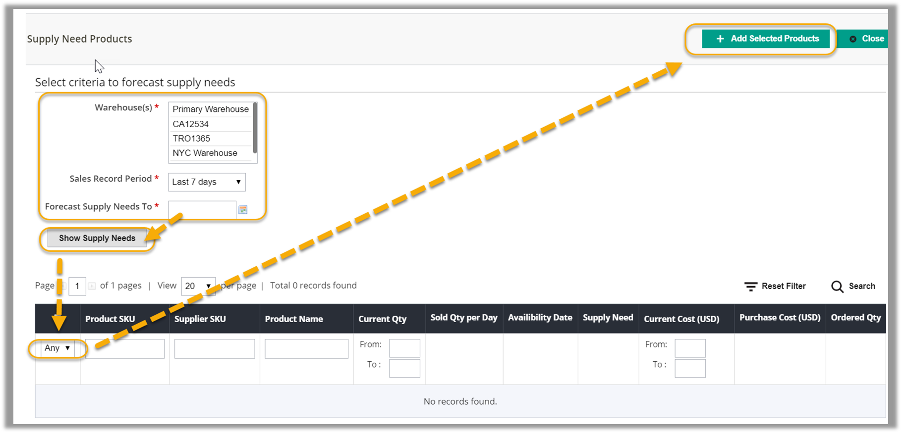

 - Prepare **Back Order Products**. Back order products are those that have been ordered by customers but currently not available in stock;
 
 - Prepare **Low Stock Products**. If Inventory Management module is installed, Low Stock products are suggested according to your low stock rules. Select a low stock notification from the drop-down list, then select the products you want to create quotation and click **Add Selected Products**.

 - Select products from the list of products from that specific supplier with the **All Products from Supplier** button.

You can manually enter the Purchase Cost, Tax, Discount and Ordered Qty for each product in the grid. Current cost is the unit price you already knew, which can be blank. Purchase cost is the unit price at the time of creating the PO. Remember to click **Update Items** to save your edits.

After enter all required fields, click **Save** button and Order Totals is automatically calculated.

#### Edit Shipping and Payment method

You can set up Shipping and Payment method for the quotation:

- Enter the address you want the stock to be shipped to
- Select a shipping method for the quotation
- Estimate and enter the shipping cost
- Set dates when you start the shipment and expect delivery 
- Select the payment term
- Choose the method to send order: N/A, Email, Phone, Fax, Vendor website

After filling out the form, do not forget to save all the changes. Now you can Send Request to the suppliers, **Save** or **Prin**t the quotation. If you want to Convert Quotation to P.O, read more in the **_ Generate Purchase Order from Quotation_** section.

### Manage Quotations

To manage all created quotation, please go to **Purchase Order Management>Quotations**:

There is a shortcut to create a new quotation. Click here to know how to create a new quotation.

Each quotation is listed with related information: Reference Number, Created Date, Supplier, Requested Qty, Grand Total (Inclusive Tax), Status and Action (to view more details). Please note that the quotations which are converted into PO will be removed from this list.

-------------

## HOW TO CREATE AND MANAGE PURCHASE ORDERS

“**Purchase Order (PO)** is a document sent to a specific supplier to purchase more inventories for your warehouses. It contains descriptions, quantities, prices, discounts, payment terms, date of performance or shipment, other associated terms and conditions.”

### Create a New Purchase Order Manually

To create a new purchase order manually, select the Create Purchase Order submenu under the Purchase Order menu.

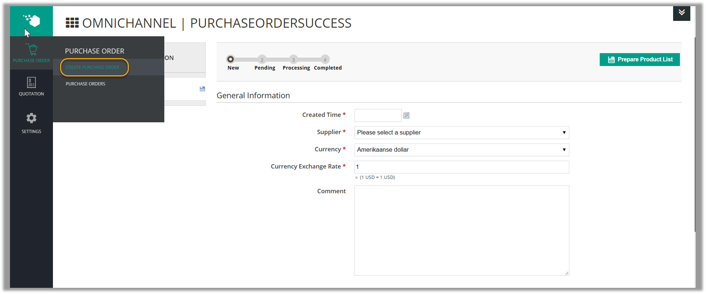

#### General Information

Fill in all required information including Created Time, Supplier, Currency, Currency Exchange Rate. You can also add extra information in the Comment box.notification Supplier can also view this comment if you send them a  email later. Then click **Prepare Product List** to continue.

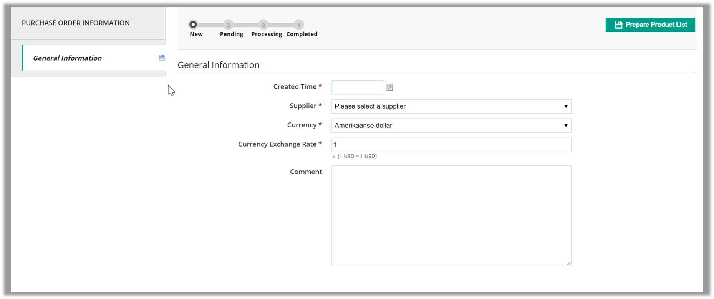

#### Prepare Product List

In this step, there are 6 ways for you to prepare product list. (These 6 ways are the same as how to prepare products list to create a quotation)

- **Import Products** via a CSV file (a sample file is provided);

- **Scan Barcode** to prepare product (if Barcode Management module is also installed);

- Prepare product list based on **Supply Need Products** forecast. The system will calculate the number of stock that may be in need in an upcoming period based on its sales. 

- Prepare **Back Order Products**. Back order products are those that have been ordered by customers but currently not available in stock;

- Prepare **Low Stock Products**. If Inventory Management module is installed, Low Stock products are suggested according to your low stock rules. Select a low stock notification from the drop-down list, then select the products you want to create quotation and click **Add Selected Products**.

- Select products from the list of products from that specific supplier with the **All Products from Supplier** button.

You can manually enter the Purchase Cost, Tax, Discount and Ordered Qty for each product in the grid. Remember to click **Update Items** to save your edits.

After enter all required fields, click **Save** button and Order Totals is automatically calculated.

#### Edit Shipping and Payment method

You can set up Shipping and Payment method for the order:

- Enter the address you want the stock to be shipped to
- Select a shipping method for the quotation
- Estimate and enter the shipping cost
- Set dates when you start the shipment and expect delivery 
- Select the payment term
- Choose the method to send order: N/A, Email, Phone, Fax, Vendor website

At this time, you can choose to **Save** the PO, **Send Request** to the supplier (PO will be sent to the supplier’s email address), **Print, Cancel**.

#### Confirm Purchase Order
To confirm purchase order, click on **Confirm Purchase Order**

Then you will be able to access 5 following tabs:

##### Summary:
This tab displays all the PO’s information you have entered in the previous steps.

##### Received Item:

   
This tab updates how many of each product in the PO you have received. You can mark all items as received, or manually do that for some products. If you have installed the Barcode Management module, you can also enter the product’s barcode and update its delivery status.

##### Returned Item:

This tab records all products in the PO which you have returned to the supplier.
Please note that you can only return products which you have received.

A **Return Items** window will appear. Enter the date of return, select product(s) to be returned, type in the quantity to be returned and finish by clicking **Return**.

##### Invoices:

This tab allows you to create invoice for the PO including payment and refund amount.

A **Create an Invoice** window will appear. Enter the date of creating the invoice; select product(s) to be invoiced; type in the quantity to be billed, unit price (if different), tax and discount in percentage and finish by clicking **Save**.

- **Transferred Item**: transfers deliveries into a specific warehouse. Please note that you can only transfer products which you have received.

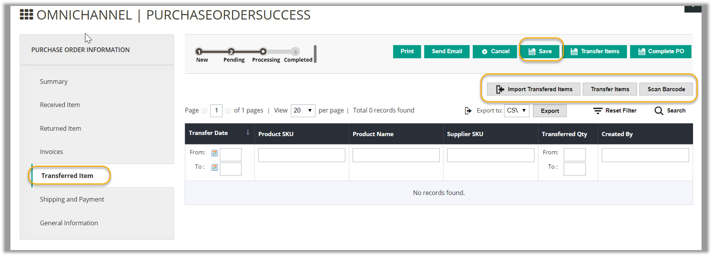

A **Transfer Items** window will appear. Enter the date of transferring; choose the warehouse to transfer products to; select product(s) to be transferred; type in the quantity to be transferred and finish by clicking **Transfer**.

- **Shipping and Payment**: views and edits shipping and payment information for the PO which you may have input in creating the PO.

- **General Information**: displays the General Information that you input when creating the PO.

#### Complete Purchase Order

During the process of **Confirm Purchase Order**, you can complete the purchase order any time by clicking the **Complete PO** button at the right of the page. You can also **Print, Send Email, Cancel or Save** the PO during the process.

You can complete a purchase order even when you have not received all requested items. When the purchase order status is completed, you cannot receive items anymore but you can still transfer received items into warehouses by clicking on **Transfer Items**

### Manage Purchase Orders

To create/ edit purchase orders, manage deliveries from suppliers to warehouses and return items from warehouses to suppliers, go to **Purchase Orders** submenu under the Purchase Order menu. The **Manage Purchase Orders** page contains information related to all POs including Reference Number, Date of the PO, Supplier, Ordered Qty, Received Qty, Billed Qty, Total Paid, Grand Total inclusive Tax (i.e. the total value of the PO) and Status.

There are 3 types of Status indicating to which stage the PO has been processed:

  - Pending: when you have input **General Information** and prepared product list;

  - Processing: when you click the **Confirm Purchase Order** button;

  - Completed: when you click the **Complete PO** button.

Click on **view** a POto see more details of the PO and you can continue editing the PO.

### Generate Purchase Order from Quotation

If you want to generate Purchase Order from **Quotation, please go to **Quotation> Quotations, click to choose a pending quotation. Then choose **Convert Quotation** to PO button.

After that, a new purchase order is generated. Now you can:

  - Edit Shipping and Payment method 
  - Confirm Purchase Order
  - Complete Purchase Order
  
-------------

## Settings  

There are 4 tabs to configure Purchase Management: Shipping method, Payment method, Payment term, Tax & Shipping Cost.

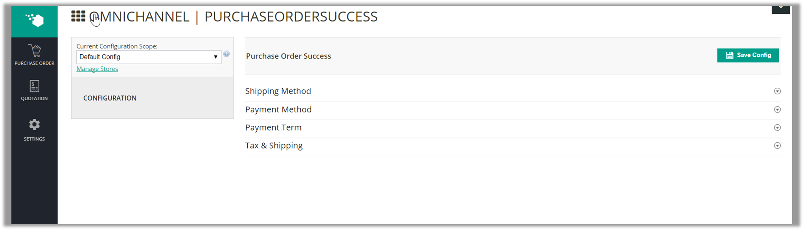

### Shipping Method

This tab allows you to add/edit or delete Shipping methods for purchase orders. Click **Add**, enter name of the shipping method and set status (Enable/Disable) for each one. Click **Delete** to delete a shipping method. After all, do not forget to choose **Save Config** to save your work.

### Payment Method

This tab allows you to add/edit or delete Payment methods for purchase orders. Click on Add, enter name of the payment method and set status (Enable/Disable) for each one. Click Delete to delete a payment method. After all, do not forget to choose Save Config to save your work.

###  Payment Terms

This tab allows you to add/edit or delete Payment terms for purchase orders. Click on **Add**, enter name of the payment term and set status (Enable/Disable) for each one. Click **Delete** to delete a payment term. After all, do not forget to choose **Save Config** to save your work.

### Tax & Shipping Cost

This tab allows you to edit Tax & Default Shipping Cost for purchase orders.

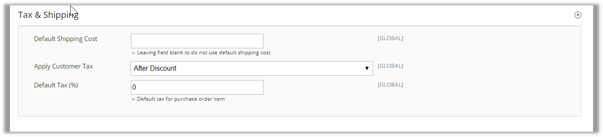

- Default Shipping Cost: If you enter a shipping amount here, all purchase orders will automatically use this shipping cost as default. If you want to set different shipping cost for different purchase orders, leave this field blank.
- Apply Customer Tax: Set customer tax applied before or after discount.
- Default Tax (%): Enter default tax for purchase order items
----------------
## Release Note

### Version 1.1.0 (released on Sep 12, 2017)

<a href="#p2">Allow to import CSV when delivery/receipt/transfer items in Purchase Order</a>

### Version 1.0.1 (released on Jul 13, 2017)

<a href="#p1">Allow to assign product to many suppliers in product edit page</a>

### Version 1.0.0 (released on Mar 7, 2017)

Release stable version of Purchase Management

----
**_Confidential Information Notice_**

Copyright 2017. All Rights Reserved. Any unauthorized reproduction of this document is prohibited. 

This document and the information it contains constitute a trade secret of Magestore and may not be reproduced or disclosed to non-authorized users without the prior written permission from Magestore. Permitted reproductions, in whole or in part, shall bear this notice.

