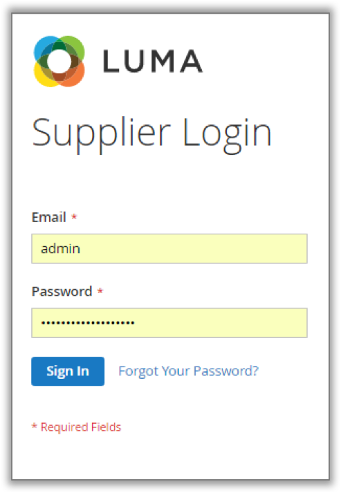
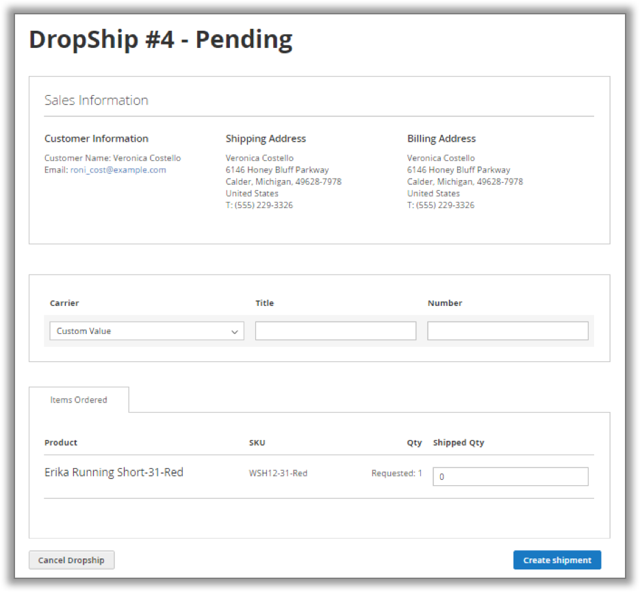

# DROPSHIP - MAGENTO 2

**Version 1.0.0**

*Confidential Information Notice
Copyright2016. All Rights Reserved. Any unauthorized reproduction of this document is prohibited.
This document and the information it contains constitute a trade secret of Magestore and may not be reproduced or disclosed to non-authorized users without the prior written permission from Magestore. Permitted reproductions, in whole or in part, shall bear this notice.*

##  Introduction

Do you know that 45 - 90% of all business expenses are as results of inventory costs? (upstreamcommerce.com). Therefore, it is vital to have an effective inventory management strategy in 1. Introduction

Do you know that 45 - 90% of all business expenses are as results of inventory costs? (upstreamcommerce.com). Therefore, it is vital to have an effective inventory management strategy in order to save costs and gain profits. 

Dropship for Magento 2 is one module from Order Success solution, which allows your suppliers to ship items to customers directly. This plugin is:

•	Compatible with Magento CE 2.1.x

•	Open source 100%

•	License Certificate valid for 1 live Magento installation and unlimited test Magento installations (No license key required)

•	Easy to install and configure

•	User-friendly interface

##  How to prepare and ship items for sales order

### Drop-ship

**“Drop-shipping (Drop-ship)** is a term to describe the retailer does not keeping goods in stock, but instead transferring sales orders and shipment details to the wholesaler/ supplier, who then ships the goods directly to the customer.”

With Dropship module, you will act as the retailer, passing the order information onto your supplier for shipping. As items on drop-ship are not passed through your hands, they don’t affect to the Qty. and inventory movements in your warehouses.

### Drop-ship Process

Below is a step-by-step guide on how to handle a sales order that will be drop shipped to a customer. If you do not have enough in stock to complete the sales order, then a drop-ship request should be made and sent to the suppliers. The process contains only 3 simple steps:

-	Admin sends drop-ship request to the supplier
-	The supplier ships items to customers and confirm the shipped Qty after shipping
-	Admin creates/cancels shipment

**Step 1:** Admin sends drop-ship request to the supplier
When fulfilling an order in backend (with ***Order Fulfillment module for Magento 2***), in the **Prepare Fulfil** step, you can choose **Request Dropship** option. Select **Fulfill** button on the right of the order you want to request drop-ship for.

The drop-down list in the **Shipping Channel** field includes drop-ship. Select **Request Dropship**, choose **Add Products to Request** then it will show all available suppliers that provide corresponding products. You can choose among these suppliers as preferred.

After that, click on the **Add Selected Product(s to Request** and **Save** button to send drop-ship requests to the suppliers chosen.

The drop-ship request is saved in **Dropship Request**. The status of this dropshipment in backend is **Pending**.

**Step 2:** The supplier ships items to customers and confirm the shipped Qty after shipping.

Each supplier selected will receive a notification email about the drop-ship request as below: 

As being instructed in the email, the supplier follows the login link to access the **Supplier Manager** page and then fills in the Qty. that he can ship.

**Note:** When adding/ editing a supplier (in ***Purchase Management module for Magento 2***), the **Password Management** section will be shown. You can set password and email it to the supplier. The email will be shown as below:

In case the supplier forget the password, the can request to reset the password. After the request is send, the supplier will receive a notification email as below:

The supplier can use his email address and password to log in on the **Supplier** page and create drop-ship.  The supplier need to enter the carrier information and shipped Qty to create shipment. After a supplier create shipment, you will receive a notification email as below:            

If the supplier can meet your demand, they would refuse to create shipment. You will receive a notification email as below:

**Step 3:** Admin creates/cancels shipment.

If the supplier refuses to create shipment, you need to create shipment by yourself. Go to **Dropship Request** section and find the order you want to work with. Choose **Create Shipment** to complete this order or **Back to Prepare Fulfill** to cancel/request dropship from other suppliers.

Notification email when the storeowner cancel the dropship request:

### How Admin & Warehouse Managers Manage Drop Shipments

In the back-end, go to **Fulfillment > Dropship Request**. This tab lists all drop shipments from a supplier. 

To review or take actions related to drop shipments, click on the ***Edit*** link in the **Action** column. The system will navigate you to the Drop Shipment detailed page.

### How Suppliers Manage Drop Shipments

To help suppliers follow all their drop shipments easier, the module provides a separate page in the front-end, namely **Supplier Page**, where suppliers can log in and track all related information.

Suppliers will fill their email address and the password received in the **Supplier Login** form as below:

Once logged in successfully, suppliers can access their **Supplier Page**:

#### Dropship tab

This tab shows Drop Shipment #, Request Date, Shipping Address, Total Items Requested and Status. To see more details and edit each drop shipment, suppliers simply click on the View link in the last column. 

There are 2 types of status for drop shipments, including **Pending** and **Complete**. 

•	Drop Shipments with **Pending** status are the ones that provide the quantity requested from admin/ store owner and need suppliers to create shipment. 

Suppliers should enter the Qty. that they can send directly to the customer in the **Qty. confirmed** column, then click on the Confirm button. A confirmation email will be sent automatically to you (admin/ store owner) for approval.

•	Drop Shipments with **Complete** status are the ones that all Qty. that need to ship has been delivered to customers. Suppliers can review information of completed drop shipments.

#### Supplier Information tab

In this tab, supplier can edit their information such as Name, Contact Person, Email, Telephone, Address and Password. All changes will be updated in the **General Information** tab of the **Supplier Manager** page in backend or vice versa. Thus, you can easily contact suppliers whenever having drop-ship requests.

### Settings

Go to **Fulfillment > Dropship Configuration**

**No**|**Field**|**Sample**|**Description**
---|---|---|---
1| Email notice dropship request for supplier|Submit request notice to suppliers|Supplier will get notifications email if there are new drop-ship requests
2| Email cancel dropship request for supplier|Cancel request notcie to suppliers|Supplier will get notifications email if admin cancels drop-ship requests 
