# M2E PRO – USER GUIDE FOR MAGENTO 2

-------------------
## Introduction

In the hustle and bustle of today’s retail industry, it is important that business should connect with online marketplaces. There are various reasons why many retailers use sites like Amazon, eBay, Rakuten, Sears, etc,… to scale online orders, to tap into global demand, to gain support and so on. 

However, is selling on marketplaces easy to set up and grow your sales?

There are still many problems that you will face while embarking on these virtual marketplaces. Peer competition in each marketplace is just one part of the story outside the business, while inventory management is one of the nerve-racking internal issues that may cause you to fail to make a sustainable revenue. Cataloguing and updating inventory across marketplaces isn’t an easy feat. Changing the price of copious products on different channels is also the big challenge when you want to stay ahead of the competition. 

So how to get at ease with all the challenges of inventory management across marketplaces? 

It will be much better if you synchronize your Magento warehouses to your Amazon/eBay/Rakuten stores by M2E Pro. This module can help you effectively synchronize stock level and manage orders between Magento backend and different marketplaces. What is more, from now on with the M2E Magento Integration, your data will be managed not only in the whole Magento store but also in specific warehouses. The entire work is done smartly by just one order management system. So controlling the flow of thousands of products will become easier and smoother than ever!

Let’s open more doors for your business by expanding your presence to these marketplaces with this M2E Pro solution now!

[M2E Pro](https://www.magestore.com/magento-ebay-amazon-integration) is one module in our [Omnichannel solution](https://www.magestore.com/omnichannel-retail) for Magento retailers.

-------------------------------------

## Create a new listing

Path: **eBay Integration > M2E Pro**

Click on **Add Listing** button to begin the process. 

#### **Step 1: General Settings** 

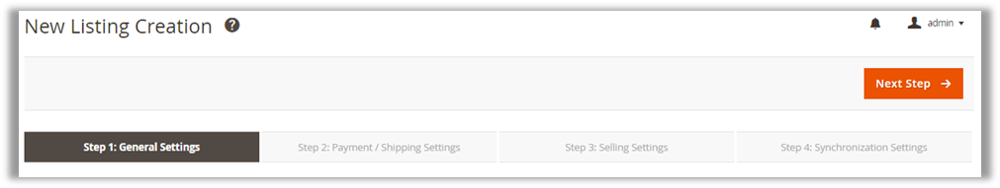

On the **New Listing Creation** page, a status bar will be displayed the whole process as below to help you create a new listing step by step. 

i. **General** section:

(1)	**Title**: Enter a descriptive name for your M2E Pro listing. 
This is used for reference within M2E Pro and will not appear on your eBay Listings.

ii. **eBay settings** section: 

(2)	**Account**:  Use an eBay User ID you are going to list the Items from.
If the eBay User ID you want to use is not available as an option – you can add one by clicking **Add Another** button next to the Account bulk. 

(3)	**Marketplace**: Choose the marketplace on which you want to sell the products listed on the M2E Pro Listing. The currency will be set automatically according to the marketplace you select. 

iii. **Magento Settings** section:

(4)	**Magento Store View**: Select a Magento Store View you want to display this M2E Pro Listing.

iv. **Warehouse** section:

(5)	**Select Warehouse**: Choose a warehouse you want to assign this product listing to.

### **Step 2: Payment/ Shipping Settings**

After specifying general information, you need to set payment methods, shipping methods, and whether you accept return for Products added on eBay with the M2E Pro Listing you‘re editing. 

i.	**Payment** tab

Choose one payment method for the product listing. If you choose PayPal, please enter your PayPal registered email. Besides, you can select other payment methods you are using.

Click on **Save as New Policy** button to save your settings.  

ii.	**Shipping** tab: 

•	**Item Location** section is prefilled for you based on your Magento settings. Check if the information is correct and edit it if necessary. 

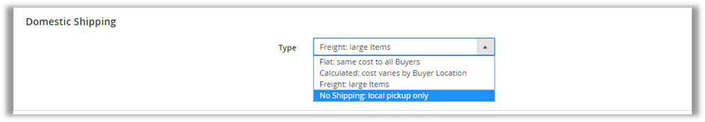

•	**Domestic Shipping** section allows you to select a suitable shipping method that allows items to be delivered to Buyers.

**Other shipping settings**:

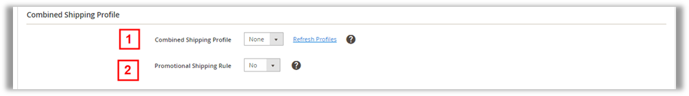

•	**Combined Shipping Profile** section allows you to use flat shipping and calculated shipping rule profiles that you created on eBay.  In addition, you can enable promotional shipping rule to offer buyers special discounts when they purchase multiple items or spend a certain amount.

•	**International Shipping** (only display if you choose flat and calculated shipping method) allows you to qualify Listings to be posted in international marketplaces where the selected buyers can see it. 

•	**Package Details** section (only display if you choose the shipping method: **Calculated: cost varies by Buyers location**) enables you to set a measurement system, size source, dimension source and weight source for the package. 

•	**Excluded Locations** section:  allows you to exclude buyers in particular locations from purchasing items.

Remember to click on **Save as New Policy** button to save your settings.  

iii.	**Return** tab

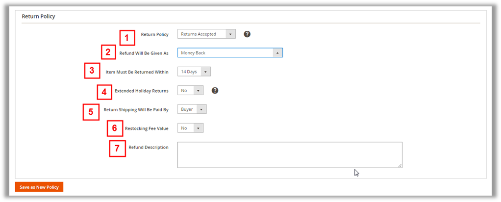

•	**Return Policy** section allows you to enable return policy, and set its conditions such as the type of refund buyers will receive, the duration of which items will be returned, the fee of restocking, and so on. 

Click **Save as New Policy** to complete. 

### **Step 3: Selling Settings**

i.	**Price, Quantity and Format** tab: 

•	**How You Want To Sell Your Item** section requires you to choose a sale type of listing from many options such as Fixed Price, Auction, and Magento Attributes. Besides, you can decide whether you want Buyers to remain Anonymous to other users in Private Listing field and elect to offer the Item exclusively to Business users.

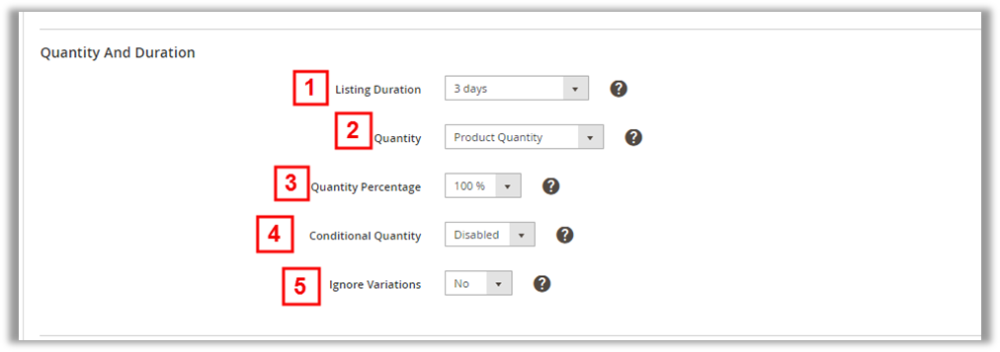

•	**Quantity and Duration** section:
In this section, you can set the length of time your Listing will be available on eBay, and other quantity conditions by which your items will be listed on eBay. 

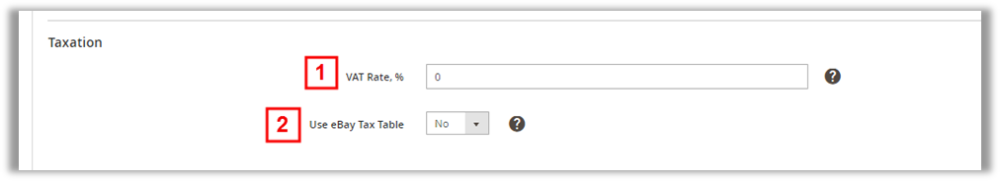

•	**Taxation** section: Set **VAT rate** and the tax will be added to or included in Item Price according to Add VAT Percentage field settings located in the Price section below. 

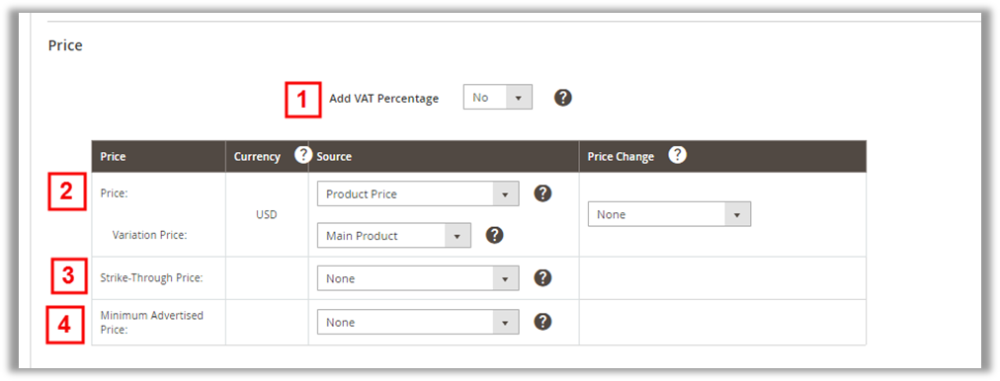

•	**Price** section allows you to choose whether you want to add VAT to the Price when a product is listed on eBay. In addition, you need to choose a type of price and add a value you want the Magento Price to be modified while listing on eBay. 

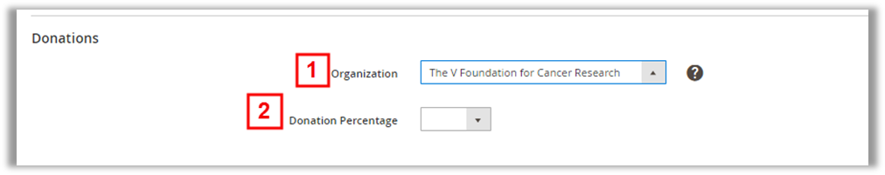

•	**Donations** section helps choose your favorite charity or organization and the donation percentage which you want to transfer to it. 

•	**Best Offer** section requires you to determine if you accept offers from buyers and negotiate a price. You can also manually respond the Buyers directly on eBay or use auto Accept and Decline Offers conditions. 

ii.	**Description** tab: 

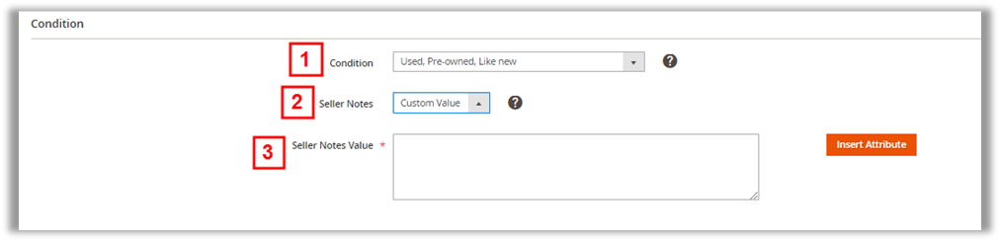

•	**Condition** section let you specify which condition has the Item you are going to sell on eBay. Besides, if you want to have a custom value, add notes to provide additional details about the Item’s Condition. 

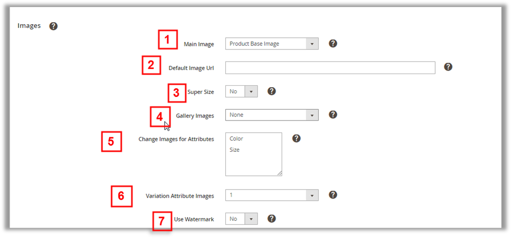

•	**Images** section allows you to set the elements of images such as location, size,  gallery images, watermark, 

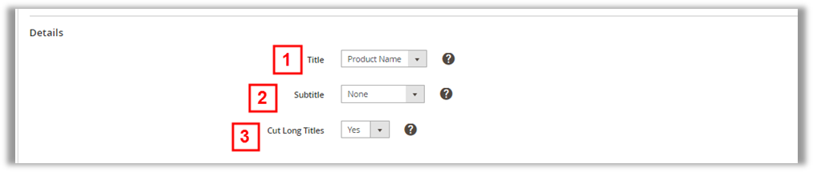

•	**Details** section requires you to specify the type of title and subtitle displayed.

•	**Description** section: Select whether to show Product Description or Product Short Description as an eBay Item description. Otherwise, customize the descriptive information by choosing Custom Value and inserting Magento Attributes, Images tags or an HTML code you created. 

•	**eBay Catalog Identifiers** section allows you to specify a Magento Attribute that contains Product UPC/ EAN/ ISBN/Brand/MPN Value.

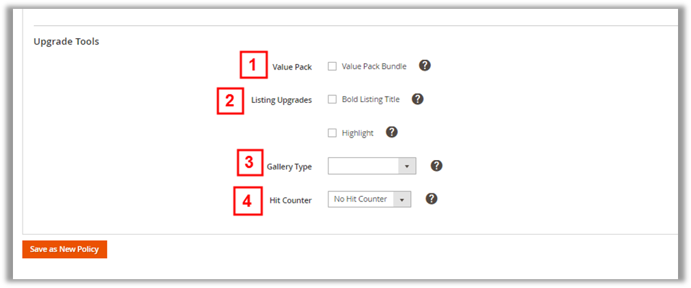

•	**Upgrade Tools** section helps you make your Listing stand out from others These tools include **Value Pack Bundle, Listing Upgrades (Bold or Highlight), Gallery Type** and **Hit Counter** that counts the number of visitors to your eBay listing. 

After completing all these above fields in step 3, click on **Save as New Policy** button. 

### **Step 4: Synchronize Settings**

There are several different types of Synchronization Rules that you can set on this screen:

•	**List Rules** define which new products should be listed on eBay.
•	**Revise Rules** define when products currently listed on eBay should be revised.
•	**Relist Rules** define when products that have previously been listed on eBay but aren’t currently should be relisted on eBay.
-------------------------------------
##  **Assign warehouse to all M2E product listings on the marketplace**

Path: **Stores > Configuration > Magestore Extension > M2esuccess Configuration**

In **M2E Pro Integration** section: 

(1)	**eBay store is associated with**:  
Select **Specify Warehouse** to allow a specific warehouse to link with your eBay store. 

Select **Global Website** to link Ebay store with the primary warehouse. 

(2)	**[Ebay] Warehouse** (only available if you choose **Specify Warehouse**): choose a specific warehouse to link with your eBay store.

(3)	**Amazon store is associated with**: 
Select **Specify Warehouse** to allow a specific warehouse to link with your Amazon store. 

Select **Global Website** to set Amazon store linking with primary  warehouse.

** [Amazon] Warehouse** (only available if you choose Specify Warehouse): choose a specified warehouse to link with your Amazon store

**Note**: You have two ways to assign the warehouse to your product listing:

-	The first way: Assign the warehouse to the product listing when creating a new product listing. Refer to **Create a new product listing** part for more details.
-	The second one: Assign the warehouse to the product listing in **Configuration**. However, this setting is only applied to the product listings which are not assigned to any warehouse. That means if you assigned the warehouse when creating a new product listing, it will overwrite options in **Configuration**.

-------------------------------------

## **Manage orders between Magento backend and marketplaces**

Path: **eBay Integration > Sales** section > **Orders**

#### **View orders synchronization between eBay and Magento backend**. 
If you enable the synchronization between Magento Backend and your marketplaces, you can see the order list as below when you follow the path (**eBay Integration > Sales** section > **Orders**) 

When clicking on a corresponding row of an order, you will see the overview details about eBay order.

eBay Order Details will appear on another page as below: 

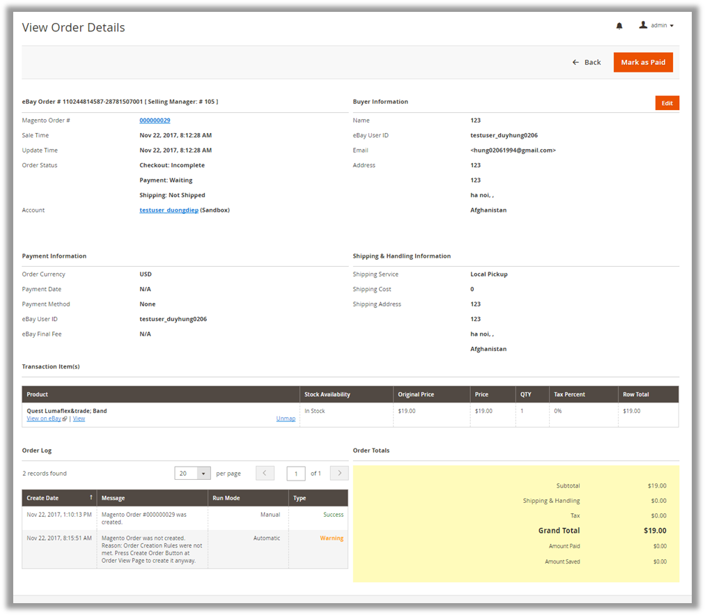

When an order is placed on eBay and the corresponding Magento order is created manually by admin in Magento backend, you can see the Magento order numbers below.  Click on this number to view the Magento Order Details created for selected eBay Order. 

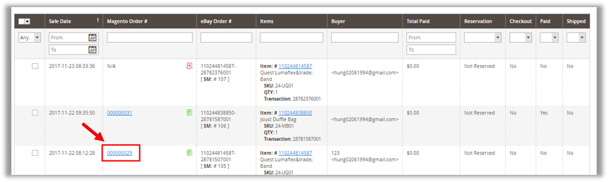

The Magento Order Details will appear on another page as below:
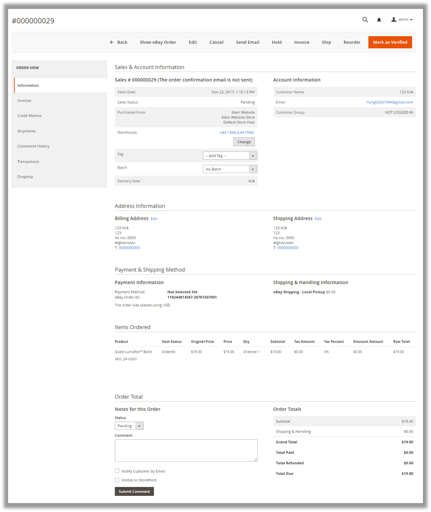

#### **Process eBay orders in Magento backend**. 

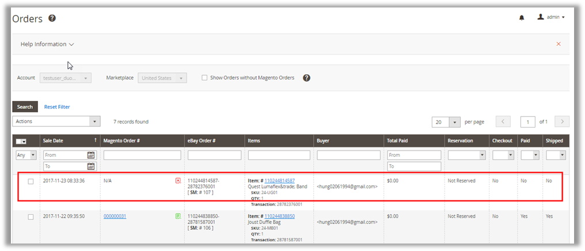

(1)	Click on the corresponding row of an eBay Order that has not been created in Magento.

(2)	To create order in Magento backend, click on **Create Magento Order** button on the top right of the page.

After that, a notification will be displayed to notify you that the order was created in Magento. 

(3)	Continually, click on **Mark as Paid** button to confirm that you have received payment for the order. 

(4)	After having shipped the order to the buyer, you can click **Mark as Shipped** to confirm that you have dispatched the order. You can also add tracking Magento order details by clicking the Magento order number for quick access to the Magento order. 

**Resend shipping information** if necessary ( for example, you have added a tracking number or the buyer has lost the shipping information).

*** Notice to the **Transaction items** section: 

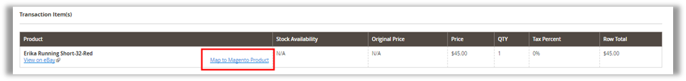

The items that form the eBay order appear in this section. If you see a link to **Map to Magento Product**, you will need to let M2E Pro know which Magento product in your inventory matches the eBay item.

First, click on **Map to Magento Product** and an **Order Item Mapping** page will appear as below. 

Search for the corresponding product title or SKU and click on **Map to This Product** link on the appropriate line as above. 

Click **Unmap** to break the link between the eBay item and a Magento product before mapping again. 
Every change you made to the eBay order in this eBay View Order Details page will be automatically synchronized with the Magento View Order Details page.

-----------------------------------------The End-----------------------------------------

**_Confidential Information Notice _**
 
Copyright 2017. All Rights Reserved. Any unauthorized reproduction of this document is prohibited. 

This document and the information it contains constitute a trade secret of Magestore and may not be reproduced or disclosed to non-authorized users without the prior written permission from Magestore. Permitted reproductions, in whole or in part, shall bear this notice.
