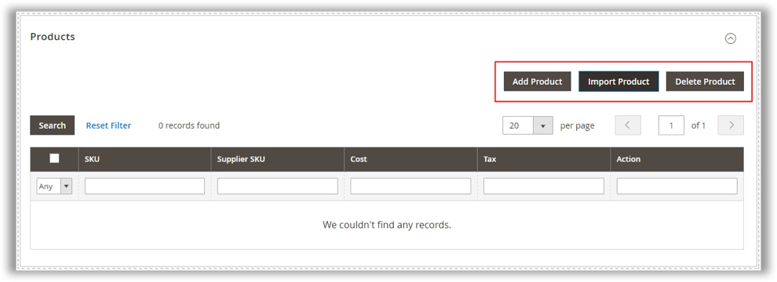
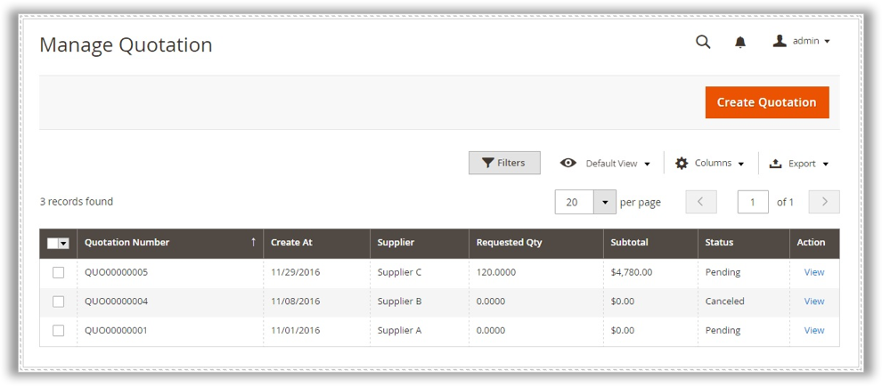
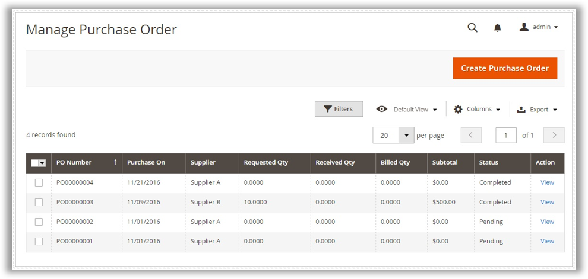
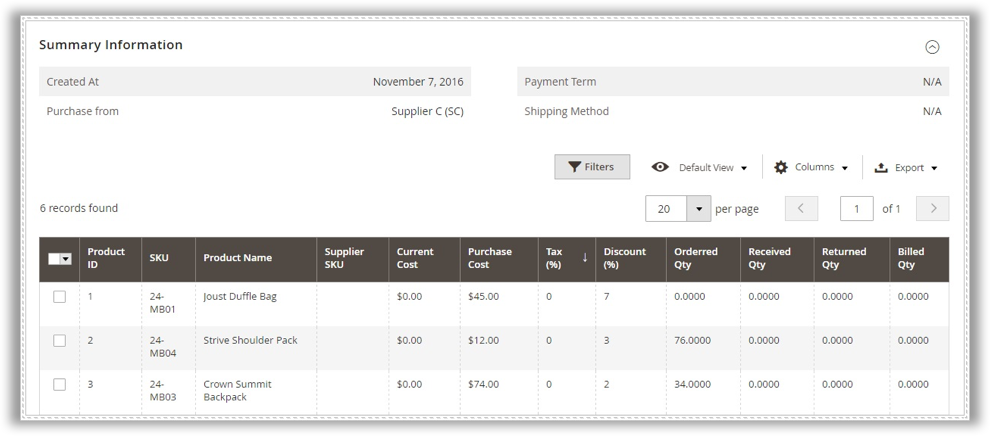
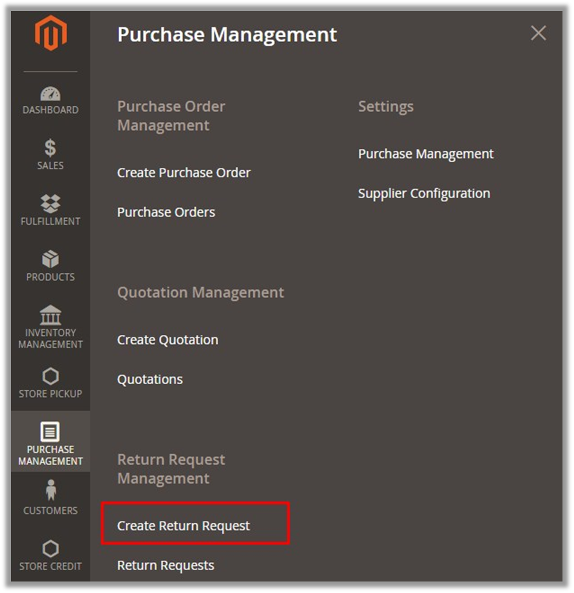
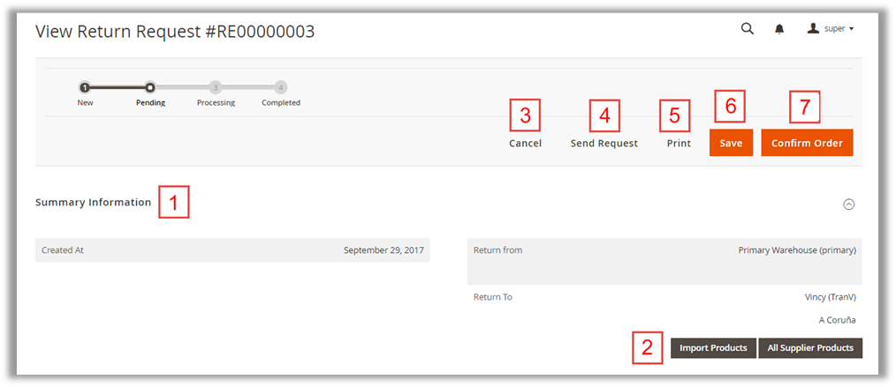
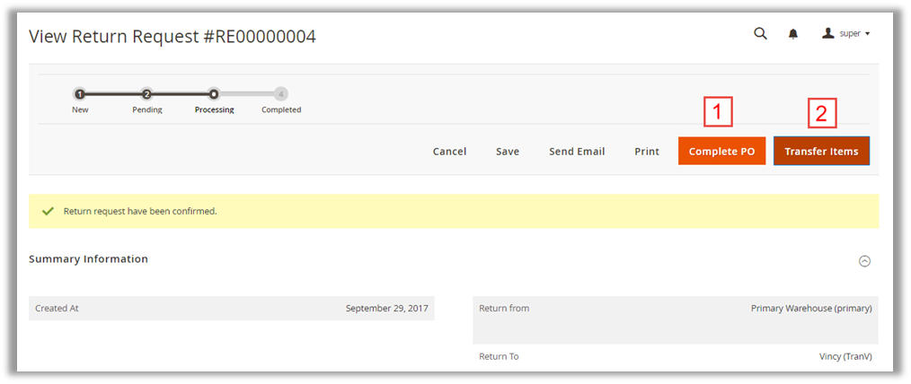
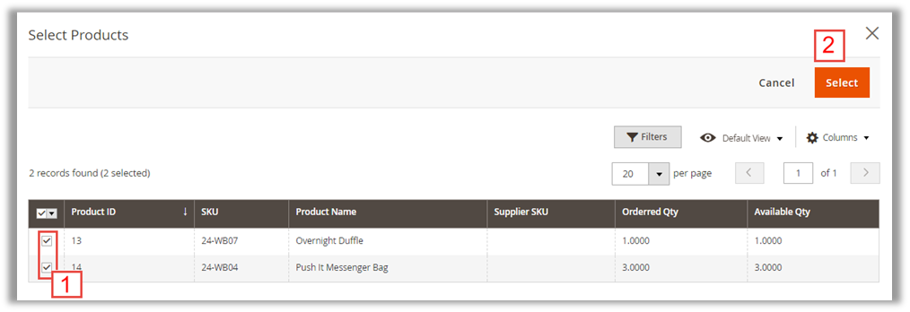
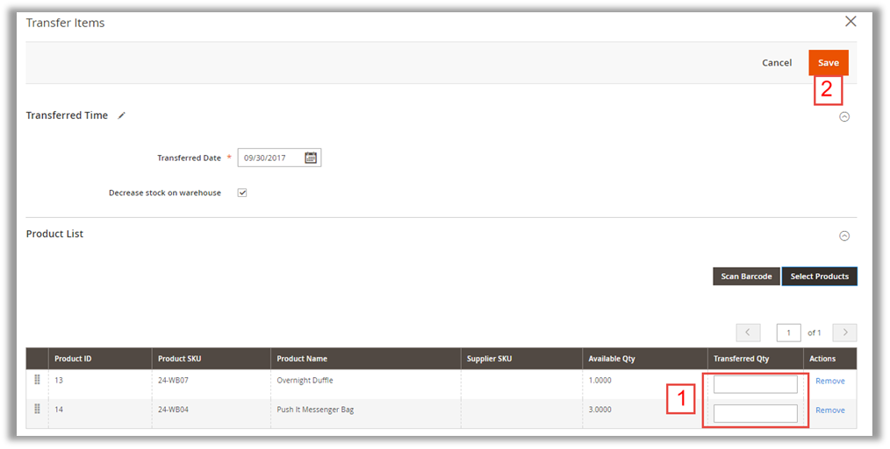
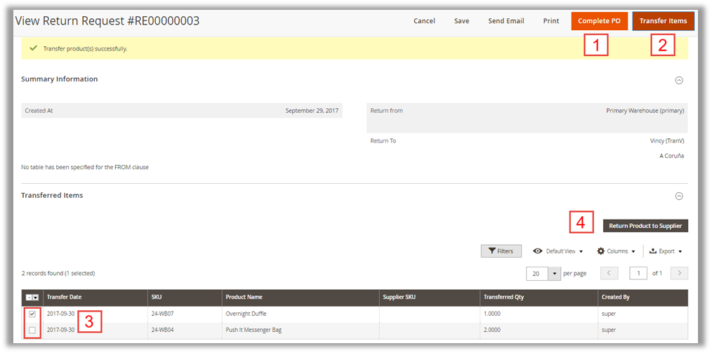

# PURCHASE MANAGEMENT - MAGENTO 2
**Version 1.0.1**

*Confidential Information Notice* 
*Copyright2016. All Rights Reserved. Any unauthorized reproduction of this document is prohibited.
This document and the information it contains constitute a trade secret of Magestore and may not be reproduced or disclosed to non-authorized users without the prior written permission from Magestore. Permitted reproductions, in whole or in part, shall bear this notice.*

## Introduction

**Purchase Management** is a Magento 2 module, which helps you manage purchasing and receiving stock from suppliers. All information about Purchase Order, Quotation and Suppliers are kept track and automatically updated in the system. The module is:

•	Compatible with Magento CE 2.1.0, 2.1.1, 2.1.2

•	Open source 100%

•	License Certificate valid for 1 live Magento installation and unlimited test Magento installations (No license key required)

•	Easy to install and configure

•	User-friendly interface

## How to manage suppliers
---

### Add a new supplier

To add a new supplier to the system, you should go to **Purchase Management => Manage Supplier** (in section Supplier) then click on **Add New Supplier** button. There are two types of information you have to enter in order to add a new supplier: Supplier Information & Supplier Address

•	Supplier Information: Supplier Code, Supplier Name, Contact Person and Email are required fields. You should add description for each supplier to differentiate between this supplier and the rest. Do not forget to enable the supplier.

•	Supplier Address: This field contains all address information of the supplier. Since fields here are optional, you do not have to fill all of them.

Choose **Save** to finish entering supplier information. Now you need to assign products to this supplier. After you click on **Save** button, your screen will appear as following:

There are two ways to assign products to the supplier: Add product manually and import products with a csv file. If you choose to upload products manually, remember to enter related information for each one: Supplier SKU, Cost and Tax. Otherwise, importing products in mass is recommended. A csv file sample is offered. In case you have a mistake on importing products, Delete Product button can help.

### Manage supplier

To have an overview of Supplier, go to **Purchase Management => Manage Supplier**. Each warehouse comes with Supplier Code, Total SKU,  Purchase Order Value, Status and Date for last purchase order. You can view or click to edit the detail of each one.

### Manage pricelist

“**Pricelist** is a list of prices for the goods offered by a supplier. It usually consists of Minimal Qty and Cost”
Go to **Purchase Management => Manage Pricelist**

There are two ways to add pricelist into the system:

•	Select **Add Pricelist** button manually. With this method, you need to select products and enter required information for each: Minimal Qty and Cost. If you have 2 Minimal Qty for a product, you must select this product and enter information twice.

•	If you got the pricelist from suppliers, it is much easier to import them into Purchase Management with a csv file.

### Supplier settings

There is only one thing you need to configure for Supplier. Please go to **Purchase Management => Supplier** (in Settings 
section):

If you choose Yes the system will automatically use and update cost from pricelist to purchase order. 

## How to manage quotation
----

### Create a new quotation

“A **quotation** (or a request for quotation) is the proposal of price and quantity of goods that store owners send to suppliers. The quotation will become purchase order when a seller sends confirmation of price and availability of products stated in the quotation.”

To create a new quotation, please go to **Purchase Management => Create Quotation** and choose **Create Quotation** button

#### Fill out General Information Form

After choose to create a new quotation, you will be navigated to this view: 

As can be seen, it is compulsory to choose Created Time and Supplier for the pricelist. Tick on the box next to Send Email to Supplier if you want an email to be automatically sent to supplier address (This email address can be changed in **Manage Supplier** section). Also, adding further comments is allowed here.

After that, click on **Prepare Product List** for the next step

#### Prepare Product List

In this step, there are 5 ways for you to prepare product list:

•	Import products via a CSV file

•	Prepare product list based on supply need forecast

•	Prepare back order products (Back orders products are ordered by customers but not available in stock now)

•	Prepare low stock products

•	Prepare product list manually with All Supplier Products button

Apart from importing products via a CSV file, you need to enter Purchase Cost, Tax, Discount and Qty Ordering for each product. Editing in line is allowed here. After enter all required fields, click **Save** button and Order Totals is automatically calculated.

#### Edit Shipping and Payment method

It is time to set up Shipping and Payment method for the quotation:

•	Enter the address you want the stock to be shipped to

•	Select a shipping method for the quotation

•	Estimate and enter the shipping cost

•	Set start shipping and expected delivery date

•	Select the payment term

•	Choose the way to place order: N/A, Email, Phone, Fax, Vendor website

After filling out the form

1) Click **Save** to save your work. Now you can **Send Request** to the suppliers or **Print** the quotation. 

2) To do more update about products information, click on **Revert Quotation** and you will be brought back to the previous step and enable to update products information. Later on, you will receive quotations from suppliers and compare their RFQ.

### Manage Quotation

To manage all created quotation, please go to **Purchase Management => Quotation**:

There is a shortcut to create a new quotation. 

Each quotation is listed with some related information: Created Date, Supplier, Requested Qty, Subtotal and Status. Please notice that quotations, which are converted into PO will be removed from this list.

## How to submit the additional data to the place order
---

“**Purchase Order (PO)** is a document sent to a specific supplier to purchase more inventories for your warehouses. It contains descriptions, quantities, prices, discounts, payment terms, date of performance or shipment, other associated terms and conditions.”

To create/ edit purchase orders, manage deliveries from suppliers to warehouses and return items from warehouses to suppliers, go to **Purchase Management => Purchase Order**. Then you will see the **Manage Purchase Orders** page as follows:

### Create a New Purchase Order Manually 

In order to create a new purchase order manually, click on the **Create Purchase Order** button on the top-right of the page or choose the **Create Purchase Order** tab. 

When creating Purchase Order, you will see a tab showing steps at which Purchase Order is. They are **New, Pending, Processing,** and **Completed.**

#### General Information

In this tab, you should configure all the required fields marked with a red star, such as Created Time and Supplier.

There are several optional fields to help you add extra information to your purchase order:

•	Send Email to Supplier: By ticking the checkbox, the module will automatically send information to the supplier via email right after creating the purchase order.

•	Comment: Add extra information for the purchase order. Suppliers will be notified about it.
After that, click on **Prepare Product List** button to continue.

#### Add products to the Purchase Order

In this step, there are 5 ways for you to prepare product list:

•	Import products via a CSV file

•	Prepare product list based on supply need forecast

•	Prepare back order products (Back orders products are ordered by customers but not available in stock now)

•	Prepare low stock products

•	Prepare product list manually with **All Supplier Products** button

Apart from importing products via a CSV file, you need to enter Purchase Cost, Tax, Discount and Qty Ordering for each product. Editing in line is allowed here. After enter all required fields, click **Save** button and Order Totals is automatically calculated.

#### Setting Shipping and Payment

It is time to set up Shipping and Payment method for the purchase order:

•	Enter the address you want the stock to be shipped to

•	Select a shipping method for the purchase order

•	Estimate and enter the shipping cost

•	Set start shipping and expected delivery date

•	Select the payment term

•	Choose the way to place order: N/A, Email, Phone, Fax, Vendor website

After this step, choose **Save** and the purchase order status will be changed to **Pending**. At this time, you can choose to Send Request to the supplier (Request will be sent to suppliers’ email address), Print the purchase order, Cancel or Confirm Purchase Order. 

You should double-check all information before confirming purchase order. After being confirmed, the purchase order status will be changed to **Processing.**

#### Receiving/Returning Items 

When the purchase order is processing, you can be navigated to the following view and receive or return items:

There are five tabs on this view:

#### Summary Information

All information you entered in the previous steps will be summarized here: Created Time, Supplier, Payment Method, Shipping Method and Selected Products.

#### Received Items

This tab shows all items in the purchase order you received. Each product goes with detail information: Receive Date, SKU, Product Name, Received Qty and Created By.

There are two ways to receive items: **Receive Items** (This method is most suitable when you use partial shipment. You need to enter the receive date, select received products and fill Received Qty for each product) and **Receive All Items** (All products will be noted as received).

#### Returned Items

**Return Items** are records of items & Qty. returned against a purchase order. They are similar to Credit Memos of Sales Orders but these items are returns from your 

If you only want to return some items in the purchase order, you can create a partial return by clicking on the **Return Order** button. The **Returned Product** page is as below:

You need to enter the return date, select returned products and fill Returned Qty for each product. After that, you click on the Save button to save your work. The system will automatically subtracted the returned Qty. that you entered from the corresponding warehouse’s inventory. Now, you can see the records of all returned items shown in the **Return Orders** tab.

#### Invoices

Multiple invoices can be created by products for one purchase order. When you click on **Create an Invoice** button, the **Create Invoice** page will be shown like below:

You need to enter the billed date, select products and fill billed Qty, unit price, tax and discount for each product you want to create invoice for. After that, you click on the **Save** button to save your work. Now, you can see the records of all invoices shown in the **Invoices** tab.

#### Transferred items

After receiving products, you can transfer them to warehouses. Here is what we got in **Transferred Items** tab:

After clicking on **Transfer Product to Warehouse** button, you need to enter the transferred date, warehouse, select products and fill transferred Qty for each product you want to transfer. After that, you click on the **Save** button to save your work. Now, you can see the records of all transferred products in the **Transferred** Items tab.

#### Shipping and Payment

From this tab, you can view and edit shipping and payment information for the purchase order. 

#### General Information

From this tab, you can view and edit general information for the purchase order.

### Complete Purchase Order

You can complete a purchase order by choosing **Complete PO** button. After completing PO, the status will be changed to **Completed**

You can complete a purchase order even when you have not received all requested items. When the purchase order status is completed, you cannot receive items anymore but you still transfer received items into warehouses after that.

### Generate Purchase Order from Quotation

If you want to generate Purchase Order from Quotation, please go to **Purchase Management => Quotations**, click to choose a pending quotation. Then choose **Convert Quotation to PO** button.

After that, a new purchase order is generated. Now you can:

•	Setting Shipping and Payment

•	Receiving/Returning items

•	Complete Purchase Order

### Purchase Management Settings

There are 4 tabs to configure Purchase Management: Shipping method, Payment method, Payment term, Tax & Shipping. Go to **Purchase Management => Purchase Management** (in Settings section) to do these settings.

#### Shipping Method

This tab allows you to add/edit or delete Shipping methods for purchase orders. Click on **Add**, enter name of the shipping method and set status (Enable/Disable) for each on. Click on Trash bin icon in Action column to delete a shipping method. After all, do no forget to choose **Save Config** to save your work.

#### Payment Method

This tab allows you to add/edit or delete Payment methods for purchase orders. Click on **Add**, enter name of the payment method and set status (Enable/Disable) for each on. Click on Trash bin icon in Action column to delete a payment method. After all, do no forget to choose **Save Config** to save your work.

#### Payment Terms

This tab allows you to add/edit or delete Payment terms for purchase orders. Click on **Add**, enter name of the payment term and set status (Enable/Disable) for each on. Click on Trash bin icon in Action column to delete a payment term. After all, do no forget to choose **Save Config** to save your work.

#### Tax & Shipping

This tab allows you to edit Tax & Shipping for purchase orders. You need to uncheck all box next to **Use system value** before configure fields

•	Default Shipping Cost: If you enter an shipping amount here, all purchase orders will automatically use this shipping cost as default. If you want to set different shipping cost for different purchase orders, leave this field blank

•	Apply Customer Tax: Set customer tax applied before or after discount

•	Default Tax (%): Enter default tax for purchase order items
## How to Manage Return Order

### Create Return Order

In order to request a product return, go to **Purchase Management >  Return Request Management > Return Requests**

You will be led to the **Create Return Request** page

1) Return progress is controlled in 4 steps: 
	* New: input general information of the return process 	
	* Pending: create the list of products to return to supplier 
	* Processing: the product list has been submitted to the supplier. Products, once delivered, are waiting to be validated and transferred to warehouse 
	* Completed 
2) Input the date that you create the return request

3) Choose the warehouse to take products out for return

4) Choose supplier to return products to

5) Input return reason (optional)

6) Click **Prepare Product List** to move to the next step

On **Pending** step:

1) View general information of the return request that you have input in the previous step.

2) There are 2 ways of preparing product list to return: 
	* Choose to either Import Products list via csv file (template provided) 
	* Or view and choose among all products of that supplier by clicking on All Supplier Products button. 
3) Cancel the return request

4) Send an email to supplier to inform of the return

5) Print the list of returned items

6) Save your current process while stay on the page

7) Confirm 

After adding products, you can edit product quantity to return:

1) Select products to edit

2) Input product quantity to return

3) Click **Save** to save your current process and stay on page; or **Confirm Order** to continue.

### Complete Return Order

After validating the products, inventory staff can process with the product receipt:

1) Click **Complete PO** to finish the Return request.

2) Click **Transfer Items** to transfer the received products to the warehouse that you have appointed before.

In **Transfer items** page: 

1) Input the date of transfer

2) Choose either to select products by scanning barcode; or select products from a list with 2 steps as below

After selecting products or scanning barcode, you will be sent back to the **Transfer Items** page:

1) Input the product quantity to transfer (you can transfer partially in multiple times)

2) Click **Save** to continue

1) Click **Complete PO** to finish the return request

2) Click **Transfer Items** to continue transferring the rest of received products.

3&4) Select products and click button to **Return to Supplier**.

