# ECOMMERCE MANAGER – USER GUIDE FOR MAGENTO 1

---------------------------

##  Introduction

According to Big Commerce and Square, ecommerce is growing 23% year-over-year. Even 2 in 5 (40%) online shoppers say they couldn’t live without online shopping. However, many e-commerce businesses are struggling to capitailize on their digital sales channels. 

So how retailers can manage their business to maximize sales on online channels in the emerging technology world? 

Magento Ecommerce Management module including Store Pickup, and Loyalty programs is here to help you create more values for your customers and thus, will boost sales for the whole business. 

With Loyalty programs module, your ebusiness can build a strong relationship with their customers and drive more sales from returning ones as well through Reward Point, Store CrediT and Gift Cards. Besides, Store Pickup will satisfy your shoppers with the convenient option of ordering online - picking up in store.  

This guide is specially written according to each role of an ecommerce business including manager and staff members. Therefore, you can quickly understand the responsibility of your workforce during the operation of an ecommerce business.  

Power up yourself with our [Magento Ecommerce Manager solution](https://www.magestore.com/ecommerce-manager) to convert online sales smarter!

-----------------------------

## Permission Matrix

---------------------------------------

## I. User Guide For Ecommerce Manager
###  1.1. Validating Orders and Store Pickup Processing

####  1.1.1. Validate Orders
##### 1.1.1.1. Check orders in store

#####  1.1.1.2. Process Shipment for customers

**Path: Sales > Orders** 
###### a. Create shipment

1.	In the **Information** tab, click on **Ship** 

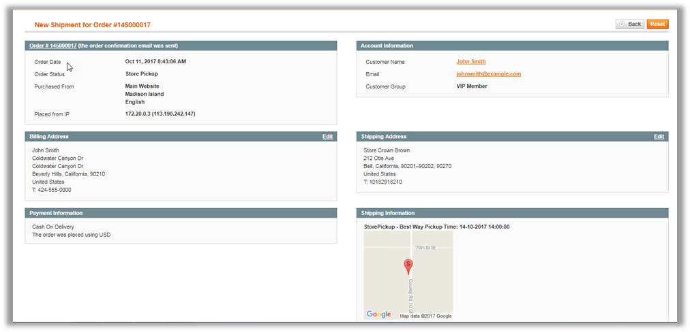

The **New Shipment** page like the image above will open and include a customer’s information such as sales info, account, address, payment and shipping method. 

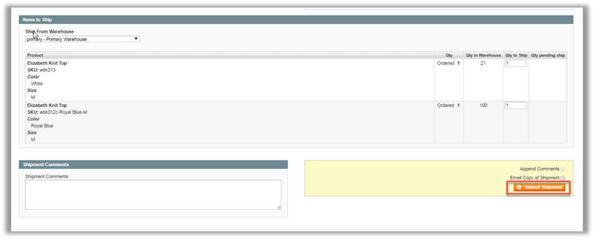

2.	Click on **Submit Shipment** button to complete.

When a new shipment is created, you will see the notification:   **The shipment has been created**

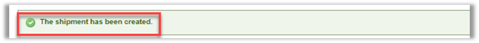

###### b. Print  Packing Slips

**Path: Sales > Orders** 

After a new shipment has been created, if you want to print packing slips:

1.	In the **Order** page, click on **Shipments** to open a shipment tab.

The **Shipment page** of a particular order will open as above. 

2.	Click on **Print** button to print out your packing slip. 

###### c. Send confirm email to customers

**Path: Sales > Orders** 

Continually, to send confirm email to customers: 

1.	In the **Information** tab, click on **Send Email**.

Then a popup will appear to make sure that you want to send confirm email to customers. 

2.	Click on **OK** to complete.

After that, you will see the notification as above.
##### 1.1.1.3. Request Transfer Stock from other warehouse

**Path: Inventory Management > Transfer Stock > Request Stock**.

If the store where customers choose to pick up their orders doesn’t have enough stock to provide, it ‘s time  to request stock from other warehouses, firstly go to **Inventory Management > Transfer Stock > Request Stock**.

In the **Add a New Request Stock** tab, let’s fill in the **Transfer Code**, choose **Source Warehouse** and **Destination Warehouse**.  Besides, you can fill in the **Reason** box for resquesting stock. 

Then, to prepare product list, click on the **Prepare Product List** button as the image above. 

To add new list of products:

1.	Click on the product needed 

2.	Choose the quantity to transfer

3.	Click on  **Start to Request**

A new Stock Request  is ready to deliver and receive.

##### 1.1.1.4. Receice Transfer Stock 

**Path: Inventory Management > Transfer Stock > Request Stock**

After the staff of the requested warehouse confirmed transferring their stocks and these stocks are ready to import into your store, it’s time to receive them. 

To receive stock from other warehouses, in the **Receiving History** tab of the created request:

1.	Click on the request created for receiving

2.	Write the quantity received in **Receiving History**

3.	Click on **Save Receiving**

4.	Click on Mark as Completed to end the process. 

####  1.1.2. Deliver orders in store
##### 1.1.2.1. Find pickup-in-store-orders	

**Path: Inventory Management > Warehouse**.

In the **Manage Warehouses** page, tick to the warehouse of store in which your customer want to pick up his/her order.

Then click **View** to see the order in the chosen warehouse.  

**View Warehouse** page will open and in the **Orders** section, you can find the order of customer picking up in your store. **Apply Filters** to find that order easily by following steps in the image above.

#####  1.1.2.2. Print invoice

In the **View Warehouse** page - section **Orders**, click on a row of the customer’s pickup-in-store order to see his or her detailed information.	

An Order page will display and allow you to create new invoice for the customer. 

Click on **Invoice** to create a new invoice for customers.

A **New Invoice** page will appear with all information of the customer ‘ s order. 

Click on **Submit Invoice** button. Then a new invoice has been created. 

To print it, click on **Print** button. 

### 1.2. Running Loyalty Program
####  1.2.1. Reward points

##### 1.2.1.1. Settings

**General Configuration Tab**

1.	Choose **Yes** to enable Reward Points Extension on the Module

2.	Enter the **Point Label**. If you leave it empty, the default label “Point” will be used.

For example, if you enter “P” on this field, then instead of showing “1 Point”, it will show “1 P”.  

3.	Enter the **Point label (plural)**. (similar as step 2)

4.	**Choose File** to upload Reward Point Image. Notice that: the recommended sixe is 18x18px. If you leave it blank, the image on template will be used instead.

5.	Choose **Yes** if you want to use Reward Policy page

6.	Choose **Yes** to show Reward Welcome Page

**Earning Points Configuration Tab**

1.	You have three options about Rounding Method:

✓ Normal:  for example, 10.2 points generated from an order can be rounded to 10, and 10.8 points generated from an order can be rounded to 11.

✓ Up: for example, 10.2 points generated from an order can be rounded up to 11

✓ Down: for example, 10.2 points generated from an order can be rounded down to 10

If you finish editing the field, remember to reindex **Catalog Earning Rules**,  as below:

2.	Enter the **expiration date** of the Points

3.	Enter the **maximum number** of points allowed in Customer’s balance. If you leave it blank, there will be no limitation.

4.	Choose **Yes** to allow customers to earn point from tax

5.	Choose **Yes** to allow customers to earn point from using your shipping service

6.	Choose **Yes** to allow customers to earn point after spending points.

**Spending Points Configuration Tab**

1.	Enter the **minimum number of points** in Customer’s Balance is permitted to redeem. If you leave it blank, there will be no limitation

2.	Enter the **maximum number of points** that customers can redeem in an order. If you leave it blank, there will be no limitation

3.	Choose **Yes** if you allow customers to spend maximum points at checkout by default

4.	Choose **Yes** to allow using points for **Shipping Fee**

**Display Configuration Tab**

1.	Choose **Yes** to show total point balance next to My Account link

2.	Choose **Yes** to display collectible Points on **Product Page**

3.	Choose **Yes** to display collectible points on **Mini cart**

4.	Choose **Yes** to display collectible points on **Product listing page**

**Email Configuration Tab**

1.	Choose **Yes** to enable notification email

2.	Choose the **name of the Sender** who can send email about Balance Updates and Expiration Notifications to customers:

✓ General Contact

✓ Sale Representative

✓ Customer Support

✓ Customer Email 1

✓ Customer Email 2

3.	Choose **Email Template** sent to customer before a transaction expires 

4.	Enter **number of days** before a transaction empires so that your customer can receive a Reminder Email before the expiration date. 

**Loyalty Level Configuration Tab**

1.	Choose **Yes** to enable Loyalty Level Plugin

2.	Choose **Yes** to send email before level expires

**Rules Plugin Configuration Tab**

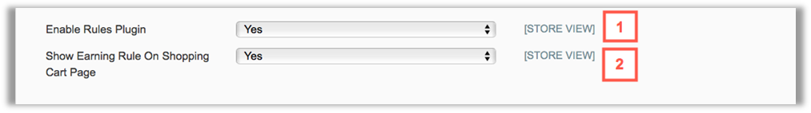

1.	Choose **Yes** to enable Rules plugin

2.	Choose **Yes** to show Earning Rule on Shopping Cart Page

##### 1.2.1.2. Manage Earning Rate and Rule 

###### a. Manage Earning rate

**Path:  Backend > Reward Points > Earning > Earning Rates**

Then the **Earning Rates** page will be shown, allowing you to do many tasks:

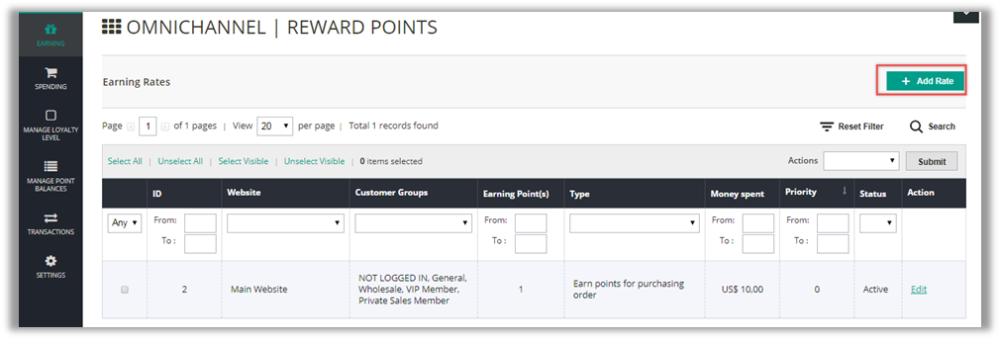

•	**Add a new rate**

In order to add a new earning rate, you can click on the **Add Rate** button and then fill out all the required data below: 

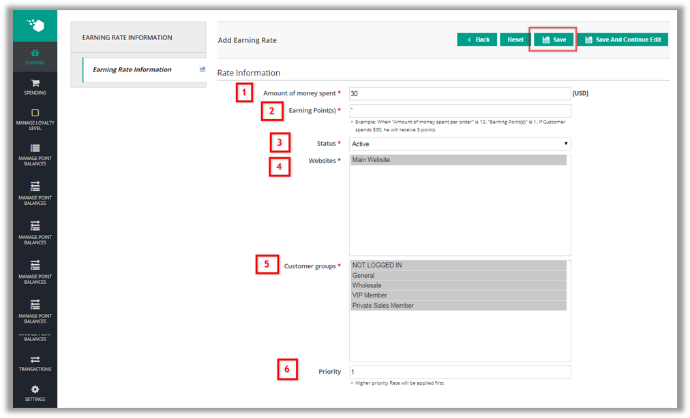

1.	**Amount of money spent**: Enter a specific amount of money

2.	**Earning point(s)**: Enter the number of points that you want customers to earn when they place orders. It is compatible with the above money spent.

3.	**Status**: Select Active to enable the earning rate in fronend

4.	**Websites**: Select the website where customers can earn points

5.	**Customer groups**: Select the customer groups which are allowed to earn points

6.	**Priority**:  This field allows you to set up the priority level for every earning rule. If there are many rules, then the one with the highest priority will be applied first. In case there are two rates with the same priority, the rate created sooner will be applied.

After you finish filling out all the required data, remember to click on the **Save** or **Save and Continue Edit** button to save your work. If you click on the **Save** button, you’ll be navigated to the **Earning rates** page and your rate will be shown as below:

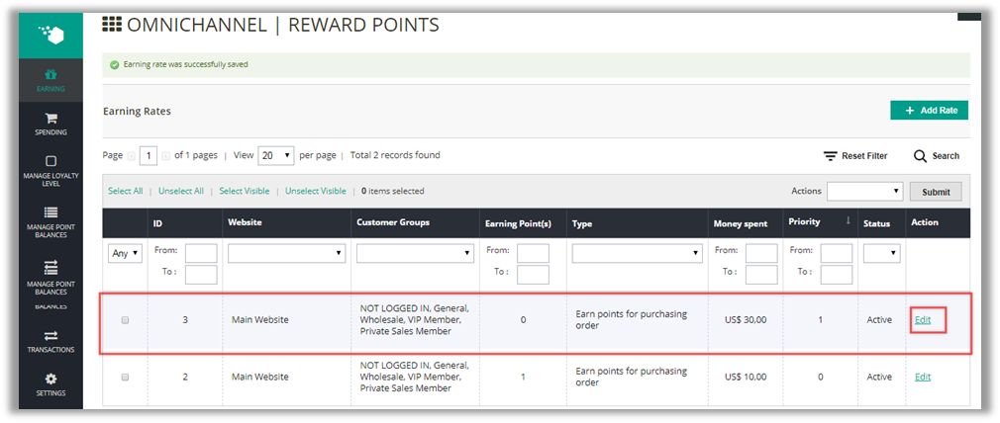

•	**Edit/ Delete an existing rate**

In case you want to edit a rate, please click on the **Edit** link in the **Action** column.

Then you will be redirected to the **Edit Earning Rate** page:

After editing the rate as you want, remember to click on the **Save** or the S**ave and Continue Edit** button to save your work.

To delete a rate, you can go to the **Edit Rate** page and then click on the **Delete** button on top of the page.

###### b. Manage Catalog Earning Rules

**Path:  Backend > Reward Points > Earning > Catalog Earning Rules**

Or you can follow the path **Earning > Catalog Earning Rules** as below:  

Then you can see the **Catalog Earning Rule Manager** page as below:

•	**Add a new rule**:

In order to add a new catalog rule, click on the **Add Rule** button and fill out all the required data.

**General Information tab**:

You should pay attention to these following fields:

1.	**Rule Name**: Set name for a rule

2.	**Description**: Describe the rule

3.	**Status**: Select **Active** or **Inactive** to allow the rule works or not.

4.	**Websites**: Select the website you want to apply the rule.

5.	**Customer Group**: Select types of customers you want to apply the rule. 

 6,7. **Validate from** and **Validate to**: These fields are used to configure the effective time of the rule.

8.**Priority**: This field allows you to set up the priority level for every catalog rule. If there are many rules, then the one with the highest priority will be applied first.

**Conditions tab**: 

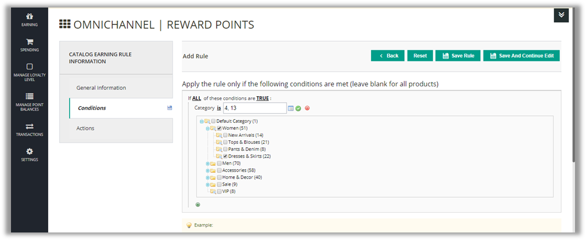

This tab allows you to configure the products to which the rule is applicable. For example, if you want to apply this rule for **Dress and Shirts**, you can configure the condition as in the image above.

If you leave this tab blank, the rule will be applied for all products.

**Actions tab**:

In this tab, you can configure the number of points that Customers will receive according to the rule and how to exchange points when they purchase products. There are three options for you to choose: 

**Option 1: Give Fixed X points to Customers**:

 Customers will receive a fixed number of points for whatever products they buy. 

For example, if you want to give Customers 5 points for purchasing products, then:

1.	Choose **Action**: Give X points to Customer 

2.	Fill in field **Points** (X): eg: 5

3.	Select  **Yes** for the field **Stop Further Rules Processing** to stop applying  all other Shopping Cart Earning rules or **No** to apply the rule with the highest priority level.

➪ If Customers purchase a product of $500.00 or $800.00, they will earn 5 points.

**Option 2: Give X points for every Y amount of Price**: 

The more expensive the products Customers buy, the more points they can receive. 

For example, if you want to give Customers 5 points for every $200.00 of price they spend and limit the number of points that can be earned to 15, then:

1.	Choose **Action**: Give X points for every Y amount of price 

2.	Fill in field **Points** (X): eg: 5 

4.	Fill in field **Money Step** (Y): eg: 200 

3.	Fill in field **Max points earned by this rule**: eg: 15 

4.	Select  **Yes** for the field **Stop Further Rules Processing** to stop applying  all other Shopping Cart Earning rules or **No** to apply the rule with the highest priority level.

➪  If Customers purchase a product of $800.00, they will earn 15 points.

**Option 3: Give X points for every Y amount of Profit**

 The more profits get from selling products that Customers buy, the more points they can receive.

For example, if you want to give Customers 5 points for every $200.00 of profit they make and limit the number of points that can be earned to 15, then:

1.	Choose **Action**: Give X points for every Y amount of Profit 

2.	Fill in field **Points** (X): eg:5 

3.	Fill in field **Money Step** (Y): eg: 200 

4.	Fill in field **Max points earned by this rule**: eg: 15

5.	Select  **Yes** for the field **Stop Further Rules Processing** to stop applying  all other Shopping Cart Earning rules or **No** to apply the rule with the highest priority level.
.
➪  If Customers purchase a product which contributes $800.00 in profit, they will earn 15 points.

After you finish configuring, remember to click on the **Save Rule** or **Save and Continue Edit** button to save your work. If you click on the **Save Rule** button, you will be navigated to the **Catalog Earning Rule Manager** page and the rule will be shown in the catalog rule list as below:

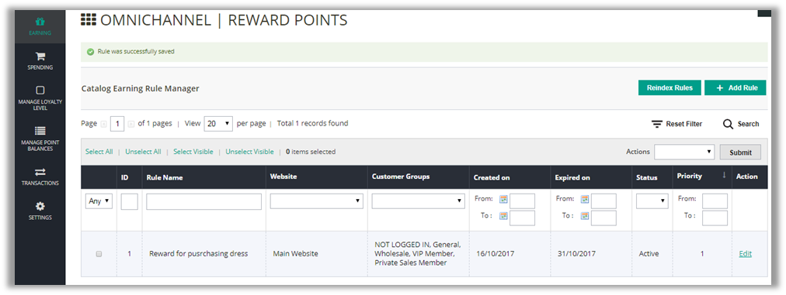

•	**Edit/ Delete an existing rule**

In case you want to edit any catalog rule, please click on the **Edit** link in the **Action** column. Then you will be redirected to the **Edit Rule** page.

After editing the rule as you want, remember to click on the **Save Rule** or **Save and Continue Edit** button to save your work.

To delete a catalog rule, you can go to the **Edit Rule** page and click on the **Delete** button on the top of the page. 

###### c. Manage Shopping Cart Earning Rules

**Path:  Backend > Reward Points > Earning > Shopping Cart Earning Rules**

Or follow as below: 

•	**Add a new rule**

In order to add a new **Shopping Cart** rule, you can click on the **Add rule** button and fill out all the required data.

**General Information tab**

You should pay attention to these following fields:

1.	**Rule Name** : Set rule name, which will be shown on the **My Reward** page on fronend. 

2.	**Description**: Describe the rule

3.	**Status**: Select **Active** or **Inactive** to allow the rule works or not.

4.	**Websites**: Select the website you want to apply the rule.

5.	**Customer Group**: Select types of customers you want to apply the rule. 

6,7. **Validate from** and **Validate to**: These fields are used to configure the effective time of the rule.

8. **Priority**: This field allows you to set up the priority level for every catalog rule. If there are many rules, then the one with the highest priority will be applied first

**Conditions tab**:

This tab allows you to configure the condition of shopping carts to which the rule is applicable. 

For example, if you want to apply this rule only for carts which have **Subtotals** greater than $300, you can configure the condition as in the image above:

If you leave this tab blank, the rule will be applied for all shopping carts.

**Actions tab**

In the **Action** tab, you can configure the number of points that Customers will receive when the rule is applied.

There are three options of actions for you to choose:

**Option 1: Give fixed X points to Customers**:

 Customers will receive a fixed number of X points for whatever order they place.

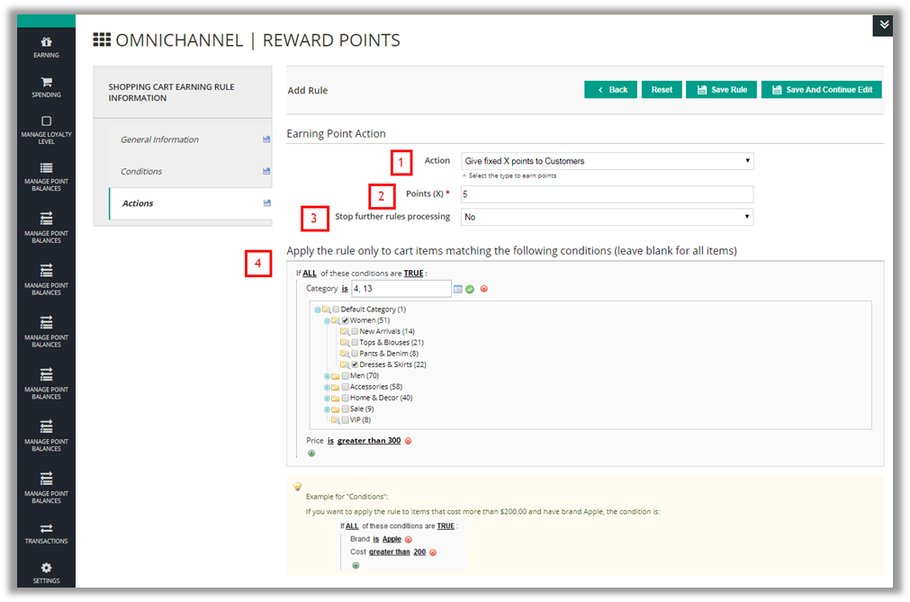

For example, if you want to give Customers 5 points for purchasing, then:
1.	Choose **Action**: Give fixed X points to Customers 

2.	Fill in field **Points** (X): 5 

3.	Select  **Yes** for the field **Stop Further Rules Processing** to stop applying all other Shopping Cart Earning rules or **No** to apply the rule with the highest priority level.

4.	Choose the conditions of card items to apply the rule 

➪  If Customers place an order of $100 or $1000, they will earn 5 points.

**Option 2: Give X points for every Y money spent**: 

The higher the order values that Customers place, the more points they can receive.

For example, if you want to give Customers 5 points for every $200.00 spent and limit the number of points that can be earned to 15, then:

1.	Choose **Action**: Give X points for every Y amount spent 

2.	Fill in field **Points** (X): 5 

3.	Fill in field **Money Step** (Y): 200 

4.	Fill in field **Max points earned by this rule**: 15 

5.	Select  **Yes** for the field **Stop Further Rules Processing** to stop applying all other Shopping Cart Earning rules orNo to apply the rule with the highest priority level.

6.	Choose the conditions of card items to apply the rule 

➪ If Customers purchase an order of $800.00, they will earn 15 points.

**Option 3: Give X points for every Y quantity**:

 The more products Customers buy from your store, the more points they can receive. 

For example, if you want to give Customers 5 points for every 10 items they order and limit the number of points that can be earned to 15, then:

1.	Choose **Action**: Give X points for every Y qty purchased 

2.	Fill in field **Points** (X): eg.  5 

3.	Fill in field **Quantity** (Y): eg.  10 

4.	Fill in field **Max points earned by this rule**:  eg. 15 

5.	Select  **Yes** for the field **Stop Further Rules Processing** to stop applying all other Shopping Cart Earning rules or **No** to apply the rule with the highest priority level. 

6.	Choose the conditions of card items to apply the rule 

➪ If Customers purchase an order of 40 items, they will earn 15 points.

After you finish configuring, remember to click on the **Save Rule** or **Save and Continue Edit** button to save your work. If you click on the **Save Rule** button, you will be navigated to the **Shopping Cart Earning Rule Manager** page and the rule will be shown in the catalog rule list as below:

•	**Edit/ Delete an existing rule**

In case you want to edit any shopping cart rule, please click on the **Edit** link in the **Action** column. Then you will be redirected to the **Edit Rule** page.

After editing the rule as you want, remember to click on the **Save Rule** or **Save and Continue Edit** button to save your work.

To delete a catalog rule, you can go to the **Edit Rule** page and click on the **Delete** button on the top of the page. 

######  d. Manage Earning points by product

**Path:  Backend > Reward Points > Earning > Manage earning points by product**:

Or follow the path **Earning > Manage earning points by product**:

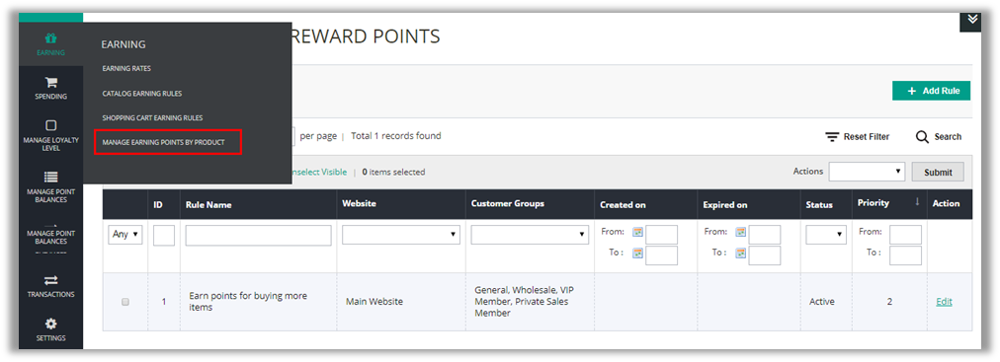

Then you will be redirected to the **Manage Earning Points By Product** page:

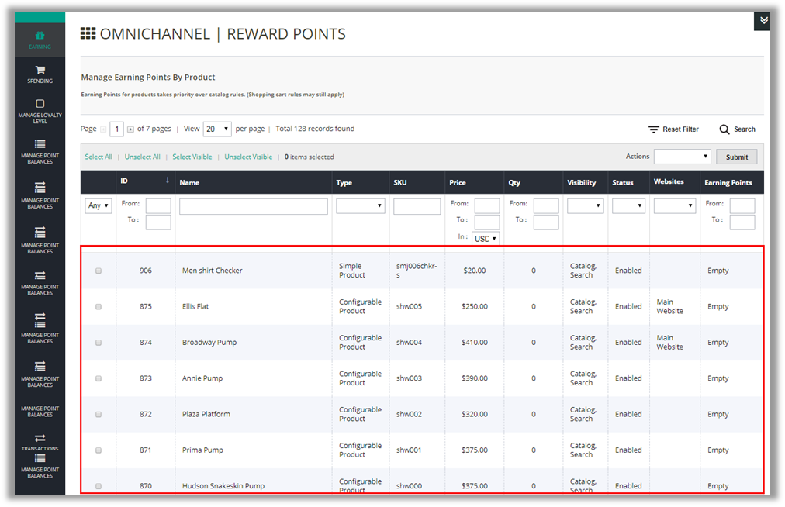

On this page, you can change the number of earning points for each product by 2 ways:

✓ Tick the product, choose **Change Point** in dropdown menu of **Action** box. Then, fill in the number of points you want to set.

✓ Double click on **Earning Points** column of the product you want to edit. Insert the number of points as you prefer, then click on **Ok**

Please note that Earning Points for products takes priority over catalog rules, and shopping cart rules may still apply.

##### 1.2.1.3. Mange Speanding Rate and Rule
###### a. Manage Spending Rate

**Path: Backend > Reward Points > Spending > Spending rates**

Or follow the path below: 

Then the **Spending Rates** page will be shown, allowing you to do many tasks:

•	**Add a new rate**

In order to add a new spending rate, you can click on the **Add Rate** button and then fill out all the required.

1.	**Spending Points**: Enter a specific number of spending points

2.	**Discount received**: Enter the amount of money which will be discounted,  compatible with the above spending points.

3.	**Status**: Select **Active** or **Inactive** to allow the rule works or not.

4.	**Limit Spending points based on fixed amount** or **a percentage amount** of Total Order Value or none of which are applied. 

5.	**Websites**: Select the website you want to apply the rule.

6.	**Customer Group**: Select types of customers you want to apply the rule. 

7.	**Priority**: This field allows you to set up the priority level for every catalog rule. If there are many rules, then the one with the highest priority will be applied first.

---------------

Confidential Information Notice 

Copyright 2017. All Rights Reserved. Any unauthorized reproduction of this document is prohibited. 

This document and the information it contains constitute a trade secret of Magestore and may not be reproduced or disclosed to non-authorized users without the prior written permission from Magestore. Permitted reproductions, in whole or in part, shall bear this notice.

