# ECOMMERCE MANAGEMENT - MAGENTO 2

Confidential Information Notice 

Copyright 2017. All Rights Reserved. Any unauthorized reproduction of this document is prohibited. 

This document and the information it contains constitute a trade secret of Magestore and may not be reproduced or disclosed to non-authorized users without the prior written permission from Magestore. Permitted reproductions, in whole or in part, shall bear this notice.
 

## Introduction

According to Big Commerce and Square, ecommerce is growing 23% year-over-year. Even 2 in 5 (40%)online shoppers say they couldn’t live without online shopping. However, many e-commerce businesses are struggling to capitailize on their digital sales channels.

So how retailers can manage their business to maximize sales on online channels in the emerging technology world? 

Magento 2 Ecommerce Management module including Store Pickup, and Loyalty programs is here to help you create more values for your customers and thus, will boost sales for the whole business. 

With Loyalty programs module, your ebusiness can build a strong relationship with their customers and drive more sales from returning ones as well through Reward Points, Store Credit and Gift Cards. Besides, Store Pickup will satisfy your shoppers with the convenient option of ordering online - picking up in store.  

This guide is specially written according to each role of an ecommerce business including manager and staff members. Therefore, you can quickly understand the responsibility of your workforce during the operation of an ecommerce business.  

----------------------

## Permission Matrix

----------------------

## For Ecommerce Manager

### Validating Orders & Store Pickup Processing
####  Validate orders
##### Check orders in store

✓ **Path:  Inventory Management -> Warehouses**

The **Manage Warehouses** page will display a list of warehouses and you need to find the warehouse that customers place their pickup-in-store order and click on **View** to view the chosen warehouse. 

1)	In the **View Warehouses** page - section Orders, find the order that customer want to pick up in store. 

2)	Click on **View** to see the detail of the order. 

The order page will be opened and you can see all the information of the order as above:.

##### Process Shipment for customers

###### Create shipment

✓ **Path: Sales > Orders** 

1)	In the **Information** tab, click on **Ship** 

The **New Shipment** page will open and include a customer’s information such as sales info, account, address, payment and shipping method. 

2)	Click on **Submit Shipment** button to complete.

When a new shipment is created, you will see the notification:  **“ The shipment has been created”**

######  Print Packing Slips

✓ **Path: Sales > Orders** 

After a new shipment has been created, if you want to print packing slips:

1)	In the **Information** tab of the chosen order page, click on Invoice.

2)	Click on **Print** button to print out packing slips. 

######  Send confirm email to customers

✓ **Path: Sales > Orders** 

Continually, to send confirm email to customers: 

In the **Information**  tab, click on **Send Emai**

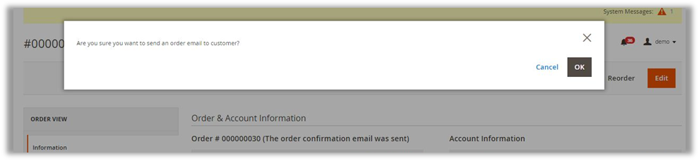

•	Then a popup will appear to make sure that you want to send confirm email to customers. Click on **OK** to complete.

•	After that, you will see the notification as above:

#####  Request Transfer Stock from other warehouses

If the store where customers choose to pick up their orders doesn’t have enough stock to provide, it ‘s time  to request stock from other warehouses, firstly go to **Inventory Management > Transfer Stock > Request Stock**.

In the **Add a New Request Stock** tab, let’s fill the **Transfer Code**, choose **Source Warehouse** and **Destination Warehouse**.  Besides, you can fill in the **Reason** box for resquesting stock. 

Then, to prepare product list, click on the **Prepare Product List** button as the image above. 

To add new list of products:

1)	Click on the product needed 

2)	**Add Selected Products**

3)	Choose the quantity to transfer and click on **Start Request Stock**

4)	Click on **Remove** to delete product line

The **request transfer** is completed.

#####  Receive Transfer stock 

After the staff of the requested warehouse confirmed transferring their stocks and these stocks are ready to import into your store, it’s time to receive them. 

To receive stock from other warehouses, in the tab Click on **Select Products** in **Receiving history** section:

1.	Click on the request created for receiving

2.	Click on **Add Selected Products**

3.	Write the quantity received in receiving history

	

4.	Click on **Save Receive**

#### Deliver orders in store

#####  Find pickup-in-store orders

✓ **Path: Inventory Management > Warehouse**.

In the **Manage Warehouses** page, tick to the warehouse of store in which your customer want to pick up his/her order.

Then click **View** to see the order in the chosen warehouse. 
 

**View Warehouse** page will open and in the **Orders** section, you can find the order of customer picking up in your store. **Apply Filters** to find that order easily by following steps in the image above.

#####  Print invoice 

1)	In the **View Warehouse** page - section **Orders**, click **View** to see the detailed information of the customer’s order.	

2)	Click on **Invoice** to create a new invoice for customer: 

A **New Invoice** page will appear with all information of the customer ‘ s order. 

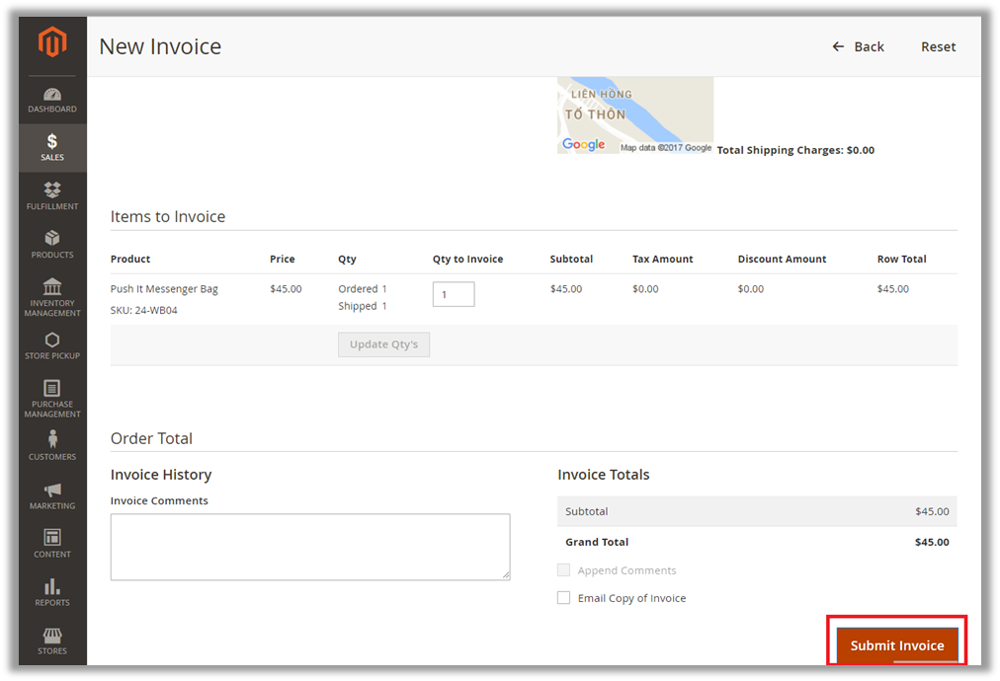

3)	Click on **Submit Invoice** button. Then a new invoice has been created.
 

4)	To print it, click on **Print** button. 

### Loyalty programs 
#### Reward Points
#####  Add new rate

1)	Click on reward points

2)	Click on spending rates 

3)	Click on  add new spending rate

Fill all the data needed in the boxes

Click on **Save spending rate** after finishing filling in all the boxes

The new earning rate will be shown as the beside image

#####  Edit existing rate 

✓ **Path: Reward Point > Spending Rates**

Click on **Edit** on action column of the rate needed to be edited

Edit the rate, then click **Save** spending rate, or **Delete** it

#####  Manage transaction

✓ **Path: Reward points > Transactions** 

Click on **Add new transaction** to add new transaction

Fill in the required information and click on **Save**

##### Manage point balances of customers

✓ **Path: Customers > All customers**

Click on **Edit** of the customer needed to be managed

Click on reward points to manage the customer’s balance by filling the change balance, change title, points expire on box

Also, update points subscription and expire transaction subscription can be configured in reward points

 Click on **Save customer** to save the changes

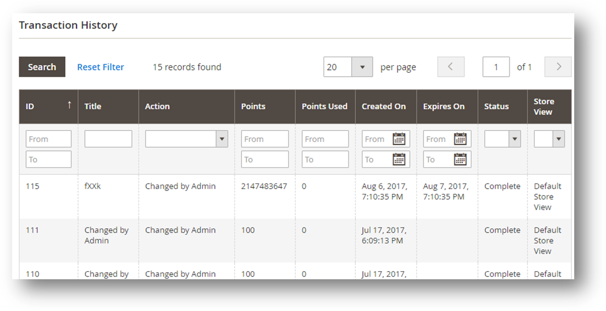

All transactions of a customer are also listed in reward points

##### Change point balance

✓ **Path: Reward points > Manage points balances**

There are two ways to change the point balance of a customer. 	

The first way is to enter the **Change Balance** in the **Reward Points** session as mentioned above.

The second way to change points, which can be done to many customers at the same time, is illustrated below:

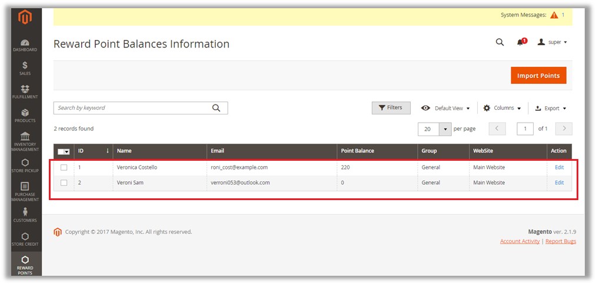

A list of customers will be shown with point balance column

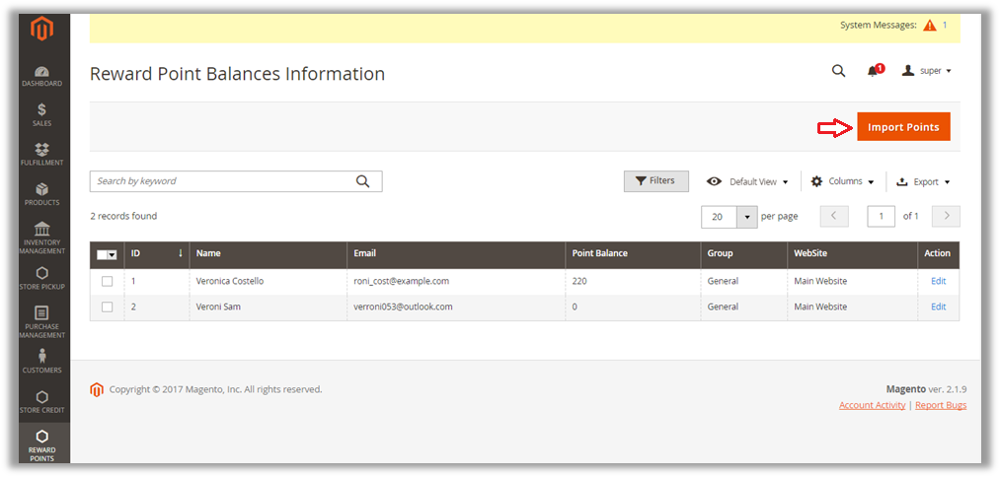

Click on **Import** to import from computer

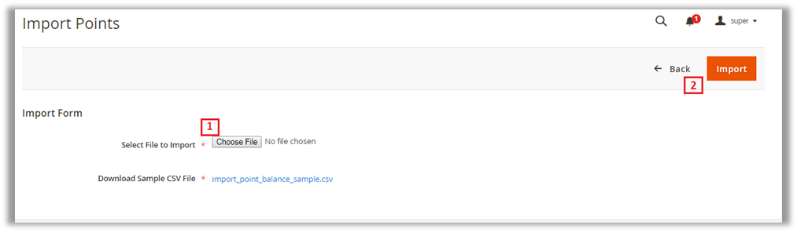

1)	Click on **“Chọn tệp”** to upload file

2)	Click on **Import** to import it

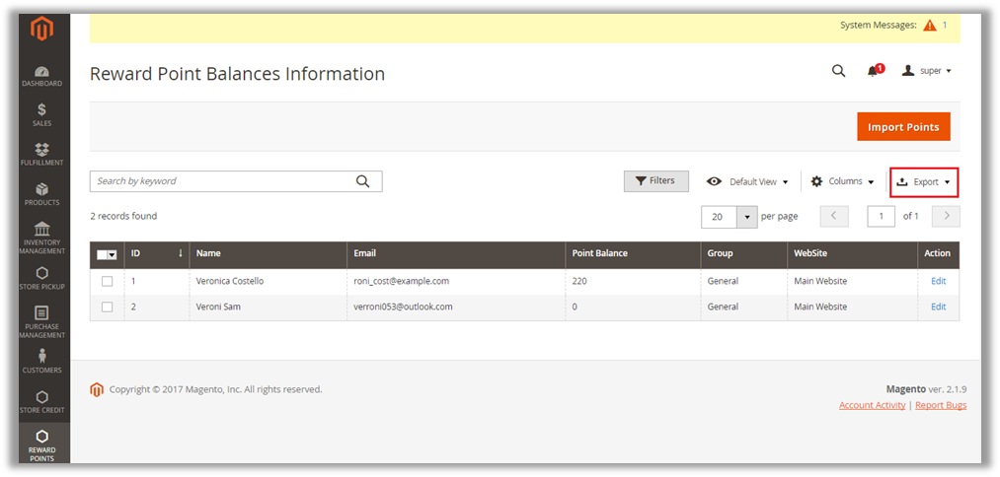

The list of customers in **Reward Point Balances Information** page can also be exported by clicking on **Export**

#####  Use points when creating orders in backend

✓ **Path: Sales > Orders**

1)	Click on **Sales**

2)	**Orders**

3)	Click on **Create new order**

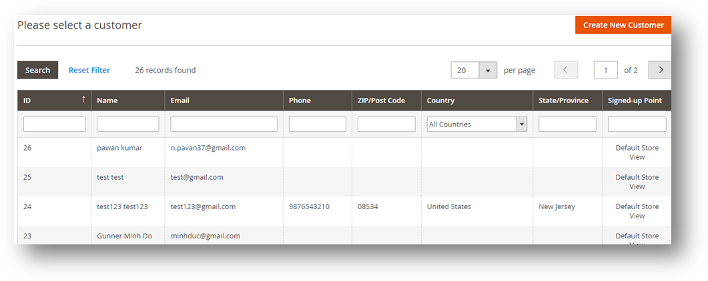

Select customer from the list

Click on **Add products** to add products to the order

Click on the product and enter the quantity, then click on **add selected product(s) to order**

Set the number of point customer will use in the order in the use customer reward points

Fill in the required fields, click on submit order to finish creating new orders.

#####  Refund an Order into points balance in backend

✓ **Path: Sales > Orders**

1)	Click on **View** to see the details of an order 

2)	On the top bar, click on **Credit Memo** label to create a refund order 

On the pop-up screen named , scroll down, then

1)	Enter the earned points that will be refunded to customer’s balance

Click on  to finish

After the credit memo has been created.

2)	Click on **Credit Memo** tab on the left hand-side to view credit memos data

#### Store Credit
#####  Manage Customers Using Credit.

✓	**Path Store Credit > Manage Customers Using Credit**

Then the **Customers Using Credit Manager** page will be displayed as above.

This page shows a list of all customers using credit and their information such as name, email, credit balance, telephone, etc.

To view more details about a customer, click on the **Edit** link in the **Action** column. 

Then, you will be navigated to the **Customer Information** page. By selecting **Store Credit** tab, you can view all of that customer’s transaction history and credit balance.

1)	Entering an integer (a positive or negative number) 

2)	Add an comment such as why you add credit for customers. 

Our module will auto send email to customer to announce about this transaction if you tick on **Send email to customer** checkbox. The email will be sent to the customer as above.

After you save, our module will auto update the customer’s credit balance, send an email to that customer and create a transaction as above.

##### Manage Credit Products

✓	**Path:  Store Credit > Manage Credit Products**

Then the **Credit Product Manager** page will be shown.

This page shows you all credit products with a lot of information such as **product ID, name, SKU, quantity, status,** etc.

To add a new credit product, click on the **Add Credit Product** button on the right top of the page.

You can add a credit product just in a similar way to adding a normal product.

- **Prices** Tab:

In this tab, you can configure the value of the credit product. There are three types of credit products including **fixed value, range of values and drop-down value.**

-	**Setting**  Section

In this tab, by default, our module sets up the field **Manage Stock** as **Yes**. It means that you need to manage the quantity of credit products.

1)	**Enable Product**: activate the Store Credit

2)	**Attribute Set**: select default or any attributes available to purchase by Store Credit

3)	**Product name**: enter the name 

4)	**SKU**: enter the SKU of your store credit

5)	**Quantity**: enter the number of store credit cards you can give (optional)

6)	**Stock Status**: select the current availability of the Store Credit

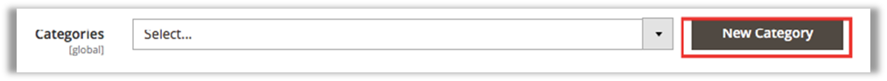

7)	**Categories**: select the categories that you sell this Store Credit. In case, you do not have fitted category. Click on “**New Category**”

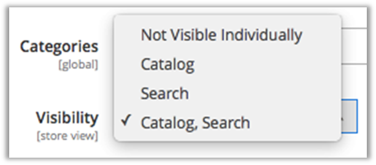

8)	**Visibility**: choose where it will be visible to customers

9)	**Set product as new from**: choose active date of the Store Credit

10)	**Visible on Web POS**: activate the Store Credit on the Web POS

•	**Advanced Inventory**
	
✓ **Path: New Product > Quantity > Advanced Inventory**

1)	**Manage Stock**: our module sets up the field as **Yes**. It means that you need to manage the Qty.. of Credit Products. You can edit it by uncheck box **Use Config Settings**.

2)	**Qty.**: it is synchronized with the **Qty**. on **New Product** Section

3)	**Out-of-stock Threshold**: our module sets up the field as **0**. It means the product will be notified “Out-of-stock” when the number of items is 0. You can edit it by uncheck box **Use Config Settings**

4)	**Minimum Qty. Allowed in Shopping Cart**: our modules set up the field as **1**. It means a customer must have at least 1 product in a single order to purchase Store Credit Product. You can edit it by non- checking box **Use Config Settings**.

5)	**Maximum Qty. Allowed in Shopping Cart**: as mentioned in No.4

6)	**Qty. Uses Decimals**: select **No** if the Qty. is not a decimal value

7)	**Allow Multiple Boxes for Shipping**: select **NO** if the Qty. purchased CAN NOT be shipping in separate boxed

8)	**Backorders: Backorder** means funds are still authorized or captured immediately when the order is placed, regardless of whether the product is in stock. Product will be shipped as they become available

•	**No backorders**: Do not accept backorders when product is out stock

•	**Allow Qty. below 0**: Accept backorders when the Qty. falls below zero

•	**Allow Qty. below 0 and notify customer**: accept backorders when the Qty. falls below zero, but notifies customers that orders can still be placed

9)	**Use Deferred Stock Updated**

10)	**Notify for Qty. below**: determine the stock level at which the system will notify the inventory is below the threshold

11)	**Enable Qty. Increments**: select if the product can be sold in quantity increments (**Qty. increments** –the number of products that must be purchased at the same time)

12)	**Stock Status**: it is synchronized with the **Qty.** on **New Product** Section

##### Manage Credit Transactions and Report Charts
###### Credit Transactions

✓	**Path: Store Credit > Credit Transactions Section > Manage Credit Transactions**

Then the **Credit Transactions** page will be shown as below

.
✓ **Path: Store Credit > Manage Credit Transactions**

This page shows all credit-related transactions with a lot of information such as **type, detail, customer name/email, added/deducted credit, credit balance** after transaction.

You can search any transaction by using filter boxes in each column.

If you click on a customer’s email, you will be navigated to the **Customer Information** page.

###### Credit Report Charts

✓ **Path: Store Credit > Credit Transactions Section > Customer Credit Report**

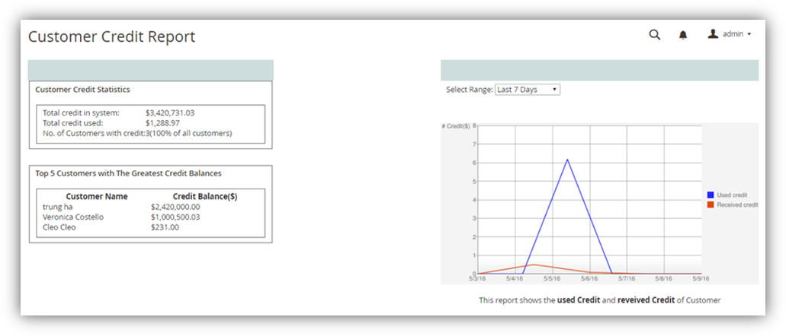

Then the **Report Charts** page will be shown as above.

This page can be divided into two main sections including **Life-time Reports** and **Period-of-time Report Charts**.

•	**Life-time Reports**: 
There are 2 types of reports.
	-	**Customer Credit Statistics** with the total credit, the total spent credit and the number of Customers with credit in your system.
	-	**Top 5 Customers with The Greatest Credit Balances** with their names and current balances in your system.

•	**Period-of-time Report Charts**: This chart shows you the total spent credit and received credit of all Customers per day in your chosen time range such as **last 24 hours, last 7 days, current month**, etc.

##### Use Credit when creating orders in backend

✓ **Path: Sales > Operations Section > Orders > enter numbers on Customer Credit tab**

On the **Create Order** page on backend, our module allows you to use credit when creating orders for customers.

Enter a credit amount and click on the **Gray Arrow** button.

Our module will auto-update and calculate the grand total of the order.

After submitting the order, the customer’s credit balance will also auto updated and you can check the transaction on the **Credit Transaction** page.

#####  Refund Orders into Credit Balance

When customers want to refund an order, our module allows you to transfer the order value to his credit balance. In that way, customers can use the credit for future purchases and you do not have to lose money for the refund at the same time. 

After clicking on the **Credit Memo** button, 

1)	Enter enter the amount you want to refund into credit as above

2)	Click on the **Refund Offline** button

The amount you entered as well as the credit that the customer used for paying for the order will be refunded to his current credit balance. 

For any order that includes only Credit Product, the option **Refund Order to Credi**t is not available. 

Once the refund is finished, you can check the transaction on the **Manage Transaction** page.

##### Settings

✓  **Path: Store Credit > Settings > Magestore Extension tab > Store Credit**

•	**General Configuration** Tab:

✓ **Path: Magento Extension > Store Credit**

1)	**Enable Store Credit**: to activate Store Credit on your site

2)	**Allow sending Credit**: allow customers to send credit to their friends

3)	**Groups can use edit**: allow only general/wholesaler/retailer or all customers able to use credits

•	**Spend Credit On** Tab

1)	**Apply Customer Credit**: If you choose **After tax**, it means the Customer Credit Discount will be applied to order value including tax

2)	**Shipping fee**: If you choose **No**, credit balance cannot be used to pay for Shipping Fee

•	**Email Configuration** Tab

1)	**Email template with credit code sent to recipients**: default

2)	**Email template with verification code sent to credit sender**: default

3)	**Email template notifying customers**: default

4)	**Send-to-customer email template when recipient receives credit**: default

•	**Adjust time for Customer credit reports on total used and total received credit** Tab.

1)	**Select start time for current year**: choose Month, then Date

2)	**Select date for current month**: choose Date

•	**Style Configuration** tab:

1)	**Background of Title**: enter Hexadecimal code

2)	**Color of Title**: enter Hexadecimal code or choose a color as above.

#### Gift Cards
##### Setting

✓ **Path: Marketing > Gift Card > Settings**

To configure default configurations and settings of the extension, please log in to backend screen, and then do the following stages as below:

**GENERAL**

**Gift code**

1)	Select **“YES”** in the dropdown list to enable Gift Card

2)	Configure the pattern to auto-generate gift codes for Gift Card products when customers purchase in WebPOS frontend

3)	Enter the number of **prefix characters** which are shown in a voucher code

4)	Enter one **letter to replace hidden characters**

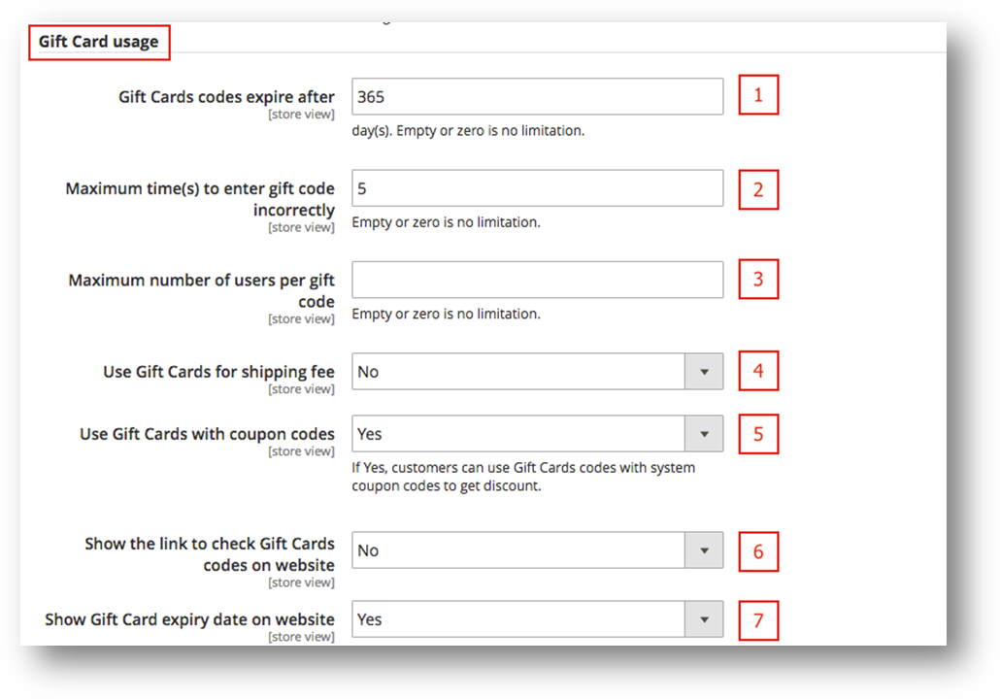

**Gift Card Usage**

1)	Enter the term of validity that Gift Cards can be used after being activated.

2)	Enter the **maximum time(s) ** that allows users to enter gift code incorrectly.

3)	Enter the **maximum number of users per gift code.**

4)	Select “**YES**” to allow customer to apply gift card for shipping fee

5)	Select “**YES**” to allow customers to use both Gift Card codes and Coupon codes at once. 

6)	Select “**YES**” to allow customers to check status of Gift Cards after entering Gift Codes, and vice versa.

7)	Select “**YES**” to show the expiration date of Gift Cards on website, and vice versa.

**Tax Configuration**

Select:

1)	**After Tax**: to allow applying Gift Card after the tax is applied

2)	**Before Tax**:  to allow applying Gift Card w/o tax

**ON PRODUCT PAGE**

**Gift Card Value**

1)	Enter the default gift card value (follow the below instruction)

2)	Enter the description of gift card value (follow the below instruction)

**Gift Card Template**

-	Select “**YES**” to allow customers to change the image inserted in the template

-	Limit the maximum size of images uploaded by customers to 500KB

**Gift Card Shipping Information**

-	Select “**YES**”: Gift card can be sent through the post office

-	After Customers order Gift Cards for friends and choose Send through post office option, Gift Cards will be sent to recipients within 5 days

-	Limit the maximum length of a custom message on Gift Card. Select “**YES**” to allow users to schedule gift card delivery date.

**ON SHOPPING CART PAGE**

1)	Select “**YES**” to Enable a Gift Card box for customers to apply gift codes right on the shopping cart page.

2)	Select the data to display on shopping cart page

3)	Select “**YES**” to allow showing Gift Card printout preview as product image on shopping cart page

**ON CHECKOUT PAGE**

Select “**YES**” to show Gift Card box on the checkout page

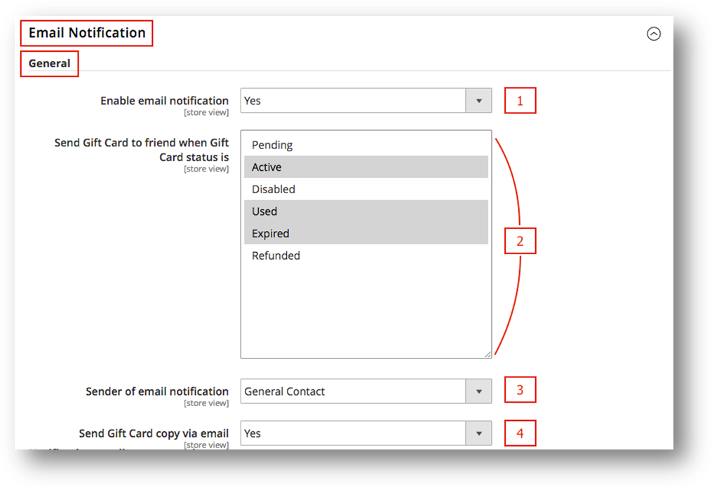

**EMAIL NOTIFICATION** 

**General**

1)	Select “**YES**” to allow sending notification emails to customers and recipients

2)	Select “**Active**”, only a gift card which is activated can be sent to a friend

3)	Set the default sender of notification emails as General Contact 

4)	Select “**YES**” to allow sending a copy of gift card via email if customers choose to ship through post office.

**Notification email sent to purchasers**

1)	Select the email template sent to purchasers after buying Gift Card successfully. 

2)	Select the email template sent to purchasers when recipients receive Gift Cards. 

**Notification email sent to recipient**

3)	Select “**YES**” to allow email notification being sent to recipient when sender refunds Gift Card.

4)	Select the email template sent to the gift card’s recipient. 

5)	Choose the email template sent to recipient when gift card is refunded. 

6)	Enable auto reminder email sent to Customers before Gift card expires 

7)	Enter the number of days to send notification to customers before the expiration date of a Gift card. 

**GIFT CARD PRINTOUT**

Click “**Choose File**” to upload an image used as a logo when Gift Cards are printed or sent via email. 

#####   Manage Gift Card Templates

######  Add new template

✓ **Path: Marketing > Gift Card > Manage Gift Card Templates**

1)	Click **Add New Template**

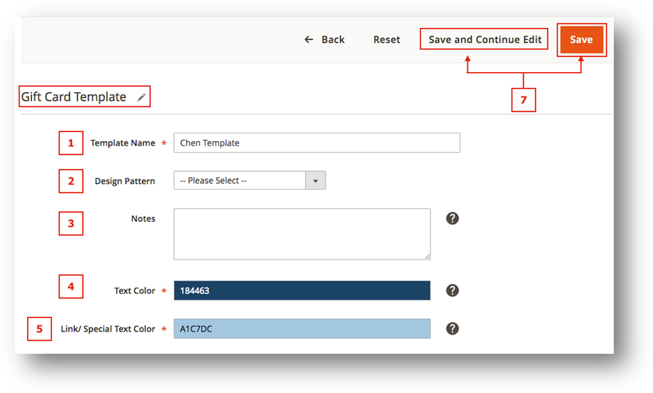

On the popup screen

2)	Enter the template’s name

3)	Choose a design pattern in dropdown list (optional)

4)	Enter notes or description about the gift card template (if any)

5)	Choose text color

6)	Choose link/ special text color

7)	Upload a background image. 

8)	Click “**Save and Continue**” or “**Save**”

######  Preview Existing Template

✓ **Path: Marketing > Gift Card > Manage Gift Card Templates**

Click “**Preview**” to see the gift card template

######  Edit and Delete Existing Template

✓ **Path: Marketing > Gift Card > Manage Gift Card Templates**

2)	Mark the template checkbox

3)	Tab the action label, select “**Delete**” to remove templates. 

4)	Click “**Edit**” to update templates data

On the popup screen

5)	Edit templates data

6)	Click “**Save**” to finish

7)	Additional guidance: Click “**Delete**” to remove template.

#####  Generate Gift Codes

✓ **Path: Marketing > Gift Card > Generate Gift Code**

1)	Click on “**Add Gift Code Pattern**” to create new pattern code

On the popup screen

2)	Enter the pattern name

3)	Follow the example mentioned below and set a format for the gift code  

4)	Enter the Gift code value

5)	Select a currency

6)	Select an expiration date

7)	Select a gift card template

8)	Enter the quantity of gift code issued

9)	Select store views

10)	Click on: 

-	“**Save and Generate**” to save and generate the gift code at the same time

-	“**Save**” to finish

A status “the pattern has been generated successfully” would be shown on the pop-up screen.

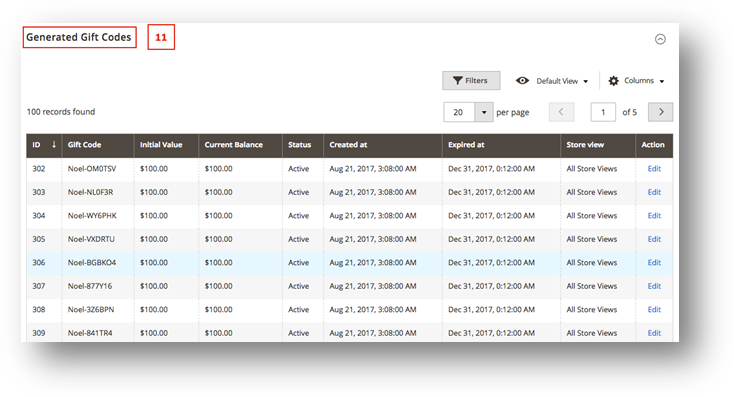

11)	A list a generated Gift Codes would be shown at the botton of the pop-up screen 

#####  Manage Gift Codes
######  Create a new Gift Code

✓ **Path: Marketing > Gift Card > Manage Gift Code**

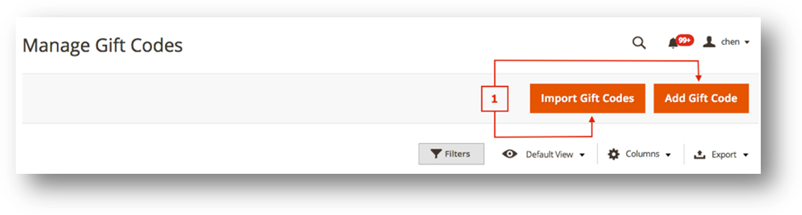

1)	Click on “Add Gift Code” to create a new gift code

Moreover, click on “**Import Gift Codes**” to import data from your device to the system.
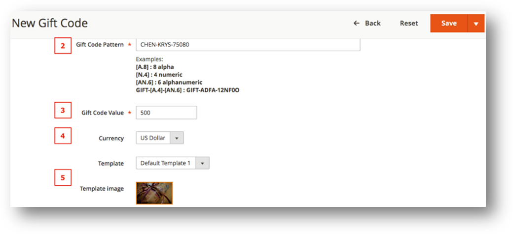

On the popup screen:

2)	Follow the example mentioned below to set a format for the gift code

3)	Enter the Gift code value

4)	Select a currency

5)	Select a gift code template

6)	Select “**Active**” to enable/ activate the gift code

7)	Select an expiration date

8)	Select store views

9)	Write a comment (optional)

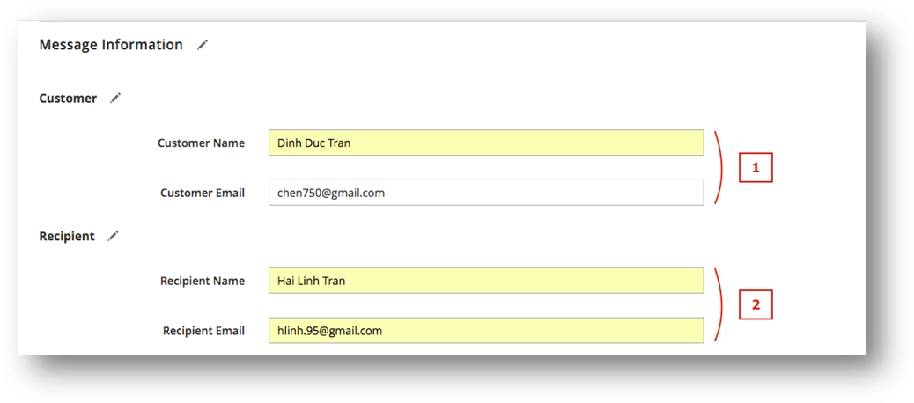

Scroll down, on the **Message Information** tab, click   to expand.

1)	Enter the sender name and email

2)	Enter the recipient name and email

3)	Enter the recipient Address

4)	Enter the message to the recipient

Finally, scroll up, tab the arrow on the right hand-side of “Save” button: 

1)	Select “**Save & Send Email**” to save and send Gift Codes via emails to both sender and recipient

2)	Select “**Save & Continue Edit**” to finish.

######  Manage Gift Card History per customer

✓ **Path: Customers > All Customers**

1)	Click “**Edit**” to view an existing customer’s detailed information 

On the popup screen:

2)	Click on “**Gift Card History**” tab to view all transactions in which gift cards were applied

#####  Apply Gift code when creating new orders

✓ **Path: Customers > All Customers**

On **Create New Order** page, after selecting a customer and adding a product to an order, the system will show the Gift Card box, which allowing you to use Gift Card credit balance or Gift Card code(s) of the Customer to pay for this order. Select the method(s) as you want and then remember to click on **Apply Gift Card** button. 

1)	Mark the check box to use gift card to checkout

2)	Enter the Gift card code

3)	Click on the arrow to apply the gift code

Scroll down to view “Order Totals” label, then click on **(4) “Submit Order”** to finish.

##### Refund Orders into Gift Card Credit Balance

✓ **Path: Sales > Orders**

1)	On the dashboard screen of admin, click “**Sales” > “Orders**”

2)	Click “**View**”

3)	On the “**Order View” tab, click on “**Credit Memos**” to refund

4)	Enter the number of money to refund to gift credit 

5)	Click on “**Refund Offline**” to finish.

##### History

✓  **Path: Marketing > Gift Card > Gift Code History**

On Gift Card History page, you will know when Gift Cards were created/ updated/ redeemed/ spent/ refunded and by whom as well as their values and status. 

You can filter data with the above criteria to get more accurate reports. Information can be exported to .CSV or .XML files for your convenience. 

## For Ecommerce Staff

### Validating orders and Store Pickup process 

####  Validate orders

#####  Check orders in store

To check online orders, you can refer to section   **Check orders in store**  - Validating Orders and Store Pickup part in Role for Ecommerce Manager above.

#####  Process shipment for customers

######  Create shipment

Follow the steps in section **Create shipment**  - Validating Orders and Store Pickup part in Role for Ecommerce Manager 

######  Print packing slips

To print packing slips, you can go to **Print packing slips** - Validating Orders and Store Pickup part in Role for Ecommerce Manager.

######  Send confirm email to customers

Ecommerce staff can send confirm email to customers as ecommerce manager can do. (see section **Send confirm email to customers**  - Validating Orders and Store Pickup part in Role for Ecommerce Manager to know more).

#####  Request Transfer Stock from other warehouses

If the store where customers choose to pick up their orders doesn’t have enough stock to provide, it ‘s time  to request stock from other warehouses. You can go to section **Request Transfer Stock from other warehouses**  Validating Orders and Store Pickup part in Role for Ecommerce Manager.
	
#####  Receive Transfer stock 

Similarly, ecommerce staff can receive transfer stock by following the guidelines in section **Receive Transfer stock** - Validating Orders and Store Pickup part in Role for Ecommerce Manager.

####  Deliver orders in store	 
#####  Find pickup-in-store order 

Please go to section **Find pickup in-store order**  - Validating Orders and Store Pickup part in Role for Ecommerce Manager to see how to do. 

#####  Print invoice

Ecommerce staff can print receipt and invoice similar as their manager ( see section **Print invoice**  - Validating Orders and Store Pickup part in Role for Ecommerce Manager.
	
### Loyalty programs
####  Reward Points

For Reward Points module, ecommerce staff will have several particular roles including using points at chekout and refunding orders by points as below. 

**Notice**: All functions related to configuring rules of Reward points program and managing Customers ‘ points will be undertaken by Ecommerce managers (EM), except for EM setting up extra authority for their staff.

#####  Use points when creating orders
 
There are 2 ways to use points at checkout. 

•	In backend of your webstore

•	In Web POS in store. 

###### Use points when creating orders in backend

You can refer to section **Use points to create orders in backend** - Reward Points part in Role for Ecommerce Manager to see how it works. 	
	
######   Use points when creating orders in Web POS

-	How to earn points

1)	Click on products wanted 

2)	Click on **Check out** 

The amount of points earned by customers will be shown below the substotal amount

Choose the customer to receive the points by click on the symbol as in the image

Click on the customers in the list or create new ones

- **How to use spending points**

✓ **Path: Web POS screen > Orders > Checkout** 

After select customers and add products, Web POS users click on  button to access the payment and shipment procurements. 

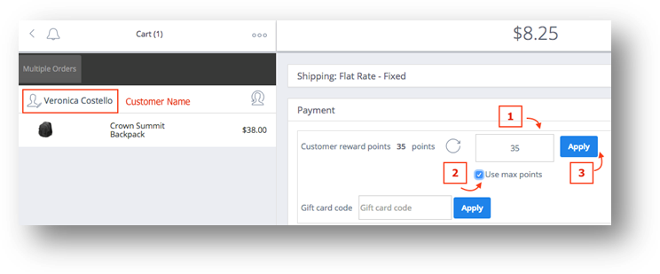

1)	Enter the number of spending points that customers would like to spend for their orders

2)	Mark the **Use Max points** checkbox to spend the maximum number of points

3)	Click **Apply**  

On **Checkout Page**, the system will show a details summary of the order. 

Spending points which were converted into $$$ for discount would be shown in the **Use point** field.

4)	Click **Place Order** to finish.

- **How to manage Reward Points of customers**

Click on the symbol highlighted as in the first image, then click on **Customer List**

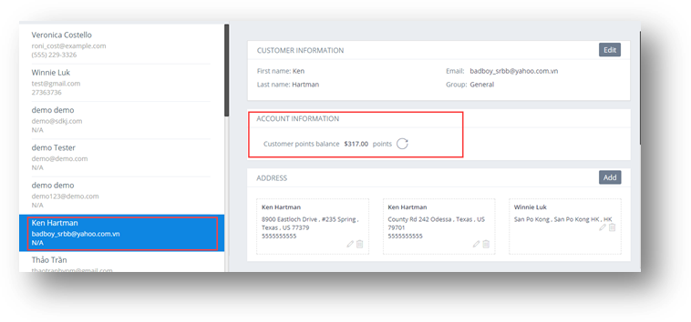

Click on a **customer** to view the points left in that customer’s account.

#####  Refund an Order by points
######   Refund an Order into points balance in backend

As this authority of ecommerce staff is similar to that of ecommerce manager in this section, you can see **Refund  an Order by points** - Reward Points part in  Role for Ecommerce Manager in backend to know how it works. 

######  Refund orders into points balancee in Web POS 

✓	**Path: Orders > Orders History > Select an order to refund**

1)	Click on “Refund”

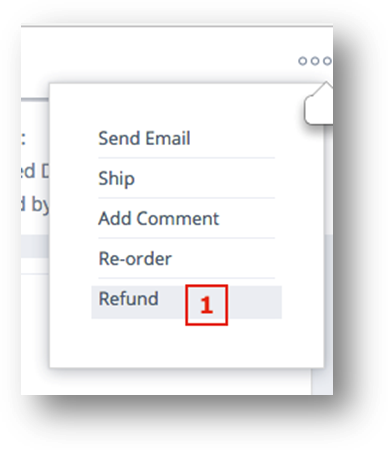

On the pop-up screen:

2)	Enter the number of money to refund into Store Credit balance 

(Image Refund into Points  balance)

3)	Click on “**Submit Refund**” to complete.

#### Store Credit

For Store Credit module, ecommerce staff will have authorities including using credit  at chekout and refunding orders by credit 

**Notice** : All functions related to configuring rules of Store Credit program and managing customers ‘ credit will be undertaken by Ecommerce managers (EM), except for EM setting up extra authority for their staff.

##### Use Credit when creating orders

There are 2 ways to use points at checkout. 

•	In backend of your webstore

•	In Web POS at store. 

######   Use credit when creating orders  in backend

Please see the detailed guidelines in section **Use Credit to check out  in backend** - Store Credit part in  Role for Ecommerce Manager to know how to do it. 

######  Use credit when creating orders in Web POS  

On Checkout page, after selecting a customer and adding a product to an order, the system will show Shipping and Payment session. After choosing shipment  method, go to Payment session to choose the payment method as customers want. 

To use credit to place new orders :

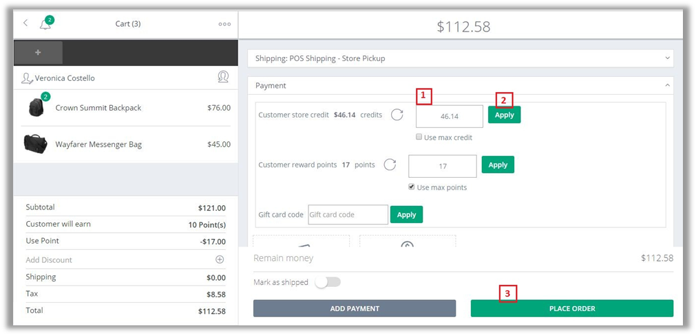

1)	Enter the store credit  in the blank. Tick **Use max credit** if a customers wants to spend all credit in their purse. 

2)	Click on “**Apply**” 

Then select a payment method (such as: Web POS Cash In) and view the pop-up screen

3)	Click on “**Place Order**” to finish.
 
#####  Refund Orders into Credit Balance

There are 2 ways to refund orders into Credit balance

•	In backend of your webstore

•	In Web POS at store. 
######   Refund orders into Credit Balance in backend

Go to section **Refund  Orders into Credit balance - Store Credit part in  Role for Ecommerce Manager to know how it works. 

######  Refund orders into Credit Balance in Web POS

 ✓ **Path: Orders > Orders History > Select an order to refund**

1)	Click on “**Refund**”

On the pop-up screen:

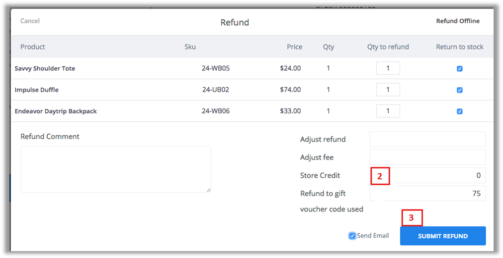

2)	Enter the number of money to refund into Store Credit balance 

3)	Click on “**Submit Refund**” to complete.
#### Gift Cards
#####  Apply Gift cards Code / Credit balance  when creating an order 

There are 2 ways to apply  gift code to create an order

•	In backend of your webstore

•	In Web POS at store. 

######  Apply Gift codes when creating an order in backend 

Go to section **Apply Gift code when creating new orders** - Gift Card part in Role for Ecommerce Manager .

######  Use Gift code to place order in Web POS

On **Checkout** page, after selecting a customer and adding a product to an order, the system will show the Gift Card box, which allowing you to use Gift Card credit balance or Gift Card code(s) of the Customer to pay for this order. Select the method(s) as you want and then remember to click on **Apply Gift Card** button. 

To use Gift code to place a new order on Checkout Page (Web POS):

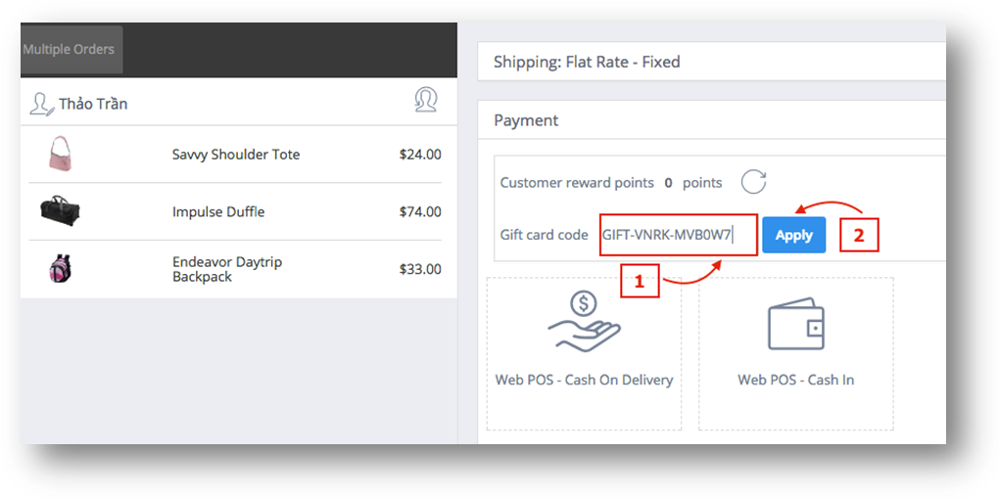

1)	Enter the gift code in the blank

2)	Click on “**Apply**”

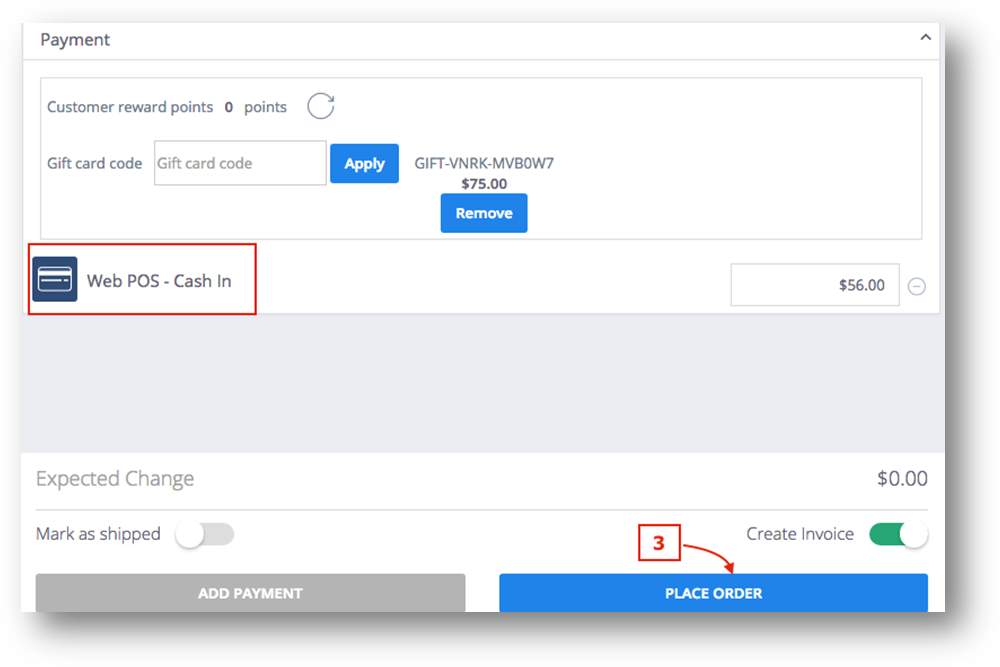

Then select a payment method (such as: Web POS Cash In) 

3) Click on “**Place Order**” to finish. 

#####  Refund Orders into Gift Card credit balance

There are 2 ways to apply  gift codes  to refund orders into Gift Card credit balance.

•	In backend of your webstore

•	In Web POS at store. 

###### Refund orders into Gift Card credit balance in backend

Go to section Refund orders into Gift Card Credit balance - Gift Card part in Role for Ecommerce Manager.

######  Refund orders into Gift Card Credit balance in Web POS

✓ **Path: Orders > Orders History > Select an order to refund**

1)	Click on “**Refund**”

On the pop-up screen:

2)	Enter the number of money to refund to gift credit 

3)	Click on “**Submit Refund**” to complete.

