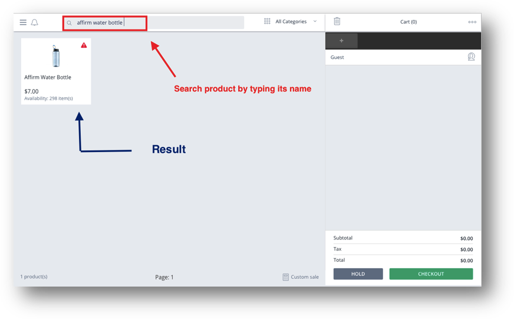

## INTRODUCTION

POS System allows user to set different authority according to user’s roles in your store. For examples, when store manager using POS, some information will be displayed just for them while others roles can’t have authority to see it. 

In this material, this amazing function will be explained in details. Each position in your store will know exactly what they can do with this POS. Because of that, they could adapt to this system and take advantage of it as much as they want.  

With the latest upgraded version and its convenience and the amount of time saved, we hope that you would enjoy and feel exhilarated when experience this newest ones. 

Thanks & Best regards,
Magestore Team 

----------
## Permission Metrix  ##

The working process of POS System from Magestore is devided into 3 sections:

 - General Sales Process
 - POS Order 
 - POS Return Order 

In each part, the responsibility for each position in your store is different. 
Here is the detailed assignment: 

### Store Manager  ##

This position takes part in almost actions on this POS System throughout 4 steps: 
In the step of “Session Management”: involved in all the actions 

In the step of “POS Order”: involved in all the actions except Select Customer, Apply Store Credit & Delivery Product. 

In the step “POS Return Order”: involved in all the actions of this step except 
“Receive the product”. 

In the “POS Order”: Involved in all the actions. 

### Sales Staff ##

This position will undertake those tasks: 
In the step of “Session Management”: not involved 

In the step of “POS Order”: 

 - Search Product and check quantity on hand 
 - Create Order 
 - Apply Promotion 
 - Apply Coupon Code 
 - Apply Gift Card
 - Apply Reward Point 
 - Select Shipping Method 

In the Step of “POS Return Order” 

 - Search old orders and check return rules 
 - Create return order 

In the step of “POS Report”: not involved 

### Store Cashier##
Store Cashier will take those tasks: 
In the step of “Session Management”: involved in all the actions. 

In the step of “POS Order”: involved in all the actions except “Delivery Product”

In the step of “POS Return Order”: 

 - Check old order and return rules 
 - Create Return Order
 - Check out and Payment 
 

In the “POS Report”:

 - X Report 
 - Z Report 

## FOR MANAGER MANAGER ##
This section is the separated guide for Store Manager only. 
All the tasks which will be involved in the system by Store Manager will be included in this guide, so that you can approach all the role responsibilities and capabilities better and more insight. 

This role will mainly take charge of the following tasks regarding Point of Sale system:

###General Sales Process
In this part, Store Manager will open session at the beginning of working day. 
The number of Opening Balance will be set. Then, in the last shift of the day, POS System could provide users daily revenue records. 

Here are the Store Manager authorities: 

 - Open Session
 - Set Opening Balance 
 - Set Closing Balance 
 - Put Money In 
 - Take Money Out 

If there is no difference between **Theoretical Closing Balance** & **Real Closing Balance**, just click the green button on the screen and the Session will be ended. 

If they are not the same, so when you tap “**Set Closing Balance**”, a pop-up will appear automatically. 

If users tap “**OK**”, then the window below will be displayed. 

In case users didn’t want to accept the different and close session with the loss/benefit, they can do the action of Put Money In or Take Money Out. 

 
Once again, the window will be popped-up to help you make sure about all the data before closing session.

Click “**Confirm**” to close the Session successfully. 
 
### POS Order ##

 - Manager can **search product** and search quantity on hands 
Users can enter terms or scan barcode to search products

 - 	Manager can create Orders
 
  
 Anyway, one thing to remind retailers is that having a customer card system is extremely necessary for sales strategy. So, it exists a demand from POS System: make sure all of the shoppers, even when they are not regular consumers, have member cards at your store. 
 
 - 	If this buyer were a brand new customer, Cashier would create a new one. 
Here is the detailed instruction: 
Tap the **human icon** > “**Create Customer**”

 - Otherwise, Cashier could search and create order based on customer history data. All the staffs need to do is typing the customer information (such as: phone number, email, address,…)

 - 	After adding products to carts, Sales staffs would push sales by applying Promotion and Loyalty Program – which are available functions when retailers install specialized extensions for their own POS System. For instance, they are Coupon Code, Gift Card, Reward Point and Store Credit. 
 

 - Manager can apply Gift Card 
 
 

 - Manager can choose Payment & Shipping Method 
 

 -	Manager can aslo checkout 
 

### POS Return Order ##

 - Manager can search old orders and check the Return Policy 
 
 
 
###Z- Report ##
Store Manager can also be able to view and manage the Z-report in the system: 

[1] You can export all the data of shift ID, Staff, POS location and session information to a .CSV file and use it for further business analysis. 
[2] The data of working session will be recorded and automatically sent to this Z-report in the backend system of WebPOS. 

## FOR SALES STAFF ##
Those sections below will show readers detailed instruction for Sale Staff(s). 

In brief, we will list out all the responsibilities for this role to help readers gain the main information easily. Those are including: 

 - POS Order 
	 - 	Search product & check quantity on hand 
	 - 	Create Orders 
	 - Apply promotion, coupon code,  gift card, reward point 
	 -	Select Shipping and Payment method 
	 -		Check out 
	 
	 
 - POS Return Order 
	 - Search Old Order & Check Return Rule 
	 -	Create Return Order 
	
### POS Order ##
Sale staffs do not often have the permission to manage working session.  They will be able to make orders for customers at the point of sale. 
The following will list out all the capabilities of sale staff at the point of sale: 

 - Manager can **search product** and search quantity on hands  Users
   can enter terms or scan barcode to search products
    

 
 - Manager can create Orders
 

Anyway, one thing to remind retailers is that having a customer card system is extremely necessary for sales strategy. So, it exists a demand from POS System: make sure all of the shoppers, even when they are not regular consumers, have member cards at your store

 - 	If this buyer were a brand new customer, Cashier would create a new one. 
Here is the detailed instruction: 
	Tap the **human icon** > **“Create Customer"**
	

 - 	Otherwise, Cashier could search and create order based on customer history data. All the staffs need to do is typing the customer information (such as: phone number, email, address,…)
  
 - After adding products to carts, Sales staffs would push sales by
   applying Promotion and Loyalty Program – which are available
   functions when retailers install specialized extensions for their own
   POS System. For instance, they are Coupon Code, Gift Card, and Reward
   Point.
 

 - Manager can apply Gift Card
 
 
 - Manager can choose Payment & Shipping Method
 

### Return Order ##

 - 	Manager can search old orders and check the Return Policy 
 

## Cashier POS ##
It is the only role who has authority as much as Store Manager.

This position could access most of the activities in this system like Store Mangager except the right to reach Advanced Report. 

Particularly, in the **“General Sales Process” Workflow** 

They directly receive payment from customer and put the change back to them in physical stores. In other words, they control cash-in and out of brick-and-mortal. 
  
Those actions they can take is totally as same as Manager POS: 

 - Open Session 
 

 - Set Opening Balance 
  

 - Put Money In 
 

 - Take Money Out
   

*(All the pictures demonstrate for those actions is similar to the section for Ecommerce Manager)* 

### POS Order ##
It’s so obvious to see that Cashier is a position which directly connect and serve customers in store. 
Most steps in customer purchasing process are accomplished by Cashier. 
For instance:

 - They can search products 
 
  
  
 - They also could apply promotion and loyalty program for customers (such as Reward Point, Gift Card, Coupon Code) 
 
 - 	Helping customers choose payment as well as shipment method and then check out  
 
 *( The ScreenShot for this part is similar to the section “Store Manager”)*

### “POS Return Order” Workflow
In case customer wanted to return products, Cashier needs doing all those following steps: 

 - 	Search order and check return rules 
 - 	Create Return Order 
 - 	Helping customer Checkout and Payment. 

*( The ScreenShot for this part is similar to the section “Ecommerce Manager”)*

### POS Report
Like we said above right from the start of this section, Cashiers have the ability to access 2 types of Report which were A & Z Report. 

 

 

> Written with [StackEdit](https://stackedit.io/).
