# PURCHASING MANAGER - USER GUIDE FOR MAGENTO 2
---------------------------------------------

## INTRODUCTION
In this user guide, we provide you a very detailed instruction in how a Purchase Manager controls all tasks involved in purchase management. Managing suppliers, pricelist, quotation and purchase order is easier than ever for a [purchase manager](https://www.magestore.com/purchasing-manager) with our step-by-step user guide by role. 

## PERMISSION MATRIX
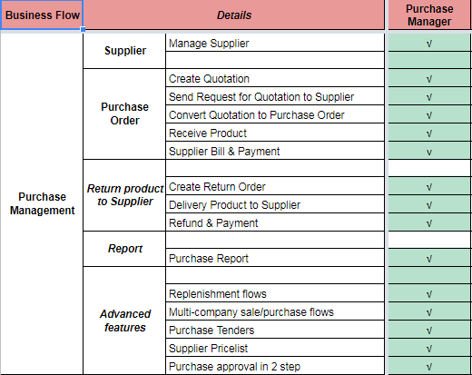 

## USERGUIDE FOR PURCHASING MANAGER
###	Manage Supplier
#### Create New Supplier
To create New Supplier, go to **Purchase Management > Supplier > Manage Suppliers**

 

Click on **Add New Suppliers** to create a new supplier’s contact.

#####	In **Supplier Information** tab:

 

Fill in all the required fields, including: 
  - Supplier Code (customise by yourself) 
  - Supplier Name 
  - Contact Person (who represents the supplying firm) 
  - Supplier’s Email 
Choose **Enable** to activate the suppliers.
  
#####	In **Supplier Address** tab:
Fill in the form below (All information is optional)

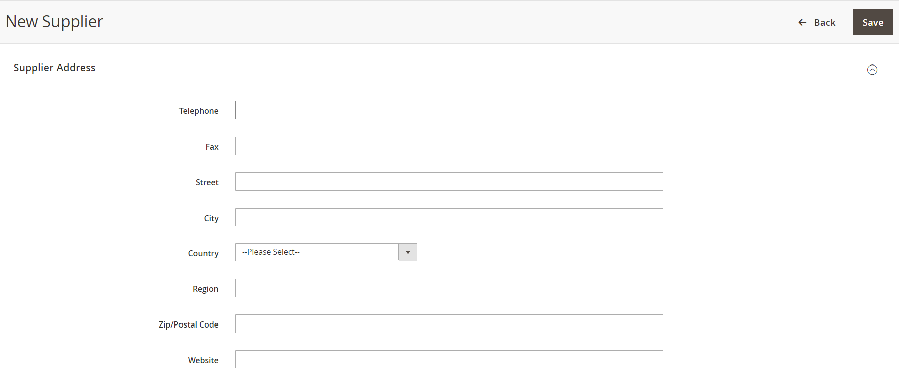 

If you enable Drop-ship function in Settings (Please refer to section Drop-ship for more details), the **Password Management** section will be automatically synchronised and shown in the **New Password** blank. You can set password and **email it to the supplier**. The supplier can use his email address and this password to log in on the **Supplier** page in frontend to update drop shipments’ status. 
Click on **SAVE** to finalize.

#### Add Products to Supplier

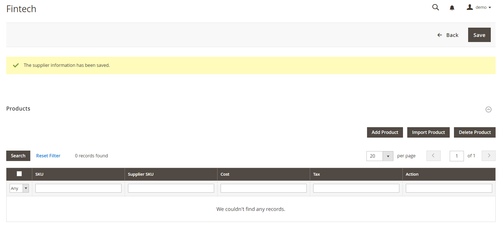 

On the extended screen named **Products**: 
-	Click on **Add Product** to select and assign specific products to suppliers. 
-	Besides that, you can either Click on **Import Product** to sync your products data with Magento systems. 
-	Enter **Supplier SKU** for each product line. 
-	Enter **Cost** – purchase cost from the suppliers. 
-	Enter **Tax** (if any) 
-	Click on **Delete** to remove unexpected products 

Click on **SAVE** to finalize

####	Edit an Existing Supplier

To Edit an existing supplier, go to **Purchase Management > Supplier > Manage Suppliers**

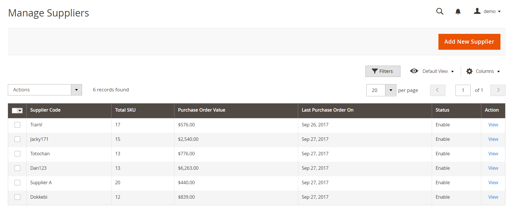 

Click on **View** to access the supplier’s detailed information. Then start editing.

####	Manage Price List
To manage Price List, go to **Purchase Management > Supplier > Manage Pricelist**

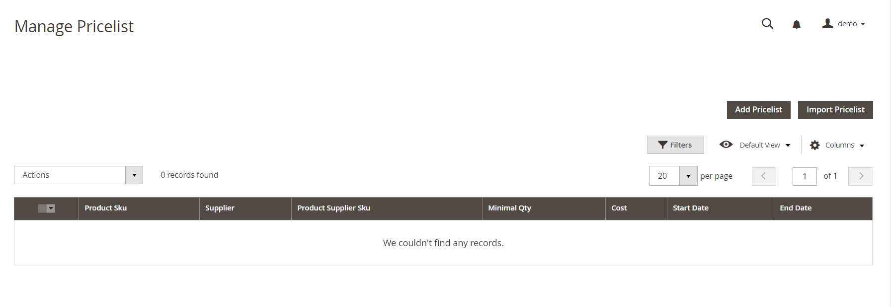 

Pricelist Management provides users lots of benefits mentioned as below: 
•	Easily keep track of all users’ prices 
•	Create group pricelists  
•	Create pricelists for each supplier 
•	Special prices are applied when creating purchase orders 
•	Create pricelists in multiple currencies 

Click on **Add Pricelist** to make a document listing multiple prices.

**Note:** You also can prepare a Pricelist on your device then import it to system by tabbing “Import Pricelist”.
By clicking on **Add Pricelist**, you will the page shown as below:

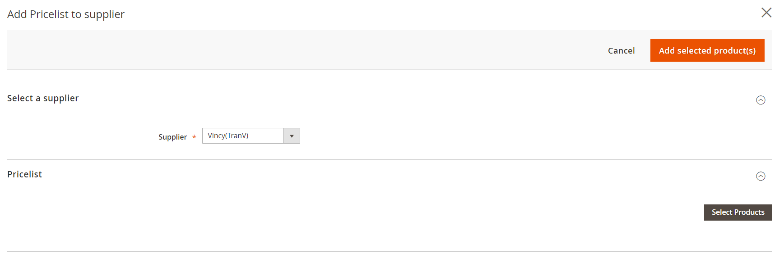 

- Select a supplier (required)
-	Click on **Select Product** then on the pop-up screen, choose which products you want to manage pricelist
-	Enter the Minimal Quantity 
-	Enter the cost for each product line
-	Set a specific opening and closing date (term of validity)
-	Click on **Add Selected Product(s)** to finalize

**Note:** Before finalizing, you can click on “Remove” to scratch out unexpected products.

####	Edit a Pricelist
To edit a pricelist, go to **Purchase Management > Supplier > Manage Pricelist**

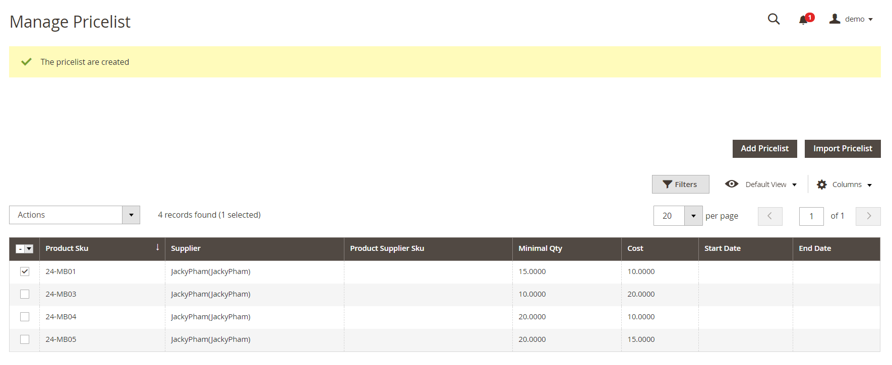 

-	Make a double clicks on the line of a product
-	Edit the data you want to re-new
-	Click on **Save** to finalize

###	Create Quotation

To create a new request for quotation, purchase staff can follow this path: **Purchase Management** > **Quotation Management** > **Create Quotation**

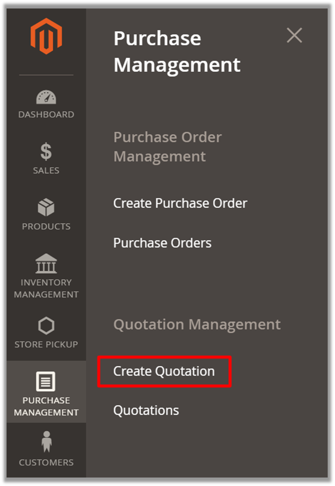

Then the page will be shown as below:

1) Choose **Created Time** 
2) Choose **Supplier** to ask for quotation.  
3) Choose Currency 
4) Chooose Currency Exchage 
5) Adding comments is optional. 
6) Click on **Prepare Product List** for the next step. You will be navigated to  this view:

In this step, there are 5 ways for you to prepare product list: 
- Import products via a CSV file 
- Prepare product list based on supply need forecast 
- Prepare back sales products (Back sales products are ordered by customers but not available in stock now) 
- Prepare low stock products 
- Prepare product list manually with **All Supplier Products** button 
Apart from importing products via a CSV file, you need to enter Purchase Cost, Tax, Discount and Qty Ordering for each product. Editing in line is allowed here. After entering all required fields, click **Save** button and Order Totals is automatically calculated.

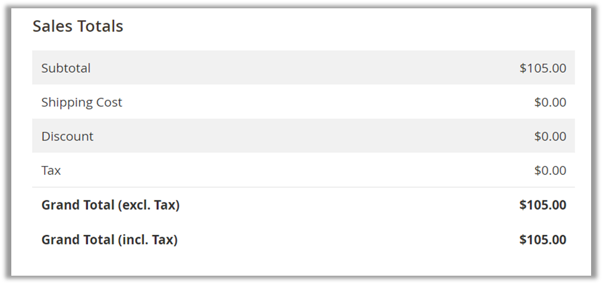

Then, scroll down to set up **Shipping and Payment**

1) Enter the address you want the stock to be shipped to 
2) Select a shipping method for the quotation 
3) Estimate and enter the shipping cost 
4) Set start shipping date 
5) Set expected delivery date 
6) Select the payment term 
7) Choose the way to place order: N/A, Email, Phone, Fax, supplier website 
After filling all the information, click **Save** to save all changes. You can still update products information by editing in a specific product line.  Then, choose **Confirm Quotation** to create a request for quotation.

#### Send Request for Quotation to Supplier

To send Request for Quotation to supplier, purchase staff go to **Purchase Management > Quotation Management**, choose **Quotation** to see quotation list. At the list of quotation, click on **View** at the quotation marked as **“confirmed”**.

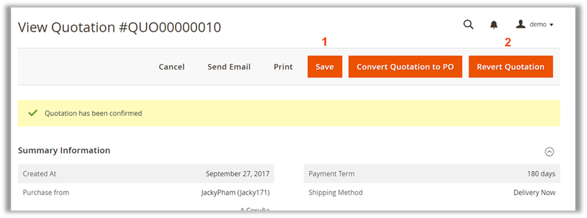

On this page, click on **Send Email**. The request for Quotation will be sent to supplier via the email in supplier information.

#### Convert Quotation to Purchase Order

To convert quotation to purchase order, in **View Quotation** page, click on **Convert Quotation to PO**.

As the quotation is converted to purchase order, you will be navigated to Purchase Order view

As can be seen, the purchase order is marked as **“pending”**. In this page, you are still able to update the product information as editing is allowed to be done directly in line. After finishing all editing, click on **Save** to save all changes.

#### Receive Products

To receive products, clicks on **Confirm Purchase Order** on **View Purchase Order** page and you be shown navigated to the detailed page of the Purchase Order

There are two ways to receive items:  
1) **Receive All Items**: All products will be noted as received. Each product goes with detailed information including Received Date, SKU, Product Name, Received Qty and Created By. 
2) **Receive Items**: By clicking on this button, you are able to choose a part of the purchase order. This method is most suitable when you use partial shipment. After selecting products, you need to enter the received date, select received products and fill Received Qty for each product.

#### Supplier Bill & Payment

To create supplier Bill and Payment, go to **View Purchase Order** page to create an invoice. By clicking on **Invoice** tab, you will see  the form below

Multiple invoices can be created by products for one purchase order. When you click on **Create an Invoice** button, the **Create an Invoice** page will be shown like below

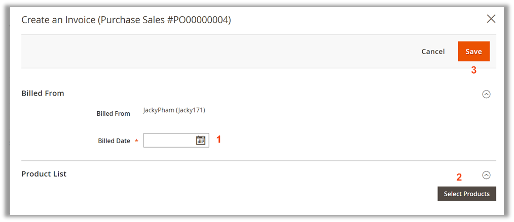

1. You need to enter the billed date,  
2. Select products and fill billed Qty, unit price, tax and discount for each product you want to create an invoice for.  
3. After that, you click on the **Save** button to save your work. Now, you can see the records of all invoices shown in the **Invoices** tab.

### Return Products to Supplier

#### Create Return Order
In order to request a product return, you can follow the path **Purchase Management >  Return Request Management > Return Requests**

You will be led to the **Create Return Request** page

1) Return progress is controlled in 4 steps: 
	* New: input general information of the return process, 
	* Pending: create the list of products to return to supplier, 
	* Processing: the product list has been submitted to the supplier. Products, once delivered, are waiting to be validated and transferred to warehouse. 
	* Completed 
2) Input the date that you create the return request  
3) Choose the warehouse to take products out for return 
4) Choose supplier to return products to 
5) Input return reason (optional) 
6) Click **Prepare Product List** to move to the next step

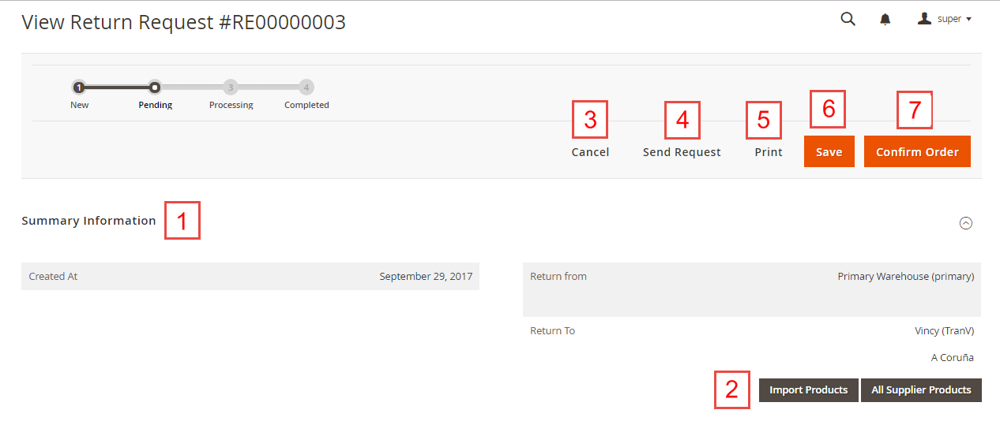

On **Pending** step: 
1) View general information of the return request that you have input in the previous step. 
2) There are 2 ways of preparing product list to return: 
	* Choose to either Import Products list via csv file (template provided) 
	* Or view and choose among all products of that supplier by clicking on All Supplier Products button. 
3) Cancel the return request 
4) Send an email to supplier to inform of the return 
5) Print the list of returned items 
6) Save your current process while stay on the page 
7) Confirm 

After adding products, you can edit product quantity to return:

1) Select products to edit 
2) Input product quantity to return 
3) Click **Save** to save your current process and stay on page; or **Confirm Order** to continue.

#### Confirm Product Delivery

After validating the products, you can process with the product receipt:

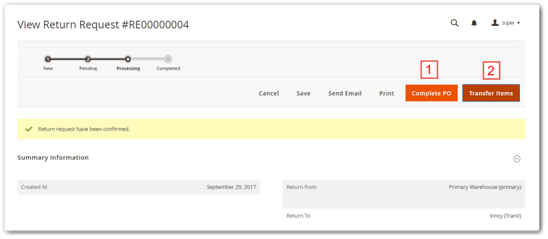

1) Click **Complete PO** to finish the Return request. 
2) Click **Transfer Items** to transfer the received products to the warehouse that you have appointed before.

In **Transfer items** page:  
1) Input the date of transfer 
2) Choose either to select products by scanning barcode; or select products from a list with 2 steps as below

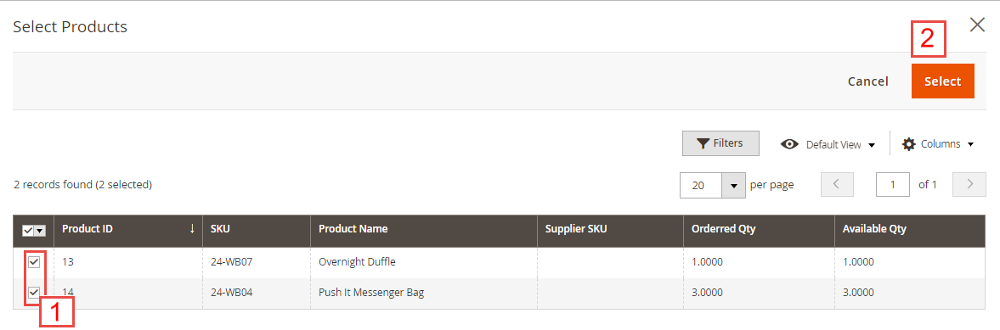

After selecting products or scanning barcode, you will be sent back to the **Transfer Items** page:

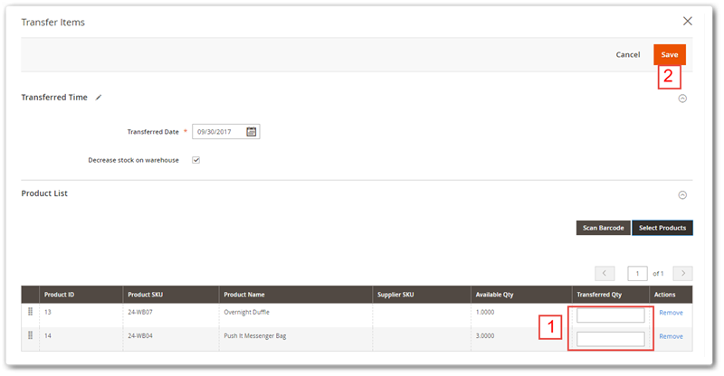

1) Input the product quantity to transfer (you can transfer partially in multiple times) 
2) Click **Save** to continue

1. Click **Complete PO** to finish the return request 
2. Click **Transfer Items** to continue transferring the rest of received products. 
3&4. Select products and click button to **Return to Supplier**.

### Report & Advanced Features _(coming soon)_

-----------
Confidential Information Notice. 

Copyright 2017. All Rights Reserved. Any unauthorized reproduction of this document is prohibited. 

This document and the information it contains constitute a trade secret of Magestore and may not be reproduced or disclosed to non-authorized users without the prior written permission from Magestore. Permitted reproductions, in whole or in part, shall bear this notice.

