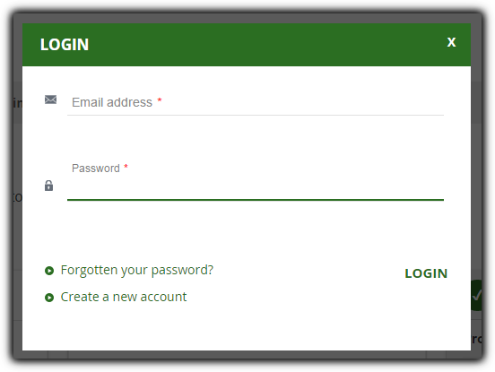

### Login/Sign up if required

Store-owners may want to require Customers to log in or sign up before placing an order. If Customers already have an account, they can click on **Click here to login or create a new account**. A popup will be displayed. They just need to enter their email address and password then click on the **Login** button.

If Customers forget their password, they can click on **Forgotten your password?** Then enter their email address and click on the **Send password** button. The module will send a new password to their email address.

If Customers don’t have an account in your site, they can create one right away by clicking **Create a new account**, filling in the required information, then click **Register**. The new account will be created before placing orders.

This is super convenient, right? Signup and Checkout at the same time help you manage Customers and Orders more easily without swaying conversion rate.
